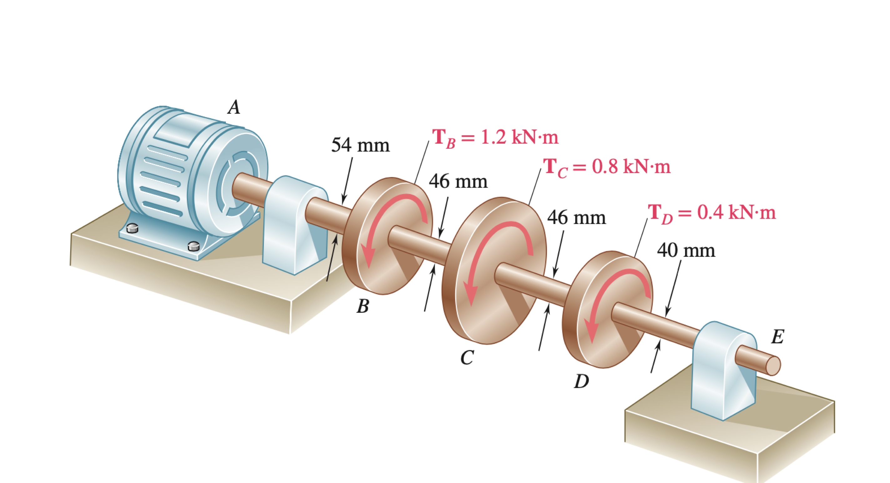
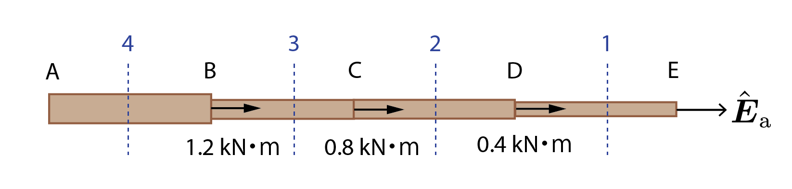
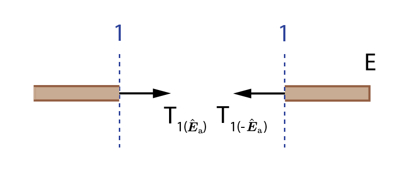
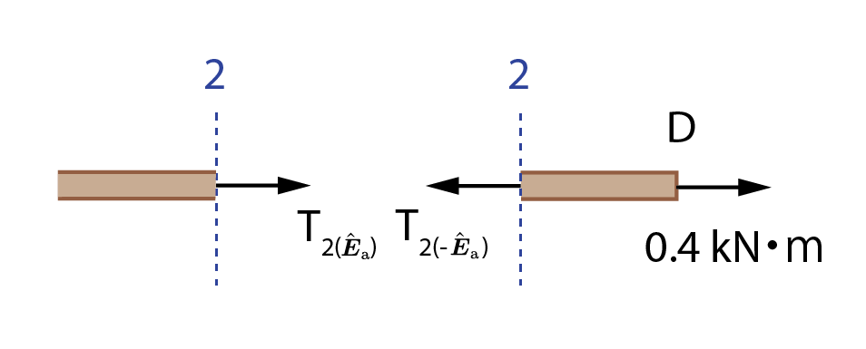




### Problem Statement

Taking the origin at $\rm A$, determine the internal torque in each of the sections $\rm AB$, $\rm BC$, $\rm CD$ and $\rm DE$.

### Solution

* Consider an imaginary cut in section $\rm DE$ as shown.

    

    
    

    Then, we know from equilibrium that the torque acting on the surface with $-\hat{\boldsymbol{E}}\_{\rm a}$ outward normal must be $0$ since there is no torque acting at $\rm E$. It then follows that the torque acting on the surface with $\hat{\boldsymbol{E}}\_{\rm a}$ outward normal is also $0$, i.e.,

    $$
    \begin{align*}
    T_{1(\hat{\boldsymbol{E}}_{\rm a})}=0~\rm{kN\cdot m}(\hat{\boldsymbol{E}}_{\rm a})
    \end{align*}
    $$

    Internal torque in section $\rm DE$ is then, by definition, $0~\rm{kN\cdot m}$.

* Similarly, consider an imaginary cut in section $\rm CD$ as shown.

    

    
    

    Then, we know from equilibrium that 

    $$
    \begin{align*}
    T_{2(-\hat{\boldsymbol{E}}_{\rm a})}=0.4~\rm{kN\cdot m}(-\hat{\boldsymbol{E}}_{\rm a})
    \end{align*}
    $$

    It then follows that

    $$
    \begin{align*}
    T_{2(\hat{\boldsymbol{E}}_{\rm a})}=0.4~\rm{kN\cdot m}(\hat{\boldsymbol{E}}_{\rm a})
    \end{align*}
    $$

    so that by definition, internal torque in section $\rm CD$ is $0.4~\rm{kN\cdot m}$.

* Following the same analysis, it can be determined that the internal torque in section $\rm BC$ is $1.2~\rm{kN\cdot m}$ and that in section $\rm AB$ is $2.4~\rm{kN\cdot m}$.

<!-- [Here](./WFiles/SP8.nb) is the MMA file for this problem. -->