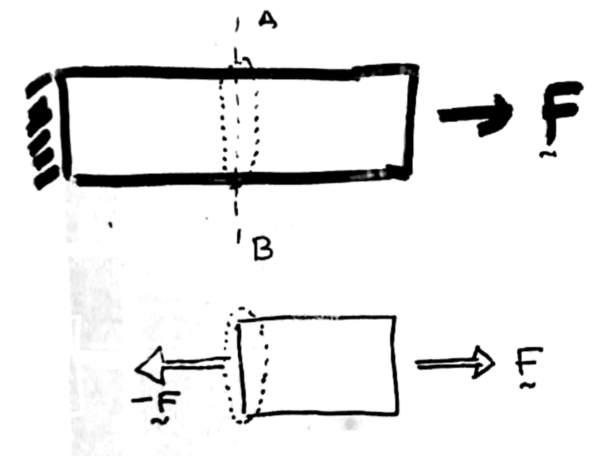
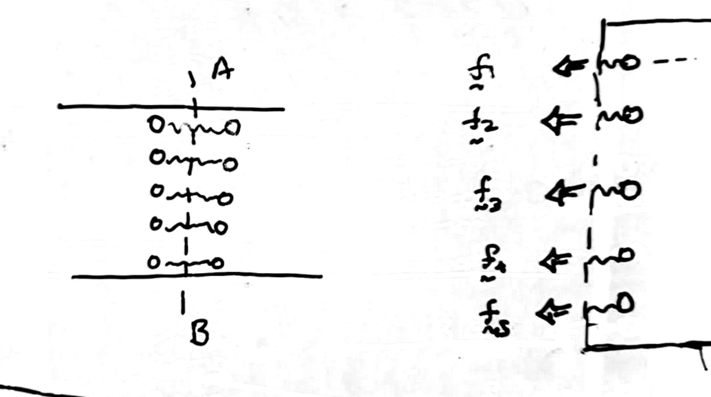
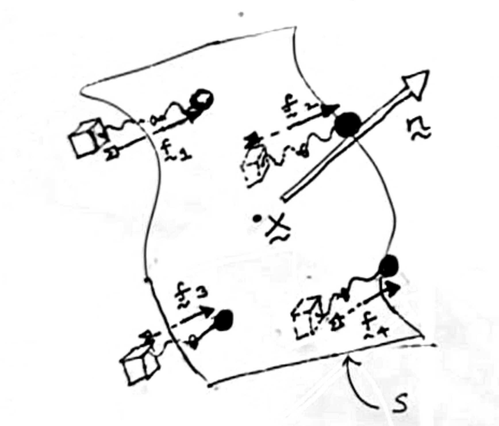
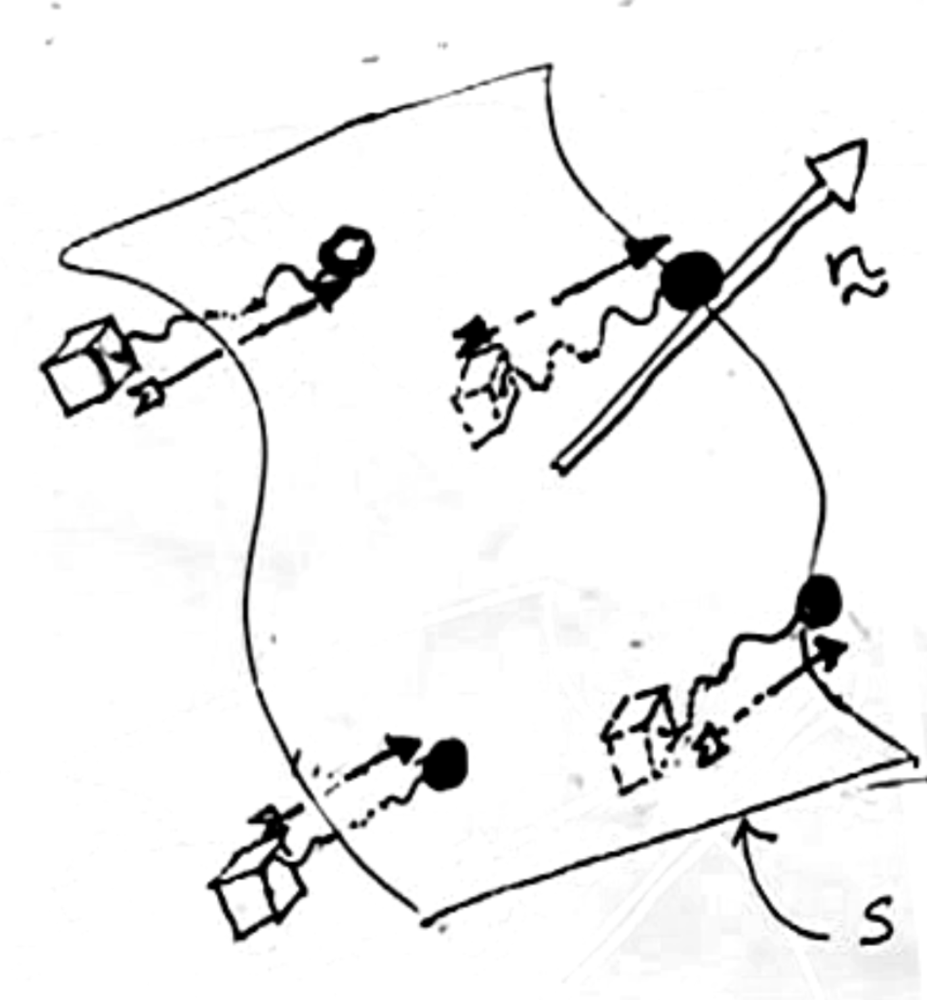




# Traction

Informally speaking, traction vector is force per unit area. It measures the intensity with which the force is distributed over a surface. When we were working with bars, we defined the normal component of the axial traction vector $\sigma_{11}$ as $F/A$, where $F\hat{\boldsymbol{E}}\_{a}$ is the force acting on the bar's end and the $A$ is the constant cross-sectional area of the bar. In this section, we will generalize this idea of ratio between the force acting on a surface and the area of that surface. 

Going back to the 1D bar, we know that when the right face of the bar is subject to a force $F\hat{\boldsymbol{E}}\_{a}$, then the left face of the bar should be experiencing the force $-F\hat{\boldsymbol{E}}\_{a}$. Let us imagine  the plane $A$-$B$ passing through the bar. The intersection of this plane with the body $\mathcal{B}\_{\rm ref}$ is the internal surface $\mathcal{S}$. This surface can be considered to be part of either the right piece, which we will denote as $\mathcal{B}\_{\rm ref}^{+}$, or the left piece, which we will denote as $\mathcal{B}\_{\rm ref}^{-}$.

Now we ask the question what is force being applied by the left piece of the bar on the right piece of the bar across the surface $\mathcal{S}$? We will refer to this force as $\boldsymbol{F}_{\mathcal{B}_{\rm ref}^{-} \to \mathcal{B}\_{\rm ref}^{+}}$. We answered this question by applying the principle of force equilibrium only to the right piece of the bar and found $\boldsymbol{F}_{\mathcal{B}\_{\rm ref}^{-} \to \mathcal{B}\_{\rm ref}^{+}}$ $=-F\hat{\boldsymbol{E}}\_{a}$. 

Though we know that $\boldsymbol{F}_{\mathcal{B}\_{\rm ref}^{-} \to \mathcal{B}\_{\rm ref}^{+}}$ should be equal to  $-F\hat{\boldsymbol{E}}\_{a}$ (as just stated in the previous paragraph, due to force equilibrium) the question still remains as to who exactly is applying the force $\boldsymbol{F}_{\mathcal{B}\_{\rm ref}^{-} \to \mathcal{B}\_{\rm ref}^{+}}$. We know that this force is _due_ to $\mathcal{B}_{\rm ref}^{-1}$, however,  $\mathcal{B}\_{\rm ref}^{-1}$ is just a name for a collection of matter (atoms, molecules, etc.). So, who is exactly is applying this force? For simplicity let is assume that the bar is a metal and that it it is a  single crystal. Then in this particular case the answer is that the force is being applied by  one set of atoms that are on the left side of $\mathcal{S}$, i.e., in  $\mathcal{B}\_{\rm ref}^{-}$ to another set of atoms that are on the right side of $\mathcal{S}$, i.e., in $\mathcal{B}\_{\rm ref}^{+}$. 

Since $\boldsymbol{F}_{\mathcal{B}\_{\rm ref}^{-} \to \mathcal{B}\_{\rm ref}^{+}}$ is acting across an internal surface, $\mathcal{S}$, we call it an internal force. In the future instead of saying that $\boldsymbol{F}_{\mathcal{B}\_{\rm ref}^{-} \to \mathcal{B}\_{\rm ref}^{+}}$ acts across $\mathcal{S}$ on $\mathcal{B}\_{\rm ref}^{+}$ we will say that $\boldsymbol{F}_{\mathcal{B}\_{\rm ref}^{-} \to \mathcal{B}\_{\rm ref}^{+}}$ is acting on $\mathcal{B}_{\rm ref}^{+}$ at $\mathcal{S}$. This way of talking emphasizes thinking about $\mathcal{B}\_{\rm ref}^{+}$ as a body in its own right, rather than thinking about it as just being a piece of $\mathcal{B}\_{\rm ref}$. However, this way of taking may suppress the emphasis on the physical nature of  $\boldsymbol{F}_{\mathcal{B}\_{\rm ref}^{-} \to \mathcal{B}\_{\rm ref}^{+}}$. Because,  physically speaking,  force $\boldsymbol{F}_{\mathcal{B}\_{\rm ref}^{-} \to \mathcal{B}\_{\rm ref}^{+}}$  acts across the surface $\mathcal{S}$ and not on it.  

Now we ask the question what is force being applied by the right piece of the bar, $\mathcal{B}\_{\rm ref}^{+}$, on the left piece of the bar, \mathcal{B}\_{\rm ref}^{-}, across the surface $\mathcal{S}$? We will refer to this force as $\boldsymbol{F}_{\mathcal{B}\_{\rm ref}^{+} \to \mathcal{B}_{\rm ref}^{-}}$. Using similar arguments as before we find that $\boldsymbol{F}_{\mathcal{B}\_{\rm ref}^{+} \to \mathcal{B}_{\rm ref}^{-}}$ $=F\hat{\boldsymbol{E}}\_{a}$. And in the future we will state that the force  $\boldsymbol{F}_{\mathcal{B}\_{\rm ref}^{+} \to \mathcal{B}\_{\rm ref}^{-}}$  acts on $\mathcal{B}\_{\rm ref}^{+}$ at $\mathcal{S}$.

The above discussion about $\boldsymbol{F}_{\mathcal{B}\_{\rm ref}^{-} \to \mathcal{B}\_{\rm ref}^{+}}$ and $\boldsymbol{F}_{\mathcal{B}\_{\rm ref}^{+} \to \mathcal{B}\_{\rm ref}^{-}}$ is meant to demonstrate the idea  that we can always consider parts of a solid and talk about the force acting on one part of by the other parts of the solids. A point to note is one part of the solid can only apply a force on another part of solid through an internal surface that is common to both part's boundaries.  

Let $\boldsymbol{X}$ be a generic point on $\mathcal{S}$, and let $B(\boldsymbol{X},r)$ be a ball of radius $r$ centered at $\boldsymbol{X}$. The surface $\mathcal{S}$ also divides the the ball into two pieces. We denote  the left piece of the ball as $B(\boldsymbol{X},r)^{-}=B(\boldsymbol{X},r)\cap\mathcal{B}\_{\rm ref}^{-}$ and the right piece of the ball as $B(\boldsymbol{X},r)^{+}=B(\boldsymbol{X},r)\cap\mathcal{B}\_{\rm ref}^{+}$. We refer small patch of the surface $\mathcal{S}$ that is contained within $B(\boldsymbol{X},r)$ as $\Delta\mathcal{S}(\boldsymbol{X},r)$.  

The internal surface $\Delta\mathcal{S}(\boldsymbol{X},r)$ is part of the boundaries of both  parts $B(\boldsymbol{X},r)^{-}$ and $B(\boldsymbol{X},r)^{-}$. Let the force on  $B(\boldsymbol{X},r)^{-}$ at $\Delta\mathcal{S}(\boldsymbol{X},r)$ (due to $B(\boldsymbol{X},r)^{-}$) be $\boldsymbol{F}_{B(\boldsymbol{X},r)^{+}\to B(\boldsymbol{X},r)^{-}}$. We define the traction vector  at $\boldsymbol{X}$ in the direction $\boldsymbol{n}$ to be 

$$ 
\boldsymbol{t}(\boldsymbol{X},\boldsymbol{n})=\lim_{r\to 0}\frac{\boldsymbol{F}_{B(\boldsymbol{X},r)^{+}\to B(\boldsymbol{X},r)^{-}}}{\text{Area}(\Delta\mathcal{S}(\boldsymbol{X},r))}
$$

Through applying a similar argument we can derive that the force acting on the left piece of the bar, due to the right piece of the bar, across $\mathcal{S}$ to be $F\hat{\boldsymbol{E}}\_{a}$. 

The surface $\mathcal{S}$ when taken to be part of the left piece has the outward normal $\uv{E}\_{a}$. The surface $\mathcal{S}$ when taken to be part of the right piece has the outward normal $-\uv{E}\_{a}$. 

We will motivate the conception of the traction vector using the concept of the denis
If we want to know the net force acting on a surface $\mathcal{S}$ of a body $\mathcal{B}$. 
If mass were analogous to force then traction would be analogous to mass density. 
The first main difference in this analogy, of course, is that force is a vector, while mass is scalar. Like density traction is also field. That can be constant throughout the solid or it can vary from point to point. For example, the material density in an  ingot of steel will more or less stay constant throughout the volume of the ingot. When as the density in a baked pumpkin pike will likely be higher at materials particles that are closer to the surfaces and smaller in the interior. The variation of density is expressed by defining the a function  $\rho(X)$ such that the mass in an infinitesimal volume containing $X$ is $\rho(X)\, dV$.  

Therefore, albeit that denisty is a scalar, traction Secondly mass density is defined terms of unit volume, i.e., 

  while traction is defined in terms of unit area. 

[Here](./WFiles/SurfaceIntersection.nb) is the mathematica file for this section 