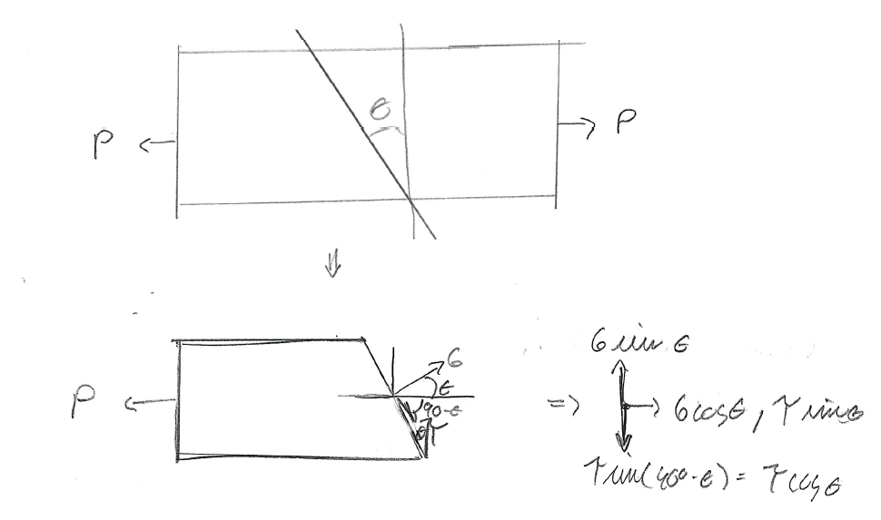
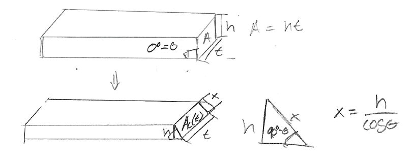
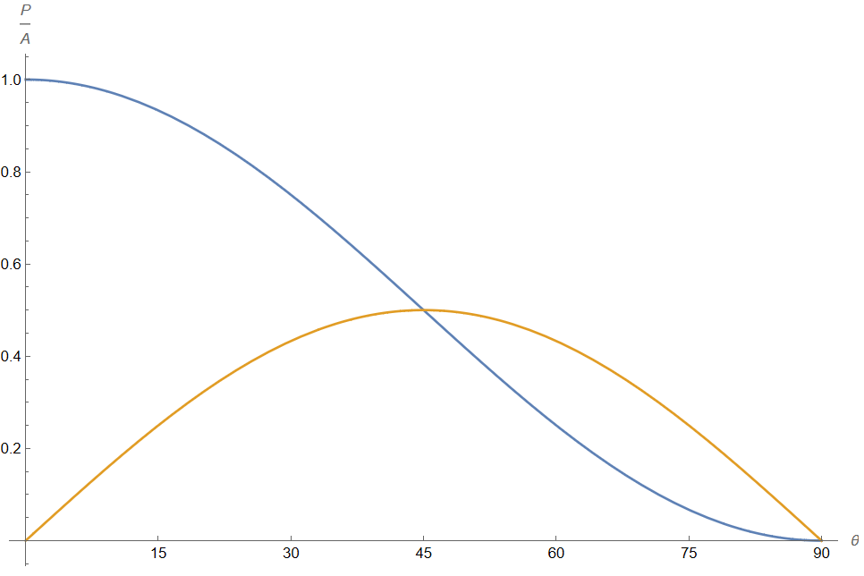





For an axially loaded bar, seen above, we want to know what the maximum normal, $\sigma$ and shear $\tau$, stresses are for a given applied force $P$. We can make an arbitrary cut in the bar at some angle $\theta$, and then due a force balance on with the resulting stresses. As in the figure above the force balance in the right facing direction is $P= A(\theta)\sigma cos(\theta) + A(\theta)\tau sin(\theta)$ and in the upward direction is $0= A(\theta)\sigma sin(\theta) - A(\theta)\tau cos(\theta)$, where $A(\theta)$ is area of the cross section as a function of $\theta$. 

For a bar with height $h$ and thickness $t$ the cross sectional area when $\theta = 0°$ is $A = th$. Notice that $t$ does not change with $\theta$, but the other dimension will, and as in the triangle in the figure above we have that $A(\theta) = tx=\frac{th}{sin(90° - \theta)} = \frac{A}{cos(\theta)}$. Then our linear system of equations simplifies to $\frac{Pcos(\theta)}{A}= \sigma cos(\theta) + \tau sin(\theta)$ and $0= \sigma sin(\theta) - \tau cos(\theta)$, which in matrix form is written as $\begin{pmatrix}
cos(\theta) & sin(\theta)  \\
sin(\theta) & -cos(\theta) 
\end{pmatrix}
\begin{pmatrix}
\sigma  \\
\tau   
\end{pmatrix} = \begin{pmatrix}
\frac{Pcos(\theta)}{A}  \\
0   
\end{pmatrix}$ Then $
\begin{pmatrix}
\sigma  \\
\tau   
\end{pmatrix} = \begin{pmatrix}
cos(\theta) & sin(\theta)  \\
sin(\theta) & -cos(\theta) 
\end{pmatrix}^{-1}
\begin{pmatrix}
\frac{Pcos(\theta)}{A}  \\
0   
\end{pmatrix} = \begin{pmatrix}
cos(\theta) & sin(\theta)  \\
sin(\theta) & -cos(\theta) 
\end{pmatrix}
\begin{pmatrix}
\frac{Pcos(\theta)}{A}  \\
0   
\end{pmatrix}$ so $\sigma(\theta) = \frac{P }{A}cos^2(\theta)$ and $\tau(\theta) = \frac{P }{A}cos(\theta)sin(\theta)$. 

Plotting the $\sigma(\theta)$ and $\tau(\theta)$ we get the figure above. Notice that the maximum $\sigma(\theta)$ for any arbitrary $\theta$ is then $\sigma(\theta = 90°) = \frac{P}{A}$, and the maximum $\tau(\theta)$ for any arbitrary $\theta$ is then $\tau(\theta = 45°) = \frac{P}{2A}$, so the maximum normal stress in a bar axially loaded with force $P$ that has a cross sectional area $A$ is $\sigma_{max}= \frac{P}{A}$ and the maximum shear stress is $\tau_{max} = \frac{P}{2A}$.

