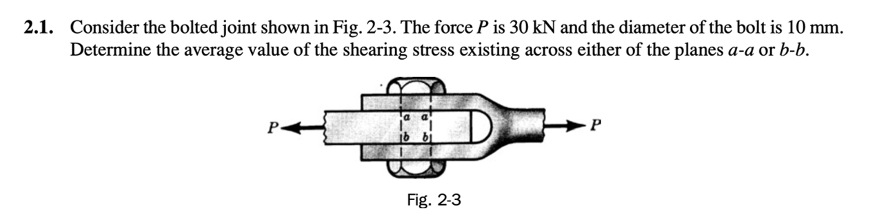
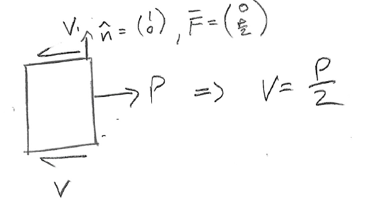
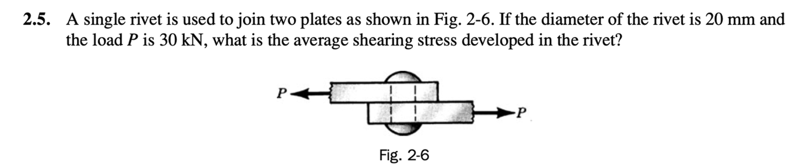
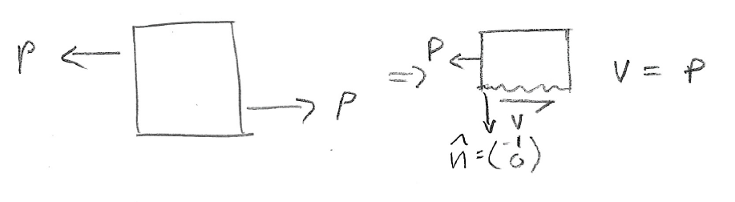
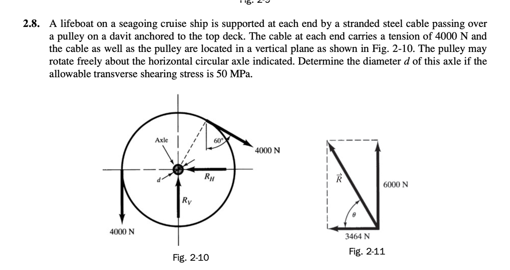
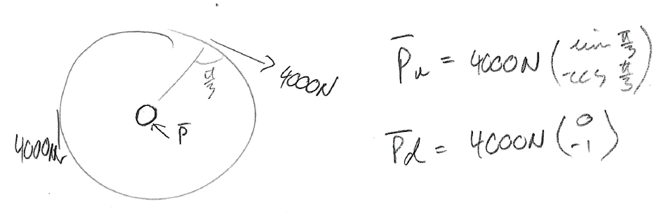
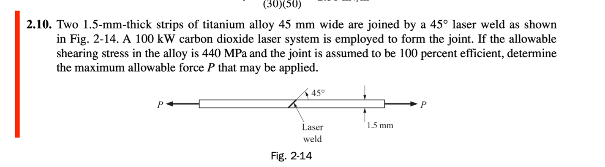
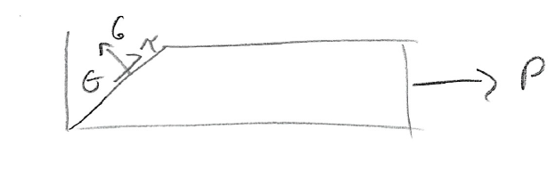
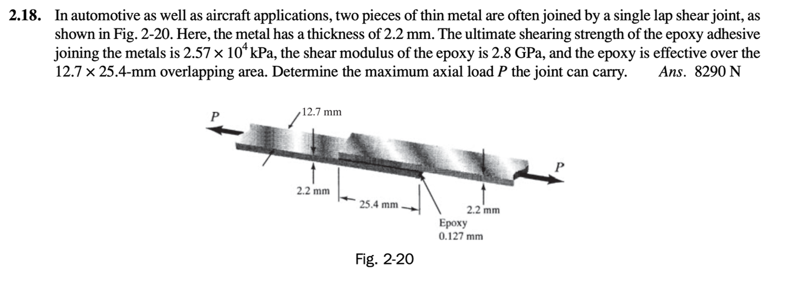
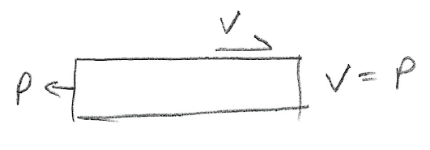




From the force balance in the figure above we can see that the shear force, parallel to the plane, is $V=\frac{P}{2}$, so the froce vector on the top surface is $\bold{F} = \left(0,\frac{P}{2}\right)$ and the normal vector is $\bold{\hat{n}} = \left(1,0\right)$. Then we have that the traction vector is $\bold{t} = \bold{F}\frac{sin(\theta)}{A} = \left(0,\frac{P}{2A}\right)$. Then $\bold{t}_n=\bold{t}\bold{\hat{n}}= \left(0,\frac{P}{2A}\right) \cdot \left(1,0\right) = \left(0,0\right)$, so $\bold{t}_s = \bold{t}-\bold{t}_n = \left(0,\frac{P}{2A}\right) - \left(0,0\right)= \left(0,\frac{P}{2A}\right) = \left(0,190.99MPa\right)$.

From the force balance in the figure above we can see that the shear force, parallel to the plane, is $V=P$, so the froce vector on the top surface is $\bold{F} = \left(0,P\right)$ and the normal vector is $\bold{\hat{n}} = \left(-1,0\right)$. Then we have that the traction vector is $\bold{t} = \bold{F}\frac{sin(\theta)}{A} = \left(0,\frac{P}{A}\right)$. Then $\bold{t}_n=\bold{t}\bold{\hat{n}}= \left(0,\frac{P}{A}\right) \cdot \left(-1,0\right) = \left(0,0\right)$, so $\bold{t}_s = \bold{t}-\bold{t}_n = \left(0,\frac{P}{A}\right) -\left(0,0\right) = \left(0,\frac{P}{A}\right) = \left(0,95.49MPa\right)$.

From the figure above we have that $\bold{P}_u = \left(3464.1N, -2000N \right)$ and $\bold{P}_d = \left(0, -4000N \right)$, then $\bold{P} = \bold{P}_u+\bold{P}_d = \left(3464.1N, -6000N \right)$, so in the direction of maximum shear the shear force on the axel is $\left|\bold{P}\right| = \sqrt{(3464.1N)^2+(-6000N)^2} = 6928.2N$, then since the maximum allowable shear stress is $\tau_{max} = 50MPa$ we have that $A = \frac{\left|\bold{P}\right|}{\tau_{max}} = \frac{6928.2N}{50MPa} = 1.386\times10^{-4}m^2\Rightarrow d = .0133m$.

From the derivation of the maximum shear stress, [here](./Max.md), we know that $\tau(\theta) = \frac{P }{A}cos(\theta)sin(\theta)$, and in this case $\theta = 45°$ from the angle of the weld, so $\tau(\theta = 45°) = \frac{P}{2A}$, and since we want to solve for the maximum applied force we have that $P_{max} = 2A\tau_{max} = 2(1.5mm)(45mm)(44MPa) = 59.4kN$. 

From the figure above we have that $V = P$, and the area of the epoxy is $A = (12.7mm)(25.4mm) = 3.226\times10^{-4}m^2 $, then the maximum force is $P_{max} = A\tau_{max} =(3.226\times10^{-4}m^2)(25.7MPa) = 8290.3N$

The MA notebook for the above calculations is [here](./WFiles/Examples.nb)