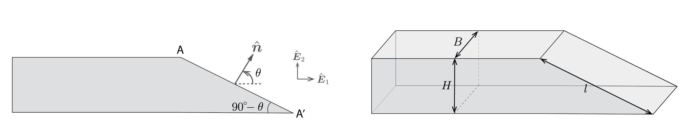

## Matrix representation of traction vectors



### Traction vector

  

### Axial loading

Consider a force $\boldsymbol{F}=F_1\hat{\boldsymbol{E}}\_1$ that is acting on the right end face of a bar. The matrix representation of the force is 

$$
\left[
{\boldsymbol{F}}\right]_{(\hat{\boldsymbol{E}}_1,\hat{\boldsymbol{E}}_2)}=
\left[
\begin{array}{l}
F_1\\
0\\
\end{array}
\right]
$$

 
Consider the angled cut $A-A'$ which has the normal vector $\hat{\boldsymbol{n}}$. The normal vector can be written as $\hat{\boldsymbol{n}}=\cos(\theta)\hat{\boldsymbol{E}}_1+\sin(\theta)\hat{\boldsymbol{E}}_2$. In matrix representation, the vector can be written as 

$$
\left[
\hat{\boldsymbol{n}}\right]_{(\hat{\boldsymbol{E}}_1,\hat{\boldsymbol{E}}_2)}=
\left[
\begin{array}{r}
\cos(\theta)\\
\sin(\theta)\\
\end{array}
\right]
$$

The force vector on the surface $AA'(\hat{\boldsymbol{n}})$ is, from force  equilibrium, $\boldsymbol{F}$. The mean/average traction vector on  $AA'(\hat{\boldsymbol{n}})$ is defined to be the force acting on it divided by its area. The area of $AA'(\hat{\boldsymbol{n}})$ is the cross-sectional area $Bl$,  where $l \cos(\theta)=H $. This means that $l=H/\cos(\theta)$, which in turn implies that 

$$
\left
\langle \boldsymbol{t}\right\rangle(AA'(\hat{\boldsymbol{n}}))
=\boldsymbol{F}\cos(\theta)/BH.
$$

In matrix notation, the traction vector can be written as 

$$
\left[
\left\langle \boldsymbol{t}\right\rangle(AA'(\hat{\boldsymbol{n}}))\right]_{(\hat{\boldsymbol{E}}_1,\hat{\boldsymbol{E}}_2)}
=\left[
\begin{array}{r}
F_1 \cos(\theta)/BH \\
0
\end{array}
\right]
$$

In the following, when it is clear, instead of writing 

$$
\left[\left
\langle \boldsymbol{t}\right\rangle (AA'(\hat{\boldsymbol{n}}))\right]_{(\hat{\boldsymbol{E}}_1,\hat{\boldsymbol{E}}_2)}
$$

we will simply write 
 
$$\left[
\left
\langle \boldsymbol{t}\right\rangle(AA'(\hat{\boldsymbol{n}}))\right].$$

Following the same analysis as before, the traction vector on the surface $AA'(-\hat{\boldsymbol{n}})$ is 

$$
\left[
\left
\langle \boldsymbol{t}\right\rangle(AA'(-\hat{\boldsymbol{n}}))\right]
=\left[
\begin{array}{r}
-F_1 \cos(\theta)/BH \\
0
\end{array}
\right]
$$

### Transverse loading

Consider a case in which the force acting on the right side of the bar is $\boldsymbol{F}=F_2\hat{\boldsymbol{E}}\_2$. Then it follows that the force on the left side of the bar is $-\boldsymbol{F}$. The force vector on the surface $AA'(\hat{\boldsymbol{n}})$ is, from force equilibrium, $\boldsymbol{F}$.

The matrix representation of $\boldsymbol{F}$ is

$$
\left[
{\boldsymbol{F}}\right]=
\left[
\begin{array}{l}
0\\
F_2\\
\end{array}
\right]
$$

The traction vector on  $AA'(\hat{\boldsymbol{n}})$ is defined to be the force acting on it divided by its area. The area of $AA'(\hat{\boldsymbol{n}})$ is $B H/\cos(\theta)$. Therefore, the traction vector on $AA'(\hat{\boldsymbol{n}})$ (in matrix) notation is

$$
\left[
\left
\langle \boldsymbol{t}\right\rangle(AA'(\hat{\boldsymbol{n}}))\right]
=\left[
\begin{array}{r}
0\\
F_2 \cos(\theta)/BH 
\end{array}
\right]
$$

Following the same analysis as before the traction vector on the surface $AA'(-\hat{\boldsymbol{n}})$ is 

$$
\left[
\left
\langle \boldsymbol{t}\right\rangle(AA'(-\hat{\boldsymbol{n}}))\right]
=\left[
\begin{array}{r}
0\\
-F_2 \cos(\theta)/BH 
\end{array}
\right]
$$

### Combined loading 

Let the force on the right side of the bar be $\boldsymbol{F}=F_1\hat{\boldsymbol{E}}\_1+F_2\hat{\boldsymbol{E}}\_2$.The matrix representation of the force is 

$$
\left[
{\boldsymbol{F}}\right]=
\left[
\begin{array}{l}
F_1\\
F_2\\
\end{array}
\right]
$$

Following the same analysis as before, the traction vector on the surface $AA'(\hat{\boldsymbol{n}})$ is 

$$
\left[
\left
\langle \boldsymbol{t}\right\rangle(AA'(\hat{\boldsymbol{n}}))\right]
=\left[
\begin{array}{r}
F_1\\
F_2  
\end{array}
\right]\frac{\cos(\theta)}{BH}
$$

and the traction vector on the surface $AA'(-\hat{\boldsymbol{n}})$ is 

$$
\left[
\left
\langle \boldsymbol{t}\right\rangle(AA'(-\hat{\boldsymbol{n}}))\right]
=-\left[
\begin{array}{r}
F_1\\
F_2  
\end{array}
\right]\frac{\cos(\theta)}{BH}
$$

<!-- ### Examples. -->

