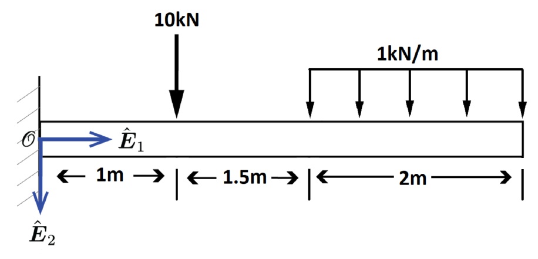
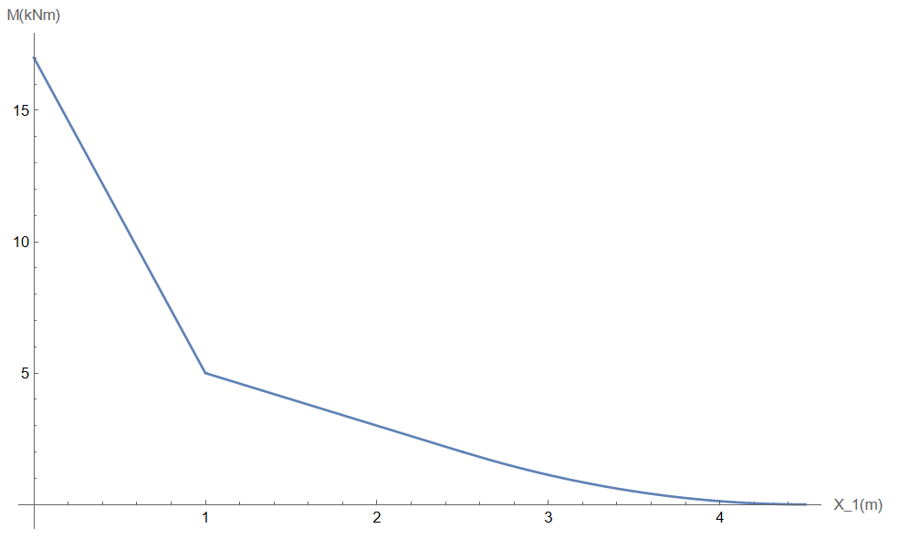




#### Problem 1. 

**Solution:**

By rotating the bar by $30^{o}$ we can get isolate the normal stress in the $\hat{\boldsymbol{E}}_1$  direction and the shear stress in the $\hat{\boldsymbol{E}}_2$, so then $\sigma_{max}A = P_{max} \sin{30^{o}}\Rightarrow P_{max} = \frac{(40~\rm MPa)(.0019 ~\rm m^2)}{\sin{30^{o}}} = 152~\rm kN$ and $\tau_{max}A = P_{max} \cos{30^{o}}\Rightarrow P_{max} = \frac{(15~\rm MPa)(.0019~\rm m^2)}{\cos{30^{o}}} = 32.9~\rm kN$. So the maximum value of $P$ is $32.9~\rm kN$ and failure in the weld will occur in shear. 

#### Problem 2. 

**Solution:**

$$\boldsymbol{\sigma} = \begin{pmatrix} 175~\rm MPa & 50 ~\rm MPa\\ 50~\rm MPa & -90~\rm MPa\end{pmatrix}$$

(b) For this given stress tensor what is the maximum and minimum values of the scalar part of normal component of the traction vector, and what are the corresponding angles. 

**Solution:**

The scalar part of the normal component of the traction vector is $\sigma(\theta) = \sigma_{11}cos(\theta)^2 + \sigma_{22}sin(\theta)^2 + \sigma_{12}sin(2\theta)$. The maximum is $\sigma(\theta = .180 ~\rm rads) = 184.12~\rm MPa$ and the minimum is $\sigma(\theta = 1.751~\rm rads) = -99.12~\rm MPa$.

(c) For this given stress tensor what is the maximum and minimum values of the scalar part of shear component of the traction vector, and what are the corresponding angles. 

**Solution:**

The scalar part of the normal component of the traction vector is $\tau(\theta) = -\frac{\sigma_{11} - \sigma_{22}}{2}sin(2\theta) + \sigma_{12}cos(2\theta)$. The maximum is $\tau(\theta = .966~\rm rads) = 141.62 ~\rm MPa$ and the minimum is $\tau(\theta = 2.536~\rm rads) = -141.62~\rm MPa$.

(d)  For this given stress tensor draw the Mohr Circle.

**Solution:**

The radius of the Mohr's Circle is $R = \sqrt{\left(\frac{\sigma_{11} - \sigma_{22}}{2}\right)^2 + \sigma_{12}^2} =141.62 ~\rm MPa$ and the center is $(C,0) = \left(\frac{\sigma_{11} + \sigma_{22}}{2} , 0\right) = \left(42.5~\rm MPa , 0\right)$.

#### Problem 3. 

**Solution:**

1. $$\breve{u}_i(X_1,X_2,X_3) = ((\lambda_{1} - 1)X_{1}, (\lambda_{2} - 1)X_{2}, (\lambda_{3} - 1)X_{3})$$

2.  $$\breve{\epsilon}_{ij}(X_1,X_2,X_3) = \begin{pmatrix} \lambda_{1} - 1 & 0 & 0\\ 0 & \lambda_{2} - 1 & 0 \\ 0 & 0 & \lambda_{3} - 1\end{pmatrix}$$

3. $$\breve{\sigma}_{ij}(X_1,X_2,X_3) = \begin{pmatrix} 2\mu(\lambda_{1} - 1) + \lambda(\lambda_{1} + \lambda_{2} + \lambda_{3} - 3) & 0 & 0\\ 0 & 2\mu(\lambda_{2} - 1) + \lambda(\lambda_{1} + \lambda_{2} + \lambda_{3} - 3) & 0 \\ 0 & 0 & 2\mu(\lambda_{3} - 1) + \lambda(\lambda_{1} + \lambda_{2} + \lambda_{3} - 3)\end{pmatrix}$$

4. $$\lambda_{2} = \lambda_{3} = \frac{-2\mu -3\lambda +\lambda \lambda_1}{2(\mu + \lambda)}$$

5. $$\left[\breve{\boldsymbol{t}}(X_1,X_2,X_3;\hat{\boldsymbol{E}}_1)\right] = \begin{pmatrix} \frac{\mu  (2 \mu  + 3 \lambda) (-1 + \lambda_1)}{\mu + \lambda} \\ 0 \\ 0 \end{pmatrix}$$

6.  $$\boldsymbol{F}(X_1,\hat{\boldsymbol{E}}_1) = \begin{pmatrix} \frac{A\mu  (2 \mu  + 3 \lambda) (-1 + \lambda_1)}{\mu + \lambda} \\ 0 \\ 0 \end{pmatrix}$$

7. $$\boldsymbol{F}(X_1,\hat{\boldsymbol{E}}_1) \cdot \hat{\boldsymbol{E}}_1 = F(X_1) = A(X_1) E(X_1) u'(X_1)$$

#### Problem 4. 

**Solution:**

(a)

$$M(X_1) = \begin{cases}
17 - 12X_1  & ~ X_1 \leq 1 ~\rm m\\
7 - 2 X_1  & 1 ~\rm m\leq X_1 \leq 2.5 ~\rm m\\
\frac{1}{2}  (4.5 - X_1)^2  & 2.5 ~\rm m \leq X_1
\end{cases}$$

(b) $\sigma_{max} = \frac{M_{max}\frac{h}{2}}{I} = \frac{(17~\rm kNm)(.0125~\rm m)}{3.255 \times 10^{-8} ~\rm m^4} = 6528.0 ~\rm MPa$.

#### Problem 5. 

**Solution:**

(a) $R_A = \frac{M - FL}{3L}$ and $R_B = \frac{-2FL - M}{3L}$

(b)
$$M(X_1) = \begin{cases}
X_1\left( \frac{M - FL}{3L}\right)  &  X_1 \leq  ~\rm L\\
X_1\left( \frac{M - FL}{3L}\right) - M & \rm L \leq X_1 \leq 2 \rm L\\
(3L - X_1)\left( \frac{-2FL - M}{3L} \right)  & 2 \rm L \leq X_1
\end{cases}$$

(c) 
$$EIy(X_1) = \begin{cases}
\frac{X_1}{18L}(8 F L^3 + 3 L^2 M - F L X_1^2 + M X_1^2)  &  X_1 \leq  ~\rm L\\

\frac{1}{18L} (21 L^2 M X_1 + M X_1^3 - LX_1^2 (9 M + F X_1) + L^3 (-9 M + 8 F X_1)) & \rm L \leq X_1 \leq 2 \rm L\\

-\frac{1}{18L} (3 L - X_1) (L^2 (8 F L + 3 M) - 6 L (2 F L + M) X_1 + (2 F L + M) X_1^2)  & 2 \rm L \leq X_1
\end{cases}$$

#### Problem 6. 

**Solution:**

$R_A = -\frac{3 a b^2 F + b^3 F}{(a + b)^3}$,  $R_B = -\frac{a^3 F + 3 a^2 b F}{(a + b)^3}$, $ M_A = -\frac{a b^2 F}{(a + b)^2)}$ and, $ M_B = \frac{a^2 b F}{(a + b)^2}$.

$$M(X_1) = \begin{cases}
\frac{b^2 F (a (a + b) - (3 a + b) X_1)}{(a + b)^3}  &  X_1 \leq  \rm a\\

-\frac{a^2 F (a^2 + 3 a b + 2 b^2 - (a + 3 b) X_1)}{(a + b)^3} & \rm{a} \leq X_1 \\

\end{cases}$$

$$EIy(X_1) = \begin{cases}
\frac{b^2 F X_1^2 (3 a (a + b) - (3 a + b) X_1)}{6 (a + b)^3}  &  X_1 \leq  \rm a\\

-\frac{a^2 F (a + b - X_1)^2 (a (a + b) - (a + 3 b) X_1)}{6 (a + b)^3)} & \rm{a} \leq X_1 \\

\end{cases}$$