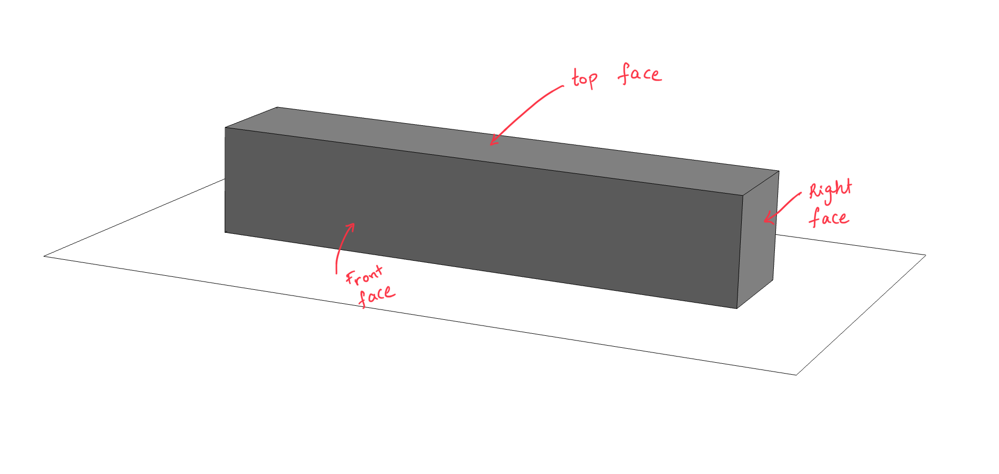




#### Problem 1. 

A square prism of   rubber  is lying flat on a table. The length of prism is 5 cm. Take the origin to be the centeroid of it's left end. The $\hat{\boldsymbol{E}}_1$ to be in the direction of the rubber prism's axis, $\hat{\boldsymbol{E}}_a$. The rubber prism base is a square, with 1 cm sides. Take $\hat{\boldsymbol{E}}_2$ to be  perpendicular to the table and pointing upward.   The top, bottom, fron faces of the prism are rectangles of sides 5 cm and 1 cm.  

1. Draw a 2D view of a  the prism's reference configuration, when viewed from the $\hat{\boldsymbol{E}}\_3$ direction.  This just going to look like a rectangle. Mark the prism's important dimensions. The vectors, $\hat{\boldsymbol{E}}\_1$, $\hat{\boldsymbol{E}}\_2$, $\hat{\boldsymbol{E}}\_3$, $+\hat{\boldsymbol{E}}\_{\rm a}$, and $-\hat{\boldsymbol{E}}\_{\rm a}$

2. Reference position vectors.
  *  Let's call the material particle that is center of the right face $\mathcal{C}$. What is the position vector of $\mathcal{C}$? Express it in terms of $\hat{\boldsymbol{E}}_1$, $\hat{\boldsymbol{E}}_2$. and $\hat{\boldsymbol{E}}_3$.
  
  * Let's call the material particle that is center of the prism's left face $\mathcal{B}$. What is the position vector of $\mathcal{B}$? Express it in terms of $\hat{\boldsymbol{E}}_1$, $\hat{\boldsymbol{E}}_2$. and $\hat{\boldsymbol{E}}_3$.
  
  * Let's call the material particle that is  at the center of the prism's face that is touching the table $\mathcal{A}$. What is the position vector of $\mathcal{A}$? Express it in terms of $\hat{\boldsymbol{E}}_1$, $\hat{\boldsymbol{E}}_2$. and $\hat{\boldsymbol{E}}_3$.  

* The prism is now streched along its axis to that its length increases to 8 cm. The left and right faces still remain squares, and the top, bottom, front, and back faces still remain rectangles. The material particles that were at the centers of the faces when the prism was undeformed are at, respective centers of the deformed faces as well. The origin does not move as the prism is deformed. The bottom face of the prims still remains in contact with the table's top surface. 

3. Draw a 2D view of a  the prism's deformed configuration, $\mathcal{B}$, when viewed from the $\hat{\boldsymbol{E}}_3$ direction.

4. Current position vectors.   
 - What is the position vector of the materials particle $\mathcal{C}$, $\mathcal{B}$, and $\mathcal{A}$ after the prism has been deformed. Express them as a combination of $\hat{\boldsymbol{E}}_1$, $\hat{\boldsymbol{E}}_2$. and $\hat{\boldsymbol{E}}_3$.

 - The material particle $\mathcal{D}$ is the materials particle that is the top, back  corner of the right face (see figure). It remains at that corner throughout  the deformation. What is the reference position vector of  $\mathcal{D}$? What is its current position vector, i.e., its position vector after the bar has been deformed? 

 - The material particle $\mathcal{E}$ is the material particle that is the bottom, front  corner of the left face (see figure). It remains at that corner throughout  the deformation. What is $\mathcal{E}$'s  position vector in the reference configuration, $\mathcal{B}\_{\rm ref}$? What is its position vector in current or deformed configuration, $\mathcal{B}$? 

6. Displacement field
  - What is the displacement vectors of  $\mathcal{C}$, $\mathcal{B}$, $\mathcal{A}$, $\mathcal{E}$ and $\mathcal{D}$. Express these in terms of  $\hat{\boldsymbol{E}}_1$, $\hat{\boldsymbol{E}}_2$, and $\hat{\boldsymbol{E}}_3$.
  
7. Calling materials particles by their reference position vectors. 
 -What is the displacement of the material particle $5~\rm cm\hat{\boldsymbol{E}}_1+\frac{1}{2}~\rm cm~\hat{\boldsymbol{E}}_2$
 - What is the current position vector of the material particle $10~\rm cm\hat{\boldsymbol{E}}_1-\frac{1}{2}~\rm cm~\hat{\boldsymbol{E}}_2-\frac{1}{2}~\rm cm~\hat{\boldsymbol{E}}_3$
