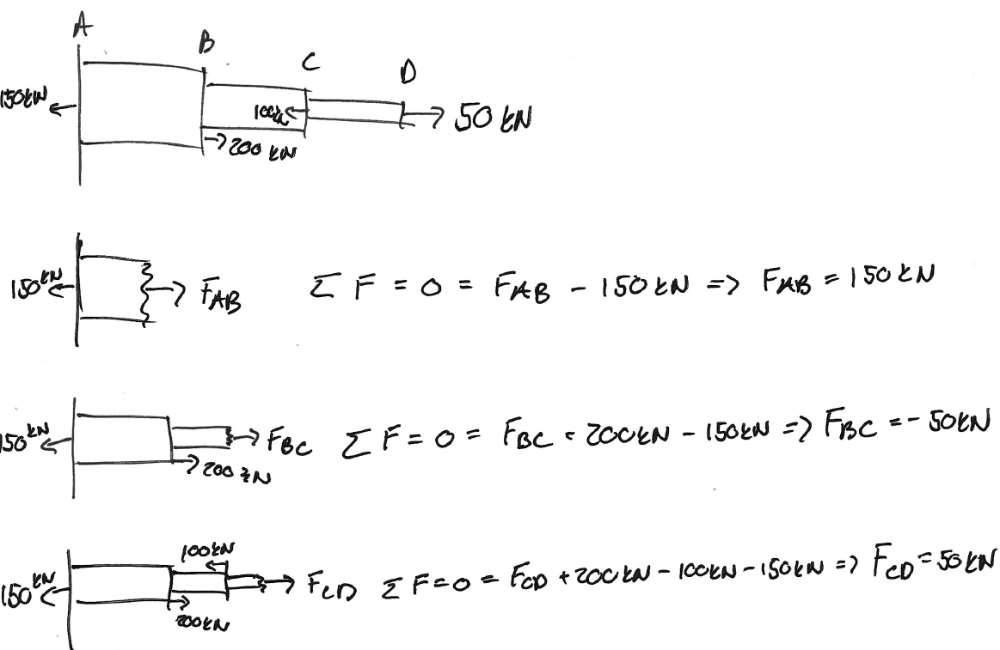
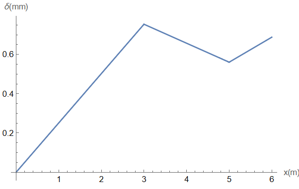
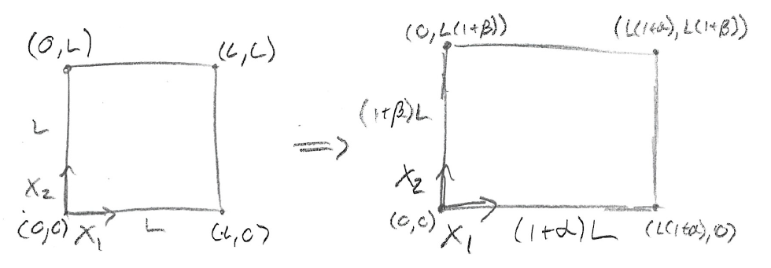

#### Problem 1. 

**Solution:** 

As given in the problem the polar moment from a rectange is $J = \frac{bh}{12}\left(b^2 + h^2 \right)$, so the polar moment of a rectangle with a rectangular hole is $J=J_{o} - J_{i} = \frac{b_oh_o}{12}\left(b_o^2 + h_o^2 \right) - \frac{b_ih_i}{12}\left(b_i^2 + h_i^2 \right)$, so plugging into the equation for twist angle we get $\theta = \frac{TL}{JG} = \frac{TL}{\left(  \frac{b_oh_o}{12}\left(b_o^2 + h_o^2 \right) - \frac{b_ih_i}{12}\left(b_i^2 + h_i^2 \right)\right)G}$.

 

#### Problem 2. 

**Solution:** 

From the internal forces seen above we can solve for the displacements in each piece of the bar using the displacement equation, $\delta = \frac{150kN(x)}{72GPa(\frac{\pi}{4})(.1m)^2}$ from $x\in(0,3m)$, then $\delta = \frac{150kN(3m)}{72GPa(\frac{\pi}{4})(.1m)^2} + \frac{-50kN(x - 3m)}{117GPa(\frac{\pi}{4})(.075m)^2}$ from $x\in(3m,5m)$, then $\delta = \frac{150kN(3m)}{72GPa(\frac{\pi}{4})(.1m)^2} + \frac{-50kN(2m)}{117GPa(\frac{\pi}{4})(.075m)^2} + \frac{50kN(x - 5m)}{200GPa(\frac{\pi}{4})(.05m)^2}$ from $x\in(3m,5m)$ from $x\in(5m,6m)$.

 

#### Problem 3. 

**Solution:** 

The cross sectional area as a function of $x$ is given by $A(x) = L(x)^2$, where $L(x)$ is the side length of the square cross section. Since it tapers linearly between $L_i$ and $L_f$, it is given by the equation $L(x) = L_i + \frac{L_f - L_i}{L}x$, so $A(x) = \left(L_i + \frac{L_f - L_i}{L}x \right)^2$. THen in order to find the body forces due to gravity as a function of $x$ we have $F_g(x) = \rho g V_{below}(x)$, where V_{below}(x) is the volume below some point $x$, which is proportional to the amount of mass below some point $x$ that is causing a gravitational force pulling downward. Then $V_{below}(x) = V_{total} - V_{above}(x) = {\int_{x}^{L} A(s) \,ds} = {\int_{x}^{L} \left(L_i + \frac{L_f - L_i}{L}x \right)^2 \,ds} = \frac{L\left(L_f^3 -  \left(L_i + \frac{L_f - L_i}{L}x \right)^3\right)}{3(L_f - L_i)}$, so $F_g(x) =  \frac{L\rho g\left(L_f^3 -  \left(L_i + \frac{L_f - L_i}{L}x \right)^3\right)}{3(L_f - L_i)}$. Then becuase the force of gravity is downward along with the internal force due to $P$, so $B(x) = P + F_g(x)$, where positive displacement is defined as pointing downwards. Then $\delta = {\int_{0}^{L} \frac{B(x)}{EA(x)} \,dx} = {\int_{0}^{L} \frac{P + \frac{L\rho g\left(L_f^3 -  \left(L_i + \frac{L_f - L_i}{L}x \right)^3\right)}{3(L_f - L_i)}}{E\left(L_i + \frac{L_f - L_i}{L}x \right)^2} \,dx} = \frac{L \left( 6P + g \rho L L_f (2L_f + Li) \right)}{6EL_fL_i}$.

 

#### Problem 4. 

**Solution:**

By definition we have that $\textbf{u}\left(\textbf{X}\right) = \left(\alpha X_1, \beta X_2 \right) = \textbf{x}(\textbf{X}) - \textbf{X}$, so if we want to know location of points in the deformed body $\textbf{x}$ that were originally at location $\textbf{X}$ in the reference body we have $\textbf{x}(\textbf{X}) = \textbf{u}\left(\textbf{X}\right) + \textbf{X}$, so we have that $x_1 = \alpha X_1 + X_1 = (\alpha + 1)X_1$ and $x_2 = \alpha X_2 + X_2 = (\beta + 1)X_2$. 

#### Problem 5. 

**Solution:**

The displacement in the section $AB$ due to the internal force, which has internal force of $50kN$, is given by $\delta_{AB} = {\int_{0}^{2}  \frac{50kN}{120GPa(\frac{\pi}{4})\left( .05m e^{2 - x}\right)^2} \,dx} = 0.1042mm$. Then the displacement in the section $BC$ due to the internal force, which is $100kN$, is given by $\delta_{BC} = \frac{(100kN)(1m)}{(200GPa)(\frac{\pi}{4})(.05^2 - .025^2)m^2} = 0.3395mm$. Then the displacement due to the temperature change is given by $\delta _T = (60\degree C)(10^{-5} \frac{1}{\degree C})(1m) + (60\degree C)(8.4\times 10^{-6} \frac{1}{\degree C})(2m) = 1.608mm$, so the total displacement is $\delta = \delta_{AB} + \delta_{BC} + \delta _T = 2.0517mm$

#### Problem 6. 

**Solution:**

The twist in the section $AB$ due to the internal torque in the section, $150kNm$, is $\theta_{AB} = {\int_{0}^{2}  \frac{150kNm}{44GPa(\frac{\pi}{2})\left( .05m e^{2 - x}\right)^4} \,dx} = 0.0868rad$. The twist in the section $BC$ due to the internal torque in the section, $100kNm$, is $\theta_{BC} = \frac{(100kNm)(1m)}{(77GPa)(\frac{\pi}{2})(.05^4 - .025^4)m^2}=2.2577rad$, so the total twist is $\theta = \theta_{AB} + \theta_{BC} = 2.3444 rad$