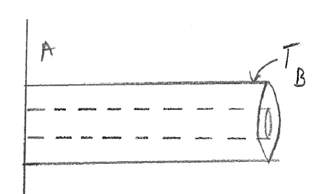
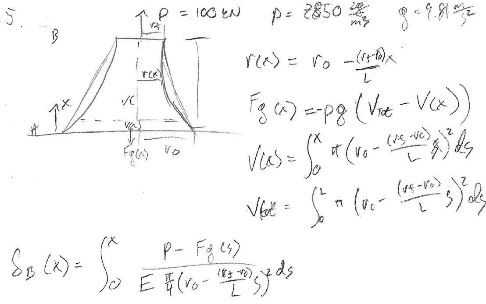




# ENGN0310: Practice Midterm

> Contact Andrew_Bagnoli@brown.edu if you have questions about the problems below.   

#### Problem 1. 

Figure 1

Assume we have the bar shown in figure 1 with radius given by the expression $r(x)=r\_{o} e^{ax}$ with a torque $T$ applied at the end of the bar $B$. What is the twist at $B$?

**Solution:** $J(x) = \frac{\pi}{2}{r(x)}^4 $, then $\theta_{B} = {\int_{0}^{L} \frac{T}{G J(x)} \,dx} = \frac{T}{2 \pi a r_o^4 G} \left( 1 - e^{-4aL} \right)$

 

#### Problem 2. 

Figure 2

Figure 3

Assume we have the bar shown in figure 2 with cross section given in figure 3. The inner bar has a radius of $r\_{A}$ and is made of a material with stiffness modulus $G\_{A}$ and the outer bar has a radius of $r\_{B}$ and is made of a material with stiffness $G\_{B}$. What is the torque that has to be applied to produce a twist of $\theta = \frac{\pi}{3}$ at the end of the bar?

**Solution:** The polar moment of inertia of the outer material is $J_B = \frac{\pi}{2}(r_B^4 - r_A^4)$ and for the inner material $J_A = \frac{\pi}{2}r_A^4$. Then $T_A = \frac{J_A G_A \theta}{L}$ and $T_B = \frac{J_B G_B \theta}{L}$, then $T = T_A + T_B = \frac{\pi^2}{6L} \left[ r_A^4 G_A + \left(r_A^4 - r_B^4\right)G_B\right]$

 

#### Problem 3. 

Figure 4

Figure 5

Assume we have the triangular bar given in figure 4 with length $L$ and made of a material with a stiffness modulus $G$, what is the angle of twist at the end of the bar due to an applied torque $T$? Hint: The centroid of a triangle with height $h$ and base length $b$ is along the midpoint, $\frac{h}{3}$ from the base, shown as the location of the coordinate axis in figure 5. You can also find this find this using the MomentOfInertia command in Mathematica for a triangle. The answer you should get for the polar moment of inertia is $J=bh\left(\frac{b^2}{48} + \frac{h^2}{36}\right)$.

**Solution:** $J = {\int_{A}^{} r^2 \,dA} = {\int_{A}^{}x^2 \,dxdy} + {\int_{A}^{}y^2 \,dxdy}$. Then the limits of integration on $x \in \left( -\frac{b}{2},0 \right)$ is $y \in \left(-\frac{h}{3}, \frac{2h}{3} + \frac{2h}{b}x\right)$ and for $x \in \left( 0, \frac{b}{2} \right)$ is $y \in \left(-\frac{h}{3}, \frac{2h}{3} - \frac{2h}{b}x\right)$. Then ${\int_{A}^{}x^2 \,dxdy} = {\int_{-\frac{b}{2}}^{0}{\int_{-\frac{h}{3}}^{\frac{2h}{3} + \frac{2h}{b}x}x^2 \,dy} \,dx} + {\int_{0}^{\frac{b}{2}}{\int_{-\frac{h}{3}}^{\frac{2h}{3} - \frac{2h}{b}x}x^2 \,dy} \,dx} = \frac{b^3h}{48}$ and ${\int_{A}^{}y^2 \,dxdy} = {\int_{-\frac{b}{2}}^{0}{\int_{-\frac{h}{3}}^{\frac{2h}{3} + \frac{2h}{b}x} y^2 \,dy} \,dx} + {\int_{0}^{\frac{b}{2}}{\int_{-\frac{h}{3}}^{\frac{2h}{3} - \frac{2h}{b}x}y^2 \,dy} \,dx} = \frac{bh^3}{36}$, then $J=bh\left(\frac{b^2}{48} + \frac{h^2}{36}\right)$, so $\theta = \frac{TL}{JG}$ for given $J$.

 

#### Problem 4. 

Figure 6

Assume we have the bar given in figure 6 with total length $L=3m$, where forces are applied at points $B$, $C$, and $D$ with magnitudes $60kN$, $40kN$, and $20kN$ respectively. Also assume that the section of the bar $AB$ has diameter $D\_{AB}=75mm$ and is made of steel, with $E\_{AB}=200GPa$ and thermal expansion coefficient $\alpha\_{AB} = 10\times10^{-6}\frac{1}{°C}$. Section $BC$ is tapered linearly from a diameter of $75mm$ to a diameter of $25mm$ and is made of titanium, with $E\_{BC}=120GPa$ and $\alpha\_{BC} = 8.4\times10^{-6}\frac{1}{°C}$. Section $CD$ has diameter $D\_{CD}=25mm$ and is also made of steel. If the bar is initially at room temperature ($20°C$), at what temperature will the net displacement at point $D$ be zero?

**Solution:**

 

#### Problem 5. 

Figure 7

Assume we have the bar in figure 7, which a circular cross section with a radius that tapers linearly from $r\_{i} = 125mm$ to $r\_{f} = 75mm$ and an applied force of $P$ at point $B$. If the bar is made of steel, with $E=200GPa$ and $\rho = 7850 \frac{kg}{m^3}$, with $L=3m$, and under an applied force of $P = 10kN$, then what is the displacement as a function of $x$? Assume that gravitational forces are present and $g=9.81 \frac{m}{s^2}$.

**Solution:**

 

#### Problem 6. 

Figure 8

Assume we have the bar in figure 8, with $D=2m$, $d=1m$, and $r=80mm$. If the bar has a yield stress of $\sigma \_{y} = 75MPa$ and the applied stress is $\sigma = 27.5MPa$, then will the bar fail?

**Solution:**

 

#### Problem 7. 

Figure 9

Assume we have the displacement field given by $\textbf{u}\left(\textbf{X}\right) = \left(\beta X\_{2}, 0, 0 \right)$. If the reference body is given in figure 9, a cube with side length $L$, draw the deformed body.

**Solution:**

 