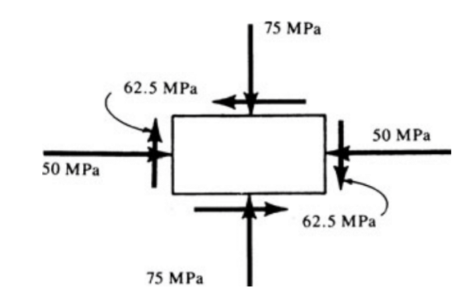




# ENGN0310: Practice Midterm

> Contact Andrew_Bagnoli@brown.edu if you have questions about the problems below.   

#### Problem 1. 

Figure 1

The bar in the figure above is made of a material with an ultimate tensile strength of $220MPa$ and an ultimate shear strength of $100MPa$, where the cross sectional area is $A = 100mm^2$. If the ultimate strength of the weld is $80%$ of that of the base material, for both shear and normal stress, then what is the maximum allowable applied force $P$ and how will the bar fail?

#### Problem 2. 

Figure 2

(a) Given the loading in figure 2 what is the stress tensor. 
(b) For this given stress tensor what is the maximum and minimum values of the scalar part of normal component of the traction vector, and what are the corresponding angles. 
(c) For this given stress tensor what is the maximum and minimum values of the scalar part of shear component of the traction vector, and what are the corresponding angles. 
(d)  For this given stress tensor draw the Mohr Circle.

#### Problem 4. 

Figure 3

(a) For the problem in figure 3 prepare the shear and bending moment diagrams.

Figure 4

(b) For the problem in figure 4 prepare the shear and bending moment diagrams.

#### Problem 5. 

Figure 5

a) If the beam in figure 5 is made of a material with an ultimate normal strength $250MPa$ and has a rectangular cross section with a width of $30mm$ and height $20mm$, then what is the maximum allowable value of $P$?

Figure 6

a) If the beam in figure 5 is made of a material with an ultimate normal strength $250MPa$ and has a cross section given in figure 6, where $H = 50mm$, $h = 40mm$, $a = 10mm$, and $b = 50mm$, then what is the maximum allowable value of $P$? Note: For an I beam like figure 6 $I = \frac{ah^3}{12} + \frac{b\left(H^3 - h^3\right)}{12}$. and the centriod is at the origin. 

#### Problem 6. 

Figure 7

a) Find the maximum displacement of the bar in figure 7. 

Figure 8

b) Find the maximum displacement of the bar in figure 8.

Figure 9

c) Find the maximum displacement of the bar in figure 9. Note that $M_1$, $M_2$, $R_1$, and $R_2$ are reaction forces and $M$ is an applied moment. 

