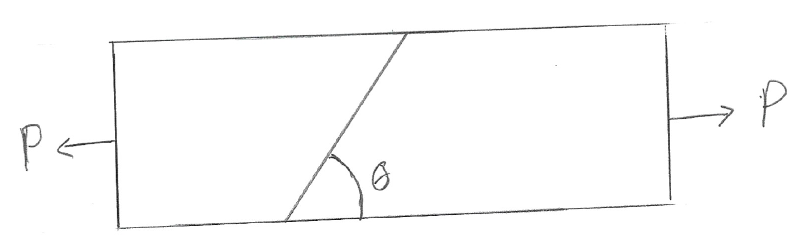
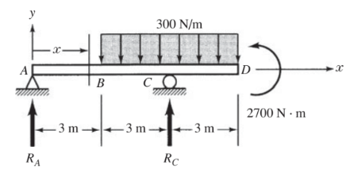
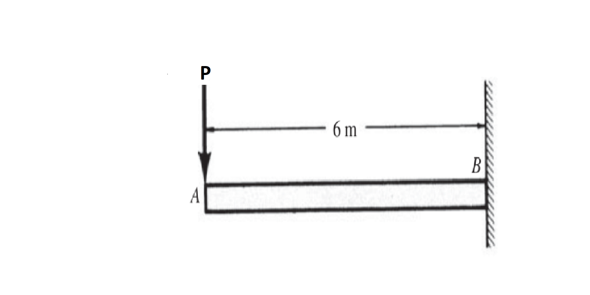
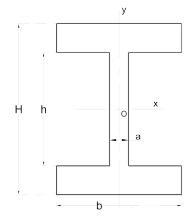
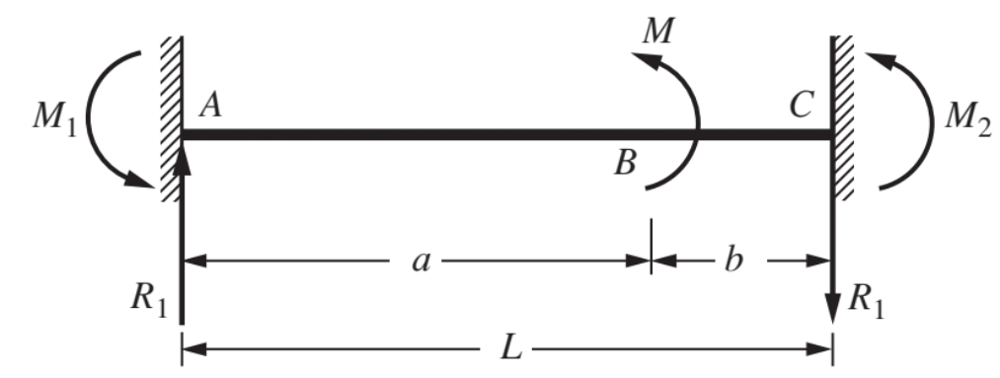




# ENGN0310: Practice Final

> Contact Andrew_Bagnoli@brown.edu if you have questions about the problems below.   

#### Problem 1. 

Figure 1

The bar in the figure above is made of a material with an ultimate tensile strength of $220MPa$ and an ultimate shear strength of $100MPa$, where the cross-sectional area is $A = 100mm^2$. If the ultimate strength of the weld is $.8$ of that of the base material, for both shear and normal stress, then what is the maximum allowable applied force $P$ and how will the bar fail? The angle of the weld is $\theta = 65^{o}$.

#### Problem 2. 

Figure 2

(a) Given the loading in figure 2 what is the stress tensor. 

(b) For this given stress tensor what is the maximum and minimum values of the scalar part of normal component of the traction vector, and what are the corresponding angles. 

(c) For this given stress tensor what is the maximum and minimum values of the scalar part of shear component of the traction vector, and what are the corresponding angles. 

(d)  For this given stress tensor draw the Mohr Circle.

#### Problem 3.

We studied the problem of bending in class, where we have been using the constitutive equation that 

$$
\begin{equation}
EIy''(X_1)=M(X_1)
\end{equation}
$$

where 
* $M(X_1)$ is the bending moment and is defined as $\boldsymbol{M}(X_1,\hat{\boldsymbol{E}}_1)\cdot \hat{\boldsymbol{E}}_3$,
* $E$ is the Young's modulus, 
* $I$ is the second bending moment of inertia, or the second moment of area. It is defined as
 $$
 \begin{equation}
 I=\int_{\Gamma(X_1)}X_2^2\, d\Gamma.
 \end{equation}
 $$ 
 Here  $\Gamma(X_1)$ is the cross-sectional surface at $X_1$, which in the current case we will take to not depend on $X_1$, i.e., the beam is of uniform cross-sections along its length.
* $y(X_1)$ is the deflection of the beam's neutral axis at $X_1$.

and $X_1$ is the coordinate of a material particle in the direction of the beam's length. The $X_2$, $X_3$ co-ordinates of the origin $\mathcal{O}$ and of the centroids of the beam's cross-sections are the same. That is, the neutral axis passes through the centroids of the beam's cross-sections. 

In the following we will derive the previous equation from the theory of linear elasticity for the case when the beam is composed of a linear elastic material of Poisson's ration $\nu=0$.

Take the displacement field in the beam  to be

$$
\begin{align}
\breve{x}_1(X_1,X_2,X_3) &= X_1-X_2 y'(X_1) \\
\breve{x}_2(X_1,X_2,X_3)&=X_2+y(X_1)\\
\breve{x}_3(X_1,X_2,X_3)&=X_3
\end{align}
$$

*  **(a)** What is the displacement field? That is, what are the functions

    $\breve{u}_1(X_1,X_2,X_3)$, $\breve{u}_2(X_1,X_2,X_3)$, and $\breve{u}_3(X_1,X_2,X_3)$? Recall that 
    
    $$
    \begin{align}
    \breve{u}_i(X_1,X_2,X_3)=\breve{x}_i(X_1,X_2,X_3)-X_i
    \end{align}
    $$
    
    where $i=1,~2,~3$.

*  **(b)** What is the strain field $\breve{\boldsymbol{\epsilon}}(X_1,X_2,X_3)$?
    Determining the strain field is equivalent to determining the components 

    $$
    \begin{align}
    \breve{\epsilon}_{ij}(X_1,X_2,X_3)
    \end{align}
    $$
 
    where $i$, $j=1,~2,~3$. In other words, find the strain field by  determining the nine functions  $\breve{\epsilon}\_{11}(X_1,X_2,X_3)$, $\breve{\epsilon}\_{12}(X_1,X_2,X_3)$,....$\breve{\epsilon}\_{32}(X_1,X_2,X_3)$, $\breve{\epsilon}\_{33}(X_1,X_2,X_3)$. 
    
    Recall the definition of the strain components:

    $$
    \begin{align}
    \breve{\epsilon}_{11}(X_1,X_2,X_3)&=
    \frac{\partial \breve{u}_1(X_1,X_2,X_3)}{\partial X_1}\\
    \breve{\epsilon}_{22}(X_1,X_2,X_3)&=
    \frac{\partial \breve{u}_2(X_1,X_2,X_3)}{\partial X_2}
    \\
    \breve{\epsilon}_{33}(X_1,X_2,X_3)&=
    \frac{\partial \breve{u}_3(X_1,X_2,X_3)}{\partial X_3}\\
    \breve{\epsilon}_{12}(X_1,X_2,X_3)&=
    \frac{1}{2}
    \left(
    \frac{\partial \breve{u}_1(X_1,X_2,X_3)}{\partial X_2}
    +
    \frac{\partial \breve{u}_2(X_1,X_2,X_3)}{\partial X_1}
    \right)
    \\
    \breve{\epsilon}_{21}(X_1,X_2,X_3)&=\breve{\epsilon}_{12}(X_1,X_2,X_3)
    \\
    \breve{\epsilon}_{13}(X_1,X_2,X_3)&=
    \frac{1}{2}
    \left(
    \frac{\partial \breve{u}_1(X_1,X_2,X_3)}{\partial X_3}
    +
    \frac{\partial \breve{u}_3(X_1,X_2,X_3)}{\partial X_1}
    \right)
    \\
    \breve{\epsilon}_{31}(X_1,X_2,X_3)&=\breve{\epsilon}_{13}(X_1,X_2,X_3)
    \\
    \breve{\epsilon}_{23}(X_1,X_2,X_3)&=
    \frac{1}{2}
    \left(
    \frac{\partial \breve{u}_2(X_1,X_2,X_3)}{\partial X_3}
    +
    \frac{\partial \breve{u}_3(X_1,X_2,X_3)}{\partial X_2}
    \right)\\
    \breve{\epsilon}_{32}(X_1,X_2,X_3)&=\breve{\epsilon}_{23}(X_1,X_2,X_3)
    \end{align}
    $$

* **(c)** Let us assume that the beam is composed of a linear elastic solid. What is the stress field $\breve{\boldsymbol{\sigma}}(X_1,X_2,X_3)$? Determining the stress field is equivalent to determining the components 

    $$
    \begin{align}
    \breve{\sigma}_{ij}(X_1,X_2,X_3)
    \end{align}
    $$
  
   where $i$, $j=1,~2,~3$. In other words, compute the stress field by determining the nine functions $\breve{\sigma}\_{11}(X_1,X_2,X_3)$, $\breve{\sigma}\_{12}(X_1,X_2,X_3)$,....$\breve{\sigma}\_{32}(X_1,X_2,X_3)$, $\breve{\sigma}\_{33}(X_1,X_2,X_3)$. 
   
    Recall the definition of a linear elastic solid. The stress and strain components in a linear elastic solid are given by the Hooke's Law, which states that

    $$
    \begin{align}
    \breve{\sigma}_{11}(X_1,X_2,X_3)&=2\mu \breve{\epsilon}_{11}(X_1,X_2,X_3)+\lambda \text{Tr}(\breve{\boldsymbol{\epsilon}}(X_1,X_2,X_3))\\
    \breve{\sigma}_{22}(X_1,X_2,X_3)&=2\mu \breve{\epsilon}_{22}(X_1,X_2,X_3)+\lambda \text{Tr}(\breve{\boldsymbol{\epsilon}}(X_1,X_2,X_3))\\
    \breve{\sigma}_{33}(X_1,X_2,X_3)&=2\mu \breve{\epsilon}_{33}(X_1,X_2,X_3)+\lambda \text{Tr}(\breve{\boldsymbol{\epsilon}}(X_1,X_2,X_3))\\
    \breve{\sigma}_{23}(X_1,X_2,X_3)&=2\mu \breve{\epsilon}_{23}(X_1,X_2,X_3)\\
    \breve{\sigma}_{13}(X_1,X_2,X_3)&=2\mu \breve{\epsilon}_{13}(X_1,X_2,X_3)\\
    \breve{\sigma}_{12}(X_1,X_2,X_3)&=2\mu \breve{\epsilon}_{12}(X_1,X_2,X_3)\\
    \breve{\sigma}_{32}(X_1,X_2,X_3)&=\breve{\sigma}_{23}(X_1,X_2,X_3)\\
    \breve{\sigma}_{31}(X_1,X_2,X_3)&=\breve{\sigma}_{13}(X_1,X_2,X_3)\\
    \breve{\sigma}_{21}(X_1,X_2,X_3)&=\breve{\sigma}_{12}(X_1,X_2,X_3)
    \end{align}
    $$

    where 

    $$
    \begin{align}
    \text{Tr}(\breve{\boldsymbol{\epsilon}}(X_1,X_2,X_3))=
    \breve{\epsilon}_{11}(X_1,X_2,X_3)+
    \breve{\epsilon}_{22}(X_1,X_2,X_3)+\breve{\epsilon}_{33}(X_1,X_2,X_3)
    \end{align}
    $$ 

    and $\mu$ is the same as $G$, the shear modulus. We will use the simplification that $\nu=0$ later. 

* **(d)** As we have been doing let us take the  beam to be aligned in the $\hat{\boldsymbol{E}}_1$ direction. Consider an imaginary cut at some $X_1$.  What is the traction vector on the surfacxe $\Gamma(X_1,\hat{\boldsymbol{E}}_1)$? That is, determine 
$\breve{\boldsymbol{\sigma}}(X_1,X_2,X_3)^{T}\hat{\boldsymbol{E}}_1$. As can be seen by the presence of $X_1$, $X_2$, and $X_3$, the traction vector will not be constant on the cross-section. It will vary from point to point on the cross-section. Find the left hand side in the below equation by determining the right hand side in the below equation 

    $$
    \begin{equation}
    \left[\breve{\boldsymbol{t}}(X_1,X_2,X_3;\hat{\boldsymbol{E}}_1)\right]
    =\left[\breve{\boldsymbol{\sigma}}(X_1,X_2,X_3)\right]^{\sf T}\left[\hat{\boldsymbol{E}}_1\right]
    \end{equation}
    $$  

* **(e)** Compute the moment  about the centeroid of $\Gamma(X_1)$ of all the forces acting on $\Gamma(X_1, \hat{\boldsymbol{E}}_1)$. That is compute,

    $$
    \begin{align}
    \boldsymbol{M}(X_1,\hat{\boldsymbol{E}}_1)=\int_{\Gamma(X_1)}\boldsymbol{X}\times \breve{\boldsymbol{t}}(X_1,X_2,X_3;\hat{\boldsymbol{E}}_1)\, d\Gamma 
    \end{align}
    $$

    Use the definition of the $I$, which is

    $$
    \begin{align}
    I =\int_{\Gamma(X_1)} X_2^2\, d\Gamma,
    \end{align}
    $$

    to simplify your answer.

    For computing the integral take $\boldsymbol{X}\times \breve{\boldsymbol{t}}(X_1,X_2,X_3;\hat{\boldsymbol{E}}_1)$ as the cross product between $\left[\boldsymbol{X}\right]$, which is

    $$
    \begin{align}
    \begin{bmatrix}
    \boldsymbol{X}
    \end{bmatrix}=
    \begin{bmatrix} 
    X_1\\
    X_2\\
    X_3
    \end{bmatrix}
    \end{align}
    $$

    and 
    
    $$
    \begin{align}
    \left[\breve{\boldsymbol{t}}(X_1,X_2,X_3;\hat{\boldsymbol{E}}_1)\right]
    \end{align}
    $$

You can further simplify your answer by writing 

$$
\begin{align}
\lambda&=\frac{E\nu}{(1+\nu)(1-2\nu)}\\
\mu&=\frac{E}{2(1+\nu)}\\
\end{align}
$$
and setting $\nu=0$.

#### Problem 4. 

Figure 3

(a) For the problem in figure 3 prepare the shear and bending moment diagrams.

Figure 4

(b) For the problem in figure 4 prepare the shear and bending moment diagrams.

#### Problem 5. 

Figure 5

a) If the beam in figure 5 is made of a material with an ultimate normal strength $250MPa$ and has a rectangular cross section with a width of $30mm$ and height $20mm$, then what is the maximum allowable value of $P$?

Figure 6

b) If the beam in figure 5 is made of a material with an ultimate normal strength $250MPa$ and has a cross section given in figure 6, where $H = 50mm$, $h = 40mm$, $a = 10mm$, and $b = 50mm$, then what is the maximum allowable value of $P$? Note: For an I beam like figure 6 $I = \frac{ah^3}{12} + \frac{b\left(H^3 - h^3\right)}{12}$. and the centroid is at the origin. 

#### Problem 6. 

Figure 7

a) Find the maximum displacement of the bar in figure 7. 

Figure 8

b) Find the maximum displacement of the bar in figure 8.

Figure 9

c) Find the maximum displacement of the bar in figure 9. Note that $M_1$, $M_2$, and $R_1$ are reaction forces and $M$ is an applied moment. 

