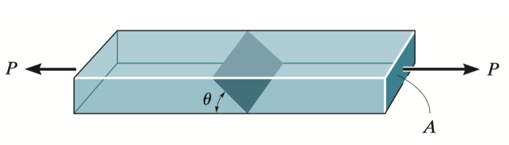
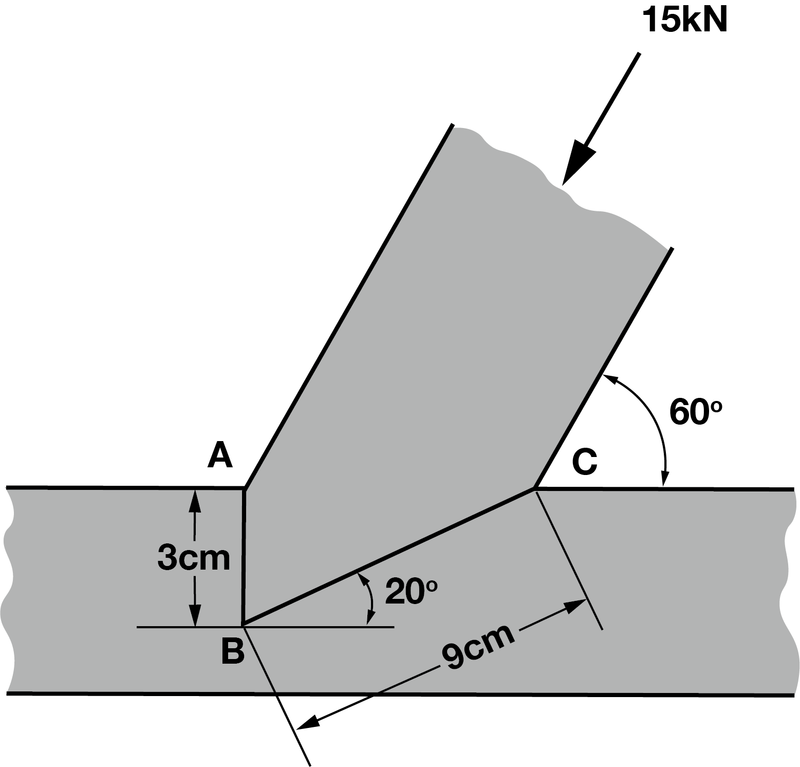
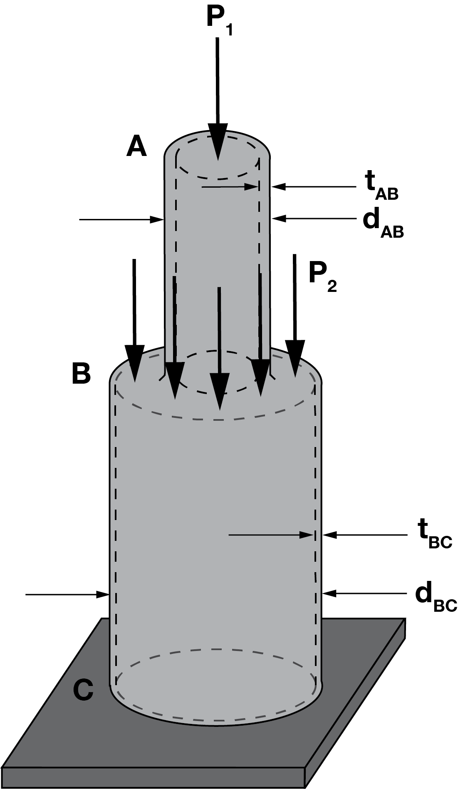
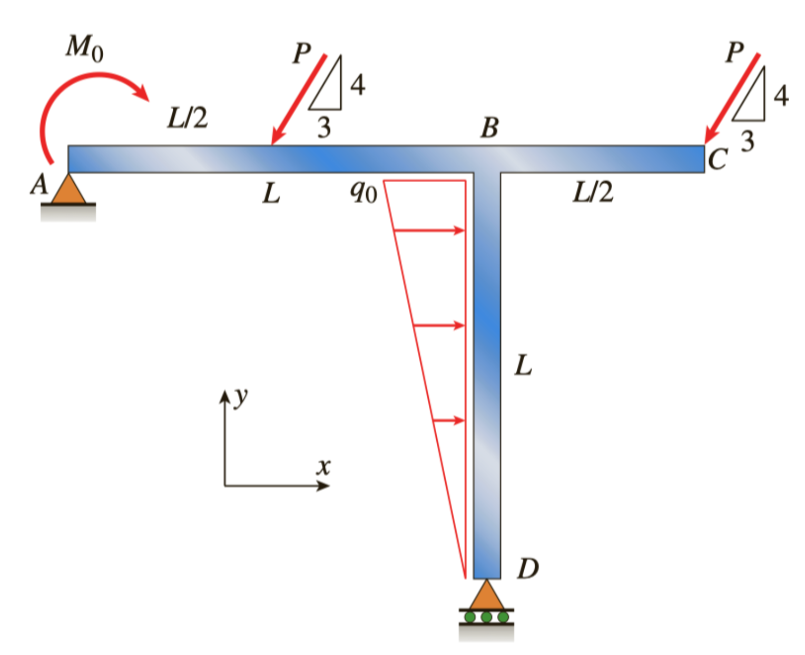
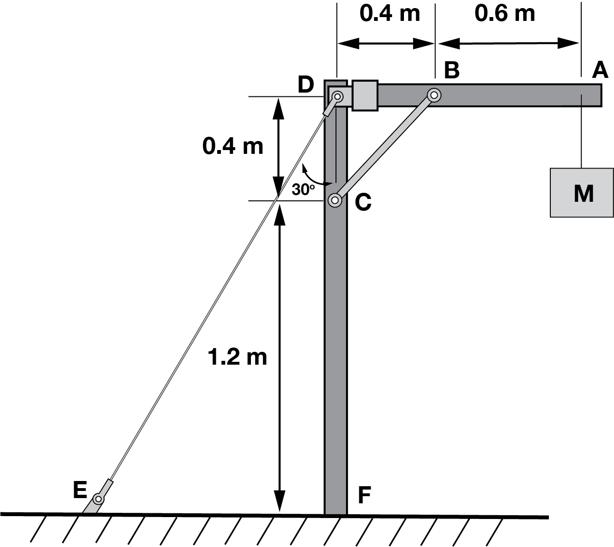

1. The bar has a cross-sectional area A and is subjected to the axial load P. Determine the average normal and shear stresses acting over the shaded section, which is oriented at $\theta$ from the horizontal. Plot the variation of these stresses as a function of $\theta$ ($0 \leq \theta \leq 90^\circ$). 

    

2. The joint is subjected to the axial member force of 15 kN. Determine the average normal stress acting on sections AB and BC. Assume the member is smooth and is 15 cm thick. 

    

3. A hollow circular post ABC supports a load $P_1 = 7.5 kN$ acting at the top. A second load $P_2$ is uniformly distributed around the cap plate at B. The diameters and thicknesses of the upper and lower parts of the poast are $d_{AB}=32~mm$, $t_{AB}=12~mm$, $d_{BC} = 57~mm$, and $t_{BC} = 9~mm$, respectively.
    (A) Calculate the normal stress $\sigma_{AB}$ in the upper part of the post.
    (B) What is the magnitude of load $P_2$ when the lower part of the post has the same compressive stress as the upper part?
    

4. Find support reactions at A and D, and calculate the axial force N, shear force V, and bending moment M at mid-span of column BD. Let $L = 4~m$, $q_0 = 120~N/m$, $P = 400~N$, and $M_0=420~N \cdot m$.
    

5. A mass of M = 9 kg is suspended from point A. Determine the average normal stress in the $5~mm$ diameter wire DE and the $10~mm$ diameter short strut BC.
    
