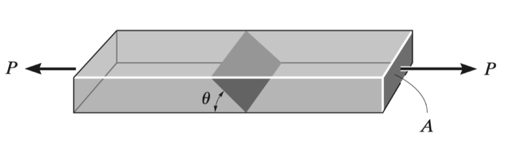
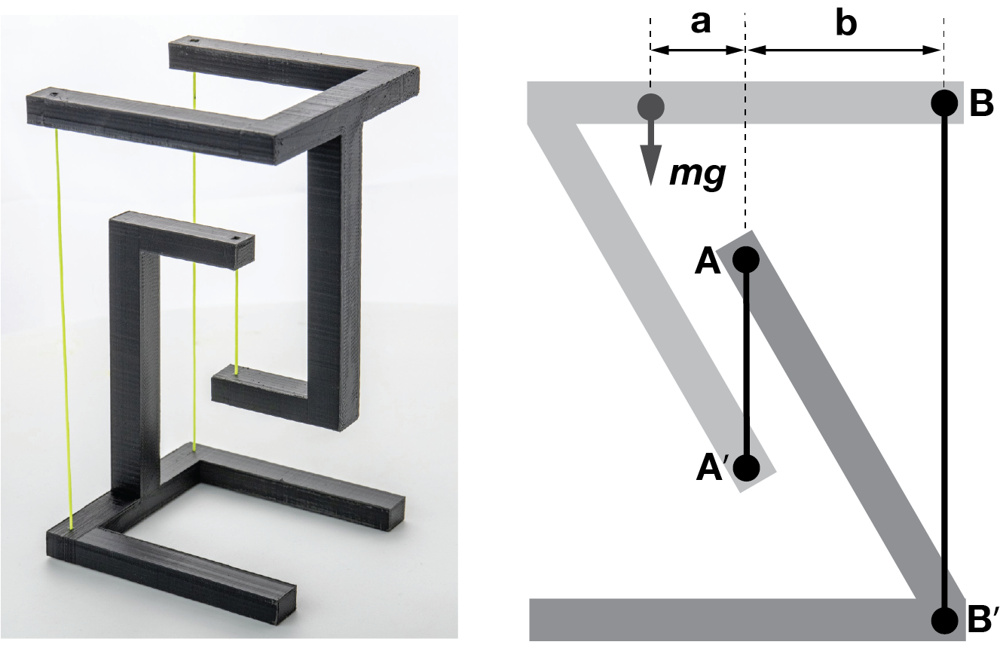
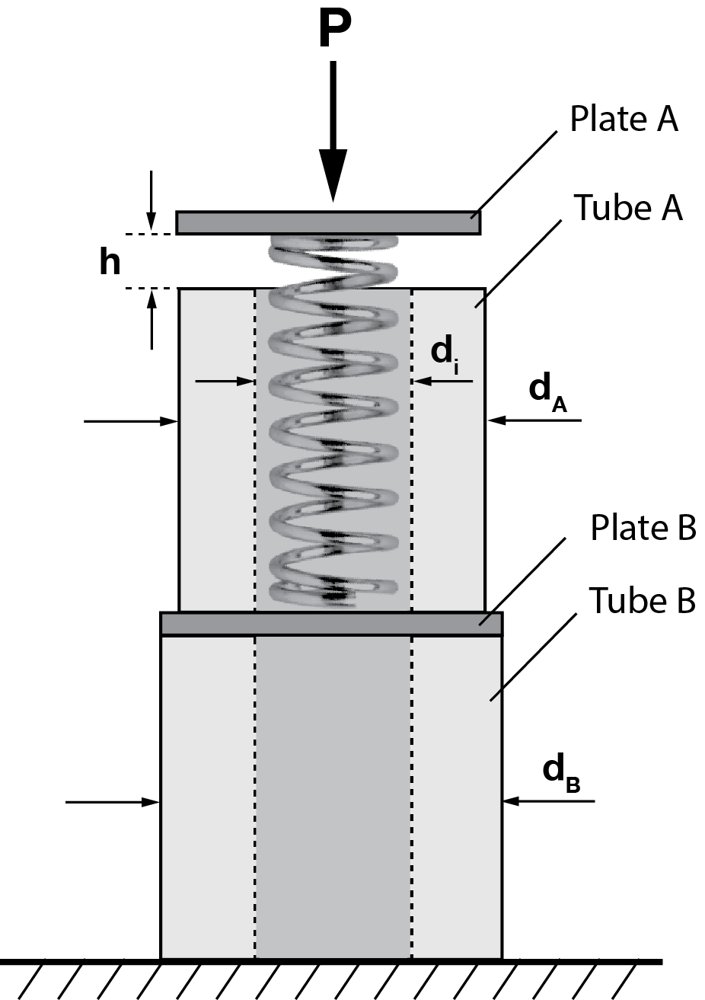

# ENGN0310: Homework 1
## Due Friday, September 15th, 2021

 

        Please upload your assignment to Canvas. You may use any scripts of your preference, such as Matlab, Mathematica, etc. to complete your assignment. Please attach the code if you decide to do so. 

 

1. The bar has a cross-sectional area $A$ and is subjected to the axial load $P$. Determine the average normal and shear stresses acting over the shaded section, which is oriented at $\theta$ from the horizontal. Plot the variation of these stresses as a function of $\theta$ ($0 \leq \theta \leq 90^\circ$). 

    

2. The joint is subjected to the axial member force of $15~\rm{kN}$. Determine the average normal stress acting on sections AB and BC. Assume the member is $15~\rm{cm}$  thick in the out-of-plane direction. 

    

<!---

3. A hollow circular post ABC supports a load $P_1 = 7.5~\rm{kN}$ acting at the top. A second load $P_2$ is uniformly distributed around the cap plate at B. The diameters and thicknesses of the upper and lower parts of the post are $d_{AB}=30~\rm{mm}$, $t_{AB}=10~\rm{mm}$, $d_{BC} = 54~\rm{mm}$, and $t_{BC} = 6~\rm{mm}$, respectively.
    (A) Calculate the normal stress $\sigma_{AB}$ in the upper part of the post.
    (B) What is the magnitude of load $P_2$ when the lower part of the post has the same compressive stress as the upper part?

    

--->

 

3. As shown in the figure on the left, two objects may be held together only through some wires in tension, such that it appears as if the upper object is "floating." A simplified 2D version of such structure is shown schematically on the right.

    &nbsp;&nbsp;&nbsp; (i) Express the forces $T_A$ and $T_B$ in the wires $AA'$ and $BB'$ in terms of the quantities given. Assume that the upper object has a mass of $m$ and that its center of mass is at distance $a$ from the wire $AA'$. 

   &nbsp;&nbsp;&nbsp;  (ii) Let $a = 2~\rm{cm}$, $b = 4~\rm{cm}$, and the diameter of the wires $AA'$ and $BB'$ be $1~\rm{mm}$. If the maximum stress that the wire can sustain before failure is $7.5~\rm{MPa}$, what is the maximum mass of the upper object $m$ that can be supported? 

     

     
     

 

4. A spring with stiffness $k = 4000~\rm{kN/m}$ is encased in rigid tube A, which is shorter than the spring by length $h = 3~\rm{mm}$. This assembly sits on top of plate B, which in turn rests on rigid tube B. Determine the axial normal stresses in tube A and tube B when the spring is compressed by an axial load (i) $P= 10~\rm{kN}$ and (ii) $P= 20~\rm{kN}$. Assume that the tubes A and B have the outer diameter of $d_A = 70~\rm{mm}$ and $d_B = 75~\rm{mm}$ respectively, and share the same inner diameter $d_i = 60~\rm{mm}$. You may ignore the mass of plate A.

    

    
    

 

5. Find support reactions at A and D, and calculate the axial force N, shear force V, and bending moment M at mid-span of column BD. Let $L = 4~\rm{m}$, $w_0 = 120~\rm{N/m}$, $P = 400~\rm{N}$, and $M_0=420~\rm{N \cdot m}$.

    

    
    

 

6. A mass of M = 9 kg is suspended from point A. Determine the average normal stress in the $5~mm$ diameter wire DE and the $10~mm$ diameter short strut BC.

    

    
    

