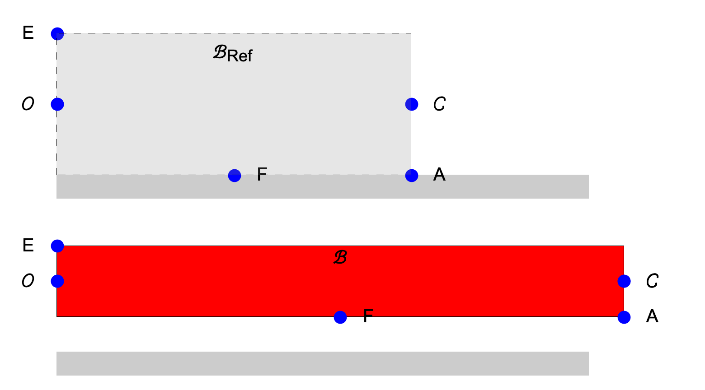




# ENGN0310: Homework 2
## Due Friday 11:59 pm, September 24th, 2021

> Please upload your assignment to Canvas. 
> Contact Andrew_Bagnoli@brown.edu if you have questions about the below problems.   

#### Concepts useful for solving the HW problems

[Reference and deformed configurations. Reference and current position vectors of a material particle. Calling a  material particle by its reference position vector.](../CourseNotes/Bars/Bars2.md)

#### Problem 0. 
A rectangle of sides 5 cm and 1 cm rests on a table. Take the origin to be the center of it's left edge ($\Gamma^{g}$), see figure below. The $\hat{\boldsymbol{E}}_1$ to be in the direction of the rubber rectangle's axis, $\hat{\boldsymbol{E}}_a$. The rectangle's short side is of length 1 cm. Take $\hat{\boldsymbol{E}}_2$ to be  perpendicular to the table and pointing upward.   

1. The below figure shows a   rectangle's reference configuration, when viewed from the $\hat{\boldsymbol{E}}\_3$ direction. Make a copy of this drawing and mark the rectangle's important dimensions on it. As well as the vectors, $\hat{\boldsymbol{E}}\_1$, $\hat{\boldsymbol{E}}\_2$, and  $+\hat{\boldsymbol{E}}\_{\rm a}$, and $-\hat{\boldsymbol{E}}\_{\rm a}$.

2. Reference position vectors.
  *  Let's call the material particle that is at the center of the right edge ($\Gamma^{h}$) $\mathcal{C}$. What is the position vector of $\mathcal{C}$? Express it in terms of $\hat{\boldsymbol{E}}_1$, and $\hat{\boldsymbol{E}}_2$. 

  * Let's call the material particle that is at the top left corner of the rectangle $\mathcal{E}$ (see Figure). 
  
  * Let's call the material particle that is at the bottom right corner of the rectangle $\mathcal{A}$ (see Figure). What is the position vector of $\mathcal{A}$? Express it in terms of $\hat{\boldsymbol{E}}_1$, and $\hat{\boldsymbol{E}}_2$. 
  
  * Let's call the material particle that is  at the rectangle edge that is touching the table $\mathcal{F}$. What is the position vector of $\mathcal{F}$? Express it in terms of $\hat{\boldsymbol{E}}_1$, and $\hat{\boldsymbol{E}}_2$.   

* The rectangle is now streched along its axis so that its length increases. After the deformation, the bar still remains a rectangle. The length of the rectangle is now 8 cm, and the side is 1/2 cm. The material particles that were on the center of the reference rectangle
rectangle's edges remain at the edge centers in the  deformed rectangle as well.  The material particles that were at the corners remain at the corners. The origin does not move as the rectangle is deformed. The deformed cofiguration is sketched in the figure (red rectangle). 

4. Current position vectors.   
 
 -  What is the position vector of the material particles $\mathcal{C}$, $\mathcal{A}$, and $\mathcal{F}$, and $\mathcal{E}$ after the rectangle has been deformed? Express them as a combination of $\hat{\boldsymbol{E}}_1$, and $\hat{\boldsymbol{E}}_2$. 

 <!-- - The material particle $\mathcal{D}$ is the material particle that is at the  bottom left  corner  of the rectangle (see figure).  What is the reference position vector of  $\mathcal{D}$? What is its current position vector, i.e., its position vector after the bar has been deformed? 

 - The material particle $\mathcal{E}$ is the material particle that is at the top, left corner of the rectangle (see figure).  What is $\mathcal{E}$'s  position vector in the reference configuration, $\mathcal{B}\_{\rm ref}$? What is its position vector in current or deformed configuration, $\mathcal{B}$?  -->

6. Displacement field
  - What is the displacement vectors of  $\mathcal{C}$, $\mathcal{A}$, $\mathcal{F}$, and $\mathcal{E}$ . Express these in terms of  $\hat{\boldsymbol{E}}_1$, and $\hat{\boldsymbol{E}}_2$.
  
7. Calling materials particles by their reference position vectors. 
 
 - What is the current position vector of the material particle $5~\rm cm\hat{\boldsymbol{E}}_1+\frac{1}{2}~\rm cm~\hat{\boldsymbol{E}}_2$
  -What is the displacement of the material particle $5~\rm cm\hat{\boldsymbol{E}}_1+\frac{1}{2}~\rm cm~\hat{\boldsymbol{E}}_2$

8. What is the material particle whose current position vector is $8~\rm cm\hat{\boldsymbol{E}}_1+\frac{1}{4}~\rm cm~\hat{\boldsymbol{E}}_2$. What is this material particle's displacement

#### Problem 2. 

Let us cut the  $\mathcal{B}_0$, into two pieces, $^1\mathcal{B}$ and $^2\mathcal{B}$. Specifically, let us cut $\mathcal{B}$ with the $A$-$A'$ plane (see Figure), which is normal to the bar's axis $\pm \hat{\boldsymbol{e}}_a$.

We will call the  left piece $^1\mathcal{B}$ and the right piece  $^2\mathcal{B}$.

Let the  surface on $^1\mathcal{B}$ that is newly created be called $S^1$ and that that on  $^2\mathcal{B}$ that is newly created be called $S^2$. 

The vector $\hat{\boldsymbol{n}}^{1}$ is (outward) normal to $S^1$. By normal we mean that $\hat{\boldsymbol{n}}^{1}$ is perpendicular to $S^1$ and points away from the $^1\mathcal{B}$ internal matter (the atoms and molecules composing the Bar) towards the outside. Similarly, $\hat{\boldsymbol{n}}^{1}$ is normal to $S^2$, i.e., it is perpendicular to $S^2$ and points away from the $^2\mathcal{B}$ internal matter and towards the outside.

Note that $\hat{\boldsymbol{n}}^{1}=-\hat{\boldsymbol{n}}^{2}$ 

