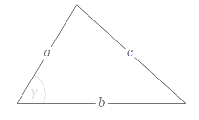
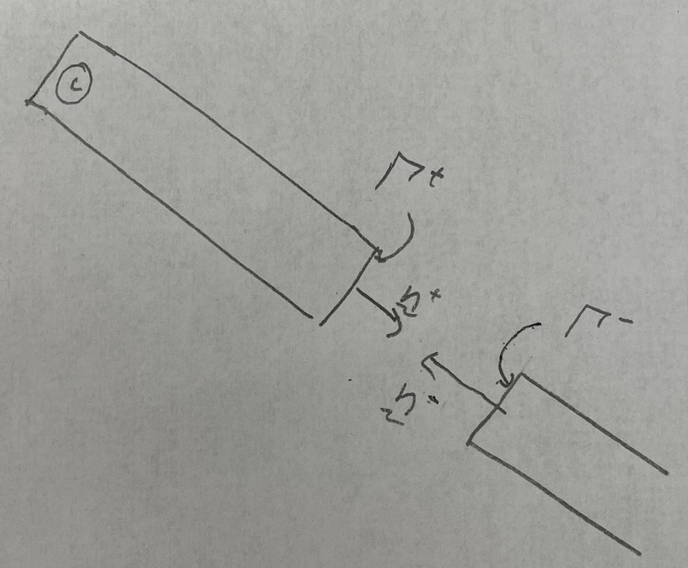
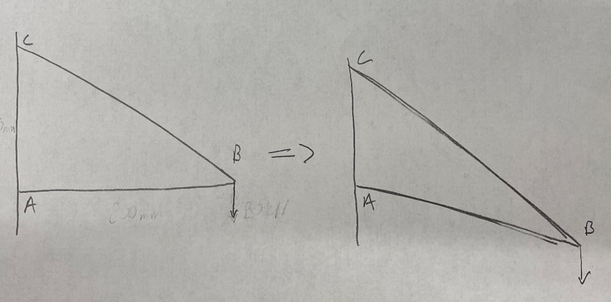
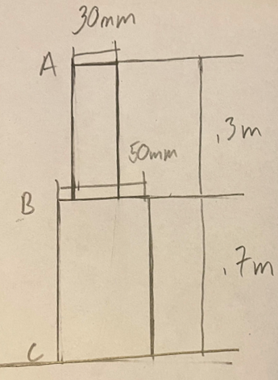




# ENGN0310: Homework 2
## Due Friday 11:59 pm, September 24th, 2021

> Please upload your assignment to Canvas. 
> Contact Andrew_Bagnoli@brown.edu if you have questions about the below problems.   

#### Concepts useful for solving the HW problems

[Reference and deformed configurations. Reference and current position vectors of a material particle. Calling a  material particle by its reference position vector.](../CourseNotes/Bars/Bars2.md)

| Materials      | $E ~(\rm{GPa})$ |
|----------------|-----------------|
| Steel          | 200             |
| Titanium alloy | 120             |

Remeber the law of Cosines for the triangle:

$$
\begin{equation}
c=\sqrt{a^2+b^2﹣2ab\cos{γ}}
\end{equation}
$$

#### Problem 1. 

A square prism of   rubber  is lying flat on a table. The length of prism is 5 cm. Take the origin to be the centeroid of it's left end. The $\hat{\boldsymbol{E}}_1$ to be in the direction of the rubber prism's axis, $\hat{\boldsymbol{E}}_a$. The rubber prism base is a square, with 1 cm sides. Take $\hat{\boldsymbol{E}}_2$ to be  perpendicular to the table and pointing upward.   The top, bottom, fron faces of the prism are rectangles of sides 5 cm and 1 cm.  

1. Draw a 2D view of a  the prism's reference configuration, when viewed from the $\hat{\boldsymbol{E}}\_3$ direction.  This just going to look like a rectangle. Mark the prism's important dimensions. The vectors, $\hat{\boldsymbol{E}}\_1$, $\hat{\boldsymbol{E}}\_2$, $\hat{\boldsymbol{E}}\_3$, $+\hat{\boldsymbol{E}}\_{\rm a}$, and $-\hat{\boldsymbol{E}}\_{\rm a}$

2. Reference position vectors.
  *  Let's call the material particle that is center of the right face $\mathcal{C}$. What is the position vector of $\mathcal{C}$? Express it in terms of $\hat{\boldsymbol{E}}_1$, $\hat{\boldsymbol{E}}_2$. and $\hat{\boldsymbol{E}}_3$.
  
  * Let's call the material particle that is center of the prism's left face $\mathcal{B}$. What is the position vector of $\mathcal{B}$? Express it in terms of $\hat{\boldsymbol{E}}_1$, $\hat{\boldsymbol{E}}_2$. and $\hat{\boldsymbol{E}}_3$.
  
  * Let's call the material particle that is  at the center of the prism's face that is touching the table $\mathcal{A}$. What is the position vector of $\mathcal{A}$? Express it in terms of $\hat{\boldsymbol{E}}_1$, $\hat{\boldsymbol{E}}_2$. and $\hat{\boldsymbol{E}}_3$.  

* The prism is now streched along its axis to that its length increases to 8 cm. The left and right faces still remain squares, and the top, bottom, front, and back faces still remain rectangles. The material particles that were at the centers of the faces when the prism was undeformed are at, respective centers of the deformed faces as well. The origin does not move as the prism is deformed. The bottom face of the prims still remains in contact with the table's top surface. 

3. Draw a 2D view of a  the prism's deformed configuration, $\mathcal{B}$, when viewed from the $\hat{\boldsymbol{E}}_3$ direction.

4. Current position vectors.   
 - What is the position vector of the materials particle $\mathcal{C}$, $\mathcal{B}$, and $\mathcal{A}$ after the prism has been deformed. Express them as a combination of $\hat{\boldsymbol{E}}_1$, $\hat{\boldsymbol{E}}_2$. and $\hat{\boldsymbol{E}}_3$.

 - The material particle $\mathcal{D}$ is the materials particle that is the top, back  corner of the right face (see figure). It remains at that corner throughout  the deformation. What is the reference position vector of  $\mathcal{D}$? What is its current position vector, i.e., its position vector after the bar has been deformed? 

 - The material particle $\mathcal{E}$ is the material particle that is the bottom, front  corner of the left face (see figure). It remains at that corner throughout  the deformation. What is $\mathcal{E}$'s  position vector in the reference configuration, $\mathcal{B}\_{\rm ref}$? What is its position vector in current or deformed configuration, $\mathcal{B}$? 

6. Displacement field
  - What is the displacement vectors of  $\mathcal{C}$, $\mathcal{B}$, $\mathcal{A}$, $\mathcal{E}$ and $\mathcal{D}$. Express these in terms of  $\hat{\boldsymbol{E}}_1$, $\hat{\boldsymbol{E}}_2$, and $\hat{\boldsymbol{E}}_3$.
  
7. Calling materials particles by their reference position vectors. 
 -What is the displacement of the material particle $5~\rm cm\hat{\boldsymbol{E}}_1+\frac{1}{2}~\rm cm~\hat{\boldsymbol{E}}_2$
 - What is the current position vector of the material particle $10~\rm cm\hat{\boldsymbol{E}}_1-\frac{1}{2}~\rm cm~\hat{\boldsymbol{E}}_2-\frac{1}{2}~\rm cm~\hat{\boldsymbol{E}}_3$

 
 
#### Problem 2.

1. Take the structure given above and assume that the components are all rigid. Assume that the positive ${\hat{\boldsymbol{E}}_1}$ direction is pointing to the right and the positive ${\hat{\boldsymbol{E}}_2}$ direction is pointing up. The bar $AB$, that is the bar between points $A$ and $B$, has a square cross section with a $50 mm$ length. The bar $BC$ has a circular cross section with a $20 mm$ diameter. Assume both bars are made of steel and the Modulus of Elasticity is $E=200 GPa$.

    (# pts) (i) What is the reaction force at pin $A$ in the ${\hat{\boldsymbol{E}}_1}$ direction?

    (# pts) (ii) What is the reaction force at pin $C$ in the ${\hat{\boldsymbol{E}}_1}$ direction?

    (# pts) (iii) What is the reaction force at pin $A$ in the ${\hat{\boldsymbol{E}}_2}$ direction?

    (# pts) (iv) What is the reaction force at pin $C$ in the ${\hat{\boldsymbol{E}}_2}$ direction?

    

    (# pts) (v) Now say that we were to cut the bar $AB$ in half at some arbitrary point between pins $A$ and $B$, shown in the figure above. Note that $\hat{\boldsymbol{n}}^-=-\hat{\boldsymbol{n}}^+$. What is the force on the face $Γ^+$ in the direction of the unit normal $\hat{\boldsymbol{n}}^+$. 

    

    (# pts) (vi) Repeat part v) for the bar $BC$. 

2. Now assume that the bars are not rigid, so that they can change in length but no bending is occurring, as shown in the exaggerated figure above. 

    (# pts) (i) What is the extension in the bar $AB$ due to the force along its axis?

    (# pts) (ii) What is the extension in the bar $BC$ due to the force along its axis?

    (# pts) (iii) What will be the final position of the pin at point $B$. 

 

#### Problem 3.

1. Assume that, as in the figure above, that you have two connected cylinders, where cylinder AB has length of $.3m$ and a diameter of $30mm$ and cylinder BC has a length of $.7m$ and a diameter of $50mm$. For now assume that both cylinders are made of steel with $E = 200 GPa$.

    (# pts) (i)  Now assume that an upward force of $50kN$ is applied to cylinder $AB$ at point $A$ in the direction of the normal to the top surface. What is the total displacement at point $A$. 
    
    (# pts) (ii)  Now assume there is a downward force being applied at point $B$ to cylinder $BC$. What should the magnitude of the force be to create a net displacement at point $A$ of zero.
    
    (# pts) (iiii)  Now assume the bar BC is made of titanium with $E=120 GPa$, now what is the magnitude of the downward force applied at point $B$ to cylinder $BC$ such that the net displacement at point $A$ is zero
 

#### Problem 4.

1. (# pts) The circular bar has a variable circular cross section with radius given by $r(x) = r_0e^{ax}$, where $x$ is the distance from point $A$ as seen above. What is the displacement at point $A$ when a force $P$ is applied along the center axis?

 