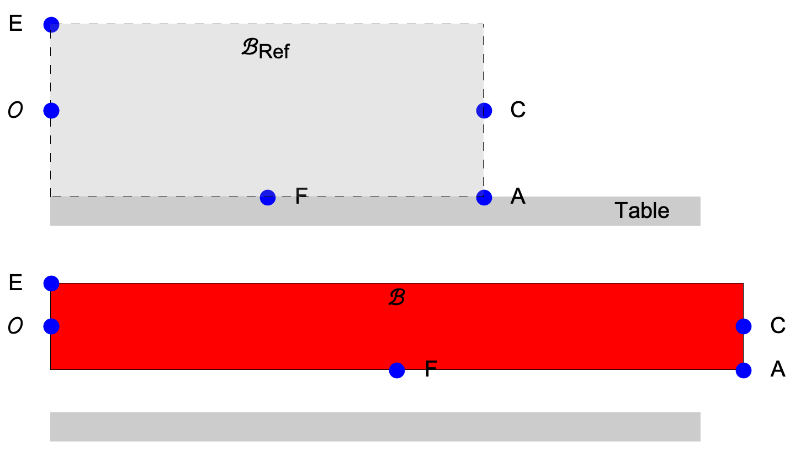




# ENGN0310: Homework 2
## Due Friday 11:59 pm, September 24th, 2021

> Please upload your assignment to Canvas. 
> Contact Andrew_Bagnoli@brown.edu if you have questions about the below problems.   

#### Concepts useful for solving the HW problems

[Reference and deformed configurations. Reference and current position vectors of a material particle. Calling a  material particle by its reference position vector.](../CourseNotes/Bars/Bars2.md)

| Materials      | $E ~(\rm{GPa})$ |
|----------------|-----------------|
| Steel          | 200             |
| Titanium alloy | 120             |

Remeber the law of Cosines for the triangle:

$$
\begin{equation}
c=\sqrt{a^2+b^2﹣2ab\cos{γ}}
\end{equation}
$$

#### Problem 1 (40 pts). 
1. A rectangle of sides 5 cm and 1 cm rests on a table. Take the origin to be the center of it's left edge ($\Gamma^{g}$), see figure below. The $\hat{\boldsymbol{E}}_1$ to be in the direction of the rectangle's axis, $\hat{\boldsymbol{E}}_a$. The rectangle's short side is of length 1 cm. Take $\hat{\boldsymbol{E}}_2$ to be  perpendicular to the table and pointing upward.   

   

   (2 pts) (i) The top panel of the figure above shows the  rectangle's reference configuration, when viewed from the $\hat{\boldsymbol{E}}\_3$ direction. Make a copy of this drawing and mark the rectangle's important dimensions on it, as well as the vectors $\hat{\boldsymbol{E}}\_1$, $\hat{\boldsymbol{E}}\_2$, and  $+\hat{\boldsymbol{E}}\_{\rm a}$, and $-\hat{\boldsymbol{E}}\_{\rm a}$.

  
   (2 pts) (ii)  Let's call the material particle that is at the center of the right edge ($\Gamma^{h}$) $C$. What is the position vector of $C$? Express it in terms of $\hat{\boldsymbol{E}}_1$, and $\hat{\boldsymbol{E}}_2$. 

  
   (2 pts) (iii) Let's call the material particle that is at the bottom right corner of the rectangle $A$ (see Figure). What is the position vector of $A$? Express it in terms of $\hat{\boldsymbol{E}}_1$, and $\hat{\boldsymbol{E}}_2$. 
  
   (2 pts) (iv) Let's call the material particle that is  at the rectangle edge that is touching the table $F$. What is the position vector of $F$? Express it in terms of $\hat{\boldsymbol{E}}_1$, and $\hat{\boldsymbol{E}}_2$.   

   (2 pts) (v) Let's call the material particle that is at the top left corner of the rectangle $E$ (see Figure). What is the position vector of $E$? Express it in terms of $\hat{\boldsymbol{E}}_1$, and $\hat{\boldsymbol{E}}_2$. 

2. The rectangle is now streched along its axis so that its length increases. After the deformation, the bar still remains a rectangle. The length of the rectangle is now 8 cm, and the side is 1/2 cm. The material particles that were at the centers of the reference 
rectangle's edges remain at the, respective, edge centers in the  deformed rectangle as well.  The material particles that were at the corners remain at the corners. The origin does not move as the rectangle is deformed. The deformed cofiguration is sketched in the figure (red rectangle). 

 
   (5 pts) (i) What are the position vectors of the material particles $C$, $A$, and $F$, and $E$ after the rectangle has been deformed? Express them as a combination of $\hat{\boldsymbol{E}}_1$, and $\hat{\boldsymbol{E}}_2$. 

   (5 pts) (ii) What are the displacement vectors of  $C$, $A$, $F$, and $E$? Express them in terms of  $\hat{\boldsymbol{E}}_1$, and $\hat{\boldsymbol{E}}_2$.
   
   (10 pts) (iii) What is the current position vector of the material particle $5~\rm cm\hat{\boldsymbol{E}}_1+\frac{1}{2}~\rm cm~\hat{\boldsymbol{E}}_2$? What is the displacement of this material particle?
   
   (10 pts) (iv) What is the material particle whose current position vector is $8~\rm cm\hat{\boldsymbol{E}}_1+\frac{1}{4}~\rm cm~\hat{\boldsymbol{E}}_2$? What is this material particle's displacement?

 
 
#### Problem 2.

1. Take the structure given above and assume that the components are all rigid. Assume that the positive ${\hat{\boldsymbol{E}}_1}$ direction is pointing to the right and the positive ${\hat{\boldsymbol{E}}_2}$ direction is pointing up. The bar $AB$, that is the bar between points $A$ and $B$, has a square cross section with a $50 mm$ length. The bar $BC$ has a circular cross section with a $20 mm$ diameter. Assume both bars are made of steel and the Modulus of Elasticity is $E=200 GPa$.

    (# pts) (i) What is the reaction force at pin $A$ in the ${\hat{\boldsymbol{E}}_1}$ direction?

    (# pts) (ii) What is the reaction force at pin $C$ in the ${\hat{\boldsymbol{E}}_1}$ direction?

    (# pts) (iii) What is the reaction force at pin $A$ in the ${\hat{\boldsymbol{E}}_2}$ direction?

    (# pts) (iv) What is the reaction force at pin $C$ in the ${\hat{\boldsymbol{E}}_2}$ direction?

    

    (# pts) (v) Now say that we were to cut the bar $AB$ in half at some arbitrary point between pins $A$ and $B$, shown in the figure above. Note that $\hat{\boldsymbol{n}}^-=-\hat{\boldsymbol{n}}^+$. What is the force on the face $Γ^+$ in the direction of the unit normal $\hat{\boldsymbol{n}}^+$. 

    

    (# pts) (vi) Repeat part v) for the bar $BC$. 

2. Now assume that the bars are not rigid, so that they can change in length but no bending is occurring, as shown in the exaggerated figure above. 

    (# pts) (i) What is the extension in the bar $AB$ due to the force along its axis?

    (# pts) (ii) What is the extension in the bar $BC$ due to the force along its axis?

    (# pts) (iii) What will be the final displacement of the pin at point $B$. 

 

#### Problem 3.

1. Assume that, as in the figure above, that you have two connected cylinders, where cylinder AB has length of $.3m$ and a diameter of $30mm$ and cylinder BC has a length of $.7m$ and a diameter of $50mm$. For now assume that both cylinders are made of steel with $E = 200 GPa$.

    (# pts) (i)  Now assume that an upward force of $50kN$ is applied to cylinder $AB$ at point $A$ in the direction of the normal to the top surface. What is the total displacement at point $A$. 
    
    (# pts) (ii)  Now assume there is a downward force being applied at point $B$ to cylinder $BC$. What should the magnitude of the force be to create a net displacement at point $A$ of zero.
    
    (# pts) (iii)  Now assume the bar BC is made of titanium with $E=120 GPa$, now what is the magnitude of the downward force applied at point $B$ to cylinder $BC$ such that the net displacement at point $A$ is zero
 

#### Problem 4.

1. (# pts) Assume a circular bar, with Elastic Modulus $E$ and length $L$, has a variable radius circular cross section with radius given by $r(x) = r_0e^{ax}$, where $x$ is the distance from point $A$ as seen above. What is the displacement at point $A$ when a force $P$ is applied along the center axis?

 
