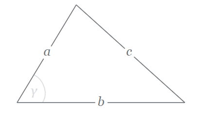
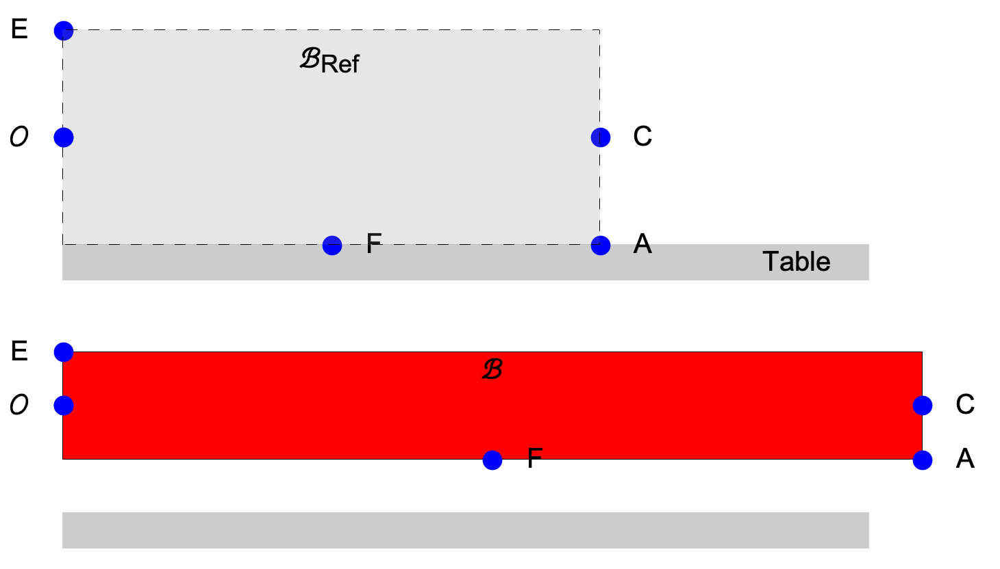
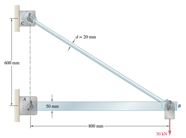
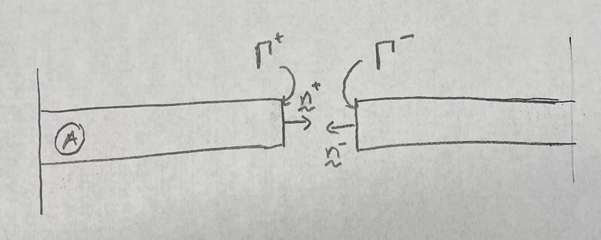
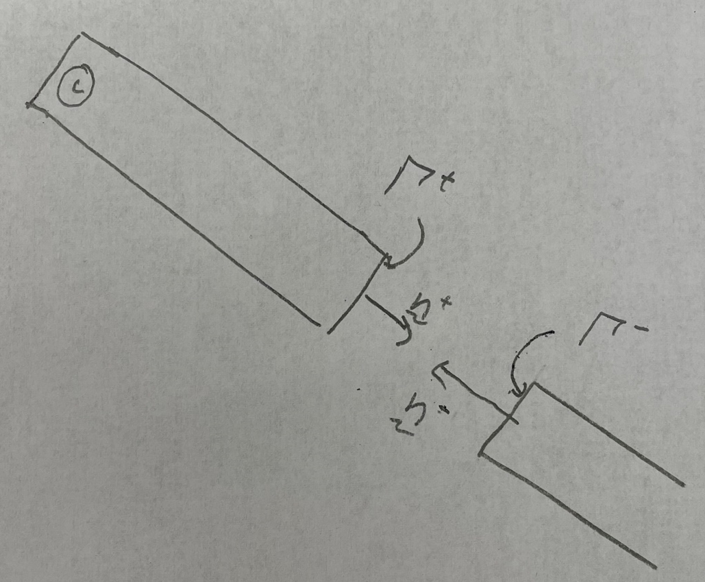
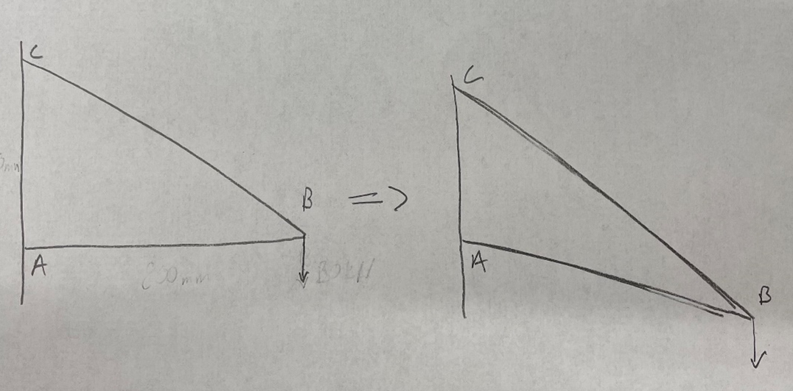
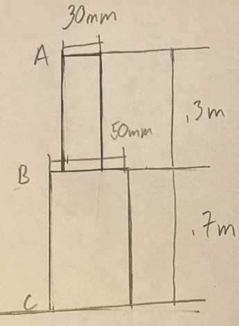
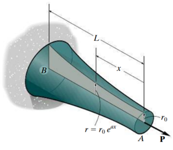




# ENGN0310: Homework 2
## Due Friday 11:59 pm, September 25th, 2021

> Please upload your assignment to Canvas. 
> Contact Andrew_Bagnoli@brown.edu if you have questions about the below problems.   

#### Concepts useful for solving the HW problems

[Reference and deformed configurations. Reference and current position vectors of a material particle. Calling a  material particle by its reference position vector.](../CourseNotes/Bars/Bars2.md)

| Materials      | $E ~(\rm{GPa})$ |
|----------------|-----------------|
| Steel          | 200             |
| Titanium alloy | 120             |

Remeber the law of Cosines for the triangle:

$$
\begin{equation}
c=\sqrt{a^2+b^2﹣2ab\cos{γ}}
\end{equation}
$$

#### Problem 1 (25 pts). 
1. A rectangle of sides 5 cm and 1 cm rests on a table. Take the origin to be the center of it's left edge ($\Gamma^{g}$), see figure below. The $\hat{\mathbf{E}}_1$ to be in the direction of the rectangle's axis, $\hat{\mathbf{E}}_a$. The rectangle's short side is of length 1 cm. Take $\hat{\mathbf{E}}_2$ to be  perpendicular to the table and pointing upward.   

   

   (2 pts) (i) The top panel of the figure above shows the  rectangle's reference configuration, when viewed from the $\hat{\mathbf{E}}\_3$ direction. Make a copy of this drawing and mark the rectangle's important dimensions on it, as well as the vectors $\hat{\mathbf{E}}\_1$, $\hat{\mathbf{E}}\_2$, and  $+\hat{\mathbf{E}}\_{\rm a}$, and $-\hat{\mathbf{E}}\_{\rm a}$.

   **Solution:** 

  
   (2 pts) (ii)  Let's call the material particle that is at the center of the right edge ($\Gamma^{h}$) $C$. What is the position vector of $C$? Express it in terms of $\hat{\mathbf{E}}_1$, and $\hat{\mathbf{E}}_2$. 

    **Solution:** $\mathbf{C}_{ref}=5cm\hat{\mathbf{E}}_1$
  
   (2 pts) (iii) Let's call the material particle that is at the bottom right corner of the rectangle $A$ (see Figure). What is the position vector of $A$? Express it in terms of $\hat{\mathbf{E}}_1$, and $\hat{\mathbf{E}}_2$. 

   **Solution:** $\mathbf{A}_{ref}=5cm\hat{\mathbf{E}}_1-.5cm\hat{\mathbf{E}}_2$
  
   (2 pts) (iv) Let's call the material particle that is  at the rectangle edge that is touching the table $F$. What is the position vector of $F$? Express it in terms of $\hat{\mathbf{E}}_1$, and $\hat{\mathbf{E}}_2$.   

    **Solution:** $\mathbf{F}_{ref}=2.5cm\hat{\mathbf{E}}_1-.5cm\hat{\mathbf{E}}_2$

   (2 pts) (v) Let's call the material particle that is at the top left corner of the rectangle $E$ (see Figure). What is the position vector of $E$? Express it in terms of $\hat{\mathbf{E}}_1$, and $\hat{\mathbf{E}}_2$. 

    **Solution:** $\mathbf{E}_{ref}=.5cm\hat{\mathbf{E}}_2$

2. The rectangle is now stretched along its axis so that its length increases. After the deformation, the bar still remains a rectangle. The length of the rectangle is now 8 cm, and the side is 1/2 cm. The material particles that were at the centers of the reference 
rectangle's edges remain at the, respective, edge centers in the  deformed rectangle as well.  The material particles that were at the corners remain at the corners. The origin does not move as the rectangle is deformed. The deformed configuration is sketched in the figure (red rectangle). 

 
   (2.5 pts) (i) What are the position vectors of the material particles $C$, $A$, and $F$, and $E$ after the rectangle has been deformed? Express them as a combination of $\hat{\mathbf{E}}_1$, and $\hat{\mathbf{E}}_2$. 
   
   **Solution:** 
   
   $\mathbf{C}=8cm\hat{\mathbf{E}}_1$

   $\mathbf{A}=8cm\hat{\mathbf{E}}_1-.25cm\hat{\mathbf{E}}_2$

   $\mathbf{F}=4cm\hat{\mathbf{E}}_1-.25cm\hat{\mathbf{E}}_2$

   $\mathbf{E}=.25cm\hat{\mathbf{E}}_2$

   (2.5 pts) (ii) What are the displacement vectors of  $C$, $A$, $F$, and $E$? Express them in terms of  $\hat{\mathbf{E}}_1$, and $\hat{\mathbf{E}}_2$.

    **Solution:** 
    
   $\mathbf{u}_C=\mathbf{C}-\mathbf{C}_{ref}=3cm\hat{\mathbf{E}}_1$

   $\mathbf{u}_A=\mathbf{A}-\mathbf{A}_{ref}=3cm\hat{\mathbf{E}}_1+.25cm\hat{\mathbf{E}}_2$

   $\mathbf{u}_F=\mathbf{F}-\mathbf{F}_{ref}=1.5cm\hat{\mathbf{E}}_1+.25cm\hat{\mathbf{E}}_2$

   $\mathbf{u}_E=\mathbf{E}-\mathbf{E}_{ref}=-.25cm\hat{\mathbf{E}}_2$

   
   (5 pts) (iii) What is the current position vector of the material particle $5cm\hat{\mathbf{E}}_1+\frac{1}{2}cm\hat{\mathbf{E}}_2$? What is the displacement of this material particle? Hint: We will generally name material particles after their original position in the reference body, and this is the case here.

    **Solution:** 
    
    $5cm\hat{\mathbf{E}}_1+\frac{1}{2}cm\hat{\mathbf{E}}_2$ refers to the original position of the top right corner of the original body, which will deform to the top right corner of the reference body, which is at $8~\rm cm\hat{\mathbf{E}}_1+\frac{1}{4}~\rm cm~\hat{\mathbf{E}}_2$. Therefore the displacement is $\mathbf{u}=3~\rm cm\hat{\mathbf{E}}_1-.25~\rm cm~\hat{\mathbf{E}}_2$
   
   (5 pts) (iv) What is the material particle whose current position vector is $8cm\hat{\mathbf{E}}_1+\frac{1}{4}cm\hat{\mathbf{E}}_2$? What is this material particle's displacement?

   **Solution:** $8cm\hat{\mathbf{E}}_1+\frac{1}{4}cm\hat{\mathbf{E}}_2$ refers to the final position of the top right corner of the deformed body, which was originally the top right corner of the reference body, which is at $5cm\hat{\mathbf{E}}_1+\frac{1}{2}cm\hat{\mathbf{E}}_2$. Therefore the displacement is $\mathbf{u}=3cm\hat{\mathbf{E}}_1-.25cm~\hat{\mathbf{E}}_2$

 
 
#### Problem 2 (30 pts).

1. Take the structure given above and assume that the components are all rigid. Assume that the positive ${\hat{\mathbf{E}}_1}$ direction is pointing to the right and the positive ${\hat{\mathbf{E}}_2}$ direction is pointing up. The bar $AB$, that is the bar between points $A$ and $B$, has a square cross section with a $50 mm$ length. The bar $BC$ has a circular cross section with a $20 mm$ diameter. Assume both bars are made of steel and the Modulus of Elasticity is $E=200 GPa$.

    (2 pts) (i) What is the reaction force at pin $A$ in the ${\hat{\mathbf{E}}_1}$ direction?

    (2 pts) (ii) What is the reaction force at pin $C$ in the ${\hat{\mathbf{E}}_1}$ direction?

    (2 pts) (iii) What is the reaction force at pin $A$ in the ${\hat{\mathbf{E}}_2}$ direction?

    (2 pts) (iv) What is the reaction force at pin $C$ in the ${\hat{\mathbf{E}}_2}$ direction?

    **Solution:** 

    After defining the forces at the pins, which are defined as being in the positive directions ${\hat{\mathbf{E}}_1}$
    and ${\hat{\mathbf{E}}_2}$ respectively, it is clear that we need four equations to solve for our four unknowns. The first is the force balance in the ${\hat{\mathbf{E}}_1}$ direction: $A_1 + C_1=0$. The second is the force balance in the ${\hat{\mathbf{E}}_2}$ direction: $A_2 + C_2=30kN$. The third is the moment balance around the point $A$: $.6mC_1 =-(.8m)(30kN)$. The forth comes from splitting the bars at pin $B$, which introduces the reaction forces at the pin $B$, but if we choose to do a moment balance around pin $B$ then we get $-.8mA_2 =0$, so we do not have to solve for the reaction forces inside at the pin $B$.

    

    Then we can set up the linear system of equations, and solve to get $A_1=40kN$, $A_2=0kN$, $C_1=-40kN$, and $C_2=30kN$.

    

    (5 pts) (v) Now say that we were to cut the bar $AB$ in half at some arbitrary point between pins $A$ and $B$, shown in the figure above. Note that $\hat{\mathbf{n}}^-=-\hat{\mathbf{n}}^+$. What is the force on the face $Γ^+$ in the direction of the unit normal $\hat{\mathbf{n}}^+$. 

    **Solution:** 

    Setting up our force balance on the imaginary cut plane we get the equation $F_{AB}+A_1=0$ so $F_{AB}=-40kN$, then in vector form $\mathbf{F}_{AB}=-40kN{\hat{\mathbf{E}}_1}$.

    

    (5 pts) (vi) Repeat part v) for the bar $BC$. 

    **Solution:** 

    Setting up our force balances on the imaginary cut plane in both directions we get the equations $F_{BC1}+C_1=0$ and $F_{BC2}+C_2=0$ and we find that in vector form $\mathbf{F}_{BC}=40kN{\hat{\mathbf{E}}_1}-30kN{\hat{\mathbf{E}}_1}$ then the magnitude in the axial direction is $F_{BC}=50kN$.

2. Now assume that the bars are not rigid, so that they can change in length but no bending is occurring, as shown in the exaggerated figure above. 

    (4 pts) (i) What is the extension in the bar $AB$ due to the force along its axis?

    **Solution:**
     From the vector form of the internal force in bar $AB$, $\mathbf{F}_{AB}=-40kN{\hat{\mathbf{E}}_1}$, we can plug direcatly into the displacement equation to get the vector displacement, $\mathbf{\delta}_{AB}=\frac{\mathbf{F}_{AB}L_{AB}}{EA_{AB}}$, where $L_{AB}=.8m$, $E=200GPa$, and $A_{AB}=.0025m^2$, so $\mathbf{\delta}_{AB}=-6.4\times10^{-5}m{\hat{\mathbf{E}}_1}$.

    (4 pts) (ii) What is the extension in the bar $BC$ due to the force along its axis?

    **Solution:** 
    Similarly to above, where $\mathbf{F}_{BC}=40kN{\hat{\mathbf{E}}_1}-30kN{\hat{\mathbf{E}}_1}$, $\mathbf{\delta}_{BC}=\frac{\mathbf{F}_{BC}L_{BC}}{EA_{BC}}$, where $L_{BC}=1m$, $E=200GPa$, and $A_{BC}=3.142\times10^{-4}m^2$, so $\mathbf{\delta}_{BC}=6.365\times10^{-4}m{\hat{\mathbf{E}}_1}-4.774\times10^{-4}m{\hat{\mathbf{E}}_2}$.

    (4 pts) (iii) What will be the final displacement of the pin at point $B$. 

    **Solution:** 
    
    

    
    To find the deformed lenghts of the bars we have to add the vector displacements to the vector forms of the lenghts. The deformed length of the bar $AB$ is $\mathbf{l}_{AB}=\mathbf{L}_{AB}+\mathbf{\delta}_{AB}=.8m{\hat{\mathbf{E}}_1}-6.4\times10^{-5}m{\hat{\mathbf{E}}_1}=.79994m{\hat{\mathbf{E}}_1}$, which has the magnitude $|\mathbf{l}_{AB}|=l_{AB}=.79994m$. Similarly we find that  $\mathbf{l}_{BC}=\mathbf{L}_{BC}+\mathbf{\delta}_{BC}=.8m{\hat{\mathbf{E}}_1}-.6m{\hat{\mathbf{E}}_2}+6.365\times10^{-4}m{\hat{\mathbf{E}}_1}-4.774\times10^{-4}m{\hat{\mathbf{E}}_2}=.80064m{\hat{\mathbf{E}}_1}-.60048m{\hat{\mathbf{E}}_1}$, which has the magnitude $|\mathbf{l}_{BC}|=l_{BC}=1.0008m$. Then by applying the Law of Cosines we can solve for the angle $\alpha$ in the figure above using the equation:

    

    Then we can solve for the angle $\phi=\frac{\pi}{2}-\alpha=.6447$. Then the deformed position of the pin $B$ is just $\mathbf{B}=l_{BC}\cos{\phi}{\hat{\mathbf{E}}_1}-(l_{BC}\sin{\phi}-.6m){\hat{\mathbf{E}}_2}$. Then, as $\mathbf{B}_{ref}=.8m{\hat{\mathbf{E}}_1}$, we have that the final displacement of the pin $B$ is given by $\mathbf{u}_B=\mathbf{B}-\mathbf{B}_{ref}=-6.525\times10^{-5}m{\hat{\mathbf{E}}_1}-.00141m{\hat{\mathbf{E}}_2}$. Note that the value $-6.525\times10^{-5}m$ is highly dependent on the number of significant figures that you were keeping throughout the problem, so if your answer is $\pm4\times10^{-5}m$ the actual solution than it should be considered correct, but if you keep at enough significant figures your answer should be correct.

 

#### Problem 3 (20 pts).

1. Assume that, as in the figure above, that you have two connected cylinders, where cylinder AB has length of $.3m$ and a diameter of $30mm$ and cylinder BC has a length of $.7m$ and a diameter of $50mm$. For now assume that both cylinders are made of steel with $E = 200 GPa$.

    (6 pts) (i)  Now assume that an upward force of $50kN$ is applied to cylinder $AB$ at point $A$ in the direction of the normal to the top surface. What is the total displacement at point $A$. 

    **Solution:** The internal force in both bars is just going to be $50kN$, so $\delta_{AB}=\frac{F_{AB}L_{AB}}{A_{AB}E_{AB}}$, where $F_{AB}=50kN$, $L_{AB}=.3m$, $E_{AB}=200GPa$, and $A_{AB}=7.069\times10^{-4}m^2$, then $\delta_{AB}=1.061\times10^{-4}m$. Similarly we find that $\delta_{BC}=8.913\times10^{-5}m$, as $F_{BC}=50kN$, $L_{BC}=.7m$, $E_{BC}=200GPa$, and $A_{BC}=.0020m^2$. Then the total displacement is $\delta_T=\delta_{AB}+\delta_{BC}=1.952\times10^{_4}m$
    
    (7 pts) (ii)  Now assume there is a downward force being applied at point $B$ to cylinder $BC$. What should the magnitude of the force be to create a net displacement at point $A$ of zero.

    **Solution:** 

    Now that the second force $F_B$ is applied the internal force in bar $AB$ is the same, but now the internal force in bar $BC$ is given by $F_{BC}=F_A+F_B=50kN+F_B$. This expression can be easily found by making an imaginary cut in the bar $AB$ and balancing the force $F_{BC}$ with the reaction forces at the base of the bar. From the problem we have that $\delta_T=\delta_{AB}+\delta_{BC}=0$, so $\delta_{BC}=-\delta_{AB}$. Since the internal force in the bar $AB$ has not changed then $\delta_{AB}=1.061\times10^{-4}m$. Then we can set up our equation to solve for $F_B$, $\delta_{BC}=\frac{F_{BC}L_{BC}}{A_{BC}E_{BC}}\Rightarrow-1.061\times10^{-4}m=\frac{(50kN+F_B)(.7m)}{(.0020m^2)(200GPa)}\Rightarrow F_B=-110.6kN$
    
    (7 pts) (iii)  Now assume the bar BC is made of titanium with $E=120 GPa$, now what is the magnitude of the downward force applied at point $B$ to cylinder $BC$ such that the net displacement at point $A$ is zero.

    **Solution:** Repeat the procedure from part ii, with the only difference being that $E_{BC}=120GPa$, so $-1.061\times10^{-4}m=\frac{(50kN+F_B)(.7m)}{(.0020m^2)(120GPa)}\Rightarrow F_B=-86.3kN$
 

#### Problem 4 (25 pts).

1. (25 pts) Assume a circular bar, with Elastic Modulus $E$ and length $L$, has a variable radius circular cross section with radius given by $r(x) = r_0e^{ax}$, where $x$ is the distance from point $A$ as seen above. What is the displacement at point $A$ when a force $P$ is applied along the center axis?

**Solution:** Now instead of the scalar version of the displacement equation we must use the functional version of the equation, because not all of the quantities in the equation are constant. $\delta={\int_{0}^{L} \frac{P(x)}{E(x)A(x)} \,dx}$, where $P(x)=P$, $E(x)=E$, and $A(x)=\pi r(x)^2=\pi{r_0}^2e^{2ax}$. Then $\delta=\frac{P}{\pi{r_0}^2E}{\int_{0}^{L} e^{-2ax} \,dx}=\frac{P}{\pi{r_0}^2E}[-\frac{e^{-2ax}}{2a}]|_0^L=\frac{P}{2\pi a{r_0}^2E}(1-e^{-2aL})$.

 
