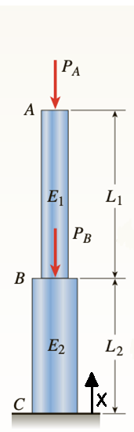




# ENGN0310: Homework 3
## Due Friday 11:59 pm, October 1st, 2021

> Please upload your assignment to Canvas. 
> Contact Andrew_Bagnoli@brown.edu if you have questions about the below problems.   

#### Concepts useful for solving the HW problems

 In a solid or liquid, there is a dynamic balance between the cohesive forces holding the atoms or molecules together and the conditions created by temperature; higher temperatures imply greater distance between atoms. Different materials have different bonding forces and therefore different expansion coefficients. The elongation due to temperature, $\delta_{T}$, is given by $\delta_{T}=\alpha L \Delta T$, where $\alpha$ is the coeficent of thermal expansion, $L$ is the original length, and $\Delta T$ is the temperature change. Additional information on the topic can be found in Chapter 2.3 of the Textbook.

 Reading on stress concentrators can be found [here](https://appliedmechanicslab.github.io/ENGN0310/CourseNotes/Bars7.html), and additional information can be found in the textbook Chapter 2.11.

#### Problem 1 (# pts). 

Figure 1

1. Assume we have the simple bar shown above, where section AB has cross sectional area A_AB and section BC has cross sectional area A_BC. 

    (# pts) (i) Plot the internal force in the bar as a function of x, defined as the distance from the base at point C shown in the figure above.

    (# pts) (ii) Plot the internal stress in the bar as a function of x.

    (# pts) (iii) Plot the displacement in the bar as a function of x.

 

#### Problem 2 (# pts). 

Figure 2

1. Assume we have the bar given in figure 2 above. Note that the outer diameter for the section AB is given by the equation D(x)=D_0+(L/2-x) e^(-ax) and the outer diameter for the section BC is D_0. Note also that there is a hole through both sections of the bar with diameter D_i. Assume the Young's Modulus in both sections is $E$.

    (# pts) (i) What is the cross-sectional area in the bar as a function of x, defined as the distance from the base of the bar at point A. 

    (# pts) (ii) If a force P is applied at point B and another force 3P is applied at point C then what is the net displacement in the bar at point C. 

 

#### Problem 3 (# pts). 

Figure 3

Figure 4

1. Assume that the bar in figure 3 above, tapered linearly with initial outer diameter D_0i and final outer diameter D_0f, has constant thickness t as shown in figure 4 above. For part 1 assume that there is no force due to gravity. 

    (# pts) (i) What is the formula for the cross-sectional area as a function of x, which defined as the distance from point A as seen above.

    (# pts) (ii) What is the net displacement at point B due to the force P?

Figure 5

2. Now instead assume that there is force due to gravity, but the bar is replaced by a cylinder of constant diameter D_0i that has no hole, that is it is a simple cylindrical bar of length L and diameter D_0i as seen in figure 2. The force P is still applied at the end of the bar.

    (# pts) (i) What is the internal force in the bar as a function of x.

    (# pts) (ii) What is the net displacement at point B due to the force P?

3. (# pts) Now assume there is force due to gravity and the bar has returned to its configuration in part 1, shown in figure 3. What is the net displacement at point B due to the force P?

 

#### Problem 4 (# pts). 

Figure 6

1. Assume that a cylindrical bar has length 1m and diameter 25mm, thermal expansion coefficient 10∙10^(-6)  1/(°C), and Young’s Modulus 200GPa, shown in figure X, at room temperature (20°C). Notice that there is a 1mm gap between the end of the bar and the wall.

    (# pts) (i) At what temperature will the gap be completely closed?

    (# pts) (ii) What is the internal force in the bar when the temperature is 500°C?

 

#### Problem 5 (# pts). 

Figure 7

1. Read the about stress concentrations at the link [here](https://appliedmechanicslab.github.io/ENGN0310/CourseNotes/Bars7.html). Notice that in the figure above there is a cylindrical hole through the width of the bar, of diameter $10mm$ (not drawn to scale), whose center is at the centerpoint of the bar (i.e. the center of the hole is $2m$ from the left face of the bar and $1m$ up from the bottom face of the bar). The dimensions of the bar are as in figure X above, length 4m, height 2m, and width .25m. Assume that the bar is large enough compared to the hole to assume that the applied stress σ can be considered a far field stress, σ_∞. 

    (# pts) (i) If the bar is made of a material with a yield stress of σ_y=330MPa, then what is the maximum allowable applied stress σ that can be applied before any yielding begins to occur.

    (# pts) (ii) If the applied stress is σ=150MPa, then what is the maximum diameter of the hole possible such that yielding will not occur (i.e. the maximum stress in the bar is equal to the yield stress).

 