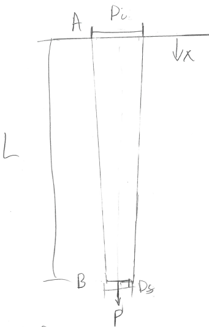




# ENGN0310: Homework 3
## Due Friday 11:59 pm, October 1st, 2021

> Please upload your assignment to Canvas. 
> Contact Andrew_Bagnoli@brown.edu if you have questions about the below problems.   

#### Concepts useful for solving the HW problems

 In a solid or liquid, there is a dynamic balance between the cohesive forces holding the atoms or molecules together and the increasing kinetic energy created by temperature; higher temperatures imply greater distance between atoms. Different materials have different bonding forces and therefore different expansion coefficients. The elongation due to temperature, $\delta_{T}$, is given by $\delta_{T}=\alpha L \Delta T$, where $\alpha$ is the coeficent of thermal expansion, $L$ is the original length, and $\Delta T$ is the temperature change. This elongation is not due to any force put on the bar, simply the bar itself physically expanding due to increasing temperature. Additional information on the topic can be found in Chapter 2.3 of the Textbook.

 Reading on stress concentrators can be found [here](https://appliedmechanicslab.github.io/ENGN0310/CourseNotes/Bars7.html), and additional information can be found in the textbook Chapter 2.11.

#### Problem 1 (15 pts). 

Figure 1

1. Assume we have the simple bar shown above. $P_{A}=35kN$, $P_{B}=10kN$, $E_{1}=200GPa$, $E_{2}=120GPa$, $L_{1}=3m$, $L_{2}=1m$, the diameter of bar $AB$ is $25mm$, and the diameter of bar $BC$ is $75mm$.

    (5 pts) (i) Plot the internal force in the bar as a function of $x$, defined as the distance from the base at point $C$ shown in the figure above.

    

    **Solution** Doing the balance of internal forces in bars 1 and 2 should result in internal forces of $F_{1}=-35kN$ and $F_{2}=-45kN$, and your plot should look like the figure above.

    (5 pts) (ii) Plot the internal stress in the bar as a function of $x$.

    

    **Solution** Dividing the forces from part (i) by their corresponding cross sectional areas gives $\sigma_{1}=\frac{-35kN}{\frac{\pi}{4}(.0125m)^2}=-71.3MPa$ and $\sigma_{2}=\frac{-45kN}{\frac{\pi}{4}(.0375m)^2}=-10.2MPa$. Which leads to the figure above.

    (5 pts) (iii) Plot the displacement in the bar as a function of $x$.

    

    **Solution** From the internal force in bar 2 then from the bottom, $x$ as defined in the problem $\delta_{2}(x)={\int_{0}^{x} \frac{F_{2}}{E_{2}A_{2}} \,dx}=\frac{F_{2}x}{E_{2}A_{2}}$ from $0 \le x \le L_{2}$, and then the displacement in bar 1 is $\delta_{1}(x)=\delta_{2}(L_{2}) + {\int_{L_{2}}^{x} \frac{F_{1}}{E_{1}A_{1}} \,dx}=\frac{F_{2}L_{2}}{E_{2}A_{2}}+\frac{F_{1}(x-L\_{2})}{E\_{1}A\_{1}}$ from $L\_{2} \le x \le L_{1}$. Plugging in values for the displacements and plotting should look like the plot above.

 

#### Problem 2 (20 pts). 

Figure 2

1. Assume we have the bar given in figure 2 above. Note that the outer diameter for the section $AB$ is given by the equation $D(x)=D\_{o} + \frac{L}{2} - x$ and the outer diameter for the section $BC$ is $D_0$. Note also that there is a hole through the section BC of the bar with diameter $D_i$. Assume the Young's Modulus in both sections is $E$.

    (10 pts) (i) What is the cross-sectional area in the bar as a function of $x$, defined as the distance from the base of the bar at point $A$. 

    **Solution** The cross sectional area of the section of the bar $AB$ is given by $A_{AB}=\frac{\pi}{4}(D(x))^2=\frac{\pi}{4}(D\_{o} + \frac{L}{2} - x)^2$. Then the cross sectional area in the section of the bar $BC$ is just $A_{BC}=\frac{\pi}{4}(D\_{o}^2-D\_{i}^2)$. Then the cross sectional area as a function of $x$ is given by $A(x)=\begin{cases}\frac{\pi}{4}(D\_{o} + \frac{L}{2} - x)^2 : 0 \le x \le \frac{L}{2} \\; \frac{\pi}{4}(D\_{o}^2-D\_{i}^2) : \frac{L}{2}  \le x \le L \\ \end{cases}$.

    (10 pts) (ii) If a force $P$ is applied at point $B$ and another force $3P$ is applied at point $C$ then what is the net displacement in the bar at point $C$. 

    **Solution** The force inside of the section of the bar $AB$ is then $2P$ by making an imaginary cut in the bar and doing a force balance with the reaction forces at the base, and by the same method of imaginary cuts we find that the force inside of the $BC$ section is $3P$. Then the internal forces are given by $P(x)=\begin{cases}2P : 0 \le x \le \frac{L}{2}\\ ; 3P : \frac{L}{2}  \le x \le L\\ \end{cases}$, so $\delta(x)={\int_{0}^{L} \frac{P(x)}{EA(x)} \,dx}={\int_{0}^{\frac{L}{2}} \frac{2P}{E\frac{\pi}{4}(D\_{o} + \frac{L}{2} - x)^2} \,dx}+{\int_{\frac{L}{2}}^{L} \frac{3P}{E\frac{\pi}{4}(D\_{o}^2-D\_{i}^2)} \,dx}=\frac{6PL}{\pi E (D\_{o}^2-D\_{i}^2)} + \frac{8PL}{\pi E (2D\_{o}^{2}+D\_{o}L)}$.

 

#### Problem 3 (30 pts). 

Figure 3

1. Assume that the bar in figure 3 above, tapered linearly with initial outer diameter $D_{i}$ and final outer diameter $D_{f}$. For part 1 assume that there is no force due to gravity. Assume the bar is made of material with Young's Modulus $E$ and density $\rho$.

    (5 pts) (i) What is the formula for the cross-sectional area as a function of $x$, which defined as the distance from point $A$ as seen above.

    **Solution** The diameter can be written as a function of $x$ as $D(x)=D\_{i} - \frac{D\_{i}-D\_{f}}{L}x$, so the cross sectional area as a function of $x$ is $A(x)=\frac{\pi}{4}(D\_{i} - \frac{D\_{i}-D\_{f}}{L}x)^2$.

    (5 pts) (ii) What is the net displacement at point $B$ due to the force $P$?

    **Solution** For the internal force of $P$ the diaplcement is given by $\delta={\int_{0}^{L} \frac{P}{E \frac{\pi}{4}(D\_{i} - \frac{D\_{i}-D\_{f}}{L}x)^2} \,dx} = \frac{4LP}{\pi E D\_{i}D\_{f}}$

    

    Figure 4

2. Now instead assume that there is force due to gravity, but the bar is replaced by a cylinder of constant diameter $D_{i}$, that is it is a simple cylindrical bar of length $L$ and diameter $D_{i}$ as seen in figure 4. The force $P$ is still applied at the end of the bar. 

    (5 pts) (i) What is the internal force in the bar as a function of $x$.

    **Solution** Now to find the internal force we need to take into account the force due to gravity. At some point $x$ along the bar the force of gravity will be proportional to the ammount of mass below that point in the bar pulling down on it. So for this case we need to find the volume below the point $x$ on the bar, as the mass is $m(x)=\rho V\_{below}(x)$. The total volume is $V\_{total}={\int_{0}^{L} A(x) \,dx}=\frac{\pi}{4} L D\_{i}^2$. Then the volume above the point $x$ is $V\_{above}(x)={\int_{0}^{x} A(\xi) \,d\xi}=\frac{\pi}{4} x D\_{i}^2$, where we are using the dummy variable $\xi$ because one of the limits of integration is $x$. Then $V\_{below}(x)=V\_{total}-V\_{above}(x)=\frac{\pi}{4} (L-x) D\_{i}^2$. Then we have that $F\_{g}(x)=\rho g V\_{below}(x)=\frac{\rho g \pi}{4} (L-x) D\_{i}^2$. Then the total internal force as a function of $x$ is $P(x)=P+F\_{g}(x)=P+\frac{\rho g \pi}{4} (L-x) D\_{i}^2$.

    (5 pts) (ii) What is the net displacement at point $B$ due to the force $P$ and the force of gravity?

    **Solution** Then the displacement in the bar is $\delta={\int_{0}^{L} \frac{P(x)}{E A} \,dx} = {\int_{0}^{L} \frac{P+\frac{\rho g \pi}{4} (L-x) D\_{i}^2}{E \frac{\pi}{4}  D\_{i}^2} \,dx}=\frac{4PL}{\pi E D\_{i}^2} + \frac{\rho g L^2}{2 E}$

3. (10 pts) Now assume there is force due to gravity and the bar has returned to its configuration in part 1, shown in figure 3. What is the net displacement at point $B$ due to the force $P$ and the force of gravity?

    **Solution** Now from part 1 we know that the formula for the cross sectional area is given by $A(x)=\frac{\pi}{4}(D\_{i} - \frac{D\_{i}-D\_{f}}{L}x)^2$ and from part 2 we know that the force due to gravity is given by $F\_{g}(x)=\rho g V\_{below}(x)= \rho g (V\_{total} - V\_{above}(x))$, where $V\_{total} = {\int_{0}^{L} A(s) \,ds} = {\int_{0}^{L} \frac{\pi}{4}(D\_{i} - \frac{D\_{i}-D\_{f}}{L}s)^2 \,ds} = \frac{\pi L}{12}(D\_{f}^2 + D\_{f}D\_{i} + D\_{i}^2)$. Then the volume above some arbitrary point $x$ is given by $V\_{above}(x) = {\int_{0}^{x} A(s) \,ds} = \frac{\pi L (D\_{i} + \frac{D\_{f} - D\_{i}}{L} x)^3}{12 (D\_{f} - D\_{i})}$ Then the total body force in the bar is $P(x) = P + \frac{\pi \rho g L}{12} \left(D\_{f}^2 + D\_{f}D\_{i} + D\_{i}^2 - \frac{(D\_{i} + \frac{D\_{f} - D\_{i}}{L} x)^3}{D\_{f} - D\_{i}}\right)$. Then the displacement is given by $\delta={\int_{0}^{L} \frac{P(x)}{E A(x)} \,dx} = {\int_{0}^{L} \frac{ P + \frac{\pi \rho g L}{12} \left(D\_{f}^2 + D\_{f}D\_{i} + D\_{i}^2 - \frac{(D\_{i} + \frac{D\_{f} - D\_{i}}{L} x)^3}{D\_{f} - D\_{i}}\right)}{E \frac{\pi}{4}(D\_{i} - \frac{D\_{i}-D\_{f}}{L}x)^2} \,dx}$. To simplify this integral notice that $x$ only appears within the context of the diameter, so if a substitution is made then we have that $\delta = \gamma {\int_{D\_{i}}^{D\_{f}} \left(\frac{\alpha}{D^2} + \beta D\right) \,dD}$ for constants $\gamma = \frac{4L}{\pi E(D\_{f} - D\_{i})}$, $\beta = \frac{\pi \rho g L}{12(D\_{i} - D\_{f})}$, and $\alpha = P + \frac{\pi \rho g L}{12}\left(D\_{f}^2 + D\_{f}D\_{i} + D\_{i}^2\right)$, then the solutution is $\delta = \frac{L \left((24P(D\_{f}-D\_{i}) + \pi \rho g L(2D\_{f}^3 - D\_{f}^2D\_{i} - D\_{f}D\_{i}^2 - 2D\_{i}^3)\right)}{6 \pi E D\_{f}D\_{i}(D\_{f}-D\_{i})}$

 

#### Problem 4 (15 pts). 

Figure 5

1. Assume that a cylindrical bar has length $1m$ and diameter $25mm$, thermal expansion coefficient $10\times10^{-6}\frac{1}{°C}$, and Young’s Modulus $200GPa$, shown in figure 5, at room temperature ($20°C$). Notice that there is a $1mm$ gap between the end of the bar and the wall.

    (7.5 pts) (i) At what temperature will the gap be completely closed?

    **Solution** Since the displacement due to thermal expansion is give by $\delta\_{T} = L\alpha \Delta T$ then for the bar to expand by $1mm$ we have that $.001m = (1m)(10 \times 10^{-6} \frac{1}{°C})(T\_{f} - 20°C) \Rightarrow T\_{f} = 120°C$

    (7.5 pts) (ii) What is the internal force in the bar when the temperature is $500°C$?

    **Solution** Once the bar has expanded to the point where it is touching the other wall then it has no more room to expand, and the 'displacement' due to increase in temperature past the point where it is touching the wall will instead by turned into an internal force given by the equation $P = \frac{E A (\delta\_{T} - \Delta)}{L} = \frac{(200GPa) (\pi)(.0125m)^2 \left((1m)(10 \times 10^{-6} \frac{1}{°C})(500°C - 20°C) - .001m \right)}{1m} = 373.1kN$

 

#### Problem 5 (20 pts). 

Figure 6

1. Read the about stress concentrations at the link [here](https://appliedmechanicslab.github.io/ENGN0310/CourseNotes/Bars7.html). Notice that in the figure above there is a cylindrical hole through the width of the bar, of diameter $10mm$ (not drawn to scale), whose center is at the centerpoint of the bar (i.e. the center of the hole is $2m$ from the left face of the bar and $1m$ up from the bottom face of the bar). The dimensions of the bar are as in figure 6 above, length $4m$, height $2m$, and width $.25m$. 

    (10 pts) (i) If the bar is made of a material with a yield stress of $σ_y=330MPa$, then what is the maximum allowable applied stress $σ$ that can be applied before any yielding begins to occur.

    **Solution** Since the maximum possible stress, before yielding occurs, is the yield stress then $σ_max=330MPa$ and the average stress is given by the applied stress, so $\sigma\_{avg} = \sigma$, then the maximum applied stress is given by $\sigma = \frac{330MPa}{K\_{t}}$. To find the stress concentration factor $K\_{t}$ we have to use the chart given in the reading, where from the geometry we have that $\frac{2r}{D} = .005$ we find that $K\_{t}$ is approximately $3$, so then $\sigma = 110MPa$.

    (10 pts) (ii) If the applied stress is $σ=150MPa$, then what is the minimum diameter of the hole possible such that yielding will not occur (i.e. the maximum stress in the bar is equal to the yield stress).

     **Solution** Going in the opposite direction we have the applied stress $\sigma = 150MPa$, so we can solve for the stress concentration factor $K\_{t} = \frac{330MPa}{150MPa} = 2.2$, then using the chart we find that the value of $\frac{2r}{D}$ that corresponds to this stress concentration value is $.45$, so the diameter is $.9m$. This result may seem unintuitive, that a larger hole would have allow a higher stress than a smaller whole, and this is due to the fact that when the effect of removing material and the decreasing cross sectional area is ignored, as is the case here, the stress concentration factor decreases with increasing diameter of the whole. This is indicitive of the fact that the stress concentration factor is due to changes in the geometry of the bar, such as the presence of a hole of fillet, and not due to the removal of material/decrease in cross sectional area.

 
