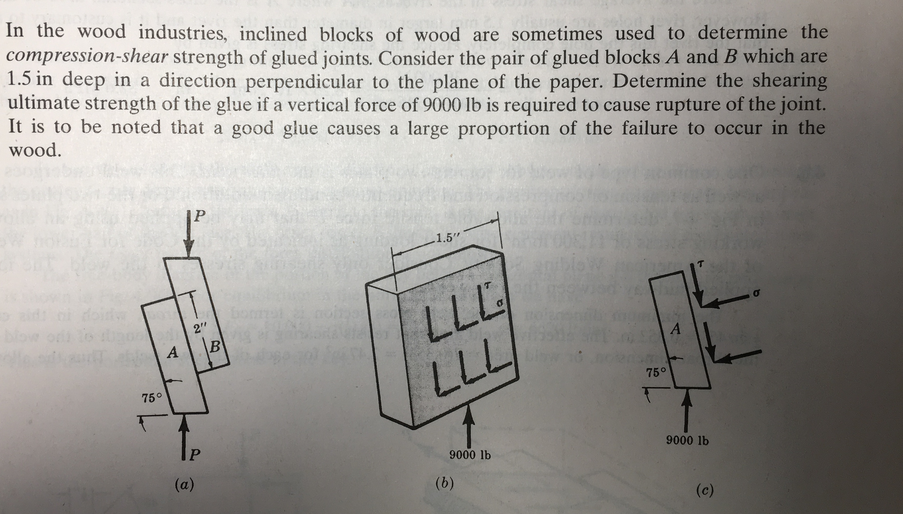




# ENGN0310: Homework 5
## Due Tuesday 11:59 pm, November 2nd, 2021

> Please upload your assignment to Canvas. 
> Contact Sayaka_Kochiyama@brown.edu if you have questions about the below problems.   

# Probelm 1: 10 pts
 A steel bar of rectangular cross-section 10 x 40 mm carries a  $P$. It is attached to a support by means of a round pin of diameter 15 mm (see figure) The maximum allowable shear stress in the pin is 60 MPa. What is the maximum permissible value for $P$?

<!-- # Problem 2: 10
Reconsider the geometry given for Problem #1. However, let's ignore the pin this time, i.e., let us assume that the failure does not happen at the pin. The maximum allowable tensile stress for the bar is 120 MPa. What is the maximum permissible value of the for $P$

# Problem 3: 5
Reconsider the geometry given for Problem #1. As before, the maximum allowable shear stress in the pin is 60 MPa. and the  The maximum allowable tensile stress for the bar is 120 MPa. What is the maximum permissible value of the for $P$ -->
# Problem 2: 10 pts.

# Problem 3: 10 pts.

The shear strength of human bone is an important parameter and implants must be employed to maintain the desired length of a fractured leg or arm. Substitute animal bone segments are sometimes employed but it is necessary to select a substance having the same transverse shear strength as human bone. For this purpose tests such as those shown in the below figure  are carried out on the substitute under consideration. The cross-sectional area of the bone specimen being tested is 150 square mm and a transverse force of 600 N is required to cause shear fracture. What the the mean shear strength of the bone substitute specimen?

# Problem 4: 20 pts.

# Problem 5: 20 pts.

Consider the steel plate shown below. The ultimate tensitle strength of the steel composing this plate is 60000 psi.  The shear strength of this steel is 49200 psi. 

