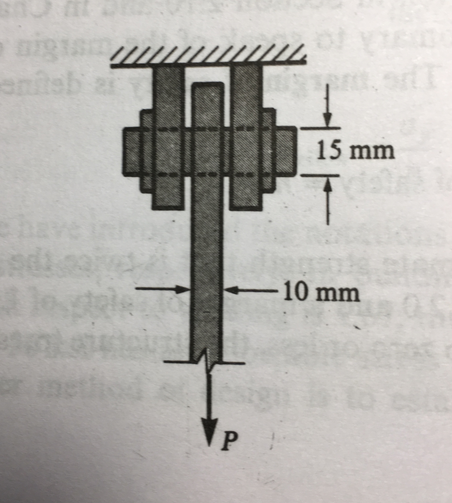
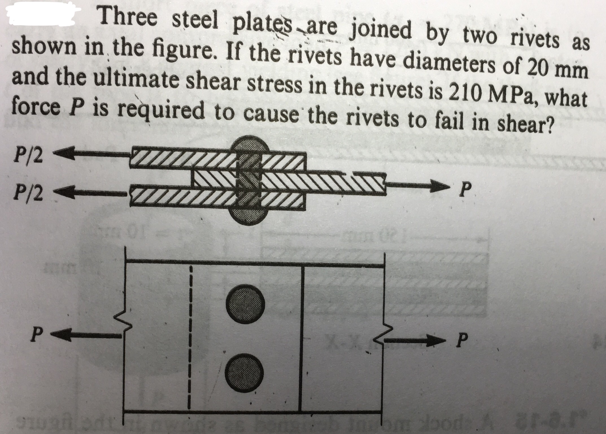
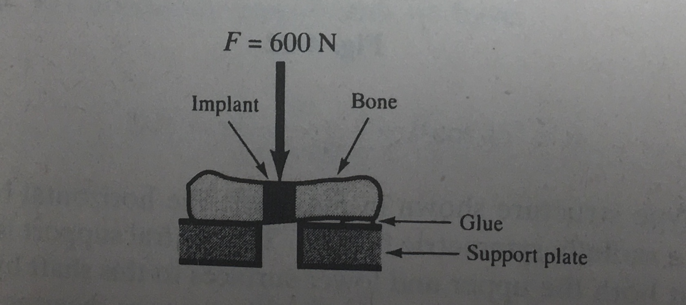
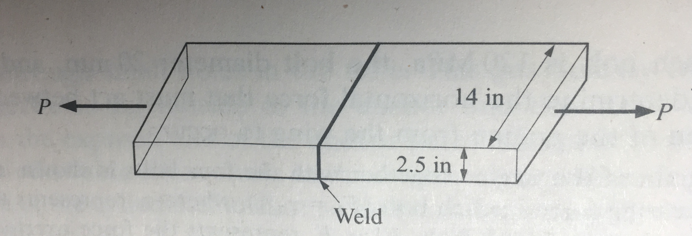




# ENGN0310: Homework 5
## Due Tuesday 11:59 pm, November 2nd, 2021

> Please upload your assignment to Canvas. 
> Contact Sayaka_Kochiyama@brown.edu if you have questions about the below problems.   

# Probelm 1: 10 pts
 A steel bar of rectangular cross-section 10 x 40 mm carries a  $P$. It is attached to a support by means of a round pin of diameter 15 mm (see figure) The maximum allowable shear stress in the pin is 60 MPa. What is the maximum permissible value for $P$?

**Solution:**

From the free body diagram of the pin above, the shear force inside for the bar is $V = \frac{P}{2}$, so the shear stress is $\tau_{max} = \frac{P_{max}}{2A}\Rightarrow P_{max}=2A\tau_{max} = \frac{\pi}{2}(.015m)^2(60 MPa) = 21.21kN$

<!-- # Problem 2: 10
Reconsider the geometry given for Problem #1. However, let's ignore the pin this time, i.e., let us assume that the failure does not happen at the pin. The maximum allowable tensile stress for the bar is 120 MPa. What is the maximum permissible value of the for $P$

# Problem 3: 5
Reconsider the geometry given for Problem #1. As before, the maximum allowable shear stress in the pin is 60 MPa. and the  The maximum allowable tensile stress for the bar is 120 MPa. What is the maximum permissible value of the for $P$ -->
# Problem 2: 10 pts.

**Solution:**

From the free body diagram of the pin above, the shear force inside for the bar is $V = \frac{P}{2}$, so the shear stress is $\tau_{max} = \frac{P_{max}}{2A}$, where in this case $A = 2(\frac{\pi}{4})(.02m)$ because there are two pins,$P_{max}=2A\tau_{max} = \pi(.02m)^2(210 MPa) = 263.89kN$.

# Problem 3: 10 pts.

The shear strength of human bone is an important parameter and implants must be employed to maintain the desired length of a fractured leg or arm. Substitute animal bone segments are sometimes employed but it is necessary to select a substance having the same transverse shear strength as human bone. For this purpose tests such as those shown in the below figure  are carried out on the substitute under consideration. The cross-sectional area of the bone specimen being tested is 150 square mm and a transverse force of 600 N is required to cause shear fracture. What the the mean shear strength of the bone substitute specimen?

**Solution:**

From the free body diagram of the pin above, the shear force inside for the bar is $V = \frac{F}{2}$, so the shear stress is $\tau_{max} = \frac{F}{2A} = \frac{600N}{2(150mm^2)} = 2MPa$.

# Problem 4: 20 pts.

**Solution:**

From the free body diagram above in the $x$ direction we have that $-A\sigma cos(15°) + A\tau cos(75°) = 0$ and in the $y$ direction $A\sigma sin(15°) + A\tau sin(75°) = P$, so for $P=9000lbs$ and $A = 3in^2$ our system of equations becomes $$\begin{pmatrix} -cos(15°) & cos(75°)\\ sin(15°) & sin(75°)\end{pmatrix} \begin{pmatrix}\sigma \\ \tau \end{pmatrix} = \begin{pmatrix}0 \\ 3000psi \end{pmatrix} \Rightarrow \begin{pmatrix}\sigma \\ \tau \end{pmatrix}=\begin{pmatrix}776.5psi \\ 2897.8psi \end{pmatrix}$$, so the ultimate shear strength of the glue is $\tau_{max} = 2897.8psi$.

# Problem 5: 20 pts.

Consider the steel plate shown below. Two steel plates are butt welded together. The ultimate tensile strength of the steel composing this plate is 60000 psi.  The shear strength of this steel is 20200 psi. The strength of the weld is 0.8 times the ultimate tensile strength. What is the maximum axial force that the plate system can support?

**Solution:**

The from the derivation of the maximum stresses in an axially loaded bar, [here](CourseNotes\Traction\Max.md), we have that the maximum normal stress is $\sigma_{max} = \frac{P}{A}$ and the max shear stress is $\tau_{max} = \frac{P}{2A}$. Then the $P_{fail}$ in the weld is $P_{fail} = A\sigma_{ult,w} = .8(35in^2)(60000 psi) = \frac{P}{A} \Rightarrow P_{fail} = A\sigma_{ult} =(35in^2) (60000 psi) = 2.1\times10^6 lbs$. Then the $P_{fail}$ for shear failure in the bar is $\tau_{max} = \frac{P}{2A} \Rightarrow P_{fail} = 2A \tau_{ult} =2(35in^2) ( 20200psi)= 1.414\times10^6 lbs$. Since the the bar will fail first at the lowest $P_{fail}$, then the failure will be in shear, and the maximum axial force that the bar can support is $P_{max} = .414\times10^6 lbs$.
