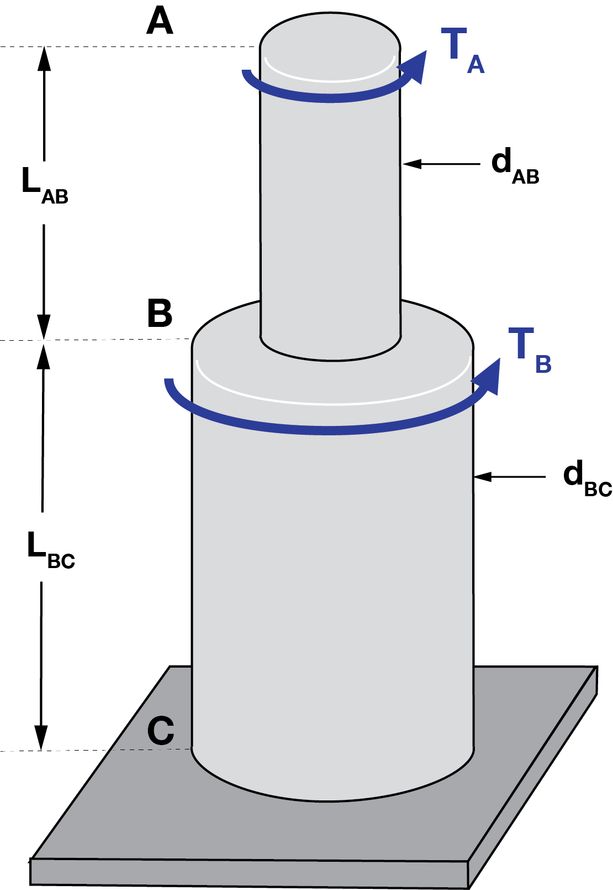




# ENGN0310: Homework 6
## Due Wednesday 11:59 pm, November 10th, 2021

> Please upload your assignment to Canvas. 

#### Some helpful concepts needed for solving the HW problems

--------

From class, we know that

$$
\begin{equation}
\frac{T L}{J\theta}=G
\end{equation}
$$

where $T$ is the torque applied to the shaft, $L$ is the length of the bar, $J$ is the polar moment of inertia, $\theta$ is the angle of twist at the shaft's right end face (in $\rm{rad}$), and $G$ is the Shear modulus of the shaft. 

Notice that this is analogous to the Hook's law we explored in the previous assignments.

$$
\begin{equation}
\frac{F L}{A\delta}=E
\end{equation}
$$

Remember that (2) was a direct consequence of the following expression for displacement at material particle X, which takes into account the variable force, Young's modulus, and cross-sectional area along its length:

$$
\begin{equation}
u(X)=\int_0^X \frac{F(Y)}{E(Y) A(Y)} dY
\end{equation}
$$

When you take F, E, A as constant values and take integration over the entire length of the bar ($0$ to $L$), you retrieve

$$
\begin{equation}
u(L)=\frac{F}{E A}\int_0^L dY = \frac{FL}{EA}
\end{equation}
$$

where the displacement at L corresponds to the elongation $\delta$ (i.e., $u(L)=\delta$.)

Similar argument can be made about (1). It derives from the following expression for angle of twist $\theta$ at material particle X

$$
\begin{equation}
\theta(X)=\int_0^X \frac{T(Y)}{G(Y) J(Y)} dY.
\end{equation}
$$

When you take $T$, $G$, and $J$ to be constant along the shaft's length and take the integration from $0$ to $L$, you retrieve (1).

----------

| Materials      | $G ~(\rm{GPa})$ |
|----------------|-----------------|
| Steel          | 77             |
| Titanium alloy | 44             |

<u> Problem 1 (10 pts) </u>

* For the given state of stress, determine the normal and shearing stresses exerted on the oblique face of the shaded triangular element shown. Use a method of analysis based on the equilibrium of that element.
 

 <u> Problem 2 (10 pts) </u>

* Consider a solid cylindrical steel shaft of length $15~\rm{cm}$,  whose cross-section is a circle of diameter $2~\rm{cm}$. If the angle of twist at the right face is $\pi/3~\rm{rad}$, what is the torque applied to the shaft?
 

<u> Problem 3 (10 pts total) </u>
* (5 pts) (i) What is the ratio of Shear modulus $G$ of the materials of two shafts if the shafts are of the same size and their angle of twist are in the ratio 5/3 when subjected to equal torque?

* (5 pts) (ii) Consider two shafts of different diameters, one made of steel and the other made of titanium alloy. Determine the diameter of each shaft if for both shafts, the applied torque is $240~\rm{N\cdot m}$, length of the shaft is $6~\rm{m}$, and the angle of twist at the end face is $45^{\circ}.$
 

<u> Problem 4 (15 pts total) </u>

* A $8~\rm{m}$ long shaft with a circular cross-sectional area of diameter $6~\rm{cm}$ is subjected to a torque of $T = 5~\rm{kN \cdot m}$. 

    * (10pts) (i) If the shaft gets twisted by $30^{\circ}$, what is its shear modulus? 
    * (5pts)(ii) Now, consider that the shaft has an inner core of $3~\rm{cm}$ diameter as shown below. What is the percentage of the torque carried out by this inner core? You can assume that the core is also made out of the same material, and that the inner core undergo the same angle of twist ($30^{\circ}$ at the right end).

  
    

     
    

 

<u> Problem 5 (15 pts total) </u>

* A $3~\rm{m}$ long shaft with a with a circular cross-sectional area of diameter $5~\rm{cm}$ is subjected to a force couple as shown below, where $F = 15~\rm{kN}$. 

    * (5pts) (i) What is the torque $T$ acting on the shaft?    
    * (5pts) (ii)  If the shaft gets twisted by $30^{\circ}$, what is its shear modulus?
    * (5pts) (iii))  Determine the angle of twist half-way along the length of the shaft.

  
    

     
    

<u> Problem 6 (20 pts total) </u>
* A smaller steel shaft $\rm{AB}$ of diameter $\rm{d_{AB}}= 50~\rm{mm}$ and length $\rm{L_{AB}}= 1~\rm{m}$ is attached to a larger steel shaft $\rm{BC}$ of diameter $\rm{d_{BC}}= 75~\rm{mm}$ and length $\rm{L_{BC}}= 2~\rm{m}$.  Consider the torque  $\boldsymbol{T}=T \hat{\boldsymbol{E}}_{\rm{a}}$, $T = 3~\rm{kN \cdot m} $ acting at $\rm{A}$ as shown. 

    * (5pts) (i) What are the polar moment of inertia $J$ in shaft $\rm{AB}$ and shaft $\rm{BC}$ respectively?
    * (5pts) (ii) Determine the angle of twist at point $\rm{B}$.
    * (5pts) (iii) Determine the angle of twist at point $\rm{A}$.
    * (5pts) (iv) If the shaft $\rm{BC}$ is made of titanium alloy instead of steel, what is the angle of twist at $\rm{A}$?

  
    

     
    

<u> Problem 7 (20 pts total) </u>
* Now, consider a similar problem but with two torques $T_A = 6~\rm{kN \cdot m}$ and $T_B =12~\rm{kN \cdot m}$ acting at $\rm{A}$ and $\rm{B}$ as shown. All other dimensions/quantities remain the same.

    * (5pts) (i) What are the torques acting in shaft $\rm{AB}$ and shaft $\rm{BC}$ respectively?
    * (5pts) (ii) Determine the angle of twist at point $\rm{B}$.
    * (5pts) (iii) Determine the angle of twist at point $\rm{A}$.
    * (5pts) (iv) If the shaft $\rm{BC}$ is made of titanium alloy instead of steel, what is the angle of twist at $\rm{A}$?
 
  
    

     
    

