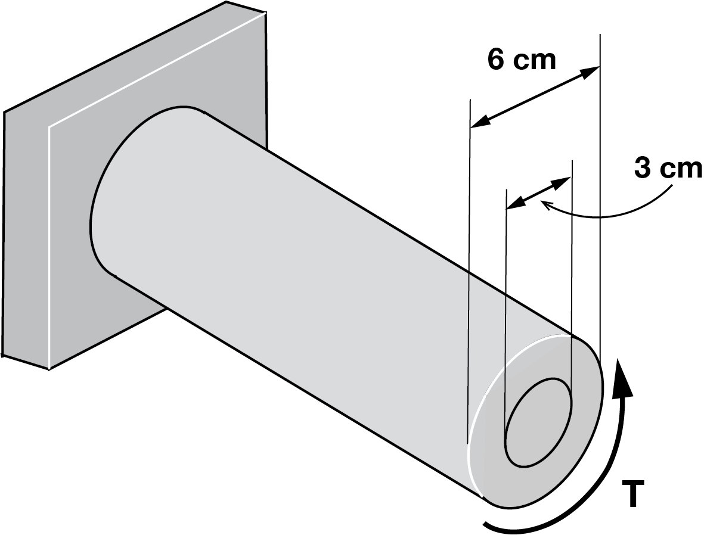




# ENGN0310: Homework 6
## Due Wednesday 11:59 pm, November 10th, 2021

> Please upload your assignment to Canvas. 

#### Some helpful concepts needed for solving the HW problems

--------

From class, we know that

$$
\begin{equation}
\frac{T L}{J\theta}=G
\end{equation}
$$

where $T$ is the torque applied to the shaft, $L$ is the length of the bar, $J$ is the polar moment of inertia, $\theta$ is the angle of twist at the shaft's right end face (in $\rm{rad}$), and $G$ is the Shear modulus of the shaft. 

Notice that this is analogous to the Hook's law we explored in the previous assignments.

$$
\begin{equation}
\frac{F L}{A\delta}=E
\end{equation}
$$

Remember that (2) was a direct consequence of the following expression for displacement at material particle X, which takes into account the variable force, Young's modulus, and cross-sectional area along its length:

$$
\begin{equation}
u(X)=\int_0^X \frac{F(Y)}{E(Y) A(Y)} dY
\end{equation}
$$

When you take F, E, A as constant values and take integration over the entire length of the bar ($0$ to $L$), you retrieve

$$
\begin{equation}
u(L)=\frac{F}{E A}\int_0^L dY = \frac{FL}{EA}
\end{equation}
$$

where the displacement at L corresponds to the elongation $\delta$ (i.e., $u(L)=\delta$.)

Similar argument can be made about (1). It derives from the following expression for angle of twist $\theta$ at material particle X

$$
\begin{equation}
\theta(X)=\int_0^X \frac{T(Y)}{G(Y) J(Y)} dY.
\end{equation}
$$

When you take $T$, $G$, and $J$ to be constant along the shaft's length and take the integration from $0$ to $L$, you retrieve (1).

----------

| Materials      | $G ~(\rm{GPa})$ |
|----------------|-----------------|
| Steel          | 77             |
| Titanium alloy | 44             |

<u> Problem 1 (10 pts) </u>

* For the given state of stress, determine the normal and shearing stresses exerted on the oblique face of the shaded triangular element shown. Use a method of analysis based on the equilibrium of that element.
 

 <u> Problem 2 (10 pts) </u>

* For the state of plane stress shown, determine the value of τxy for which the in-plane shearing stress parallel to the weld is zero.
 

<u> Problem 3 (10 pts total) </u>
* Two wooden members of $80 \times 120~\rm mm$ uniform rectangular cross section are joined by the simple glued scarf splice shown. Knowing that $\beta = 25^{o}$ and that centric loads of magnitude $P = 10 ~\rm kN$ are applied to the members as shown, determine (a) the in-plane shearing stress parallel to the splice, (b) the normal stress perpendicular to the splice.
 

<u> Problem 4 (15 pts total) </u>

* The centric force P is applied to a short post as shown. Knowing that the stresses on plane a-a are σ = −15 ksi and τ = 5 ksi, determine (a) the angle β that plane a-a forms with the horizontal, (b) the maximum compressive stress in the post.

  
    

     
    

 

<u> Problem 5 (15 pts total) </u>

* For the given state of stress, determine (a) the maximum and minimum in-plane normal stress, (b) the orientation of the planes of the maximum and minimum in-plane normal stress.

  
    

     
    

<u> Problem 6 (20 pts total) </u>
* For the given state of stress, determine (a) the maximum and minimum in-plane shearing stress, (b) the orientation of the planes of the maximum and minimum in-plane shearing stress.

  
    

     
    

