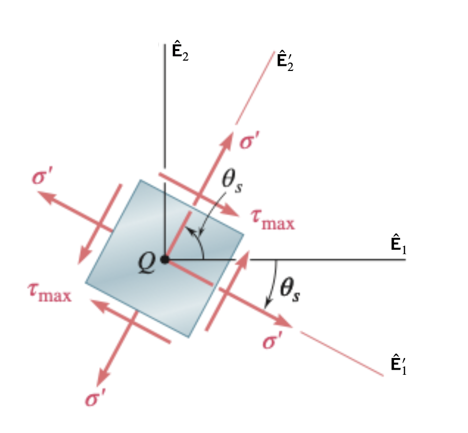




# ENGN0310: Homework 6
## Due Wednesday 11:59 pm, November 10th, 2021

> Please upload your assignment to Canvas. 

#### Some helpful concepts needed for solving the HW problems

--------
* Maximum and minimum normal stress 
$$
\begin{equation}
\sigma_{\rm max,min}=\frac{\sigma_x+\sigma_y}{2} \pm \sqrt{\left(\frac{\sigma_x-\sigma_y}{2}\right)^2+\tau_{xy}^2}
\end{equation}
$$
* The planes of maximum and minimum normal stress
$$
\begin{equation}
\tan 2\theta_p=\frac{2\tau_{xy}}{\sigma_x-\sigma_y}
\end{equation}
$$

  
    

     
    

 

> Hint: At the plane of $\theta_p$, the shearing stress equals to zero.

* Maximum and minimum shearing stress 
$$
\begin{equation}
\tau_{\rm max}=\sqrt{\left(\frac{\sigma_x-\sigma_y}{2}\right)^2+\tau_{xy}^2}
\end{equation}
$$

$$
\begin{equation}
\tau_{\rm min}=0
\end{equation}
$$

* The planes of maximum shearing stress
$$
\begin{equation}
\tan 2\theta_s=-\frac{\sigma_x-\sigma_y}{2\tau_{xy}}
\end{equation}
$$

  
    

     
    

 

----------

<u> Problem 1 (10 pts) </u>

* For the given state of stress, determine the normal and shearing stresses exerted on the oblique face of the shaded triangular element shown. Use a method of analysis based on the equilibrium of that element.
 

  
    

     
    

 

 <u> Problem 2 (10 pts) </u>

* For the state of plane stress shown, determine the value of $τ_{xy}$ for which the in-plane shearing stress parallel to the weld is zero.
 

  
    

     
    

 

<u> Problem 3 (20 pts total) </u>
* Two wooden members of $80 \times 120~\rm mm$ uniform rectangular cross section are joined by the simple glued scarf splice shown. Knowing that $\beta = 25^{o}$ and that centric loads of magnitude $P = 10 ~\rm kN$ are applied to the members as shown, determine (a) (10 pts) the in-plane shearing stress parallel to the splice, (b) (10 pts) the normal stress perpendicular to the splice.
 

  
    

     
    

 

<u> Problem 4 (20 pts total) </u>

* The centric force $\boldsymbol{\sf P}$ is applied to a short post as shown. Knowing that the stresses on plane $a-a$ (the direction of the plane is shown in subfigure (b)) are $\sigma = −15 ~\rm MPa$ and $\tau = 5 ~\rm MPa $, determine (a) (10 pts) the angle $\beta$ that plane $a-a$ forms with the horizontal, (b) (10 pts) the maximum compressive stress in the post.

  
    

     
    

 

<u> Problem 5 (20 pts total) </u>

* For the given state of stress, determine (a) (10 pts) the maximum and minimum in-plane normal stress, (b) (10 pts) the orientation of the planes of the maximum and minimum in-plane normal stress.

  
    

     
    

<u> Problem 6 (20 pts total) </u>
* For the given state of stress, determine (a) (10 pts) the maximum and minimum in-plane shearing stress, (b) (10 pts) the orientation of the planes of the maximum and minimum in-plane shearing stress.

  
    

     
    

