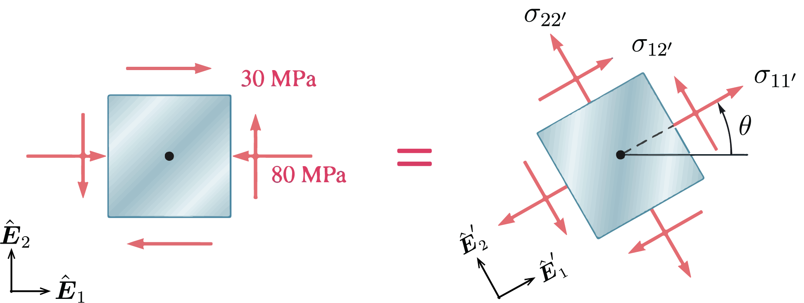




# ENGN0310: Homework 7
## Due Wednesday 11:59 pm, November 17th, 2021

> Please upload your assignment to Canvas. 
> Contact Sayaka_Kochiyama@brown.edu if you have questions about the problems.   

#### Some helpful concepts needed for solving the HW problems

--------
* Maximum and minimum normal stress 

$$
\begin{equation}
\sigma_{\rm max,min}=\frac{\sigma_{11}+\sigma_{22}}{2} \pm \sqrt{\left(\frac{\sigma_{11}-\sigma_{22}}{2}\right)^2+\tau_{12}^2}
\end{equation}
$$

* The planes of maximum and minimum normal stress

$$
\begin{equation}
\tan 2\theta_p=\frac{2\tau_{12}}{\sigma_{11}-\sigma_{22}}
\end{equation}
$$

  
    

     
    

 

> Hint: At the plane of $\theta_p$, the shearing stress equals to zero.

* Maximum and minimum shearing stress 

$$
\begin{equation}
\tau_{\rm max}=\sqrt{\left(\frac{\sigma_{11}-\sigma_{22}}{2}\right)^2+\tau_{12}^2}
\end{equation}
$$

$$
\begin{equation}
\tau_{\rm min}=0
\end{equation}
$$

* The planes of maximum shearing stress

$$
\begin{equation}
\tan 2\theta_s=-\frac{\sigma_{11}-\sigma_{22}}{2\tau_{12}}
\end{equation}
$$

  
    

     
    

 

----------

<u> Problem 1 (20 pts) </u> (Moved from HW6, Problem 6)
* For the given state of stress, determine (a) (10 pts) the maximum and minimum in-plane shearing stress, (b) (10 pts) the orientation of the planes of the maximum and minimum in-plane shearing stress.

  
    

     
    

<u> Problem 2 (25 pts total) </u> 
<!-- For the state of stress shown, determine the range of values of θ for which the magnitude of the shearing stress $\tau_{12}'$ is equal to or less than 40 MPa.  -->
* (5pts) (a) Write the stress tensor in the $\hat{\boldsymbol{E}}_1$, $\hat{\boldsymbol{E}}_2$ basis. 
* (15pts) (b) Find the expression for $\sigma_{11}'$, $\sigma_{12}'$ and $\sigma_{22}'$ in terms of $\theta$. 
* (5pts) (c) Using the result from (b), write the stress strain tensor in the $\hat{\boldsymbol{E}}_1'$, $\hat{\boldsymbol{E}}_2'$ basis in terms of $\theta$.
* (5pts) (d) What is the range of θ for which the magnitude of the $\sigma_{12}'$ is equal to or less than 40 MPa?

  
    

     
    

 
 

<u> Problem 3 (20 pts total, 5pts each) </u> 
* (a) Write the stress tensor describing the state in the left element in the $\hat{\boldsymbol{E}}_1$, $\hat{\boldsymbol{E}}_2$ basis.
* (b) Write the stress tensor describing the state in the right element in the $\hat{\boldsymbol{E}}_1$, $\hat{\boldsymbol{E}}_2$ basis.
* (c) What is the state of stress resulting from the superposition of the two stress states?
* (d) Determine the planes of maximum and minimum normal stress.

 
    

     
    

 

<u> Problem 4 (20 pts total, 5pts each) </u> 
* (a) Write the stress tensor for the element given below.
* (b) What is the unit normal vector of the shaded imaginary cut surface?
* (c) What is the traction on this surface?
* (d) Find the normal stress vector.
  
    

     
   
    

<u> Problem 5 (15 pts total) </u> 
* Consider the same element given above, but with a different imaginary cut. Repeat (b)-(d) 
 
    

    
    
