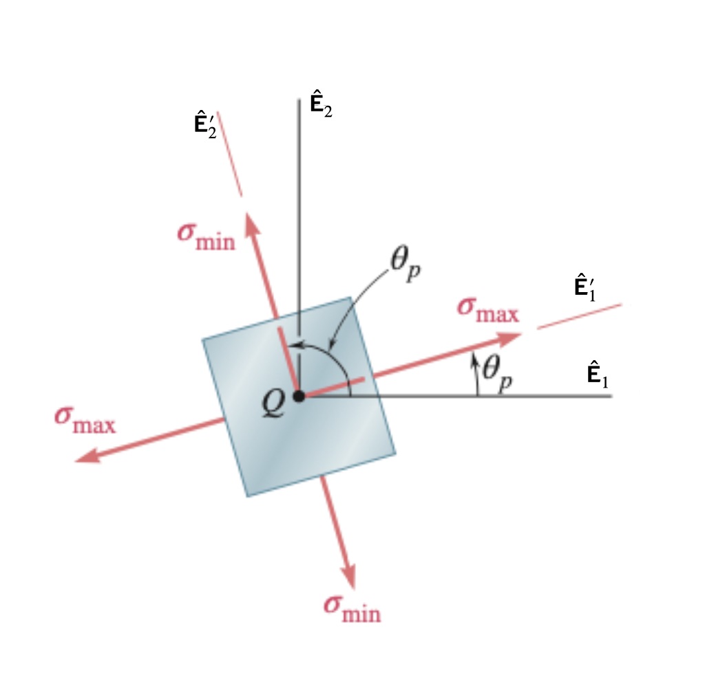




# ENGN0310: Homework 7 (100 pts)
## Due Friday 11:59 pm, November 19th, 2021

> Please upload your assignment to Canvas. 

#### Some helpful concepts needed for solving the HW problems

--------
* Maximum and minimum normal stress 

$$
\begin{equation}
\sigma_{\rm max,min}=\frac{\sigma_{11}+\sigma_{22}}{2} \pm \sqrt{\left(\frac{\sigma_{11}-\sigma_{22}}{2}\right)^2+\tau_{12}^2}
\end{equation}
$$

* The planes of maximum and minimum normal stress

$$
\begin{equation}
\tan 2\theta_p=\frac{2\tau_{12}}{\sigma_{11}-\sigma_{22}}
\end{equation}
$$

  
    

     
    

     

> Hint: At the plane of $\theta_p$, the shearing stress equals to zero.

* Maximum and minimum shearing stress 

$$
\begin{equation}
\tau_{\rm max}=\sqrt{\left(\frac{\sigma_{11}-\sigma_{22}}{2}\right)^2+\tau_{12}^2}
\end{equation}
$$

$$
\begin{equation}
\tau_{\rm min}=0
\end{equation}
$$

* The planes of maximum shearing stress

$$
\begin{equation}
\tan 2\theta_s=-\frac{\sigma_{11}-\sigma_{22}}{2\tau_{12}}
\end{equation}
$$

  
    

     
    

 

----------

<u> Problem 1 (20 pts) </u> (Moved from HW6, Problem 6)
* For the given state of stress, determine (a) (10 pts) the maximum and minimum in-plane shearing stress, (b) (10 pts) the orientation of the planes of the maximum and minimum in-plane shearing stress.

  
    

     
    

<u> Problem 2 (60 pts) </u> 

We studied the problem of torsion earlier in the semester. In solving torsion problems we used the equation

$$
\begin{equation}
\label{eq:TorsionCE}
T(X)=G(X)J(X)\phi'(X)
\end{equation}
$$

where 
* $T(X)$ is the torque,
* $G(X)$ is the shear modulus, 
* $J(X)$ is the polar moment of inertia,
* $\phi(X)$ is the angle of twist,

and $X$ is the coordinate of a material particle in the direction of the shaft's length. 

In the following we will derive the previous equation.

Take the displacement field in the  shaft  to be

$$
\begin{align}
\breve{x}_1(X_1,X_2,X_3)&= X_1-X_2\phi(X_3) \\
\breve{x}_2(X_1,X_2,X_3)&=X_2+X_1\phi(X_3)\\
\breve{x}_3(X_1,X_2,X_3)&=X_3
\end{align}
$$

* **(5pts) (a)** What is the displacement field? That is, what are the functions
    $\breve{u}_1(X_1,X_2,X_3)$, $\breve{u}_2(X_1,X_2,X_3)$, and $\breve{u}_3(X_1,X_2,X_3)$? Recall that 
    
    $$
    \breve{u}_i(X_1,X_2,X_3)=\breve{x}_i(X_1,X_2,X_3)-X_i,
    $$
    
    where $i=1,~2,~3$.

* **(10 pts) (b)** What is the strain field $\breve{\boldsymbol{\epsilon}}(X_1,X_2,X_3)$?
    Determining the strain field is equivalent to determining the components 

    $$
    \breve{\epsilon}_{ij}(X_1,X_2,X_3)
    $$
 
    where $i$, $j=1,~2,~3$. In other words, find the strain field by  determining the nine functions  $\breve{\epsilon}\_{11}(X_1,X_2,X_3)$, $\breve{\epsilon}\_{12}(X_1,X_2,X_3)$,....$\breve{\epsilon}\_{32}(X_1,X_2,X_3)$, $\breve{\epsilon}\_{33}(X_1,X_2,X_3)$. 
    
    Recall the definition of the strain components:

    $$
    \begin{align}
    \breve{\epsilon}_{11}(X_1,X_2,X_3)&=
    \frac{\partial \breve{u}_1(X_1,X_2,X_3)}{\partial X_1}\\
    \breve{\epsilon}_{22}(X_1,X_2,X_3)&=
    \frac{\partial \breve{u}_2(X_1,X_2,X_3)}{\partial X_2}
    \\
    \breve{\epsilon}_{33}(X_1,X_2,X_3)&=
    \frac{\partial \breve{u}_3(X_1,X_2,X_3)}{\partial X_3}\\
    \breve{\epsilon}_{12}(X_1,X_2,X_3)&=
    \frac{1}{2}
    \left(
    \frac{\partial \breve{u}_1(X_1,X_2,X_3)}{\partial X_2}
    +
    \frac{\partial \breve{u}_2(X_1,X_2,X_3)}{\partial X_1}
    \right)
    \\
    \breve{\epsilon}_{21}(X_1,X_2,X_3)&=\breve{\epsilon}_{12}(X_1,X_2,X_3)
    \\
    \breve{\epsilon}_{13}(X_1,X_2,X_3)&=
    \frac{1}{2}
    \left(
    \frac{\partial \breve{u}_1(X_1,X_2,X_3)}{\partial X_3}
    +
    \frac{\partial \breve{u}_3(X_1,X_2,X_3)}{\partial X_1}
    \right)
    \\
    \breve{\epsilon}_{31}(X_1,X_2,X_3)&=\breve{\epsilon}_{13}(X_1,X_2,X_3)
    \\
    \breve{\epsilon}_{23}(X_1,X_2,X_3)&=
    \frac{1}{2}
    \left(
    \frac{\partial \breve{u}_2(X_1,X_2,X_3)}{\partial X_3}
    +
    \frac{\partial \breve{u}_3(X_1,X_2,X_3)}{\partial X_2}
    \right)\\
    \breve{\epsilon}_{32}(X_1,X_2,X_3)&=\breve{\epsilon}_{23}(X_1,X_2,X_3)
    \end{align}
    $$

* **(20 pts) (c)** Let us assume that the shaft is composed of a linear elastic solid. What is the stress field $\breve{\boldsymbol{\sigma}}(X_1,X_2,X_3)$? Determining the stress field is equivalent to determining the components 

    $$
    \breve{\sigma}\_{ij}(X_1,X_2,X_3)
    $$
  
   where $i$, $j=1,~2,~3$. In other words, compute the stress field by determining the nine functions $\breve{\sigma}\_{11}(X_1,X_2,X_3)$, $\breve{\sigma}\_{12}(X_1,X_2,X_3)$,....$\breve{\sigma}\_{32}(X_1,X_2,X_3)$, $\breve{\sigma}\_{33}(X_1,X_2,X_3)$. 
   
    Recall the definition of a linear elastic solid. The stress and strain components in a linear elastic solid are given by the Hooke's Law, which states that

    $$
    \begin{align}
    \breve{\sigma}_{11}(X_1,X_2,X_3)&=2\mu \breve{\epsilon}_{11}(X_1,X_2,X_3)+\lambda \text{Tr}(\breve{\boldsymbol{\epsilon}}(X_1,X_2,X_3))\\
    \breve{\sigma}_{22}(X_1,X_2,X_3)&=2\mu \breve{\epsilon}_{22}(X_1,X_2,X_3)+\lambda \text{Tr}(\breve{\boldsymbol{\epsilon}}(X_1,X_2,X_3))\\
    \breve{\sigma}_{33}(X_1,X_2,X_3)&=2\mu \breve{\epsilon}_{33}(X_1,X_2,X_3)+\lambda \text{Tr}(\breve{\boldsymbol{\epsilon}}(X_1,X_2,X_3))\\
    \breve{\sigma}_{23}(X_1,X_2,X_3)&=2\mu \breve{\epsilon}_{23}(X_1,X_2,X_3)\\
    \breve{\sigma}_{13}(X_1,X_2,X_3)&=2\mu \breve{\epsilon}_{13}(X_1,X_2,X_3)\\
    \breve{\sigma}_{12}(X_1,X_2,X_3)&=2\mu \breve{\epsilon}_{12}(X_1,X_2,X_3)\\
    \breve{\sigma}_{32}(X_1,X_2,X_3)&=\breve{\sigma}_{23}(X_1,X_2,X_3)\\
    \breve{\sigma}_{31}(X_1,X_2,X_3)&=\breve{\sigma}_{13}(X_1,X_2,X_3)\\
    \breve{\sigma}_{21}(X_1,X_2,X_3)&=\breve{\sigma}_{12}(X_1,X_2,X_3)
    \end{align}
    $$

    where 

    $$
    \text{Tr}(\breve{\boldsymbol{\epsilon}}(X_1,X_2,X_3))=
    \breve{\epsilon}_{11}(X_1,X_2,X_3)+
    \breve{\epsilon}_{22}(X_1,X_2,X_3)+\breve{\epsilon}_{33}(X_1,X_2,X_3)
    $$ 

    and $\mu$ is the same as $G$, the shear modulus. In the current case, we are going to take that the shear modulus is constant throughout the shaft.

* **(10 pts) (d)** Let's take shaft to be aligned in the $\hat{\boldsymbol{E}}_3$ direction. Consider an imaginary cut at some $X_3$. The cross-sectional surface on the left part, $\Gamma(X_3)$, will have  $\hat{\boldsymbol{E}}_3$ as its outward normal. What is the traction vector on $\Gamma(X_3)$? That is, determine 
$\breve{\boldsymbol{\sigma}}(X_1,X_2,X_3)^{T}\hat{\boldsymbol{E}}_3$. As can be seen by the presence of $X_1$, $X_2$, and $X_3$, the traction vector will not be constant on the cross-section. It will vary from point to point on the cross-section. Find the left hand side in the below equation by determining the right hand side in the below equation 

    $$
    \begin{equation}
    \left[\breve{\boldsymbol{t}}(X_1,X_2,X_3;\hat{\boldsymbol{E}}_3)\right]
    =\left[\breve{\boldsymbol{\sigma}}(X_1,X_2,X_3)\right]^{\sf T}\left[\hat{\boldsymbol{E}}_3\right]
    \end{equation}
    $$  

* **(15 pts) (e)** Compute the torque on the cross-sectional surface discussed in the previous part as

    $$
    \breve{\boldsymbol{T}}(X_3)=\int_{\Gamma(X_3)}\boldsymbol{X}\times \breve{\boldsymbol{t}}(X_1,X_2,X_3;\hat{\boldsymbol{E}}_3)\, d\Gamma 
    $$

    where $\Gamma(X_3)$ is the cross-sectional surface at $X_3$. Use the definition of the polar moment of inertia, which is,

    $$
    J(X_3) =\int_{\Gamma(X_3)} X_1^2+X_2^2\, d\Gamma,
    $$

    to simplify your answer.

    For computing the integral take $\boldsymbol{X}\times \breve{\boldsymbol{t}}(X_1,X_2,X_3;\hat{\boldsymbol{E}}_3)$ as the cross product between $\left[\boldsymbol{X}\right]$, which is

    $$
    \begin{bmatrix}
    \boldsymbol{X}
    \end{bmatrix}=
    \begin{bmatrix} 
    X_1\\
    X_2\\
    X_3
    \end{bmatrix},
    $$

    and $\left[\breve{\boldsymbol{t}}(X_1,X_2,X_3;\hat{\boldsymbol{E}}_3)
\right]$.

<u> Problem 3 (20pts)  Mohr circle. </u>

Draw the Mohr circles for the stress state given in

* (10 pts) (a) Pb.1 of this HW, and
* (10 pts) (b) Pb.1 of HW6

