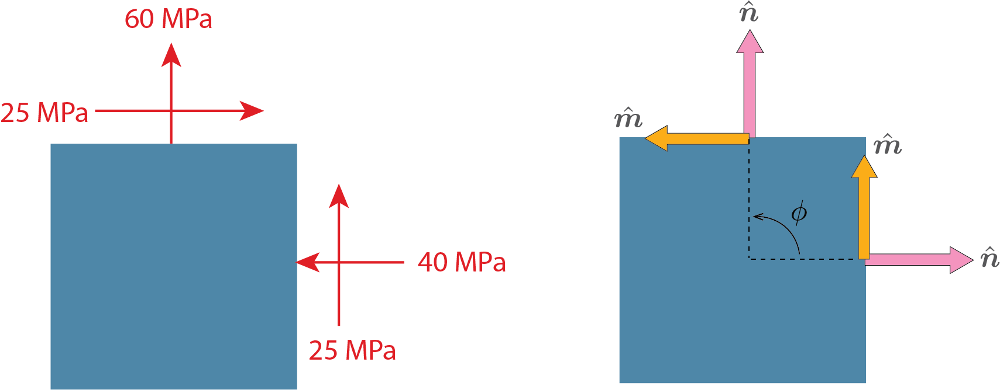




# ENGN0310: Homework 7 (100 pts)
## Due Friday 11:59 pm, November 19th, 2021

> Please upload your assignment to Canvas. 

----------

<u> Problem 1 (20 pts) </u> (Moved from HW6, Problem 6)
For the given state of stress, determine (a) (10 pts) the maximum and minimum in-plane shearing stress, (b) (10 pts) the orientation of the planes of the maximum and minimum in-plane shearing stress.

  
    

     
    

**Solution (a)** 

The minimum in-plane shearing stress is $\tau_{\rm min}=0$. Plugging in $\sigma_{11}=-40~\rm{MPa}$, $\sigma_{22}=60~\rm{MPa}$, and $\tau_{12}=25~\rm{MPa}$ to the equation given for the maximum in-plane shearing stress,

$$
\begin{equation}
\tau_{\rm max}=\sqrt{\left(\frac{\sigma_{11}-\sigma_{22}}{2}\right)^2+\tau_{12}^2}=55.9~\rm{MPa}
\end{equation}
$$

**Solution (b)** 

The orientation of the planes of the minimum in-plane shearing stress is at $\theta_p$. From HW6, Pb5 solution, this is at 

$$
\theta_p=1.34~\rm{rad}, 2.91~\rm{rad}, 4.48~\rm{rad}, 6.05~\rm{rad}
$$

or 

$$
\theta_p=76.7^\circ, 166.7^\circ, 256.7^\circ, 346.7^\circ
$$

The orientation of the planes of the maximum in-plane shearing stress is given by solving for $\theta_s$ in $0 \leq \theta_s <2\pi$ (or if you just listed $\theta_s$ in $0 \leq \theta_s <\pi$ is also sufficient) that satisfies

$$ 
\tan 2\theta_s=-\frac{\sigma_{11}-\sigma_{22}}{2\tau_{12}}
$$

which gives

$$
\theta_s=0.554~\rm{rad}, 2.12~\rm{rad}, 3.70~\rm{rad}, 5.27~\rm{rad}
$$

or 

$$
\theta_s=31.7^\circ, 121.7^\circ, 211.7^\circ, 301.7^\circ
$$

***Optional***

Refer to [this note](https://appliedmechanicslab.github.io/ENGN0310/CourseNotes/Stress/Stress6.html) to figure out which angle corresponds to positive shear/negative shear. 
 
  

<u> Problem 2 (60 pts) </u> 

***Solution (a)***

$$
\begin{align*}
\breve{u}_1(X_1,X_2,X_3)&=\breve{x}_1(X_1,X_2,X_3)-X_1\\
&=X_1-X_2\phi(X_3)-X_1=-X_2\phi(X_3) \\\\
\breve{u}_2(X_1,X_2,X_3)&=\breve{x}_2(X_1,X_2,X_3)-X_2\\
&=X_2+X_1\phi(X_3)-X_2=X_1\phi(X_3)\\\\
\breve{u}_3(X_1,X_2,X_3)&=\breve{x}_3(X_1,X_2,X_3)-X_3\\
&=X_3-X_3=0
\end{align*}
$$

***Solution (b)***

$$
\begin{align*}
\breve{\epsilon}_{11}(X_1,X_2,X_3)&=
    \frac{\partial \breve{u}_1(X_1,X_2,X_3)}{\partial X_1}=\frac{\partial( -X_2\phi(X_3))}{\partial X_1}=0\\
\breve{\epsilon}_{22}(X_1,X_2,X_3)&=
    \frac{\partial \breve{u}_2(X_1,X_2,X_3)}{\partial X_2}=\frac{\partial(X_1\phi(X_3))}{\partial X_2}=0\\
\breve{\epsilon}_{33}(X_1,X_2,X_3)&=
    \frac{\partial \breve{u}_3(X_1,X_2,X_3)}{\partial X_3}=\frac{\partial(0)}{\partial X_3}=0\\
\breve{\epsilon}_{12}(X_1,X_2,X_3)&=\frac{1}{2}\left(
    \frac{\partial \breve{u}_1(X_1,X_2,X_3)}{\partial X_2}+\frac{\partial \breve{u}_2(X_1,X_2,X_3)}{\partial X_1}\right)\\
    &=\frac{1}{2}\left(\frac{\partial( -X_2\phi(X_3))}{\partial X_2}+\frac{\partial(X_1\phi(X_3))}{\partial X_1}\right)=\frac{1}{2}(-\phi(X_3)+\phi(X_3))=0\\
\breve{\epsilon}_{21}(X_1,X_2,X_3)&=\breve{\epsilon}_{12}(X_1,X_2,X_3)=0\\
\breve{\epsilon}_{13}(X_1,X_2,X_3)&=\frac{1}{2}\left(
    \frac{\partial \breve{u}_1(X_1,X_2,X_3)}{\partial X_3}+\frac{\partial \breve{u}_3(X_1,X_2,X_3)}{\partial X_1}\right)\\
    &=\frac{1}{2}\left(\frac{\partial( -X_2\phi(X_3))}{\partial X_3}+\frac{\partial(0)}{\partial X_1}\right)=-\frac{1}{2}X_2\phi'(X_3)\\
\breve{\epsilon}_{31}(X_1,X_2,X_3)&=\breve{\epsilon}_{13}(X_1,X_2,X_3)=-\frac{1}{2}X_2\phi'(X_3)\\
\breve{\epsilon}_{23}(X_1,X_2,X_3)&=\frac{1}{2}\left(
    \frac{\partial \breve{u}_2(X_1,X_2,X_3)}{\partial X_3}+\frac{\partial \breve{u}_3(X_1,X_2,X_3)}{\partial X_2}\right)\\
    &=\frac{1}{2}\left(\frac{\partial(X_1\phi(X_3))}{\partial X_3}+\frac{\partial(0)}{\partial X_2}\right)=\frac{1}{2}X_1\phi'(X_3)\\
\breve{\epsilon}_{32}(X_1,X_2,X_3)&=\breve{\epsilon}_{23}(X_1,X_2,X_3)=\frac{1}{2}X_1\phi'(X_3)\\
\end{align*}
$$

where

$$
\phi'(X_3)=\frac{\partial \phi(X_3)}{\partial X_3}
$$

***Solution (c)***

Taking the results from part (b),
$$
\begin{align*}
\text{Tr}(\breve{\boldsymbol{\epsilon}}(X_1,X_2,X_3))&=
\breve{\epsilon}_{11}(X_1,X_2,X_3)+
\breve{\epsilon}_{22}(X_1,X_2,X_3)+\breve{\epsilon}_{33}(X_1,X_2,X_3)=0\\
\end{align*}
$$ 

So that

$$
\begin{align*}
\breve{\sigma}_{11}(X_1,X_2,X_3)&=2\mu \breve{\epsilon}_{11}(X_1,X_2,X_3)+\lambda \text{Tr}(\breve{\boldsymbol{\epsilon}}(X_1,X_2,X_3))=0\\
\breve{\sigma}_{22}(X_1,X_2,X_3)&=2\mu \breve{\epsilon}_{22}(X_1,X_2,X_3)+\lambda \text{Tr}(\breve{\boldsymbol{\epsilon}}(X_1,X_2,X_3))=0\\
\breve{\sigma}_{33}(X_1,X_2,X_3)&=2\mu \breve{\epsilon}_{33}(X_1,X_2,X_3)+\lambda \text{Tr}(\breve{\boldsymbol{\epsilon}}(X_1,X_2,X_3))=0\\
\breve{\sigma}_{23}(X_1,X_2,X_3)&=2\mu \breve{\epsilon}_{23}(X_1,X_2,X_3)=2\mu\left(\frac{1}{2}X_1\phi'(X_3)\right)=\mu X_1\phi'(X_3)\\
\breve{\sigma}_{13}(X_1,X_2,X_3)&=2\mu \breve{\epsilon}_{13}(X_1,X_2,X_3)=2\mu\left(-\frac{1}{2}X_2\phi'(X_3)\right)=-\mu X_2 \phi'(X_3)\\
\breve{\sigma}_{12}(X_1,X_2,X_3)&=2\mu \breve{\epsilon}_{12}(X_1,X_2,X_3)=0\\
\breve{\sigma}_{32}(X_1,X_2,X_3)&=\breve{\sigma}_{23}(X_1,X_2,X_3)=\mu X_1\phi'(X_3)\\
\breve{\sigma}_{31}(X_1,X_2,X_3)&=\breve{\sigma}_{13}(X_1,X_2,X_3)=-\mu X_2 \phi'(X_3)\\
\breve{\sigma}_{21}(X_1,X_2,X_3)&=\breve{\sigma}_{12}(X_1,X_2,X_3)=0
\end{align*}
$$

***Solution (d)***

$$
\begin{align*}
\left[\breve{\boldsymbol{\sigma}}(X_1,X_2,X_3)\right]&=
\begin{bmatrix}
\breve{\sigma}_{11}(X_1,X_2,X_3)&\breve{\sigma}_{12}(X_1,X_2,X_3)&\breve{\sigma}_{13}(X_1,X_2,X_3)\\
\breve{\sigma}_{22}(X_1,X_2,X_3)&\breve{\sigma}_{21}(X_1,X_2,X_3)&\breve{\sigma}_{23}(X_1,X_2,X_3)\\
\breve{\sigma}_{31}(X_1,X_2,X_3)&\breve{\sigma}_{32}(X_1,X_2,X_3)&\breve{\sigma}_{1
33}(X_1,X_2,X_3)\\
\end{bmatrix}\\&=
\begin{bmatrix}
0&0&-\mu X_2 \phi'(X_3)\\
0&0&\mu X_1\phi'(X_3)\\
-\mu X_2 \phi'(X_3)&\mu X_1\phi'(X_3)&0
\end{bmatrix}=\left[\breve{\boldsymbol{\sigma}}(X_1,X_2,X_3)\right]^{\sf T}
\end{align*}
$$  

It follows then that

$$
\begin{align*}
\left[\breve{\boldsymbol{t}}(X_1,X_2,X_3;\hat{\boldsymbol{E}}_3)\right]
&=\left[\breve{\boldsymbol{\sigma}}(X_1,X_2,X_3)\right]^{\sf T}\left[\hat{\boldsymbol{E}}_3\right]\\
&=
\begin{bmatrix}
0&0&-\mu X_2 \phi'(X_3)\\
0&0&\mu X_1\phi'(X_3)\\
-\mu X_2 \phi'(X_3)&\mu X_1\phi'(X_3)&0
\end{bmatrix}
\begin{bmatrix}
0\\
0\\
1
\end{bmatrix}=
\begin{bmatrix}
-\mu X_2 \phi'(X_3)\\
\mu X_1\phi'(X_3)\\
0
\end{bmatrix}
\end{align*}
$$  

***Solution (e)***

$$
\begin{align*}
\boldsymbol{X}\times \breve{\boldsymbol{t}}(X_1,X_2,X_3;\hat{\boldsymbol{E}}_3)
&=(X_1\hat{\boldsymbol{E}}_1+X_2\hat{\boldsymbol{E}}_2+X_3\hat{\boldsymbol{E}}_3) \times (-\mu X_2 \phi'(X_3)\hat{\boldsymbol{E}}_1+\mu X_1\phi'(X_3)\hat{\boldsymbol{E}}_2+0\hat{\boldsymbol{E}}_3)\\
&=-\mu X_1 X_2 \phi'(X_3) (\hat{\boldsymbol{E}}_1 \times \hat{\boldsymbol{E}}_1)+\mu X_1^2 \phi'(X_3) (\hat{\boldsymbol{E}}_1 \times \hat{\boldsymbol{E}}_2)+ 0 (\hat{\boldsymbol{E}}_1 \times \hat{\boldsymbol{E}}_3)\\
&\hspace{4mm}-\mu X_2^2\phi'(X_3)(\hat{\boldsymbol{E}}_2 \times \hat{\boldsymbol{E}}_1)+\mu X_1 X_2 \phi'(X_3) (\hat{\boldsymbol{E}}_2 \times \hat{\boldsymbol{E}}_2) + 0 (\hat{\boldsymbol{E}}_2 \times \hat{\boldsymbol{E}}_3)\\
&\hspace{4mm}-\mu X_2 X_3 \phi'(X_3) (\hat{\boldsymbol{E}}_3 \times \hat{\boldsymbol{E}}_1) + \mu X_1 X_3 \phi'(X_3) (\hat{\boldsymbol{E}}_3 \times \hat{\boldsymbol{E}}_2) + 0(\hat{\boldsymbol{E}}_3 \times \hat{\boldsymbol{E}}_3)\\
&=-\mu X_1 X_2 \phi'(X_3) \boldsymbol{0} +\mu X_1^2 \phi'(X_3)\hat{\boldsymbol{E}}_3\\
&\hspace{4mm}-\mu X_2^2\phi'(X_3)(-\hat{\boldsymbol{E}}_3)+\mu X_1 X_2 \phi'(X_3)\boldsymbol{0}\\
&\hspace{4mm}-\mu X_2 X_3 \phi'(X_3)\hat{\boldsymbol{E}}_2+\mu X_1 X_3 \phi'(X_3) (-\hat{\boldsymbol{E}}_1)\\
&=-\mu X_1 X_3 \phi'(X_3) \hat{\boldsymbol{E}}_1 -\mu X_2 X_3 \phi'(X_3) \hat{\boldsymbol{E}}_2 + \mu (X_1^2+X_2^2)\phi'(X_3)\hat{\boldsymbol{E}}_3
\end{align*}
$$

Noting that integral over surface $\Gamma(X_3)$ is essentially integral over $X_1$ and $X_2$,

$$
\begin{align*}
\breve{\boldsymbol{T}}(X_3
)&=\int_{\Gamma(X_3)}\boldsymbol{X}\times \breve{\boldsymbol{t}}(X_1,X_2,X_3;\hat{\boldsymbol{E}}_3)\, d\Gamma \\
&=\int_{\Gamma(X_3)}( -\mu X_1 X_3 \phi'(X_3) \hat{\boldsymbol{E}}_1 -\mu X_2 X_3 \phi'(X_3) \hat{\boldsymbol{E}}_2 + \mu (X_1^2+X_2^2)\phi'(X_3)\hat{\boldsymbol{E}}_3)\, d\Gamma \\
&=-\mu X_3  \phi'(X_3) \int_{\Gamma(X_3)} X_1\, d\Gamma \hat{\boldsymbol{E}}_1-\mu X_3  \phi'(X_3) \int_{\Gamma(X_3)} X_2\, d\Gamma \hat{\boldsymbol{E}}_1 +\mu\phi'(X_3) \int_{\Gamma(X_3)} X_1^2+X_2^2\, d\Gamma \hat{\boldsymbol{E}}_3\\
&=-\mu X_3  \phi'(X_3) \int_{\Gamma(X_3)} X_1\, d\Gamma \hat{\boldsymbol{E}}_1-\mu X_3  \phi'(X_3) \int_{\Gamma(X_3)} X_2\, d\Gamma \hat{\boldsymbol{E}}_2 + \mu \phi'(X_3) J(X_3)\hat{\boldsymbol{E}}_3
\end{align*}
$$

In component form,

$$
\begin{align*}
[\breve{\boldsymbol{T}}(X_3
)]=\begin{bmatrix}-\mu X_3  \phi'(X_3) \int_{\Gamma(X_3)} X_1\, d\Gamma \\
-\mu X_3  \phi'(X_3) \int_{\Gamma(X_3)} X_2\, d\Gamma \\
 \mu \phi'(X_3) J(X_3)
\end{bmatrix}
\end{align*}
$$  

 
<u> Problem 3 (20pts)  Mohr circle. </u>

Draw the Mohr circles for the stress state given in

* (10 pts) (a) Pb.1 of this HW, and
* (10 pts) (b) Pb.1 of HW6

***Solution***

From the [lecture](https://appliedmechanicslab.github.io/ENGN0310/CourseNotes/Stress/Stress7.html), we know that the Mohr's circle is given by

$$
(\sigma(\phi)-c^2)+\tau(\phi)^2=r^2
$$

where 

$$
\begin{align*}
\sigma(\phi)&=c+a\cos{(2\phi)}+b\sin{(2\phi)}\\
\tau(\phi)&=-a\sin{(2\phi)}+b\cos{(2\phi)}\\
a&:=\frac{\sigma_{11}-\sigma_{22}}{2}\\
b&:=\sigma_{12}\\
c&:=\frac{\sigma_{11}+\sigma_{22}}{2}
\end{align*}
$$

and $r=\sqrt{a^2+b^2}$. 

***Solution (a)***

Plugging in $\sigma_{11}=-40$,  $\sigma_{12}=25$,  $\sigma_{22}=60$ (units omitted for ease of read), 

$$
\begin{align*}
c=10\\
r=25\sqrt{5}
\end{align*}
$$

we get that the circle is centered around (10, 0) and has a radius of $25\sqrt{5}$.

Note that 
* $\phi=0$ corresponds to $(\sigma, \tau)=(-40, 25)$ and 
* $\phi=\pi/2$ corresponds to $(\sigma, \tau)=(60,-25)$

where the positive value of $\sigma(\phi)$ is in the direction of $\hat{\boldsymbol{n}}$ and the positive value of $\tau(\phi)$ is in the direction of $\hat{\boldsymbol{m}}$ (see figure below, you can also refer to [this lecture note](https://appliedmechanicslab.github.io/ENGN0310/CourseNotes/Stress/Stress5.html).)

 
    

     
    

The Mohr's circle should look something like this. 

 
    

     
    

Notice that the angles at which maximum/minimum $\sigma$ is attained corresponds to the solutions from the last problem of HW6.

Also notice that the angles at which maximum/minimum $\tau$ is attained corresponds to the solution from Problem 1 of this HW. 
(*Note: Here, we are calling -$\tau_{max}$ as the minimum shear stress, while in Problem 1 we called $\tau=0$ as the minimum shear stress)

***Solution (b)***

Similarly, plugging in $\sigma_{11}=16$,  $\sigma_{12}=-60$,  $\sigma_{22}=-48$ (units omitted for ease of read), 

$$
\begin{align*}
c=-16\\
r=68
\end{align*} 
$$

we get that the circle is centered around (-16, 0) and has a radius of $68$.

The Mohr's circle should look something like this. 
Note that 
* $\phi=0$ corresponds to $(\sigma, \tau)=(16, -60)$ and 
* $\phi=\pi/2$ corresponds to $(\sigma, \tau)=(-48,60)$

 
    

     
    
