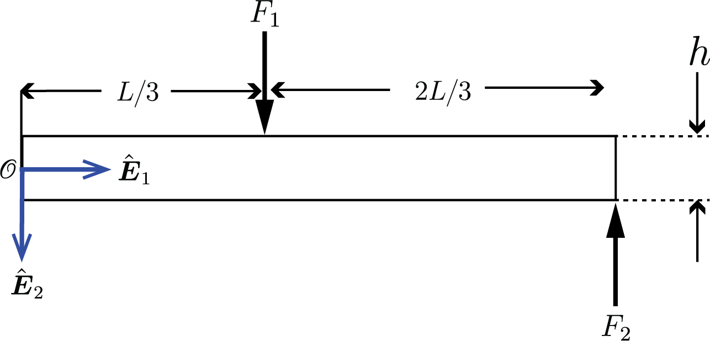
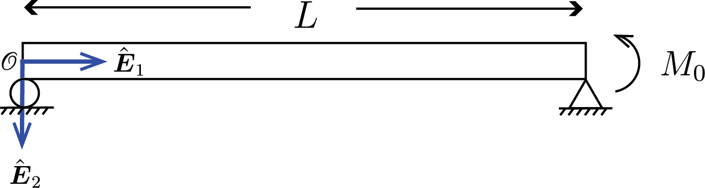




# ENGN0310: Homework 8
## Due Saturday 11:59 pm, December 4th, 2021

> Please upload your assignment to Canvas. 

**Problem 1 (30pts total)** 

Consider the configuration shown below, where $M_0=1500~\rm N \cdot \rm m$, $L=2 ~\rm m$, $h = 10~\rm{cm}$, and the dimension in the $\hat{\boldsymbol{E}}\_{\rm 3}$ direction is $b=5~\rm{cm}$. Use $E = 120~\rm{GPa}$.

  
    

     
    
 
 
 

(a)(10pts) Find the bending moment  $M(X_1)$  along the length of the beam. 

(b)(10pts) Find the maximum  bending stress, by which we are asking for 

$$
\max_{X_1\in (0,L)} \max_{X_{2}\in (-h/2, h/2)} \sigma_{11}(X_1,X_2,X_3),
$$ 

$$
\sigma_{11}(X_1,X_2,X_3)=-\frac{M(X_1)}{I(X_1)} X_2
$$

(c)(10pts) Find the displacement at the point $X_1=0.8~\rm{m}$.

***Solution (a)***

 
    

     
    
 
  

Consider an arbitrary segment of the beam as shown in gray, where the left end face of the segment has an outward normal of $-\hat{\boldsymbol{E}}_1$ and is at position $X_1$. By definition, the moment of the tractions on this left end face about its centroid $\mathcal{P}$ is $\boldsymbol{M}(X_1, -\hat{\boldsymbol{E}}_1)$.

Since the moment of all the forces acting on the segment should be zero about any point, taking the moment of all forces about $\mathcal{P}$,

$$
\boldsymbol{M}(X_1, -\hat{\boldsymbol{E}}_1)+M_0\hat{\boldsymbol{E}}_3=\boldsymbol{0}
$$

We have that $\boldsymbol{M}(X_1, -\hat{\boldsymbol{E}}_1)=-\boldsymbol{M}(X_1, \hat{\boldsymbol{E}}_1)$, so that

$$
\begin{align*}
-\boldsymbol{M}(X_1, \hat{\boldsymbol{E}}_1)+M_0\hat{\boldsymbol{E}}_3&=\boldsymbol{0}\\
\boldsymbol{M}(X_1, \hat{\boldsymbol{E}}_1)=M_0\hat{\boldsymbol{E}}_3
\end{align*}
$$

Further noting that by definition, $\boldsymbol{M}(X_1, \hat{\boldsymbol{E}}_1)\cdot \hat{\boldsymbol{E}}_3 =M(X_1)$, we get

$$
\begin{align*}
\boldsymbol{M}(X_1, \hat{\boldsymbol{E}}_1)\cdot \hat{\boldsymbol{E}}_3&=M_0\hat{\boldsymbol{E}}_3\cdot \hat{\boldsymbol{E}}_3\\
M(X_1)&=M_0
\end{align*} 
$$

This shows that the moment is constant along the beam's length and is $1500~\rm N \cdot \rm m$,.

***Solution (b)***

$$
\begin{align*}
\sigma_{11}(X_1,X_2,X_3)&=-\frac{M(X_1)}{I(X_1)} X_2\\
&=-\frac{M_0}{bh^3/12}X_2=-\frac{12M_0}{bh^3}X_2
\end{align*}
$$

The bending stress is maximum at $X_2=\pm h/2$.

$$
\begin{align*}
\sigma_{11}(X_1,X_2,X_3)&|_{X_2=-h/2}=\frac{6M_0}{bh^2}=18~\rm{MPa}\hspace{10mm} (tensile~stress)\\
\sigma_{11}(X_1,X_2,X_3)&|_{X_2=h/2}=-\frac{6M_0}{bh^2}=-18~\rm{MPa}\hspace{10mm} (compressive~stress)
\end{align*}
$$

***Solution (c)***

The governing differential equation is given by

$$
E I y''(X_1)=M(X_1)\\
E I y''(X_1)=M_0
$$

Integrating once, we get

$$
y'(X_1)=\frac{M_0}{E I}X_1 +C_1
$$

Integrating again, we get

$$
y(X_1)=\frac{M_0}{2E I}X_1^2 +C_1X_1+C_2
$$

We have two unknowns $C_1$ and $C_2$. These can be solved for by noticing that

* $y'(0)=0$ (slope is 0 at fixed end)
* $y(0)=0$ (deflection is 0 at fixed end)

Applying these boundary conditions, we get that

$$
y'(0)=C_1=0\\
y(0)=C_2=0
$$

Hence, the deflection is given by

$$
y(X_1)=\frac{M_0}{2EI}X_1^2
$$

At $X_1=0.8~\rm{m}$,

$$
y(0.8)=\frac{M_0}{2EI}(0.8^2)=9.6\times10^{-4}~\rm{m}
$$

**Problem 2 (30pts total)** 

Consider the configuration shown below, where $F_1 = 10 ~\rm N$, $F_2 = 20 ~\rm N$, $L=6 ~\rm m$, $h = 3~\rm{cm}$ and the dimension in the $\hat{\boldsymbol{E}}\_{\rm 3}$ direction is $b=4~\rm{cm}$. Use $E = 150~\rm{GPa}$.

 
    

     
    

 

(a)(10pts) Find the bending moment $M(X_1)$ along the length of the beam. 

(b)(10pts) Find the maximum  bending stress, by which we are asking for 

$$
\max_{X_1\in (0,L)} \max_{X_{2}\in (-h/2, h/2)} \sigma_{11}(X_1,X_2,X_3),
$$ 

$$
\sigma_{11}(X_1,X_2,X_3)=-\frac{M(X_1)}{I(X_1)} X_2
$$

(c)(10pts) Find the displacement at the point $X_1=4~\rm{m}$.

***Solution (a)***

$$
M(X_1)=
\begin{cases}
10X_1-100 ~(\rm{N}\cdot \rm{m}) & 0\leq X_1 \leq 2\\
20X_1-120~(\rm{N}\cdot \rm{m})  & 2\leq X_1 \leq 6\\
\end{cases}
$$

You can take either of the approaches below to arrive at this solution.

<u>(Approach 1):</u>

 
    

     
    

  

* $(\rm i)~0\leq X_1 \leq L/3$

    $$
    \boldsymbol{M}(X_1, -\hat{\boldsymbol{E}}_1)+((L/3-X_1)\hat{\boldsymbol{E}}_1\times F_1\hat{\boldsymbol{E}}_2)+((L-X_1)\hat{\boldsymbol{E}}_1 \times (-F_2\hat{\boldsymbol{E}}_2))=\boldsymbol{0}
    $$

    $$
    \boldsymbol{M}(X_1, -\hat{\boldsymbol{E}}_1)+F_1(L/3-X_1)\hat{\boldsymbol{E}}_3-F_2(L-X_1)\hat{\boldsymbol{E}}_3 =\boldsymbol{0}
    $$

    Since $M(X_1,-\hat{\boldsymbol{E}}_1)=-M(X_1,\hat{\boldsymbol{E}}_1)$

    $$
    -\boldsymbol{M}(X_1, \hat{\boldsymbol{E}}_1)+F_1(L/3-X_1)\hat{\boldsymbol{E}}_3-F_2(L-X_1)\hat{\boldsymbol{E}}_3 =\boldsymbol{0}
    $$

    $$
    \boldsymbol{M}(X_1, \hat{\boldsymbol{E}}_1)=F_1(L/3-X_1)\hat{\boldsymbol{E}}_3-F_2(L-X_1)\hat{\boldsymbol{E}}_3
    $$

    whereby definition, $\boldsymbol{M}(X_1, \hat{\boldsymbol{E}}_1)\cdot \hat{\boldsymbol{E}}_3=M(X_1)$ and it follows from taking dot product with $\hat{\boldsymbol{E}}_3$ on both sides that

    $$
    \begin{align*}
    M(X_1)&=F_1(L/3-X_1)-F_2(L-X_1)\\
    &=10X_1-100~(\rm{N}\cdot \rm{m})
    \end{align*}
    $$

* $(\rm ii)~L/3\leq X_1 \leq L$

    Similarly,

    $$
    \boldsymbol{M}(X_1, -\hat{\boldsymbol{E}}_1)+((L-X_1)\hat{\boldsymbol{E}}_1 \times (-F_2\hat{\boldsymbol{E}}_2))=\boldsymbol{0}
    $$

    $$
    \boldsymbol{M}(X_1, -\hat{\boldsymbol{E}}_1)-F_2(L-X_1)\hat{\boldsymbol{E}}_3 =\boldsymbol{0}
    $$

    $$
    -\boldsymbol{M}(X_1, \hat{\boldsymbol{E}}_1)-F_2(L-X_1)\hat{\boldsymbol{E}}_3 =\boldsymbol{0}
    $$

    $$
    \boldsymbol{M}(X_1, \hat{\boldsymbol{E}}_1)=-F_2(L-X_1)\hat{\boldsymbol{E}}_3 
    $$

    $$
    \begin{align*}
    M(X_1)&=-F_2(L-X_1)\\
    &=20X_1-120 ~(\rm{N}\cdot \rm{m})
    \end{align*}
    $$

<u>(Approach 2):</u>

You can also take segments as shown below. You will still end up with the same expression of $M(X_1)$

 
    

     
    

  

In this case, you would have to consider the reactions at the fixed end $\boldsymbol{M_0}=M_0\hat{\boldsymbol{E}}_3$  and $\boldsymbol{R_A}=-R_A\hat{\boldsymbol{E}}_2$.

Taking sum of moments about the origin,

$$
\boldsymbol{M_0}+(L/3\hat{\boldsymbol{E}}_1\times F_1\hat{\boldsymbol{E}}_2)+(L\hat{\boldsymbol{E}}_1\times(- F_2\hat{\boldsymbol{E}}_2))=\boldsymbol{0}
$$

$$
\boldsymbol{M_0}+F_1(L/3)\hat{\boldsymbol{E}}_3-F_2 L\hat{\boldsymbol{E}}_3=\boldsymbol{0}
$$

$$
M_0=-F_1(L/3)+F_2 L
$$

Also from force equilibrium,

$$
\boldsymbol{R_A}+F_1\hat{\boldsymbol{E}}_2-F_2\hat{\boldsymbol{E}}_2=\boldsymbol{0}
$$

$$
-R_A\hat{\boldsymbol{E}}_2+F_1\hat{\boldsymbol{E}}_2-F_2\hat{\boldsymbol{E}}_2=\boldsymbol{0}
$$

$$
R_A=F_1-F_2
$$
 

* $(\rm i)~0\leq X_1 \leq L/3$

    $$
    \boldsymbol{M}(X_1, \hat{\boldsymbol{E}}_1)+\boldsymbol{M_0}+((0-X_1)(\hat{\boldsymbol{E}}_1) \times \boldsymbol{R_A})=\boldsymbol{0}
    $$

    $$
    \boldsymbol{M}(X_1, \hat{\boldsymbol{E}}_1)+M_0\hat{\boldsymbol{E}}_3+(-X_1\hat{\boldsymbol{E}}_1 \times (-R_A\hat{\boldsymbol{E}}_2))=\boldsymbol{0}
    $$

    $$
    \boldsymbol{M}(X_1, \hat{\boldsymbol{E}}_1)+M_0\hat{\boldsymbol{E}}_3+R_A X_1\hat{\boldsymbol{E}}_3=\boldsymbol{0}
    $$

    It then follows that

    $$
    \begin{align*}
    M(X_1)&=-M_0-R_A X_1\\
    &=(F_1(L/3)-F_2 L)-(F_1-F_2)X_1=F_1(L/3-X_1)-F_2(L-X_1)
    \end{align*}
    $$

* $(\rm ii)~L/3\leq X_1 \leq L$

    $$
    \boldsymbol{M}(X_1, \hat{\boldsymbol{E}}_1)+\boldsymbol{M_0}+((0-X_1)\hat{\boldsymbol{E}}_1 \times \boldsymbol{R_A})+((L/3-X_1)\hat{\boldsymbol{E}}_1 \times F_1\hat{\boldsymbol{E}}_2)=\boldsymbol{0}
    $$

    $$
    \boldsymbol{M}(X_1, \hat{\boldsymbol{E}}_1)+M_0\hat{\boldsymbol{E}}_3+R_A X_1\hat{\boldsymbol{E}}_3+F_1(L/3-X_1)\hat{\boldsymbol{E}}_3=\boldsymbol{0}
    $$

    and it follows that

    $$
    M(X_1)=-M_0-R_A X_1-F_1(L/3-X_1)=-F_2(L-X_1)
    $$

<u>(Approach 3):</u>

You may also take segments as below. You will arrive at the same piecewise expression of $M(X_1)$.

 
    

     
    

  

***Solution (b)***

Bending stress is given by

$$
\sigma_{11}(X_1,X_2,X_3)=-\frac{M(X_1)}{I(X_1)} X_2=-\frac{M(X_1)}{I}X_2
$$

where $I=bh^3/12$ is constant through the length of the beam. Plotting $M(X_1)$, you would see that its magnitude is maximum at $X_1=0$ where $M(0)=-100$. Since $\sigma_{11}$ is linearly dependent on $X_2$, for fixed $X_1$, the maximum $\sigma_{11}$ would be at $X_2=\pm h/2$. Hence,

$$
\begin{align*}
\sigma_{11}(X_1,X_2,X_3)&|_{X_1=0, X_2=-h/2}=-\frac{-100}{I}\left(-\frac{h}{2}\right)=-16.7~\rm{MPa}\hspace{10mm} (compressive~stress)\\
\sigma_{11}(X_1,X_2,X_3)&|_{X_1=0, X_2=h/2}=-\frac{-100}{I}\left(\frac{h}{2}\right)=16.7~\rm{MPa}\hspace{10mm} (tensile~stress)
\end{align*} 
$$

***Solution (c)***
The governing differential equation is given by

$$
E I y''(X_1)=M(X_1)\\
$$

$$
E I y''(X_1)=
\begin{cases}
10X_1-100 ~(\rm{N}\cdot \rm{m}) & 0\leq X_1 \leq 2\\
20X_1-120~(\rm{N}\cdot \rm{m})  & 2\leq X_1 \leq 6\\
\end{cases}
$$

Integrating once, we get

$$
y'(X_1)=\frac{1}{E I}
\begin{cases}
5X_1^2-100X_1+C_1  & 0\leq X_1 \leq 2\\
10X_1^2-120X_1+C_2  & 2\leq X_1 \leq 6\\
\end{cases}
$$

Integrating again, we get

$$
y(X_1)=\frac{1}{E I}
\begin{cases}
(5/3)X_1^3-50X_1^2+C_1X_1+C_3 ~(\rm{m}) & 0\leq X_1 \leq 2\\
(10/3)X_1^3-60X_1^2+C_2X_1+C_4~(\rm{m})  & 2\leq X_1 \leq 6\\
\end{cases}
$$

We have four unknowns, $C_1-C_4$. These can be found by applying the following boundary conditions (B.C.s).

* $y'(0)=0$
* $y(0)=0 $
* $\lim_{X_1\to 2^-}y'(X_1)=\lim_{X_1\to 2^+}y'(X_1)$
* $\lim_{X_1\to 2^-}y(X_1)=\lim_{X_1\to 2^+}y(X_1)$

We then have from the first two B.C.s

$$
y'(0)=C_1=0
$$

$$
y(0)=C_3=0
$$

From the third B.C.,
$$
\begin{align*}
\lim_{X_1\to 2^-}y'(X_1)&=\lim_{X_1\to 2^+}y'(X_1)\\
\lim_{X_1\to 2^-}\frac{1}{E I}\left(5X_1^2-100X_1+C_1\right)&=\lim_{X_1\to 2^+}\frac{1}{E I}\left(10X_1^2-120X_1+C_2\right)\\
\lim_{X_1\to 2^-}5X_1^2-100X_1&=\lim_{X_1\to 2^+}10X_1^2-120X_1+C_2\\
-180&=-200+C_2\\
C_2&=20
\end{align*}
$$

Finally, with the last remaining B.C.,

$$
\begin{align*}
\lim_{X_1\to 2^-}y(X_1)&=\lim_{X_1\to 2^+}y(X_1)\\
\lim_{X_1\to 2^-}\frac{1}{E I}\left(\frac{5}{3}X_1^3-50X_1^2+C_1X_1+C_3\right)&=\lim_{X_1\to 2^+}\frac{1}{E I}\left(\frac{10}{3}X_1^3-60X_1^2+C_2X_1+C_4\right)\\
\lim_{X_1\to 2^-}\frac{5}{3}X_1^3-50X_1^2&=\lim_{X_1\to 2^+}\frac{10}{3}X_1^3-60X_1^2+20X_1+C_4\\
-\frac{560}{3}&=-\frac{520}{3}+C_4\\
C_4&=-\frac{40}{3}
\end{align*}
$$

Hence, the deflection of the beam is given by

$$
y(X_1)=\frac{1}{E I}
\begin{cases}
(5/3)X_1^3-50X_1^2 ~( \rm{m}) & 0\leq X_1 \leq 2\\
(10/3)X_1^3-60X_1^2+20X_1-40/3~(\rm{m})  & 2\leq X_1 \leq 6\\
\end{cases}
$$

At $X_1=4$,

$$
y(4)=\frac{1}{EI}\left(\frac{10}{3}(4)^3-60(4)^2+20(4)-\frac{40}{3}\right)=-0.0504~\rm{m}
$$

**Problem 3 (40pts total)**

Consider the simply-supported beam shown below, where $L=2~\rm m$ and the beam's cross section is a square with $50~\rm{mm}$ side length. If the maximum permissible displacement, $\delta$, in the beam is $5~\rm{mm}$ and the allowable bending stress is 150 MPa, find the maximum allowable $M_0$. Use $E = 200~\rm{GPa}$. You can solve this in the following steps. 

 
    

     
    

 

(a)(10pts) Find the bending moment along the length of the beam in terms of $M_0$.

(b)(10pts) Derive the expression for the maximum displacement in the beam given $M_0$.

(c)(10pts) Derive the expression for the maximum bending stress in the beam given $M_0$.

(d)(10pts) Solve for the maximum allowable $M_0$.

***Solution (a)***

 
    

     
    

 

Let the reactions be $\boldsymbol{R_A}=-R_A\hat{\boldsymbol{E}}_2$ and $\boldsymbol{R_B}=-R_B\hat{\boldsymbol{E}}_2$.

Since the moment of all the forces acting on the beam should be zero about any point, taking the moment of all forces about the origin,

$$
-M_0\hat{\boldsymbol{E}}_3+(L \hat{\boldsymbol{E}}_1 \times (-R_B \hat{\boldsymbol{E}}_2))=\boldsymbol{0}\\
-M_0\hat{\boldsymbol{E}}_3-R_B L\hat{\boldsymbol{E}}_3=\boldsymbol{0}\\
$$

It then follows that

$$
R_B=-\frac{M_0}{L}
$$

From balance of forces,

$$
\boldsymbol{R_A}+\boldsymbol{R_B}=\boldsymbol{0}\\
-R_A\hat{\boldsymbol{E}}_2-R_B\hat{\boldsymbol{E}}_2=0\\
$$

Hence,
$$
R_A=-R_B=\frac{M_0}{L}
$$

Now, consider a segment as shown below, where $\mathcal{P}$ is the centroid of its right end face. 

 
    

     
    

 

Since the moment of all the forces acting on the segment should be zero about any point, taking the moment of all forces about $\mathcal{P}$, we can write

$$
\boldsymbol{M}(X_1, \hat{\boldsymbol{E}}_1)+((0-X_1)\hat{\boldsymbol{E}}_1 \times (-R_A)\hat{\boldsymbol{E}}_2)=\boldsymbol{0}\\
\boldsymbol{M}(X_1, \hat{\boldsymbol{E}}_1)+R_A X_1\hat{\boldsymbol{E}}_3=\boldsymbol{0}
$$

Remembering that $\boldsymbol{M}(X_1, \hat{\boldsymbol{E}}_1)\cdot \hat{\boldsymbol{E}}_3=M(X_1)$, 

$$
M(X_1)=-R_AX_1=-\frac{M_0}{L}X_1
$$

***Solution (b)***

The governing differential equation is given by

$$
E I y''(X_1)=M(X_1)\\
E I y''(X_1)=-\frac{M_0}{L}X_1\\
$$

Integrating once, we get

$$
y'(X_1)=-\frac{M_0}{2E IL}X_1^2+C_1
$$

Integrating twice, we get

$$
y(X_1)=-\frac{M_0}{6E IL}X_1^3+C_1X_1+C_2
$$

Applying the following B.C.s, 

* $y(0)=0$
* $y(L)=0$

we find the values of two constants $C_1, C_2$ as

$$
y(0)=C_2=0\\
$$

and

$$
\begin{align*}
y(L)=-\frac{M_0}{6 EIL}L^3+C_1L=0 \Leftrightarrow C_1=\frac{M_0L}{6EI}
\end{align*}
$$

Hence, we get deflection as

$$
\begin{align*}
y(X_1)&=-\frac{M_0}{6E IL}X_1^3+\frac{M_0L}{6EI}X_1\\
&=-\frac{M_0}{6E I}\left(\frac{X_1^3}{L}-X_1L\right)=-\frac{M_0L^2}{6E I}\left(\frac{X_1^3}{L^3}-\frac{X_1}{L}\right)
\end{align*}
$$

The maximum deflection takes place when

$$
y'(X_1)=0 
$$

$$
-\frac{M_0L^2}{6E I}\left(\frac{3X_1^2}{L^3}-\frac{1}{L}\right)=0
$$

$$
\Rightarrow X_1=\frac{L}{\sqrt{3}}
$$

The expression for maximum deflection is then

$$
\begin{align*}
y_{max}=y\left(\frac{L}{\sqrt{3}}\right)&=-\frac{M_0L^2}{6E I}\left(\frac{1}{3\sqrt{3}}-\frac{1}{\sqrt{3}}\right)\\&=\frac{M_0}{234375\sqrt{3}}~~(=2.46\times10^{-6}M_0)~\rm {m}
\end{align*} 
$$

***Solution (c)***

Bending stress is given by

$$
\sigma_{11}(X_1,X_2,X_3)=-\frac{M(X_1)}{I(X_1)} X_2=\frac{M_0}{LI}X_1X_2
$$

where $I$ is constant through the length of the beam. It is apparent from the equation that $\sigma_{11}$ will be maximum at $X_1=L$ and $X_2=\pm h/2$.

Hence, the maximum bending stress in terms of $M_0$ are

$$
\begin{align*}
\sigma_{11}(X_1,X_2,X_3)&|_{X_1=L, X_2=-h/2}=\frac{M_0}{L I}(L)\left(-\frac{h}{2}\right)=-\frac{M_0h}{2I}=-48000~M_0~\rm{MPa}\hspace{10mm} (compressive~stress)\\\\
\sigma_{11}(X_1,X_2,X_3)&|_{X_1=L, X_2=h/2}=\frac{M_0}{L I}(L)\left(\frac{h}{2}\right)=\frac{M_0h}{2I}=48000~M_0~\rm{MPa}\hspace{10mm} (tensile~stress)\\\\
\end{align*}
$$

***Solution (d)***

Two criteria are given in the problem.

$(\rm i)$ Maximum permissible displacement of $5~\rm{mm}$

$\hspace{4mm}$ This requires

$$
y_{max}\leq 5\times 10^{-3}~\rm{m}
$$

$$
\frac{M_0}{234375\sqrt{3}}\leq 5\times 10^{-3}
$$

$$
M_0\leq 2030~\rm{N \cdot m}
$$

$(\rm ii)$ Maximum allowable bending stress of $150~\rm{MPa}$

$\hspace{4mm}$ This requires 

$$
48000~M_0 \leq 150~\rm{MPa}
$$

$$
M_0\leq 3125\rm{N \cdot m}
$$

To satisfy both criteria, maximum allowable $M_0$ must be

 $$
 M_0=2030~\rm{N \cdot m}.
 $$