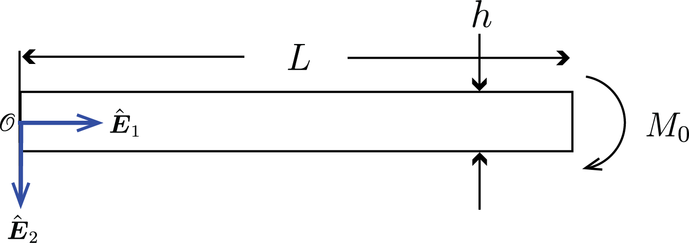




**Problem 1 (30pts total)** 

Consider the configuration shown below, where $M_0=500~\rm N \cdot \rm m$ $L=2 ~\rm m$, $h = 10~\rm{cm}$ and the dimension in the $\hat{\boldsymbol{E}}\_{\rm 3}$ direction is $b=5~\rm{cm}$. Use $E = 120~\rm{GPa}$.

  
    

     
    

 

(a)(10pts) Find the bending moment along the length of the beam. 

(b)(10pts) Find the maximum  bending stress, by which we are asking for 

$$
\max_{X_1\in (0,L)} \max_{X_{2}\in (-h/2, h/2)} \sigma_{11}(X_1,X_2,X_3),
$$ 

$$
\sigma_{11}(X_1,X_2,X_3)=-\frac{M(X_1)}{I(X_1)} X_2
$$

(c)(10pts) Find the deflection at the point $X_1=0.8~\rm{m}$.

**Problem 2 (30pts total)** 

Consider the configuration shown below, where $F_1 = 10 ~\rm N$, $F_2 = 20 ~\rm N$, $L=6 ~\rm m$, $h = 3~\rm{cm}$ and the dimension in the $\hat{\boldsymbol{E}}\_{\rm 3}$ direction is $b=4~\rm{cm}$. Use $E = 150~\rm{GPa}$.

 
    

     
    

 

(a)(10pts) Find the bending moment along the length of the beam. 

(b)(10pts) Find the maximum  bending stress, by which we are asking for 

$$
\max_{X_1\in (0,L)} \max_{X_{2}\in (-h/2, h/2)} \sigma_{11}(X_1,X_2,X_3),
$$ 

$$
\sigma_{11}(X_1,X_2,X_3)=-\frac{M(X_1)}{I(X_1)} X_2
$$

(c)(10pts) Find the deflection at the point $X_1=0.8~\rm{m}$.

**Problem 3 (40pts total)**

Consider the simply-supported beam shown below, where $L=2~\rm m$ and the beam's cross section is a square with $50~\rm{mm}$ side length. If the maximum permissible deflection in the beam is $5~\rm{mm}$ and the allowable bending stress is 150 MPa, find the maximum allowable $M_0$. Use $E = 200~\rm{GPa}$. You can solve this in the following steps. 

 
    

     
    

 

(a)(10pts) What are the boundary conditions?

(b)(10pts) Derive the expression for the maximum deflection in the beam given $M_0$.

(c)(10pts) Derive the expression for the maximum bending stress in the beam given $M_0$.

(d)(10pts) Solve for the maximum allowable $M_0$.