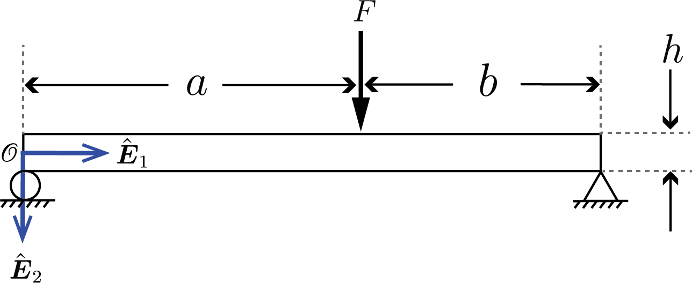
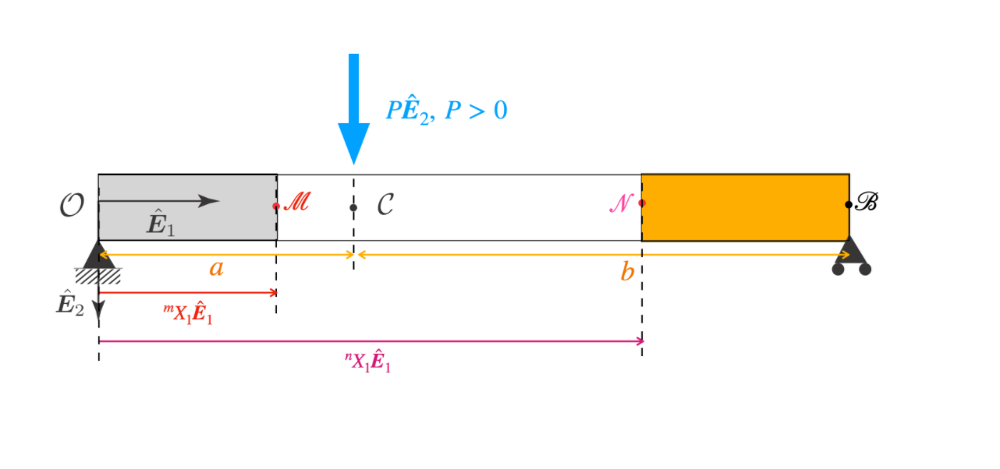
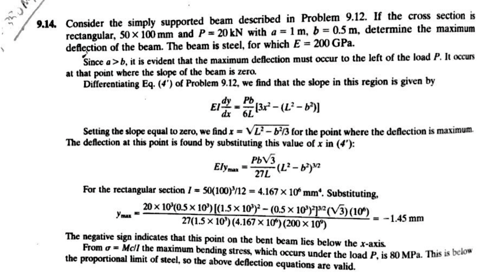
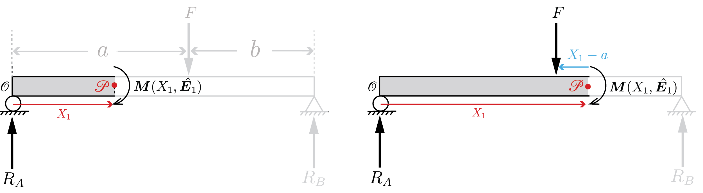
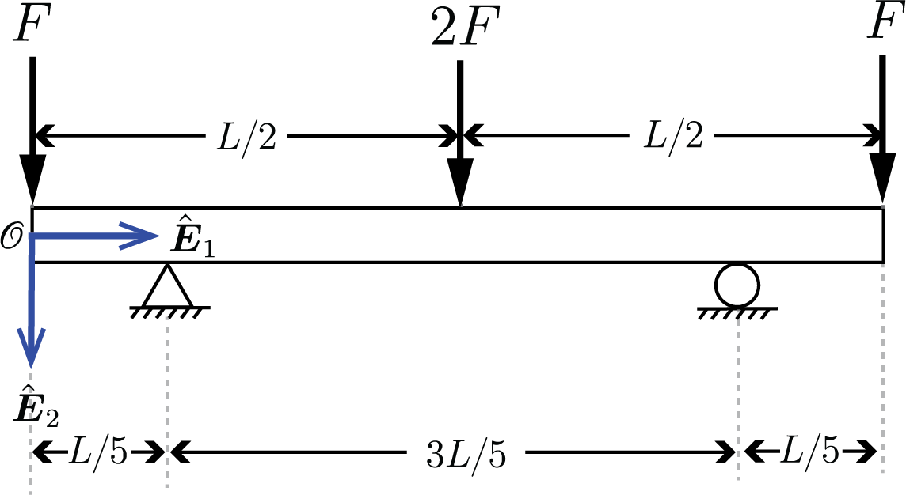
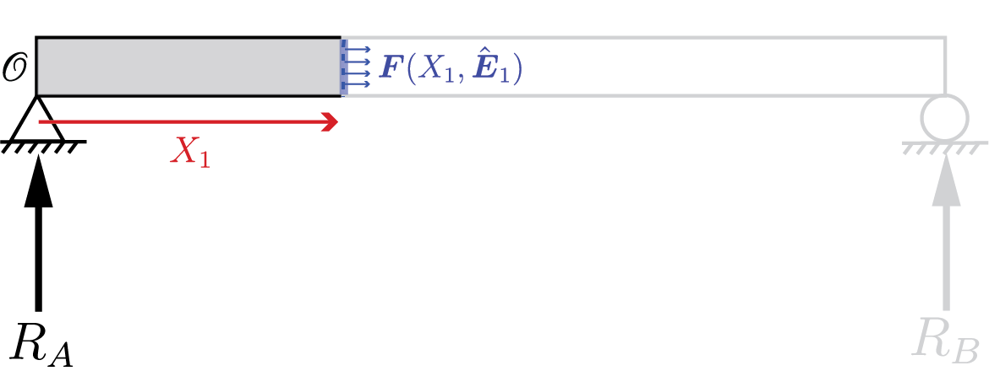
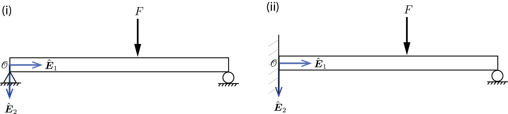
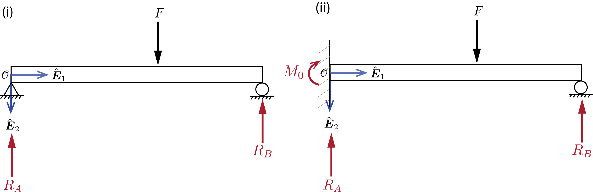

X


# ENGN0310: Homework 9 (100 pts)

### Problem 1 (30pts total)   ***[Solution MMA code](HW9-Problem1-Solution.nb)*** 

Consider the geometry shown where $a=3~\rm{m}$ and $b=2~\rm{m}$ ($L=5~\rm{m}$). If the yield stress of the material is $180~\rm{MPa}$, what is the maximum force $F$ that can be applied without exceeding the yield stress? Assume that the beam has a $1~\rm{cm}\times1~\rm{cm}$ square cross-sectional area. You can approach this problem in the following step.

 
    

     
    
 
 

(a)(5pts) Find $M(X_1)$ along the length of the beam in terms of $F$ and the reactions $R_A, R_B, M_0$ where $\boldsymbol{R_A}=-R_A\hat{\boldsymbol{E}_2}$, $\boldsymbol{R_B}=-R_B\hat{\boldsymbol{E}_2}$, and $\boldsymbol{M_0}=M_0\hat{\boldsymbol{E}_3}$.

(b)(10pts) Using 4 boundary conditions, solve the governing differential equation to find $y(X_1)$ (in terms of all or some of $E, I, F, R_A, R_B, M_0$).

(c)(5pts) There should be one more boundary condition that you have not yet utilized. Using this and the equilibrium conditions, solve for $R_A, R_B$, and $M_0$ in terms of $F$. 

(d)(10pts) Using the results above, find the maximum $F$ that can be applied without exceeding the yield stress.

***Solution (a)***

You can write this in multiple ways (they are all equivalent)

<u>(Approach 1)</u>

$$
M(X_1)=
\begin{cases}
-M_0-R_A X_1 ~(\rm{N}\cdot \rm{m}) & ~0\leq X_1 \leq 3\\
-M_0-(R_A-F)X_1-3F~(\rm{N}\cdot \rm{m})  & 3\leq X_1 \leq 5\\
\end{cases}
$$

<u>(Approach 2)</u>

$$
M(X_1)=
\begin{cases}
(R_B-F)X_1+3F-5R_B ~(\rm{N}\cdot \rm{m}) & ~0\leq X_1 \leq 3\\
-R_B(5-X_1)~(\rm{N}\cdot \rm{m})  & 3\leq X_1 \leq 5\\
\end{cases}
$$
 
<u>(Approach 3)</u>

$$
M(X_1)=
\begin{cases}
-M_0-R_A X_1 ~(\rm{N}\cdot \rm{m}) & ~0\leq X_1 \leq 3\\
-R_B(5-X_1)~(\rm{N}\cdot \rm{m})  & 3\leq X_1 \leq 5\\
\end{cases}
$$

<u>(Approach 1-demonstration)</u>

 
    

     
    
 
 

Consider segments as shown above. Since the moment of all the forces acting on the segment should be zero about any point, taking the moment of all forces about $\mathcal{P}$,

* $(\rm i)~0\leq X_1 \leq a~~~(0\leq X_1 \leq 3)$

    $$
    \boldsymbol{M}(X_1, \hat{\boldsymbol{E}}_1)+M_0\hat{\boldsymbol{E}}_3+((0-X_1)\hat{\boldsymbol{E}}_1 \times (-R_A \hat{\boldsymbol{E}}_2))=\boldsymbol{0}
    $$

    $$
    \boldsymbol{M}(X_1, \hat{\boldsymbol{E}}_1)+M_0\hat{\boldsymbol{E}}_3+R_A X_1\hat{\boldsymbol{E}}_3=\boldsymbol{0}
    $$

    Remembering that  $\boldsymbol{M}(X_1, \hat{\boldsymbol{E}}_1)\cdot \hat{\boldsymbol{E}}_3=M(X_1)$, we get
    
    $$
    M(X_1)=-M_0-R_A X_1
    $$

* $(\rm ii)~a\leq X_1 \leq a+b~~~(3\leq X_1 \leq 5)$

    $$
    \boldsymbol{M}(X_1, \hat{\boldsymbol{E}}_1)+M_0\hat{\boldsymbol{E}}_3+((0-X_1)\hat{\boldsymbol{E}}_1 \times (-R_A \hat{\boldsymbol{E}}_2))+((a-X_1)\hat{\boldsymbol{E}}_1 \times F\hat{\boldsymbol{E}}_2)=\boldsymbol{0}
    $$

    $$
    \boldsymbol{M}(X_1, \hat{\boldsymbol{E}}_1)+M_0\hat{\boldsymbol{E}}_3+R_A X_1\hat{\boldsymbol{E}}_3+F(a-X_1)\hat{\boldsymbol{E}}_3=\boldsymbol{0}
    $$

    It follows then that

    $$
    \begin{align*}
    M(X_1)&=-M_0-R_A X_1-F(a-X_1)\\
    &=-M_0-(R_A-F)X_1-3F
    \end{align*}
    $$

<u>(Approach 2-demonstration)</u>

 
    

     
    
 
 

Consider segments as shown above. Since the moment of all the forces acting on the segment should be zero about any point, taking the moment of all forces about $\mathcal{P}$,

* $(\rm i)~0\leq X_1 \leq a~~~(0\leq X_1 \leq 3)$

    $$
    \boldsymbol{M}(X_1, -\hat{\boldsymbol{E}}_1)+((a-X_1)\hat{\boldsymbol{E}}_1 \times F_1 \hat{\boldsymbol{E}}_2)+((a+b-X_1)\hat{\boldsymbol{E}}_1 \times(-R_B \hat{\boldsymbol{E}}_2))=\boldsymbol{0}
    $$

    $$
    \boldsymbol{M}(X_1, -\hat{\boldsymbol{E}}_1)+F_1(a-X_1)\hat{\boldsymbol{E}}_3-R_B(a+b-X_1)\hat{\boldsymbol{E}}_3=\boldsymbol{0}
    $$

    Recalling that $\boldsymbol{M}(X_1, \hat{\boldsymbol{E}}_1)=-\boldsymbol{M}(X_1, -\hat{\boldsymbol{E}}_1)$
    
    $$
    -\boldsymbol{M}(X_1, \hat{\boldsymbol{E}}_1)+F_1(a-X_1)\hat{\boldsymbol{E}}_3-R_B(a+b-X_1)\hat{\boldsymbol{E}}_3=\boldsymbol{0}
    $$

    Since by definition, $\boldsymbol{M}(X_1, \hat{\boldsymbol{E}}_1)\cdot \hat{\boldsymbol{E}}_3=M(X_1)$, we get

    $$
    \begin{align*}
    M(X_1)&=F_1(a-X_1)-R_B(a+b-X_1)\\
    &=F(3-X_1)-R_B(5-X_1)\\
    &=(R_B-F)X_1+3F-5R_B
    \end{align*}
    $$

* $(\rm ii)~a\leq X_1 \leq a+b~~~(3\leq X_1 \leq 5)$

    $$
    \boldsymbol{M}(X_1, -\hat{\boldsymbol{E}}_1)+((a+b-X_1)\hat{\boldsymbol{E}}_1 \times (-R_B \hat{\boldsymbol{E}}_2))=\boldsymbol{0}
    $$

    $$
    \boldsymbol{M}(X_1, -\hat{\boldsymbol{E}}_1)-R_B(a+b-X_1)\hat{\boldsymbol{E}}_3=\boldsymbol{0}
    $$

    $$
    -\boldsymbol{M}(X_1, \hat{\boldsymbol{E}}_1)-R_B(a+b-X_1)\hat{\boldsymbol{E}}_3=\boldsymbol{0}
    $$

    It follows then that

    $$
    \begin{align*}
    M(X_1)&=-R_B(a+b-X_1)\\
    &=-R_B(5-X_1)
    \end{align*}
    $$

<u>(Approach 3-demonstration)</u>

 
    

     
    
 
 

Consider segments as shown above. Since the moment of all the forces acting on the segment should be zero about any point, taking the moment of all forces about $\mathcal{P}$,

* $(\rm i)~0\leq X_1 \leq a~~~(0\leq X_1 \leq 3)$

    $$
    \boldsymbol{M}(X_1, \hat{\boldsymbol{E}}_1)+M_0\hat{\boldsymbol{E}}_3+((0-X_1)\hat{\boldsymbol{E}}_1 \times (-R_A \hat{\boldsymbol{E}}_2))=\boldsymbol{0}
    $$

    $$
    \boldsymbol{M}(X_1, \hat{\boldsymbol{E}}_1)+M_0\hat{\boldsymbol{E}}_3+R_A X_1\hat{\boldsymbol{E}}_3=\boldsymbol{0}
    $$

    Remembering that  $\boldsymbol{M}(X_1, \hat{\boldsymbol{E}}_1)\cdot \hat{\boldsymbol{E}}_3=M(X_1)$, we get

    $$
    M(X_1)=-M_0-R_A X_1
    $$

* $(\rm ii)~a\leq X_1 \leq a+b~~~(3\leq X_1 \leq 5)$

    $$
    \boldsymbol{M}(X_1, -\hat{\boldsymbol{E}}_1)+((a+b-X_1)\hat{\boldsymbol{E}}_1 \times (-R_B \hat{\boldsymbol{E}}_2))=\boldsymbol{0}
    $$

    $$
    \boldsymbol{M}(X_1, -\hat{\boldsymbol{E}}_1)-R_B(a+b-X_1)\hat{\boldsymbol{E}}_3=\boldsymbol{0}
    $$

    $$
    -\boldsymbol{M}(X_1, \hat{\boldsymbol{E}}_1)-R_B(a+b-X_1)\hat{\boldsymbol{E}}_3=\boldsymbol{0}
    $$

    It follows then that

    $$
    \begin{align*}
    M(X_1)&=-R_B(a+b-X_1)\\
    &=-R_B(5-X_1)
    \end{align*}
    $$

***Solution (b)***

The solution below is written based on (Approach 1). Read the note at the end of this section if you took a different approach.
The governing differential equation is given by

$$
E I y''(X_1)=M(X_1)\\
$$

$$
\begin{align*}
E I y''(X_1)&=
\begin{cases}
-M_0-R_AX_1 ~(\rm{N}\cdot \rm{m}) & 0\leq X_1 \leq 3\\
-M_0-(R_A-F)X_1-3F~(\rm{N}\cdot \rm{m})  & 3\leq X_1 \leq 5\\
\end{cases}\\
&=
\begin{cases}
-R_AX_1-M_0 ~(\rm{N}\cdot \rm{m}) & 0\leq X_1 \leq 3\\
-(R_A-F)X_1-(M_0+3F)~(\rm{N}\cdot \rm{m})  & 3\leq X_1 \leq 5\\
\end{cases}
\end{align*}
$$

Integrating once, we get

$$
y'(X_1)=\frac{1}{E I}
\begin{cases}
-\dfrac{R_A}{2}X_1^2-M_0X_1+C_1 ~(\rm{N}\cdot \rm{m}) & 0\leq X_1 \leq 3\\\\
-\dfrac{R_A-F}{2}X_1^2-(M_0+3F)X_1+C_2~(\rm{N}\cdot \rm{m})  & 3\leq X_1 \leq 5\\
\end{cases}
$$

Integrating again, we get

$$
y(X_1)=\frac{1}{E I}
\begin{cases}
-\dfrac{R_A}{6}X_1^3-\dfrac{M_0}{2}X_1^2+C_1X_1+C_3 ~(\rm{N}\cdot \rm{m}) & 0\leq X_1 \leq 3\\\\
-\dfrac{R_A-F}{6}X_1^3-\dfrac{M_0+3F}{2}X_1^2+C_2X_1+C_4~(\rm{N}\cdot \rm{m})  & 3\leq X_1 \leq 5\\
\end{cases}
$$

We have four unknowns, $C_1-C_4$. These can be found by applying four of the following boundary conditions (B.C.s).

* $(\rm i)$ $\hspace{2.7mm}$ $y'(0)=0$ 
* $(\rm ii)$ $\hspace{2mm}$ $y(0)=0 $
* $(\rm iii)$ $\hspace{1mm}$ $y(a+b)=y(5)=0$
* $(\rm iv)$ $\hspace{1mm}$ $\lim_{X_1\to 3^-}y'(X_1)=\lim_{X_1\to 3^+}y'(X_1)$
* $(\rm v)$ $\hspace{1.7mm}$ $\lim_{X_1\to 3^-}y(X_1)=\lim_{X_1\to 3^+}y(X_1)$

Let us arbitrarily choose B.C.s $(\rm{i}),(\rm{ii}),(\rm{iv})\&(\rm{v})$ to solve for $C_1-C_4$.

Applying $(\rm{i})$, 

$$
y'(X_1)=C_1=0
$$

Applying $(\rm{ii})$,

$$
y(X_1)=C_3=0
$$

Applying $(\rm{iv})$,

$$
\begin{align*}
\lim_{X_1\to 3^-}y'(X_1)&=\lim_{X_1\to 3^+}y'(X_1)\\
\lim_{X_1\to 3^-}\frac{1}{E I}\left(-\frac{R_A}{2}X_1^2-M_0X_1+C_1 \right)&=\lim_{X_1\to 3^+}\frac{1}{E I}\left(-\frac{R_A-F}{2}X_1^2-(M_0+3F)X_1+C_2\right)\\
\lim_{X_1\to 3^-}-\frac{R_A}{2}X_1^2-M_0X_1&=\lim_{X_1\to 3^+}-\frac{R_A-F}{2}X_1^2-(M_0+3F)X_1+C_2\\
-\frac{9}{2}R_A-3M_0&=-\frac{9}{2}(R_A-F)-3(M_0+3F)+C_2\\
C_2=-\frac{9}{2}F+9F&=\frac{9}{2}F
\end{align*}
$$

Applying $(\rm{v})$,

$$
\begin{align*}
\lim_{X_1\to 3^-}y(X_1)&=\lim_{X_1\to 3^+}y(X_1)\\
\lim_{X_1\to 3^-}\frac{1}{E I}\left(-\frac{R_A}{6}X_1^3-\frac{M_0}{2}X_1^2+C_1X_1+C_3 \right)&=\lim_{X_1\to 3^+}\frac{1}{E I}\left(-\frac{R_A-F}{6}X_1^3-\frac{M_0+3F}{2}X_1^2+C_2X_1+C_4\right)\\
\lim_{X_1\to 3^-}-\frac{R_A}{6}X_1^3-\frac{M_0}{2}X_1^2&=\lim_{X_1\to 3^+}-\frac{R_A-F}{6}X_1^3-\frac{M_0+3F}{2}X_1^2+\frac{9F}{2}X_1+C_4\\
-\frac{9}{2}R_A-\frac{9}{2}M_0&=-\frac{9}{2}(R_A-F)-\frac{9}{2}(M_0+3F)+\frac{27}{2}F+C_4\\
\end{align*}
$$

and we get

$$
C_4=\frac{9}{2}(-R_A-M_0+R_A-F+M_0+3F-3F)=-\frac{9}{2}F
$$

Deflection $y(X_1)$ is then given as

$$
y(X_1)=\frac{1}{E I}
\begin{cases}
-\dfrac{R_A}{6}X_1^3-\dfrac{M_0}{2}X_1^2 ~(\rm{N}\cdot \rm{m}) & 0\leq X_1 \leq 3\\\\
-\dfrac{R_A-F}{6}X_1^3-\dfrac{M_0+3F}{2}X_1^2+\dfrac{9}{2}FX_1-\dfrac{9}{2}F~(\rm{N}\cdot \rm{m})  & 3\leq X_1 \leq 5\\
\end{cases}
$$ 

 

> NOTE 1: Depending on which approach you took in (a) and which four of the five B.C.s above you decided to use, the solution for $y(X_1)$ might appear different. You will find that they are all equivalent, once you plug in the solution in part (c).

> NOTE 2: The coefficients of the equations you'll end up with if you took different Approach and/or combinations of B.C.s are shown in the table at the end of this solution.

***Solution (c)***

Since the moment of all the forces acting on the beam should be zero about any point, taking the moment of all forces about the origin $\mathcal{O}$,

$$
M_0\hat{\boldsymbol{E}}_3+(a\hat{\boldsymbol{E}}_1\times F\hat{\boldsymbol{E}}_2)+((a+b)\hat{\boldsymbol{E}}_1 \times(-R_B)\hat{\boldsymbol{E}}_2)=\boldsymbol{0}
$$

$$
M_0\hat{\boldsymbol{E}}_3+aF\hat{\boldsymbol{E}}_3-R_B(a+b)\hat{\boldsymbol{E}}_3=\boldsymbol{0}
$$

$$
M_0+aF-R_B(a+b)=0
$$

$$
M_0+3F-5R_B=0 \tag{$\star$}
$$

From balance of forces,

$$
-R_A\hat{\boldsymbol{E}}_2+F\hat{\boldsymbol{E}}_2-R_B\hat{\boldsymbol{E}}_2=\boldsymbol{0}
$$

$$
-R_A+F-R_B=0 \tag{$\star \star$}
$$

We also have the unused B.C $(\rm{iii})$,

$$
y(5)=0
$$

$$
y(5)=-\frac{R_A-F}{6}(5)^3-\frac{M_0+3F}{2}(5)^2+\frac{9F}{2}(5)-\frac{9F}{2}=0 \tag{$\star \star \star$}
$$

Using the three equations ($\star$),  ($\star \star$), and ($\star \star \star$) to solve for $M_0, R_A$, and $R_B$ in terms of $F$, we get

$$
\begin{align*}
R_A=\frac{71}{125}F, ~R_B=\frac{54}{125}F, ~M_0=-\frac{21}{25}F
\end{align*}
$$

> NOTE 3: The solution to this part is the same regardless of how you approached parts (a) and (b).

***Solution (d)***

Bending stress is given by

$$
\sigma_{11}(X_1,X_2,X_3)=-\frac{M(X_1)}{I(X_1)} X_2=-\frac{M(X_1)}{I}X_2
$$

where $I$ is constant through the length of the beam. It is apparent from the equation that $\sigma_{11}$ will be maximum at $X_2=\pm h/2$ for fixed $X_1$.

We now want to know at which $X_1$ $M(X_1)$ takes the maximum value. In terms of F, we have that

$$
M(X_1)=\frac{F}{125}
\begin{cases}
-71X_1+105 ~(\rm{N}\cdot \rm{m}) & ~0\leq X_1 \leq 3\\
54X-270~(\rm{N}\cdot \rm{m})  & 3\leq X_1 \leq 5\\
\end{cases}
$$

Plotting $M(X_1)/F$, we see that it takes maximum value at $X_1=3$ as

$$
M(3)=-\frac{108}{125}F~(\rm{N \cdot m})
$$

Hence, the maximum bending stress is

$$
\sigma_{11}(X_1,X_2,X_3)|_{X_1=3, X_2=h/2}=-\frac{(-108F)}{125I} \left(\frac{h}{2}\right)=5.18F~\rm{MPa}\hspace{10mm} (tensile~stress)\\
$$

$$
\sigma_{11}(X_1,X_2,X_3)|_{X_1=3, X_2=-h/2}=-\frac{(-108F)}{125I} \left(-\frac{h}{2}\right)=-5.18 F~\rm{MPa} \hspace{10mm} (compressive~stress)\\
$$

In order to not exceed the yield stress of $180~\rm{MPa}$, it requires 

$$
5.18 F \leq 180 
$$

$$
F \leq 34.7~(\rm{N})
$$

### Problem 2 (30pts total) ***[Solution MMA code](HW9-Prob2-Solution.nb)***  

Consider the simply supported beam shown below. If $F=20~\rm{kN}$ and the maximum allowable deflection of the beam is $2~\rm{mm}$, find the maximum $b$. Take $a=1~\rm{m}$, $E=200~\rm{GPa}$, and assume that the beam has a rectangular cross-sectional area where $h=100~\rm{mm}$ and its dimension in the $\hat{\boldsymbol{E}_3}$ direction is $50~\rm{mm}$.

 
    

      
    

 
<!-- 

 -->

(a)(10pts) Find the expression for deflection $y(X_1)$ in terms of $F, E, I, a, b$

(b)(10pts) Find the position $X_1$ at which the deflection is maximum (leave it in terms of $a, b$). 
>Hint: Consider two scenarios, (i) $a \leq b$ and (ii) $a \geq b$

(c)(10pts) Solve for the maximum allowable $b$ so that the deflection does not exceed $2~\rm{mm}$.

***Solution (a)***

 
    

      
    

  

Consider the two reaction forces, denoted as $\boldsymbol{R_A}=-R_A\hat{\boldsymbol{E}}_2$ and $\boldsymbol{R_B}=-R_B\hat{\boldsymbol{E}}_2$. 

Since the moment of all the forces acting on the beam should be zero about any point, taking the moment of all forces about the origin $\mathcal{O}$, we have that

$$
(a\hat{\boldsymbol{E}}_1 \times F\hat{\boldsymbol{E}}_2)+((a+b)\hat{\boldsymbol{E}}_1 \times (-R_B\hat{\boldsymbol{E}}_2))=\boldsymbol{0}
$$
$$
aF\hat{\boldsymbol{E}}_3-R_B(a+b)\hat{\boldsymbol{E}}_3=\boldsymbol{0}
$$

$$
aF-(a+b)R_B=0 \tag{$\ast$} 
$$

From force balance,

$$
-R_A\hat{\boldsymbol{E}}_2+F\hat{\boldsymbol{E}}_2-R_B\hat{\boldsymbol{E}}_2=\boldsymbol{0}
$$

$$
-R_A+F-R_B=0\tag{$\ast \ast$} 
$$

From ($\ast$) and ($\ast \ast$), 

$$
R_A=\frac{bF}{a+b}, \hspace{4mm} R_B=\frac{aF}{a+b}
$$

We now study the moment $M(X_1)$ along the length.

* $(\rm i)~0\leq X_1 \leq a~~~(0\leq X_1 \leq 1)$

    $$
    \boldsymbol{M}(X_1, \hat{\boldsymbol{E}}_1)+((0-X_1)\hat{\boldsymbol{E}}_1\times(-R_A\hat{\boldsymbol{E}}_2))=\boldsymbol{0}
    $$

    $$
    \boldsymbol{M}(X_1, \hat{\boldsymbol{E}}_1)+R_AX_1\hat{\boldsymbol{E}}_3=\boldsymbol{0}
    $$

    $$
    M(X_1)=-R_AX_1=-\frac{bF}{a+b}X_1
    $$

* $(\rm ii)~a\leq X_1 \leq a+b~~~(1\leq X_1 \leq 1+b)$

    $$
    \boldsymbol{M}(X_1, \hat{\boldsymbol{E}}_1)+((0-X_1)\hat{\boldsymbol{E}}_1\times(-R_A\hat{\boldsymbol{E}}_2))+((a-X_1)\hat{\boldsymbol{E}}_1 \times F_2\hat{\boldsymbol{E}}_2)=\boldsymbol{0}
    $$

    $$
    \boldsymbol{M}(X_1, \hat{\boldsymbol{E}}_1)+R_AX_1\hat{\boldsymbol{E}}_3+F_2(a-X_1)\hat{\boldsymbol{E}}_3=\boldsymbol{0}
    $$

    $$
    M(X_1)=-R_AX_1-F(a-X_1)=-\frac{bF}{a+b}X_1-F(a-X_1)=\frac{aF}{a+b}X_1-aF
    $$

Hence, 

$$
M(X_1)=
\begin{cases}
-\dfrac{bF}{a+b}X_1 & 0\leq X_1\leq a\\\\
\dfrac{aF}{a+b}X_1-aF & a\leq X_1 \leq a+b 
\end{cases}
$$

The governing differential equation is

$$
\begin{align*}
EIy''(X_1)=M(X_1)=\begin{cases}
-\dfrac{bF}{a+b}X_1 & 0\leq X_1\leq a\\\\
\dfrac{aF}{a+b}X_1-aF & a\leq X_1 \leq a+b 
\end{cases}
\end{align*}
$$

Integrating twice,

$$
\begin{align*}
y(X_1)=\frac{1}{EI}\begin{cases}
-\dfrac{bF}{6(a+b)}X_1^3+C_1X_1+C_3 & 0\leq X_1\leq a\\\\
\dfrac{aF}{6(a+b)}X_1^3-\dfrac{aF}{2}X_1^2+C_2X_1+C_4 & a\leq X_1 \leq a+b 
\end{cases}
\end{align*}
$$

We have the following B.C.s

* $(\rm i)$ $\hspace{2.7mm}$ $y(0)=0$ 
* $(\rm ii)$ $\hspace{2mm}$ $y(a+b)=0 $
* $(\rm iii)$ $\hspace{1mm}$ $\lim_{X_1\to a^-}y'(X_1)=\lim_{X_1\to a^+}y'(X_1)$
* $(\rm iv)$ $\hspace{1mm}$ $\lim_{X_1\to a^-}y(X_1)=\lim_{X_1\to a^+}y(X_1)$

Applying $(\rm i)-(\rm iv)$, (you can use the MMA code, but if you want to do it by hand, it's straight from  [this lecture note](https://appliedmechanicslab.github.io/ENGN0310/CourseNotes/Beams/SSBPointLoad.html)),

$$
C_1=\frac{ab(a+2b)}{6(a+b)}F,~~
C_2=\frac{a(2(a+b)^2+a^2)}{6(a+b)}F,~~
C_3=0,~~
C_4=-\frac{a^3F}{6}
$$

Therefore,

$$
\begin{align*}
y(X_1)=\frac{F}{EI}\begin{cases}
-\dfrac{b}{6(a+b)}X_1^3+\dfrac{ab(a+2b)}{6(a+b)}X_1 & 0\leq X_1\leq a\\\\
\dfrac{a}{6(a+b)}X_1^3-\dfrac{a}{2}X_1^2+\dfrac{a(2(a+b)^2+a^2)}{6(a+b)}X_1-\dfrac{a^3}{6} & a\leq X_1 \leq a+b 
\end{cases}
\end{align*}
$$

<!-- Applying $(\rm i)$,

$$
y(0)=C_3=0
$$

Applying $(\rm ii)$,
$$
y(a+b)=\frac{aF}{6}(a+b)^2-\frac{aF}{2}(a+b)^2+C_2(a+b)+C_4=0
$$

Applying $(\rm iii)$,
$$
\lim_{X_1\to a^-}y'(X_1)=\lim_{X_1\to a^+}y'(X_1)
$$
$$
\lim_{X_1\to a^-}-\frac{bF}{2(a+b)}X_1^2+C_1=\lim_{X_1\to a^+}\frac{aF}{2(a+b)}X_1^2-aFX_1+C_2
$$
$$
-\frac{a^2bF}{2(a+b)}+C_1=\frac{a^3F}{2(a+b)}-a^2F+C_2
$$

Applying $(\rm iv)$,
$$
\lim_{X_1\to a^-}y(X_1)=\lim_{X_1\to a^+}y(X_1)
$$
$$
\lim_{X_1\to a^-}-\dfrac{bF}{6(a+b)}X_1^3+C_1X+C_3=\lim_{X_1\to a^+}\dfrac{aF}{6(a+b)}X_1^3-\dfrac{aF}{2}X_1^2+C_2X+C_4
$$
$$
-\dfrac{a^3bF}{6(a+b)}+aC_1=\dfrac{a^4F}{6(a+b)}-\dfrac{a^3F}{2}+aC_2+C_4
$$ -->

***Solution (b)***

Let 

$$
\begin{align*}
 Y_1(X_1)&=\frac{y(X_1)}{F/EI}=-\dfrac{b}{6(a+b)}X_1^3+\dfrac{ab(a+2b)}{6(a+b)}X_1 ~~~~~~ 0\leq X_1\leq a \\
 Y_2(X_1)&=\frac{y(X_1)}{F/EI}=\dfrac{a}{6(a+b)}X_1^3-\dfrac{a}{2}X_1^2+\dfrac{a(2(a+b)^2+a^2)}{6(a+b)}X_1-\dfrac{a^3}{6} ~~~~~~ a\leq X_1\leq a+b
\end{align*}
$$

* Case $(\rm i)$: Maximum deflection is at $0\leq X_1 \leq a$

    In this case, we expect to find $X_1 \in [0,a]$ such that

    $$
    Y_1'[X_1]=0
    $$

    Then,

    $$
    Y_1'[X_1]=-\dfrac{b}{2(a+b)}X_1^2+\dfrac{ab(a+2b)}{6(a+b)}=0
    $$

    Taking the positive solution,

    $$
    X_1=\sqrt{\frac{a(a+2b)}{3}}
    $$

    For this solution to exist in $X_1 \in [0,a]$, it should be further imposed that

    $$
    \sqrt{\frac{a(a+2b)}{3}}\leq a
    \Leftrightarrow b \leq a
    $$

* Case $(\rm ii)$: Maximum deflection is at $a\leq X_1 \leq a+b$

    Similarly, we expect to find $X_1 \in [a,a+b]$ such that

    $$
    Y_2'[X_1]=0
    $$

    Then,

    $$
    Y_2'[X_1]=\dfrac{a}{2(a+b)}X_1^2-aX_1+\dfrac{a(2(a+b)^2+a^2)}{6(a+b)}=0
    $$

    $$
    X_1=a+b\pm\sqrt{\frac{b(2a+b)}{3}}
    $$

    With closer observation, we notice that

    $$
    X_1=a+b+\sqrt{\frac{b(2a+b)}{3}}
    $$

    lies outside the beam, and cannot be taken as a solution to this problem. Hence, we proceed with

    $$
    X_1=a+b-\sqrt{\frac{b(2a+b)}{3}}
    $$

    For this solution to exist in $X_1 \in [a,a+b]$, we need

    $$
    a\leq a+b-\sqrt{\frac{b(2a+b)}{3}} \Leftrightarrow a \leq b
    $$

In summary, the maximum deflection takes place at

$$
\begin{cases}
X_1=\sqrt{\dfrac{a(a+2b)}{3}}& (b \leq a \Leftrightarrow 0\leq X_1 \leq a)\\
X_1=a+b-\sqrt{\dfrac{b(2a+b)}{3}}& (a \leq b \Leftrightarrow a\leq X_1 \leq a+b) 
\end{cases}
$$

***Solution (c)***

* Case $(\rm i)$: $b \leq a~~(0\leq X_1\leq a)$

    Maximum deflection is given by

    $$
    \begin{align*}
    y_{max}=y\left(\sqrt{\dfrac{a(a+2b)}{3}}\right) &=\frac{F}{EI}\left(-\dfrac{b}{6(a+b)}X_1^3+\dfrac{ab(a+2b)}{6(a+b)}X_1\right)\Bigg|_{X_1=\sqrt{\frac{a(a+2b)}{3}}}\\
    &=\frac{F}{EI}\frac{b(a(a+2b))^{3/2}}{9\sqrt{3}(a+b)}=\frac{b(1+2b)^{3/2}}{375\sqrt{3}(1+b)} 
    \end{align*}
    $$

    Solving for $b$ such that it doesn't exceed $2~\rm{mm}$,

    $$
    \frac{b(1+2b)^{3/2}}{375\sqrt{3}(1+b)}\leq 2\times 10^{-3}~\rm{m}
    $$

    $$
    b \leq 0.625~\rm{m}
    $$

    Hence, the maximum allowable $b$ would be $b=0.625~\rm{m}$, which does not contradict the assumption $b \leq a$.

* Case $(\rm ii)$: $a\leq b~~(a\leq X_1\leq a+b)$

    Maximum deflection is given by

    $$
    \begin{align*}
    y_{max}=y\left(a+b-\sqrt{\dfrac{b(2a+b)}{3}}\right) &=\frac{F}{EI}\left(\dfrac{a}{6(a+b)}X_1^3-\dfrac{a}{2}X_1^2+\dfrac{a(2(a+b)^2+a^2)}{6(a+b)}X_1-\dfrac{a^3}{6}\right)\Bigg|_{X_1=a+b-\sqrt{\frac{b(2a+b)}{3}}}\\&=\frac{F}{EI}\frac{a(b(2a+b))^{3/2}}{9\sqrt{3}(a+b)}=\frac{b(2+b)^{3/2}}{375\sqrt{3}(1+b)} 
    \end{align*} 
    $$

    <!-- =\frac{F}{EI}\left(\dfrac{a}{6(a+b)}\left(a+b-\sqrt{\dfrac{b(2a+b)}{3}}\right)^3-\dfrac{a}{2}\left(a+b-\sqrt{\dfrac{b(2a+b)}{3}}\right)^2+\dfrac{a(2(a+b)^2+a^2)}{6(a+b)}\left(a+b-\sqrt{\dfrac{b(2a+b)}{3}}-\frac{a^3}{6}\right)\right)\\
    & -->

    Solving for $b$ such that it doesn't exceed $2~\rm{mm}$,

    $$
    \frac{b(2+b)^{3/2}}{375\sqrt{3}(1+b)}\leq 2\times 10^{-3}~\rm{m}
    $$

    $$
    b \leq 0.627~\rm{m}
    $$

    Hence, the maximum allowable $b$ would be $b=0.627~\rm{m}$. However, this contradicts the assumption $a \leq b$ and is not valid.

In summary, the maximum allowable $b$ is $0.625~\rm{m}$, and the maximum deflection takes place in the range $0\leq X_1 \leq a$.

### Problem 3 (20pts total)

(a) (10pts) Prepare the shear force diagram and bending moment diagram for the configuration below, where $a=3~\rm{m}$, $b=2~\rm{m}$, and $\boldsymbol{M_0}=1500~\rm{N\cdot m} \hat{\boldsymbol{E}_3}$. 
 
 
    

     
    

 

(b)  (10pts) Prepare the shear force diagram and bending moment diagram for the configuration below, where $L=5~\rm{m}$ and $F=12~\rm{kN}$.

 
    

     
    

 

***Solution(a)***

 
    

     
    

 

Notice that the two reactions, shown as $\boldsymbol{R_A}=-R_A\hat{\boldsymbol{E}}_2$ and $\boldsymbol{R_B}=-R_B\hat{\boldsymbol{E}}_2$ can be determined.

From force balance,

$$
-R_A\hat{\boldsymbol{E}}_2-R_B\hat{\boldsymbol{E}}_2 =\boldsymbol{0}
$$

$$
-R_A-R_B=0
$$

By taking the moment of all forces about the origin,

$$
M_0\hat{\boldsymbol{E}}_3+((a+b)\hat{\boldsymbol{E}}_1 \times (-R_B\hat{\boldsymbol{E}}_2))=\boldsymbol{0}
$$

$$
M_0\hat{\boldsymbol{E}}_3-R_B(a+b)\hat{\boldsymbol{E}}_3=\boldsymbol{0}
$$

$$
M_0-R_B(a+b)=0
$$

so that we have

$$
R_A=-\frac{M_0}{a+b}, ~~R_B=\frac{M_0}{a+b}
$$

<u>Shear force diagram </u>

Now consider the segment shown below in gray. The force acting on the right face of the gray segment (applied by the rest of the beam to its right) is denoted as $\boldsymbol{F}(X_1, \hat{\boldsymbol{E}}_1)$. 

 
    

     
    

 

From force balance on the gray segment, we have

$$
\boldsymbol{F}(X_1, \hat{\boldsymbol{E}}_1)-R_A \hat{\boldsymbol{E}}_2=\boldsymbol{0}
$$

$$
\boldsymbol{F}(X_1, \hat{\boldsymbol{E}}_1)=R_A \hat{\boldsymbol{E}}_2
$$

Recall that by definition, $\boldsymbol{F}(X_1, \hat{\boldsymbol{E}}_1) \cdot \hat{\boldsymbol{E}}_2=V(X_1)$. Taking dot product with $\hat{\boldsymbol{E}}_2$ on both sides, we get

$$
V(X_1)=R_A=-\frac{M_0}{a+b}=-300~\rm{N}
$$ 

Since this analysis stays true for all $X_1$ along the length of the beam, $V(X_1)$ is constant and the shear force diagram should like

 
    

     
    

 

<u>Moment diagram </u>

 
    

     
    
 
 

* $(\rm i)~0\leq X_1 \leq a~~~(0\leq X_1 \leq 3)$

    Consider the gray segment shown in the left side of the figure above. As we have seen multiple times at this point, we can take the moment of all forces about $\mathcal{P}$ and write

    $$
    \boldsymbol{M}(X_1, \hat{\boldsymbol{E}}_1)+((0-X_1)\hat{\boldsymbol{E}}_1 \times(-R_A\hat{\boldsymbol{E}}_2))=\boldsymbol{0}
    $$

    $$
    \boldsymbol{M}(X_1, \hat{\boldsymbol{E}}_1)+R_AX_1\hat{\boldsymbol{E}}_3=\boldsymbol{0}
    $$

    Noting that $\boldsymbol{M}(X_1, \hat{\boldsymbol{E}}_1)\cdot\hat{\boldsymbol{E}}_3=M(X_1)$,
    
    $$
    M(X_1)=-R_AX_1=\frac{M_0}{a+b}X_1=300X_1
    $$

* $(\rm ii)~a\leq X_1 \leq a+b~~~(3\leq X_1 \leq 5)$

    Consider the gray segment shown in the right side of the figure above. We can take the moment of all forces about $\mathcal{P}$ and write

    $$
    \boldsymbol{M}(X_1, \hat{\boldsymbol{E}}_1)+M_0\hat{\boldsymbol{E}}_3+((0-X_1)\hat{\boldsymbol{E}}_1 \times(-R_A\hat{\boldsymbol{E}}_2))=\boldsymbol{0}
    $$

    $$
    \boldsymbol{M}(X_1, \hat{\boldsymbol{E}}_1)+M_0\hat{\boldsymbol{E}}_3+R_AX_1\hat{\boldsymbol{E}}_3=\boldsymbol{0}
    $$

    $$
    M(X_1)=-M_0-R_AX_1=-1500+300X_1
    $$

The bending moment diagram should look like 

 
    

     
    
 
 

***Solution(b)*** 

 
    

     
    
 
 

From force balance,

$$
F\hat{\boldsymbol{E}}_2+2F\hat{\boldsymbol{E}}_2+F\hat{\boldsymbol{E}}_2-R_A\hat{\boldsymbol{E}}_2-R_B\hat{\boldsymbol{E}}_2=\boldsymbol{0}
$$

$$
4F-R_A-R_B=0
$$

Taking the moment of all forces about the midpoint of the beam,

$$
\left(-\frac{L}{2}\hat{\boldsymbol{E}}_1\times F\hat{\boldsymbol{E}}_2\right)+\left(-\frac{3L}{10}\hat{\boldsymbol{E}}_1\times(-R_A\hat{\boldsymbol{E}}_2)\right)+\left(\frac{3L}{10}\hat{\boldsymbol{E}}_1\times(-R_B\hat{\boldsymbol{E}}_2)\right)+\left(\frac{L}{2}\hat{\boldsymbol{E}}_1\times F\hat{\boldsymbol{E}}_2\right)=\boldsymbol{0}
$$

$$
-\frac{L}{2}F \hat{\boldsymbol{E}}_3+\frac{3L}{10}R_A \hat{\boldsymbol{E}}_3-\frac{3L}{10}R_B \hat{\boldsymbol{E}}_3-\frac{L}{2}F\hat{\boldsymbol{E}}_3=\boldsymbol{0}
$$

$$
R_A-R_B=0
$$

We can then solve for reaction forces and obtain

$$
R_A=R_B=2F=24~\rm{kN}
$$

<u>Shear force diagram </u>

Now consider the segment shown below in gray. The force acting on the right face of the gray segment (applied by the rest of the beam to its right) is denoted as $\boldsymbol{F}(X_1, \hat{\boldsymbol{E}}_1)$.  

 
    

     
    
 
 

* $(\rm i)~0\leq X_1 \leq L/5~~~(0\leq X_1 \leq 1)$
 
    From force balance on the gray segment, we have

    $$
    \boldsymbol{F}(X_1, \hat{\boldsymbol{E}}_1)+F \hat{\boldsymbol{E}}_2=\boldsymbol{0}
    $$

    $$
    \boldsymbol{F}(X_1, \hat{\boldsymbol{E}}_1)=-F\hat{\boldsymbol{E}}_2
    $$

    Recall that by definition, $\boldsymbol{F}(X_1, \hat{\boldsymbol{E}}_1) \cdot \hat{\boldsymbol{E}}_2=V(X_1)$. Taking dot product with $\hat{\boldsymbol{E}}_2$ on both sides, we get

    $$
    V(X_1)=-F=-12~\rm{kN}
    $$ 

* $(\rm ii)~L/5\leq X_1 \leq L/2~~~(1\leq X_1 \leq 5/2)$
 
    From force balance on the gray segment, we have

    $$
    \boldsymbol{F}(X_1, \hat{\boldsymbol{E}}_1)+F \hat{\boldsymbol{E}}_2-R_A\hat{\boldsymbol{E}}_2=\boldsymbol{0}
    $$

    $$
    \boldsymbol{F}(X_1, \hat{\boldsymbol{E}}_1)=-F\hat{\boldsymbol{E}}_2+R_A\hat{\boldsymbol{E}}_2
    $$

    $$
    V(X_1)=-F+R_A=12~\rm{kN}
    $$ 

* $(\rm iii)~L/2\leq X_1 \leq 4L/5~~~(5/2\leq X_1 \leq 4)$
 
    From force balance on the gray segment, we have

    $$
    \boldsymbol{F}(X_1, \hat{\boldsymbol{E}}_1)+F \hat{\boldsymbol{E}}_2-R_A\hat{\boldsymbol{E}}_2+2F \hat{\boldsymbol{E}}_2=\boldsymbol{0}
    $$

    $$
    \boldsymbol{F}(X_1, \hat{\boldsymbol{E}}_1)=-3F\hat{\boldsymbol{E}}_2+R_A\hat{\boldsymbol{E}}_2
    $$

    $$
    V(X_1)=-3F+R_A=-12~\rm{kN}
    $$ 

* $(\rm iv)~4L/5\leq X_1 \leq L~~~(4\leq X_1 \leq 5)$
 
    From force balance on the gray segment, we have

    $$
    \boldsymbol{F}(X_1, \hat{\boldsymbol{E}}_1)+F \hat{\boldsymbol{E}}_2-R_A\hat{\boldsymbol{E}}_2+2F \hat{\boldsymbol{E}}_2-R_B\hat{\boldsymbol{E}}_2=\boldsymbol{0}
    $$

    $$
    \boldsymbol{F}(X_1, \hat{\boldsymbol{E}}_1)=-3F\hat{\boldsymbol{E}}_2+R_A\hat{\boldsymbol{E}}_2+R_B\hat{\boldsymbol{E}}_2
    $$

    $$
    V(X_1)=-3F+R_A+R_B=12~\rm{kN}
    $$ 

Hence, the shear force diagram should look like

 
    

     
    
 
 

<u>Moment diagram </u>

Consider the gray segments shown for each section of the beam.

 
    

     
    
 
 

* $(\rm i)~0\leq X_1 \leq L/5~~~(0\leq X_1 \leq 1)$
 
    Taking moment of all forces about $\mathcal{P}$, we have

    $$
    \boldsymbol{M}(X_1, \hat{\boldsymbol{E}}_1)+((0-X_1)\hat{\boldsymbol{E}}_1 \times F \hat{\boldsymbol{E}}_2)=\boldsymbol{0}
    $$

    $$
    \boldsymbol{M}(X_1, \hat{\boldsymbol{E}}_1)-FX_1\hat{\boldsymbol{E}}_3=\boldsymbol{0}
    $$

    Recall that  $\boldsymbol{M}(X_1, \hat{\boldsymbol{E}}_1) \cdot \hat{\boldsymbol{E}}_3=M(X_1)$ and taking dot product with $\hat{\boldsymbol{E}}_3$, we get

    $$
    M(X_1)=FX_1=12X_1 ~~(\rm{kN}\cdot \rm{m})
    $$  

* $(\rm ii)~L/5\leq X_1 \leq L/2~~~(1\leq X_1 \leq 5/2)$
 
    Taking moment of all forces about $\mathcal{P}$, we have

    $$
    \boldsymbol{M}(X_1, \hat{\boldsymbol{E}}_1)+((0-X_1)\hat{\boldsymbol{E}}_1 \times F \hat{\boldsymbol{E}}_2)+((\dfrac{L}{5}-X_1)\hat{\boldsymbol{E}}_1 \times (-R_A \hat{\boldsymbol{E}}_2))=\boldsymbol{0}
    $$

    $$
    \boldsymbol{M}(X_1, \hat{\boldsymbol{E}}_1)-FX_1\hat{\boldsymbol{E}}_3-R_A(\frac{L}{5}-X_1)\hat{\boldsymbol{E}}_3=\boldsymbol{0}
    $$

    $$
    M(X_1)=FX_1+R_A(\frac{L}{5}-X_1)=-12X_1+24 ~~(\rm{kN}\cdot \rm{m})
    $$  

* $(\rm iii)~L/2\leq X_1 \leq 4L/5~~~(5/2\leq X_1 \leq 4)$

    Taking moment of all forces about $\mathcal{P}$, we have

    $$
    \boldsymbol{M}(X_1, \hat{\boldsymbol{E}}_1)+((0-X_1)\hat{\boldsymbol{E}}_1 \times F \hat{\boldsymbol{E}}_2)+((\dfrac{L}{5}-X_1)\hat{\boldsymbol{E}}_1 \times (-R_A \hat{\boldsymbol{E}}_2))+((\dfrac{L}{2}-X_1)\hat{\boldsymbol{E}}_1 \times 2F \hat{\boldsymbol{E}}_2)=\boldsymbol{0}
    $$

    $$
    \boldsymbol{M}(X_1, \hat{\boldsymbol{E}}_1)-FX_1\hat{\boldsymbol{E}}_3-R_A(\frac{L}{5}-X_1)\hat{\boldsymbol{E}}_3+F(L-2X_1)\hat{\boldsymbol{E}}_3=\boldsymbol{0}
    $$

    $$
    M(X_1)=FX_1+R_A(\frac{L}{5}-X_1)-F(L-2X_1)=12X_1-36 ~~(\rm{kN}\cdot \rm{m})
    $$  

* $(\rm iv)~4L/5\leq X_1 \leq L~~~(4\leq X_1 \leq 5)$

    Taking moment of all forces about $\mathcal{P}$, we have

    $$
    \boldsymbol{M}(X_1, \hat{\boldsymbol{E}}_1)+((0-X_1)\hat{\boldsymbol{E}}_1 \times F \hat{\boldsymbol{E}}_2)+((\dfrac{L}{5}-X_1)\hat{\boldsymbol{E}}_1 \times (-R_A \hat{\boldsymbol{E}}_2))+((\dfrac{L}{2}-X_1)\hat{\boldsymbol{E}}_1 \times 2F \hat{\boldsymbol{E}}_2)+((\dfrac{4L}{5}-X_1)\hat{\boldsymbol{E}}_1 \times (-R_B \hat{\boldsymbol{E}}_2))=\boldsymbol{0}
    $$

    $$
    \boldsymbol{M}(X_1, \hat{\boldsymbol{E}}_1)-FX_1\hat{\boldsymbol{E}}_3-R_A(\frac{L}{5}-X_1)\hat{\boldsymbol{E}}_3+F(L-2X_1)\hat{\boldsymbol{E}}_3-R_B(\frac{4L}{5}-X_1)\hat{\boldsymbol{E}}_3=\boldsymbol{0}
    $$
    
    $$
    M(X_1)=FX_1+R_A(\frac{L}{5}-X_1)-F(L-2X_1)+R_B(\frac{4L}{5}-X_1)=-12X_1+60 ~~(\rm{kN}\cdot \rm{m})
    $$  

The moment diagram should look like

 
    

     
    
 
 

<!-- 

Geometries from 7.11 and 7.19 on pages 108-109

 -->

### Problem 4 (20pts total)

(a) (10pts) Which of the following two configurations are statically indeterminate? Explain why.

 
    

     
    

 

(b) (10pts) Repeat (a) for the following set of configurations.

 
    

     
    

  
<!--  -->

***Solution (a)***

(ii) is the statically indeterminate structure.

 
    

     
    

 

A structure is statically indeterminate if the force and moment equilibrium conditions alone cannot determine the unknown reactions.

Notice that (i) has two unknown reactions, while (ii) has three. 

Since we can write two equilibrium conditions (one for balance of force and the other for balance of moment), the reaction forces in (i) can be determined. However, we cannot say the same for (ii).

***Solution (b)***

 
    

     
    

 

Similarly, since there are three unknowns in (i) when we only have two equilibrium conditions, ( is the statically indeterminate structure.

***Appendix***

<u>(Approach 1)</u>

If you started with $M(X_1)$ obtained through Approach 1, your $y(X_1)$ should look like

$$
y(X_1)=\frac{1}{E I}
\begin{cases}
-\dfrac{R_A}{6}X_1^3-\dfrac{M_0}{2}X_1^2+C_1X_1+C_3 ~(\rm{N}\cdot \rm{m}) & 0\leq X_1 \leq 3\\\\
-\dfrac{R_A-F}{6}X_1^3-\dfrac{M_0+3F}{2}X_1^2+C_2X_1+C_4~(\rm{N}\cdot \rm{m})  & 3\leq X_1 \leq 5\\
\end{cases}
$$

where constants $C_1-C_4$ is according to the table below. The left-most column indicates the B.C. that was NOT included in solving the differential equation.

 
    

     
    

 

<u>(Approach 2)</u>

If you started with $M(X_1)$ obtained through Approach 2, your $y(X_1)$ should look like

$$
y(X_1)=\frac{1}{E I}
\begin{cases}
-\dfrac{R_B-F}{6}X_1^3-\dfrac{3F-5R_B}{2}X_1^2+C_1X_1+C_3 ~(\rm{N}\cdot \rm{m}) & 0\leq X_1 \leq 3\\\\
\dfrac{R_B}{6}X_1^3-\dfrac{5R_B}{2}X_1^2+C_2X_1+C_4~(\rm{N}\cdot \rm{m})  & 3\leq X_1 \leq 5\\
\end{cases}
$$

where constants $C_1-C_4$ is according to the table below. The left-most column indicates the B.C. that was NOT included in solving the differential equation.

 
    

     
    

 

<u>(Approach 3)</u>

If you started with $M(X_1)$ obtained through Approach 3, your $y(X_1)$ should look like

$$
y(X_1)=\frac{1}{E I}
\begin{cases}
-\dfrac{R_A}{6}X_1^3-\dfrac{M_0}{2}X_1^2+C_1X_1+C_3 ~(\rm{N}\cdot \rm{m}) & 0\leq X_1 \leq 3\\\\
\dfrac{R_B}{6}X_1^3-\dfrac{5R_B}{2}X_1^2+C_2X_1+C_4~(\rm{N}\cdot \rm{m})  & 3\leq X_1 \leq 5\\
\end{cases}
$$

where constants $C_1-C_4$ is according to the table below. The left-most column indicates the B.C. that was NOT included in solving the differential equation.

 
    

     
    

        