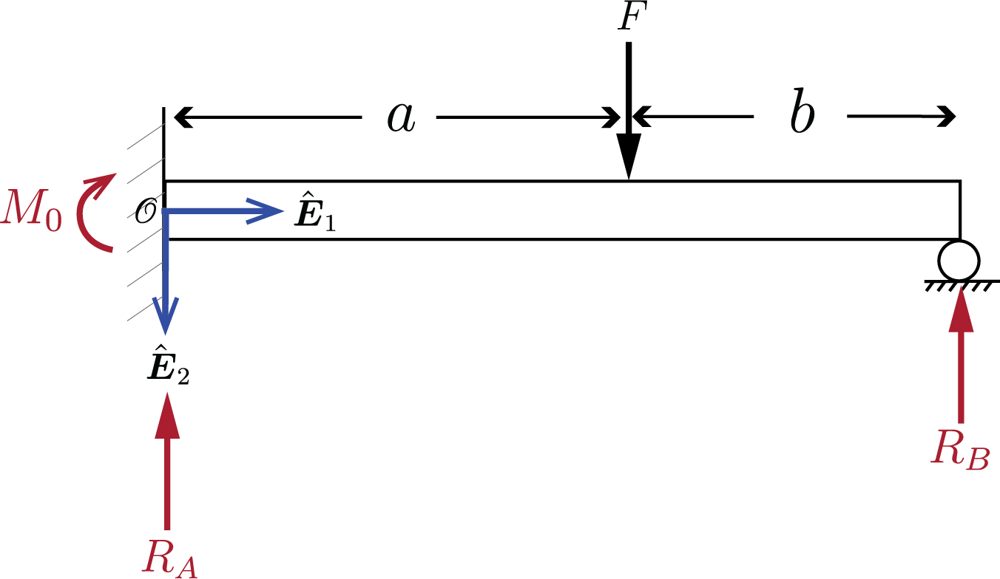
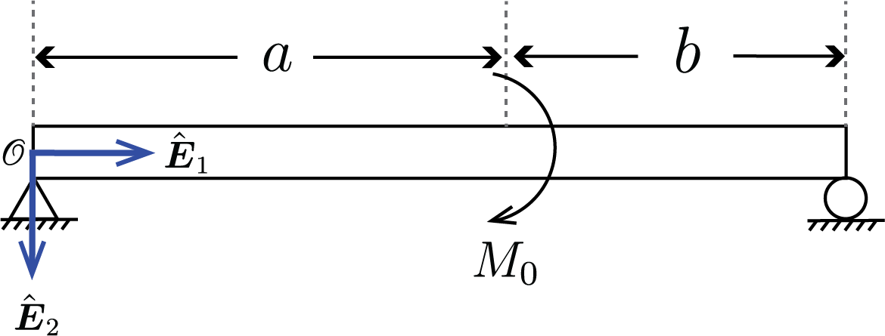




# ENGN0310: Homework 9 (100 pts)
## Due Saturday 11:59 pm, December 11th, 2021

 ### Problem 1
<!--  -->

Consider the geometry shown where $a=3~\rm{m}$ and $b=2~\rm{m}$. If the yield stress of the material is $180~\rm{MPa}$, what is the maximum force $P$ that can be applied without exceeding the yield stress? Take $E=200~\rm{GPa}$ and assume that the beam has a $1~\rm{cm}\times1~\rm{cm}$ square cross-sectional area.

 
    

     
    

 

<!-- 
ome new geometry: a design problems. What is the maximum force your can apply with out exceeding yeild stress.  -->

### Problem 2 
Consider the simply supported beam shown below. If $F=20~\rm{kN}$ and the maximum allowable deflection of the beam is $2~\rm{mm}$, find the maximum $b$. Take $a=1~\rm{m}$, $E=200~\rm{GPa}$, and assume that the beam has a $50\times100 ~\rm{mm}$ rectangular cross-sectional area.

 
    

     
    

 

<!-- 
 -->

### Problem 3

(a) Prepare the shear force and bending moment diagram for the configuration below, where $a=3~\rm{m}$, $b=2~\rm{m}$, and $\boldsymbol{M_0}=1500~\rm{N\cdot m} \hat{\boldsymbol{E}_3}$. 
 
 
    

     
    

 

(b) Prepare the shear force and bending moment diagram for the configuration below, where $L=5~\rm{m}$ and $F=12~\rm{kN}$.

 
    

     
    

 

<!-- 

Geometries from 7.11 and 7.19 on pages 108-109

 -->

### Problem 4

(a) Which of the following two configurations are statically indeterminate? Explain why.

 
    

     
    

 

(b) Repeat (a) for the following set of configurations.

 
    

     
    

  
