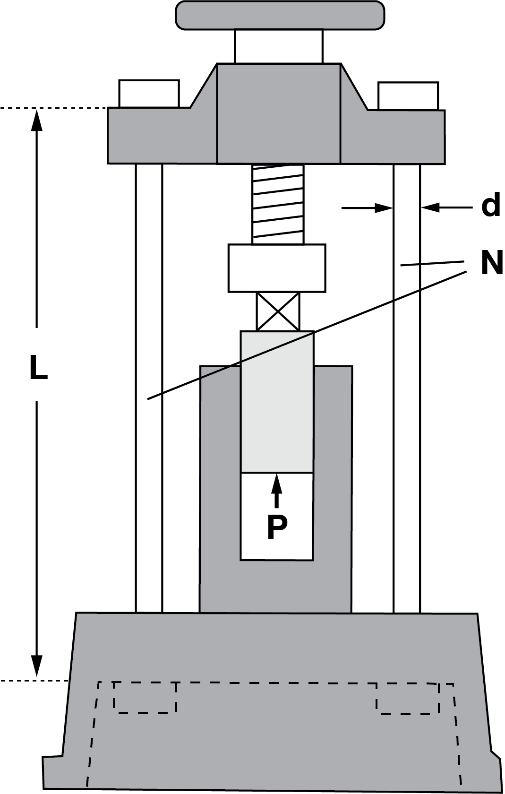
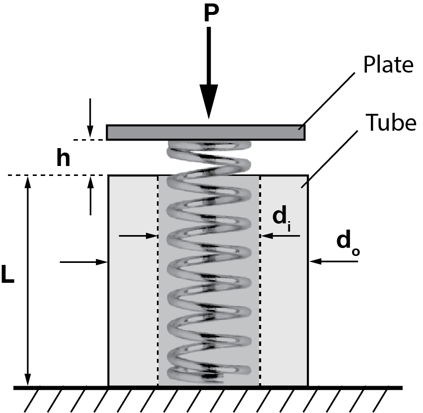




# ENGN0310: Homework 1
## Due Friday 11:59 pm, September 17th, 2021

> Please upload your assignment to Canvas. 
> Contact Sayaka_Kochiyama@brown.edu if you have questions about the below problems.   

#### Additional concepts needed for solving the HW problems

| Materials      | $E ~(\rm{GPa})$ |
|----------------|-----------------|
| Steel          | 200             |
| Titanium alloy | 120             |

  In the context of the bar, the  stress $\sigma$ along the bar's length is defined to be the ratio $F/A$, where as discussed in class, $F\hat{\boldsymbol{E}}_{a}$ is the force acting on the bar's right end face $\Gamma^{\mathscr{h}}$, and $A$ is the area of the bar's cross-section. The units of $\sigma$ are the same as those of $E$ (the Young's modulus) which are $\rm N/m^2$. One Pascal of stress, or $1~\rm{Pa}$, is $1~\rm N/m^2$ amount of stress.  One Giga-Pascal of stress, or $1~\rm{GPa}$ is $10^9~\rm N/m^2$ amount of stress. 
  
  The ratio $F/\delta$ is called the bar's stiffness, $k$. It has units of $\rm N/m$.

From class we know that
$$
\begin{equation}
\frac{F L}{A\delta}=E
\end{equation}
$$

1. Consider a solid cylindrical titanium alloy bar of length 15 cm, whose cross-section is a circle of diameter $2~\rm{cm}$ and  $\delta=90~\rm{\mu m}$. 
 (i). What is the stress in the bar?
 (ii). What is the force acting on the bar?  
 

2. Determine the elongation $\delta$ when the  stress in a $25~\rm{cm}$ long steel bar is equal to $100~\rm{MPa}$. Note that we have not specified what the shape of the bar's cross-section is. That is because the answer will not depend on the shape, or in this current problem, size, of the bar's cross-section. 
 

3. (i) We call the ratio $\delta/L$ the unit elongation/strain. What is the ratio of Young's modulus $E$ of the materials of two bars if the bars are of the same size and their unit elongations are in the ratio 5/3 when subjected to equal tensile loading?

    (ii) Determine the elongations in each bar if one is made of steel, the other is made of titanium alloy, and the tensile stress is $50~\rm{MPa}$.
 

4. A piece of wire, with circular cross-section, $6~\rm{mm}$ thick and $30~\rm{m}$ long is subjected to a tensile force $P = 5~\rm{kN}$. If the wire elongates by $2~\rm{cm}$, what is its Young's modulus?
 

5. (i) Determine the diameter $d$ of the steel bolts of circular cross-section (marked as $N$ in the below Figure) of a press for a maximum compressive force $P = 490~\rm{kN}$, if the tensile strength (working stress) for steel bars  is $\sigma_w = 70~\rm{MPa}$. The tensile strength is defined to be the critical value for $\sigma$ on which the bar would fail if exceeded.

    (ii) Determine the elongation $\delta$ of the bolts at the maximum load, if the length between their heads is $L = 125~\rm{cm}$.

    

6. A spring with stiffness $k$ is encased in a tube of length $L$, which is shorter than the spring by length $h$. Derive an expression for the compression $\delta$ of the tube when the spring is compressed by an axial load $\boldsymbol{F}=-P \hat{\boldsymbol{E}}_{a}$ applied to the plate. Assume that the tube has an inner diameter $d_i$, outer diameter $d_o$, and Young's modulus $E$. You may ignore the mass of the plate. **Hint:** You will have to consider two scenarios, the first in which the force is so small (however, still non-zero) such that the plate does not come into contact with the tube's top surface, and the second in which it does.
 

7. Imagine that the top plate is compressed to get it into contact with the tube's top surface and then the two of them are welded together. After the welding operation the applied force on the plate is removed. What will be the stress in the tube in this final state?

    

<!-- 6. A structure consisting of two equal steel bars 5 meters long and with hinged ends is submitted to the action of a vertical load P. Determine the necessary cross sectional areas of the bars and the deflection of the point $B$ ($BB'$) when $P = 20~\rm{kN}$ and the working stress is $\sigma_w = 70~\rm{MPa}$.The initial angle of inclination of the bars is $\theta = 30~\degree$.  -->