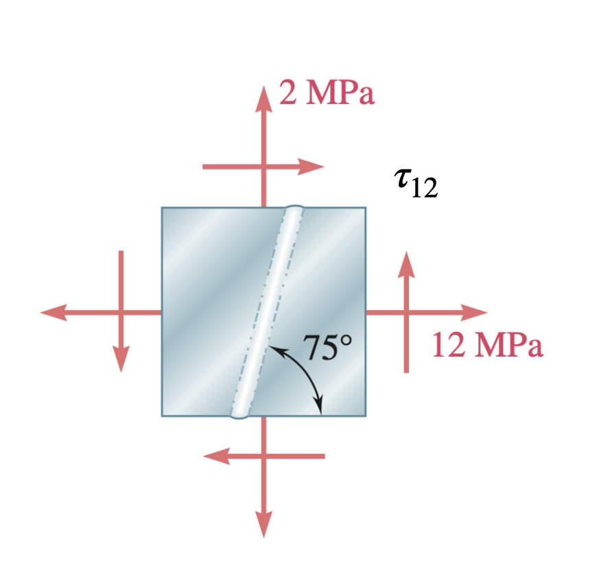
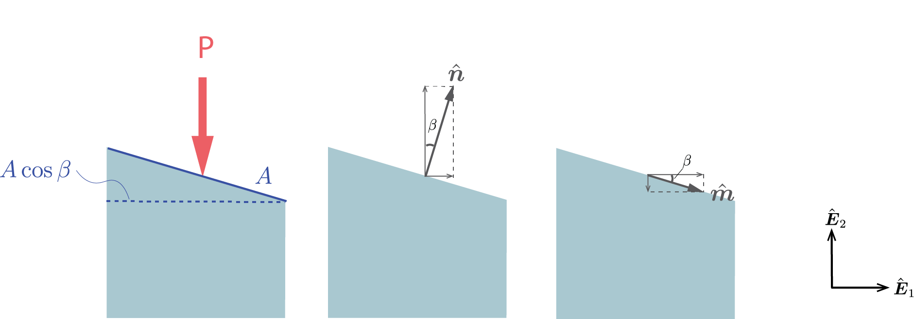
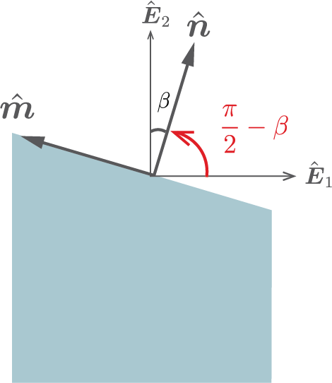




# ENGN0310: Homework 6 Solution

<u> Problem 1 (10 pts) </u>

For the given state of stress, determine the normal and shearing stresses exerted on the oblique face of the shaded triangular element shown. Use a method of analysis based on the equilibrium of that element.
 

 
    

     
    

 

**Solution:**

 
    

     
    
 
 
 

Let $S_1$, $S_2$, and $S_3$ denote the surface of the triangular element as shown. Denoting the surface area of $S_1$ as $A$, we know that $S_2$ and $S_3$ have the surface area of $\sqrt{3}A$ and $2A$ respectively.

With $\boldsymbol{t}=t_1\hat{\boldsymbol{E}}\_{\rm 1}+t_2\hat{\boldsymbol{E}}\_{\rm 2}$, equilibrium in the $\hat{\boldsymbol{E}}\_{\rm 1}$ and $\hat{\boldsymbol{E}}\_{\rm 2}$ yields

$$
\begin{align*} 
&-60 (A) \hat{\boldsymbol{E}}_{\rm 1} -16(\sqrt{3}A)\hat{\boldsymbol{E}}_{\rm 1}+t_1(2A)\hat{\boldsymbol{E}}_{\rm 1} =\boldsymbol{0}\\

&\Leftrightarrow -60-16\sqrt{3}-2t_1=0\\
&\Leftrightarrow t_1=30+8\sqrt{3}
\end{align*}
$$

$$
\begin{align*}
&-48 (A) \hat{\boldsymbol{E}}_{\rm 2} +60(\sqrt{3}A)\hat{\boldsymbol{E}}_{\rm 2}+t_1(2A)\hat{\boldsymbol{E}}_{\rm 2} =\boldsymbol{0}\\

&\Leftrightarrow -48+60\sqrt{3}+2t_2=0\\
&\Leftrightarrow t_2=24-30\sqrt{3}
\end{align*}
$$

so that 

$$
\boldsymbol{t}=(30+8\sqrt{3})\hat{\boldsymbol{E}}_{\rm 1}+(24-30\sqrt{3})\hat{\boldsymbol{E}}_{\rm 2}
$$

Then, noting that 

$$
\hat{\boldsymbol{n}} =\sin{60^\circ}\hat{\boldsymbol{E}}_1 -\cos{60^\circ}\hat{\boldsymbol{E}}_2=\sqrt{3}/2\hat{\boldsymbol{E}}_1-1/2\hat{\boldsymbol{E}}_2,
$$

the normal stress is 

$$
\sigma =\boldsymbol{t}\cdot\hat{\boldsymbol{n}}=30\sqrt{3}=51.9...~\rm{MPa}
$$

and 

$$
\boldsymbol{t_n}=\sigma~\hat{\boldsymbol{n}}=45\hat{\boldsymbol{E}}_{\rm 1}-15\sqrt{3}\hat{\boldsymbol{E}}_{\rm 2}
$$

The shearing component of the traction vector on the oblique surface is then

$$
\boldsymbol{t_s}=\boldsymbol{t}-\boldsymbol{t_n}=(-15+8\sqrt{3})\hat{\boldsymbol{E}}_{\rm 1}+(24-15\sqrt{3})\hat{\boldsymbol{E}}_{\rm 2}
$$

Hence, the magnitude of shear stress is

$$
\tau=\lVert \boldsymbol{t_s}\lVert =2.28...~\rm{MPa}
$$

More precisely speaking, recall that the definition of shear stress was $\tau(\phi)$ where

$$
\boldsymbol{t_s}=\tau(\phi)\hat{\boldsymbol{m}},
$$

where $\hat{\boldsymbol{m}}$ is defined uniquely for each surface as

$$
\hat{\boldsymbol{m}}=\hat{\boldsymbol{E}}_3\times\hat{\boldsymbol{n}}
$$

Following this definition, we get that

$$
\hat{\boldsymbol{m}}=1/2\hat{\boldsymbol{E_1}}+\sqrt{3}/2\hat{\boldsymbol{E_2}}
$$

Then, taking the dot product,

$$
\tau(\phi)=\boldsymbol{t_s}\cdot\hat{\boldsymbol{m}}=-2.28...~\rm{MPa}
$$

<u>Different perspective (1)</u>

Alternatively, you may take

$$
[\boldsymbol{\sigma}]=
\begin{bmatrix}
16 & -60\\
-60 & -48 \\
\end{bmatrix}
$$

so that

$$
\begin{align*}
[\boldsymbol{t}(\hat{\boldsymbol{n}})]&=[\boldsymbol{\sigma}][\hat{\boldsymbol{n}}]\\
&=\begin{bmatrix}
16 & -60\\
-60 & -48 \\
\end{bmatrix}\begin{bmatrix}
\frac{\sqrt{3}}{2}\\
-\frac{1}{2} \\
\end{bmatrix}
=\begin{bmatrix}
8\sqrt{3}+30\\
-30\sqrt{3}+24
\end{bmatrix}
\end{align*}
$$

from which $\boldsymbol{t_n}$ and $\boldsymbol{t_s}$ can be found in the same manner as shown above.

<u>Different perspective (2)</u>

Or, you can directly compute the values using

$$
\begin{align*}
\sigma(\phi)&=c+a\cos{(2\phi)}+b\sin{(2\phi)}\\
\tau(\phi)&=-a\sin{(2\phi)}+b\cos{(2\phi)}\\
a&:=\frac{\sigma_{11}-\sigma_{22}}{2}\\
b&:=\sigma_{12}\\
c&:=\frac{\sigma_{11}+\sigma_{22}}{2}
\end{align*}
$$

 
    

     
    
 
 

Note how angle $\phi$ is taken. You can either take

$$
\phi=150^\circ \text{~~or~~~} \phi=-30^\circ
$$

and get

$$
\sigma(150^\circ)=\sigma(-30^\circ)= 51.96..~\rm{MPa}
$$

$$
\tau(150^\circ)=\tau(-30^\circ)= -2.28..~\rm{MPa}
$$

The sign is important. If you took $\phi=30^\circ$, for example, you would have arrived at a different value.

 
 

<u> Problem 2 (10 pts) </u>

For the state of plane stress shown, determine the value of $τ_{12}$ for which the in-plane shearing stress parallel to the weld is zero.
 

  
    

     
    

 

**Solution:**

  
    

     
    

 

With $\tau_{12}$, the stress tensor can be written as
 
$$
[\boldsymbol{\sigma}]=
\begin{bmatrix}
12 & \tau_{12}\\
\tau_{12} & 2 \\
\end{bmatrix}
$$

Considering the divided piece shown, the vector (outward) normal to the welded surface is

$$
[\hat{\boldsymbol{n}}]=
\begin{bmatrix}
-\sin{75^\circ}\\
\cos{75^\circ}
\end{bmatrix}
$$

Then, traction on the welded surface is

$$
\begin{align*}
[\boldsymbol{t}(\hat{\boldsymbol{n}})]&=[\boldsymbol{\sigma}][\hat{\boldsymbol{n}}]
=\begin{bmatrix}
-12\sin{75^\circ}+\tau_{12}\cos{75^\circ}\\
-\tau_{12}\sin{75^\circ}+2\cos{75^\circ}
\end{bmatrix}
\end{align*}
$$

The normal component of the traction vector on the welded surface is $\boldsymbol{t\_n}=(\boldsymbol{t}\cdot\hat{\boldsymbol{n}})\hat{\boldsymbol{n}}$, which in component form is

$$
[\boldsymbol{t_n}]=(12\sin^2{75^\circ}-2\tau_{12}\sin{75^\circ}\cos{75^\circ}+2\cos^2{75^\circ})
\begin{bmatrix}
-\sin{75^\circ}\\
\cos{75^\circ}
\end{bmatrix}
$$

The shear component of the traction vector is then given by $\boldsymbol{t\_s}=\boldsymbol{t}-\boldsymbol{t\_n}$ and evaluates to

$$
[\boldsymbol{t_s}]=\frac{1}{4\sqrt{2}}
\begin{bmatrix}
5(1-\sqrt{3})+(\sqrt{3}-3)\tau_{12}\\
-5(1+\sqrt{3})-(3+\sqrt{3})\tau_{12}
\end{bmatrix}
$$

Solving for $\boldsymbol{t\_s}=\boldsymbol{0}$,

$$
\tau_{12}=\frac{5(1-\sqrt{3})}{3-\sqrt{3}}=-\frac{5(1+\sqrt{3})}{3+\sqrt{3}}=-2.88..~\rm{MPa}
$$

<u>Different perspective </u>

You can directly solve for $\tau_{12}(=\sigma_{12})$ taking the equation for shear stress

$$
\begin{align*}
\tau(\phi)&=-\frac{\sigma_{11}-\sigma_{22}}{2}\sin{(2\phi)}+\sigma_{12}\cos{(2\phi)}\\
\end{align*}
$$

and setting it to $0$.

$$
\tau(\phi)=0
$$

  
    

     
    

 

You can consider either plane of $\phi=165^\circ$ or $\phi=-15^\circ$ in solving the problem. However, you would also get the right answer if you used $\phi=75^\circ$ or $\phi=-165^\circ$, just because planes of minimum shear stress are at every $90^\circ$.

 
 

<u> Problem 3 (10 pts total) </u>

Two wooden members of $80 \times 120~\rm mm$ uniform rectangular cross section are joined by the simple glued scarf splice shown. Knowing that $\beta = 25^{o}$ and that centric loads of magnitude $P = 10 ~\rm kN$ are applied to the members as shown, determine (a) (10 pts) the in-plane shearing stress parallel to the splice, (b) (10 pts) the normal stress perpendicular to the splice.
 

  
    

     
    

 

**Solution:**

 
    

     
    

 

From force equilibrium, we see that the load on the splice is $P\hat{\boldsymbol{E}}\_{\rm 1}=10~\rm{kN}\hat{\boldsymbol{E}}\_{\rm 1}$. The traction is then simply

$$
\boldsymbol{t}=\frac{\boldsymbol{P}}{A}=
\frac{10~\rm{kN}\hat{\boldsymbol{E}}_1}{(120 ~\rm{mm})(\frac{80}{\sin{\beta}}~\rm{mm})}=440~\rm{kPa}\hat{\boldsymbol{E}}_1
$$

Now, the vector normal to the splice is

$$
\hat{\boldsymbol{n}}=\sin{\beta}\hat{\boldsymbol{E}}_1+\cos{\beta}\hat{\boldsymbol{E}}_2
$$

Hence, the magnitude of the normal stress is

$$
\sigma=\boldsymbol{t}\cdot \hat{\boldsymbol{n}}=440\sin{\beta}=186 ~\rm{kPa} 

$$
 
and the normal component of the traction vector is

$$
\begin{align*}
\boldsymbol{t_n}=\sigma~\hat{\boldsymbol{n}}&=186~\rm{kPa}\sin{\beta}\hat{\boldsymbol{E}}_1+186~\rm{kPa}\cos{\beta}\hat{\boldsymbol{E}}_2\\
&=78.6\rm{kPa}\hat{\boldsymbol{E}}_1+168\rm{kPa}\hat{\boldsymbol{E}}_2
\end{align*}
$$

Then, the shear component of the traction vector

$$
\begin{align*}
\boldsymbol{t_s}=\boldsymbol{t}-\boldsymbol{t_n}
&=361.4\rm{kPa}\hat{\boldsymbol{E}}_1-168\rm{kPa}\hat{\boldsymbol{E}}_2 
\end{align*}
$$

and its magnitude is

$$
\tau=\sqrt{361.4^2+168^2}~\rm{kPa}=398~\rm{kPa}
$$

More precisely speaking, recall that the definition of shear stress is $\tau(\phi)$ in

$$
\boldsymbol{t_s}=\tau(\phi)\hat{\boldsymbol{m}},
$$

where $\hat{\boldsymbol{m}}$ is defined uniquely for each surface as

$$
\hat{\boldsymbol{m}}=\hat{\boldsymbol{E}}_3\times\hat{\boldsymbol{n}}
$$

Following this definition, we get that

$$
\hat{\boldsymbol{m}}=-\cos{\beta}\hat{\boldsymbol{E}}_1+\sin{\beta}\hat{\boldsymbol{E}}_2
$$

Then, taking the dot product,

$$
\tau(\phi)=\boldsymbol{t_s}\cdot\hat{\boldsymbol{m}}=-398~\rm{kPa}
$$

<u>Different perspective (1)</u>

 
    

     
    

  

You can also start by finding the stress tensor components first. It is apparent that $\sigma_{12}=0$ and $\sigma_{22}=0$. 
We have for $\sigma_{11}$

$$
\sigma_{11}=\frac{P}{A}=\frac{10~\rm{kN}}{(120~\rm{mm})(80~\rm{mm})}=1.041...~\rm{MPa}
$$

where $A$ is the cross-sectional area of the member perpendicular to $\hat{\boldsymbol{E}}_1$.
You can then utilize the equations

$$
\begin{align*}
\sigma(\phi)&=\frac{\sigma_{11}+\sigma_{22}}{2}+\frac{\sigma_{11}-\sigma_{22}}{2}\cos{(2\phi)}+\sigma_{12}\sin{(2\phi)}\\
\tau(\phi)&=-\frac{\sigma_{11}-\sigma_{22}}{2}\sin{(2\phi)}+\sigma_{12}\cos{(2\phi)}\\
\end{align*}
$$

which in this case reduces to

$$
\begin{align*}
\sigma(\phi)&=\frac{\sigma_{11}}{2}(1+\cos{(2\phi)})\\
\tau(\phi)&=-\frac{\sigma_{11}}{2}\sin{(2\phi)}\\
\end{align*}
$$

Choosing $\phi=90^\circ-\beta=65^\circ$,

$$
\sigma(65^\circ)=186~\rm{kPa}
$$

$$
\tau(65^\circ)=-398~\rm{kPa}
$$

<u>Different perspective (2)</u>

Or you can start by constructing a stress tensor as

$$
[\boldsymbol{\sigma}]=
\begin{bmatrix}
\sigma_{11} & 0\\
0 & 0 \\
\end{bmatrix}
$$

With

$$
[\hat{\boldsymbol{n}}]=
\begin{bmatrix}
\cos{(90^\circ-\beta)}\\
\sin{(90^\circ-\beta)}
\end{bmatrix}
=
\begin{bmatrix}\sin{\beta}\\
\cos{\beta} 
\end{bmatrix},~~~

[\hat{\boldsymbol{m}}]=
\begin{bmatrix}
-\sin{(90^\circ-\beta)}\\
\cos{(90^\circ-\beta)}
\end{bmatrix} 
=
\begin{bmatrix}
-\cos{\beta}\\
\sin{\beta} 
\end{bmatrix}\\
$$

you get that the traction is

$$
[\boldsymbol{t}(\hat{\boldsymbol{n}})]=[\boldsymbol{\sigma}][\hat{\boldsymbol{n}}]=\begin{bmatrix}\sigma_{11}\sin{\beta}\\0\end{bmatrix}
$$

It follows then that

$$
\begin{cases}
\sigma=\boldsymbol{t}(\hat{\boldsymbol{n}})\cdot \hat{\boldsymbol{n}}=\sigma_{11} \sin^2{\beta}=186~\rm{kPa}\\\\
\tau=\boldsymbol{t}(\hat{\boldsymbol{n}})\cdot \hat{\boldsymbol{m}}=-\sigma_{11}  \sin{\beta}\cos{\beta}=-398~\rm{kPa}
\end{cases}
$$

 
 

<u> Problem 4 (10 pts total) </u>

The centric force $\boldsymbol{\sf P}$ is applied to a short post as shown. Knowing that the stresses on plane $a-a$ (the direction of the plane is shown in subfigure (b)) are $\sigma = −15 ~\rm MPa$ and $\tau = 5 ~\rm MPa $, determine (a) (10 pts) the angle $\beta$ that plane $a-a$ forms with the horizontal, (b) (10 pts) the maximum compressive stress in the post.

  
    

     
    

 

**Solution**

 
    

     
    

 

From equilibrium, it is apparent that the traction vector on the oblique surface is of the form

$$
\boldsymbol{t}=\frac{-P\hat{\boldsymbol{E}}_2}{A}=-t\hat{\boldsymbol{E}}_2
$$

where $A$ is the area of the oblique surface. 
With

$$
\hat{\boldsymbol{n}}=\sin{\beta}\hat{\boldsymbol{E}}_1+\cos{\beta}\hat{\boldsymbol{E}}_2
$$

$$
\hat{\boldsymbol{m}}=\cos{\beta}\hat{\boldsymbol{E}}_1-\sin{\beta}\hat{\boldsymbol{E}}_2
$$

we can write that

$$
\sigma=\boldsymbol{t}\cdot\hat{\boldsymbol{n}}=-t\cos{\beta} \tag{$\star$}
$$

$$
\tau=\boldsymbol{t}\cdot\hat{\boldsymbol{m}}=t\sin{\beta} \tag{$\star\star$}
$$

Plugging in $\sigma=-15~\rm{MPa}$ and $\tau=5~\rm{MPa}$ and solving for $t, \beta$, 

$$
\begin{align*}
t&=5\sqrt{10}~\rm{MPa}=15.8..~\rm{MPa}\\
\beta&=0.321..~\rm{rad}=18.4..^\circ
\end{align*}
$$

We then get that 

$$
P=tA
$$

The compression is maximum on a cross section perpendicular to $\hat{\boldsymbol{E}}_2$, whose area is $A\cos{\beta}$

$$
\frac{P}{A\cos{\beta}}=\frac{t}{\cos{\beta}}=16.7~\rm{MPa}
$$

<u>Different perspective (1) </u>

Take $\hat{\boldsymbol{n}}$ and $\hat{\boldsymbol{m}}$ as shown. Note that this follows the notation introduced in class, where $\hat{\boldsymbol{m}}=\hat{\boldsymbol{E}}_3 \times \hat{\boldsymbol{n}}$, where as the orientation of $\hat{\boldsymbol{m}}$ given originally in the problem <u>does not</u>.

 
    

      
    

 

Maximum compression is $\sigma_{22}$. We can say that $\sigma_{11}=\sigma_{12}=0$ so that

$$
\begin{align*}
\sigma(\phi)&=\frac{\sigma_{11}+\sigma_{22}}{2}+\frac{\sigma_{11}-\sigma_{22}}{2}\cos{(2\phi)}+\sigma_{12}\sin{(2\phi)}\\
\tau(\phi)&=-\frac{\sigma_{11}-\sigma_{22}}{2}\sin{(2\phi)}+\sigma_{12}\cos{(2\phi)}\\
\end{align*}
$$

reduces to

$$
\begin{align*}
\sigma(\phi)&=\frac{\sigma_{22}}{2}(1+\cos{(2\phi)})\\
\tau(\phi)&=\frac{\sigma_{22}}{2}\sin{(2\phi)}\\
\end{align*}
$$

Solving the following system of equations for $\sigma_{22}$ and $\beta$ (note that you have to take $=\tau=-5~\rm{MPa}$ here to stay consistent with the how $\hat{\boldsymbol{m}}$ is oriented),

$$
\begin{cases}
\sigma(\dfrac{\pi}{2}-\beta)=\dfrac{\sigma_{22}}{2}\left(1+\cos{(2(\dfrac{\pi}{2}-\beta))}\right)=-15~\rm{MPa}\\\\
\tau(\dfrac{\pi}{2}-\beta)=\dfrac{\sigma_{22}}{2}\sin{(2(\dfrac{\pi}{2}-\beta))}=~\rm{-5MPa}\\
\end{cases}
$$

we get 

$$
\beta=18.4..^\circ
$$ 

$$
\sigma_{22}=-16.7~\rm{MPa}
$$

<u>Different perspective (2) </u>

 
    

      
    

 

Or you can start by constructing a stress tensor as

$$
[\boldsymbol{\sigma}]=
\begin{bmatrix}
0 & 0\\
0 & \sigma_{22} \\
\end{bmatrix}
$$

With

$$
[\hat{\boldsymbol{n}}]=
\begin{bmatrix}
\cos{(\dfrac{\pi}{2}-\beta)}\\
\sin{(\dfrac{\pi}{2}-\beta)}
\end{bmatrix}=
\begin{bmatrix}
\sin{\beta}\\
\cos{\beta}
\end{bmatrix},~~~

[\hat{\boldsymbol{m}}]=
\begin{bmatrix}
-\sin{(\dfrac{\pi}{2}-\beta)}\\
\cos{(\dfrac{\pi}{2}-\beta)}
\end{bmatrix}=
\begin{bmatrix}
-\cos{\beta}\\
\sin{\beta}
\end{bmatrix} \\
$$

you get that the traction is

$$
[\boldsymbol{t}(\hat{\boldsymbol{n}})]=[\boldsymbol{\sigma}][\hat{\boldsymbol{n}}]=\begin{bmatrix}0\\\sigma_{22}\cos{\beta}\end{bmatrix}
$$

It follows then that

$$
\begin{cases}
\sigma=\boldsymbol{t}(\hat{\boldsymbol{n}})\cdot \hat{\boldsymbol{n}}=\sigma_{22} \cos^2{\beta}=-15~\rm{MPa}\\\\
\tau=\boldsymbol{t}(\hat{\boldsymbol{n}})\cdot \hat{\boldsymbol{m}}=\sigma_{22}  \sin{\beta}\cos{\beta}=-5~\rm{MPa}
\end{cases}
$$

and you can solve for $\beta, \sigma_{22}$ as

$$
\beta=18.4..^\circ
$$ 

$$
\sigma_{22}=-16.7~\rm{MPa}
$$

 

<u> Problem 5 (10 pts total) </u>

For the given state of stress, determine (a) (10 pts) the maximum and minimum in-plane normal stress, (b) (10 pts) the orientation of the planes of the maximum and minimum in-plane normal stress.

 
    

     
    

**Solution**

Simply plugging in $\sigma_{11}=-40~\rm{MPa}$, $\sigma_{22}=60~\rm{MPa}$, and $\tau_{12}=25~\rm{MPa}$,

$$
\begin{equation}
\sigma_{\rm max}=\frac{\sigma_{11}+\sigma_{22}}{2} + \sqrt{\left(\frac{\sigma_{11}-\sigma_{22}}{2}\right)^2+\tau_{12}^2} = 65.9~\rm{MPa}
\end{equation}
$$

$$
\begin{equation}
\sigma_{\rm min}=\frac{\sigma_{11}+\sigma_{22}}{2} - \sqrt{\left(\frac{\sigma_{11}-\sigma_{22}}{2}\right)^2+\tau_{12}^2} =-45.9~\rm{MPa}
\end{equation}
$$

The orientation of the planes of the maximum and minimum in-plane normal stress is given by

$$
\begin{equation}
\tan 2\theta_p=\frac{2\tau_{12}}{\sigma_{11}-\sigma_{22}}\tag{$\star$}
\end{equation}
$$

Solving for $\theta_p$ in $0 \leq \theta_p <2\pi$,

$$
\theta_p=1.34~\rm{rad}, 2.91~\rm{rad}, 4.48~\rm{rad}, 6.05~\rm{rad}
$$

or 

$$
\theta_p=76.7^\circ, 166.7^\circ, 256.7^\circ, 346.7^\circ
$$

It is also sufficient if you just solved for $\theta_p$ in $0 \leq \theta_p <\pi$.

***Optional***

Remember from class that the normal stress at angle $\theta$ was given by 

$$
\sigma(\theta)=\frac{\sigma_{11}+\sigma_{22}}{2} +\frac{\sigma_{11}-\sigma_{22}}{2} \cos{(2\theta)}+\tau_{12}\sin{(2\theta)}
$$

Note that ($\star$) above is obtained by taking 

$$
\sigma'(\theta)=-\frac{\sigma_{11}-\sigma_{22}}{2} \sin{(2\theta)}+\tau_{12}\cos{(2\theta)}=0
$$

To figure out at which $\theta_p$ the normal stress is maximum or minimum, let us denote the $\theta_p$ at which the normal stress is maximum by $\theta_{p_{max}}$. Then,

$$
\sigma(\theta_{p_{max}})=\sigma_{\rm max}
$$

$$
\Leftrightarrow \frac{\sigma_{11}+\sigma_{22}}{2} +\frac{\sigma_{11}-\sigma_{22}}{2} \cos{(2\theta_{p_{max}})}+\tau_{12}\sin{(2\theta_{p_{max}})}=\frac{\sigma_{11}+\sigma_{22}}{2} + \sqrt{\left(\frac{\sigma_{11}-\sigma_{22}}{2}\right)^2+\tau_{12}^2}\\
$$

$$
\Leftrightarrow \frac{\sigma_{11}-\sigma_{22}}{2} \cos{(2\theta_{p_{max}})}+\tau_{12}\sin{(2\theta_{p_{max}})}= \sqrt{\left(\frac{\sigma_{11}-\sigma_{22}}{2}\right)^2+\tau_{12}^2}\\
$$

Letting $a = \dfrac{\sigma_{11}-\sigma_{22}}{2}$ and $b=\tau_{12}$,

$$
a\cos{(2\theta_{p_{max}})}+b\sin{(2\theta_{p_{max}})}=\sqrt{a^2+b^2} 
$$

$$
a\cos{(2\theta_{p_{max}})}\left(1+\frac{b}{a}\tan{(2\theta_{p_{max}})}\right)=\sqrt{a^2+b^2}
$$

Plugging in 

$$
\tan{2\theta_p}=\frac{2\tau_{12}}{\sigma_{11}-\sigma_{22}}=\frac{b}{a}
$$

we get 

$$
\begin{align*}
a\cos{(2\theta_{p_{max}})}\left(1+\frac{b^2}{a^2}\right)=\sqrt{a^2+b^2} \\
\Leftrightarrow \cos{(2\theta_{p_{max}})}=\frac{a}{\sqrt{a^2+b^2}} \tag{$\star \star$}
\end{align*}
$$

Hence, by solving for $\theta_p$ that satisfies both ($\star$) and ($\star \star$), we find that the normal stress is maximum at 

$$
\theta_p=1.34~\rm{rad}~(=76.7^\circ )
$$

Similarly, the normal stress is minimum when ($\star$) and ($\star \star \star$) below are satisfied

$$
\begin{align*}
\cos{(2\theta_{p_{min}})}=-\frac{a}{\sqrt{a^2+b^2}} \tag{$\star \star \star$}
\end{align*}
$$

which is when

$$
\theta_p=2.91~\rm{rad}~(=166.7^\circ )
$$