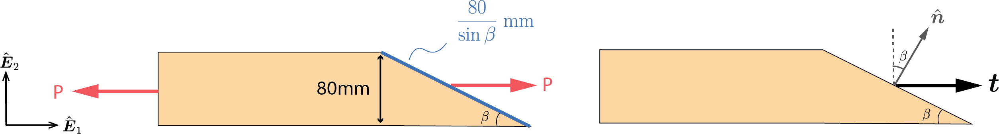




# ENGN0310: Homework 6 Solution

**Mathematica file** used to compute the solutions below can be found [here](HW4_calc.nb).

<u> Problem 1 (10 pts) </u>

For the given state of stress, determine the normal and shearing stresses exerted on the oblique face of the shaded triangular element shown. Use a method of analysis based on the equilibrium of that element.
 

 
    

     
    

 

**Solution:**

 
    

     
    

 

Let $S_1$, $S_2$, and $S_3$ denote the surface of the triangular element as shown. Denoting the surface area of $S_1$ as $A$, we know that $S_2$ and $S_3$ have the surface area of $\sqrt{3}A$ and $2A$ respectively.

With $\boldsymbol{t}=t_1\hat{\boldsymbol{E}}\_{\rm 1}+t_2\hat{\boldsymbol{E}}\_{\rm 2}$, equilibrium in the $\hat{\boldsymbol{E}}\_{\rm 1}$ and $\hat{\boldsymbol{E}}\_{\rm 2}$ yields

$$
\begin{align*}
&-60 (A) \hat{\boldsymbol{E}}_{\rm 1} -16(\sqrt{3}A)\hat{\boldsymbol{E}}_{\rm 1}+t_1(2A)\hat{\boldsymbol{E}}_{\rm 1} =\boldsymbol{0}\\

&\Leftrightarrow -60-16\sqrt{3}-2t_1=0\\
&\Leftrightarrow t_1=30+8\sqrt{3}
\end{align*}
$$

$$
\begin{align*}
&-48 (A) \hat{\boldsymbol{E}}_{\rm 2} +60(\sqrt{3}A)\hat{\boldsymbol{E}}_{\rm 2}+t_1(2A)\hat{\boldsymbol{E}}_{\rm 2} =\boldsymbol{0}\\

&\Leftrightarrow -48+60\sqrt{3}+2t_2=0\\
&\Leftrightarrow t_2=24-30\sqrt{3}
\end{align*}
$$

so that 

$$
\boldsymbol{t}=(30+8\sqrt{3})\hat{\boldsymbol{E}}_{\rm 1}+(24-30\sqrt{3})\hat{\boldsymbol{E}}_{\rm 2}
$$

Then, noting that $\hat{\boldsymbol{n}} =(\sin{60^\circ}, -\cos{60^\circ})=(\sqrt{3}/2,-1/2)$, the normal stress is 

$$
t_n=\boldsymbol{t}\cdot\hat{\boldsymbol{n}}=30\sqrt{3}=51.9...~\rm{MPa}
$$

and 

$$
\boldsymbol{t_n}=t_n\hat{\boldsymbol{n}}=45\hat{\boldsymbol{E}}_{\rm 1}-15\sqrt{3}\hat{\boldsymbol{E}}_{\rm 2}
$$

The shearing stress on the oblique surface is then

$$
\boldsymbol{t_s}=\boldsymbol{t}-\boldsymbol{t_n}=(-15+8\sqrt{3})\hat{\boldsymbol{E}}_{\rm 1}+(24-15\sqrt{3})\hat{\boldsymbol{E}}_{\rm 2}
$$

and 

$$
t_s=\lVert \boldsymbol{t_s}\lVert =2.28...~\rm{MPa}
$$

Alternatively, you may take

$$
[\boldsymbol{\sigma}]=
\begin{bmatrix}
16 & -60\\
-60 & -48 \\
\end{bmatrix}
$$

so that

$$
\begin{align*}
[\boldsymbol{t}(\hat{\boldsymbol{n}})]&=[\boldsymbol{\sigma}][\hat{\boldsymbol{n}}]\\
&=\begin{bmatrix}
16 & -60\\
-60 & -48 \\
\end{bmatrix}\begin{bmatrix}
\frac{\sqrt{3}}{2}\\
-\frac{1}{2} \\
\end{bmatrix}
=\begin{bmatrix}
8\sqrt{3}+30\\
-30\sqrt{3}+24
\end{bmatrix}
\end{align*}
$$

from which $\boldsymbol{t_n}$ and $\boldsymbol{t_s}$ can be found in the same manner as shown above.

<u> Problem 2 (10 pts) </u>

For the state of plane stress shown, determine the value of $τ_{12}$ for which the in-plane shearing stress parallel to the weld is zero.
 

  
    

     
    

 

**Solution:**

  
    

     
    

 

With $\tau_{12}$, the stress tensor can be written as

$$
[\boldsymbol{\sigma}]=
\begin{bmatrix}
12 & \tau_{12}\\
\tau_{12} & 2 \\
\end{bmatrix}
$$

Considering the divided piece shown, the vector (outward) normal to the welded surface is

$$
[\hat{\boldsymbol{n}}]=
\begin{bmatrix}
-\sin{75^\circ}\\
\cos{75^\circ}
\end{bmatrix}
$$

Then, traction on the welded surface is

$$
\begin{align*}
[\boldsymbol{t}(\hat{\boldsymbol{n}})]&=[\boldsymbol{\sigma}][\hat{\boldsymbol{n}}]
=\begin{bmatrix}
-12\sin{75^\circ}+\tau_{12}\cos{75^\circ}\\
-\tau_{12}\sin{75^\circ}+2\cos{75^\circ}
\end{bmatrix}
\end{align*}
$$

The normal stress on the welded surface is $\boldsymbol{t\_n}=(\boldsymbol{t}\cdot\hat{\boldsymbol{n}})\hat{\boldsymbol{n}}$, which in component form is

$$
[\boldsymbol{t_n}]=(12\sin^2{75^\circ}-2\tau_{12}\sin{75^\circ}\cos{75^\circ}+2\cos^2{75^\circ})
\begin{bmatrix}
-\sin{75^\circ}\\
\cos{75^\circ}
\end{bmatrix}
$$

The shear stress is then given by $\boldsymbol{t\_s}=\boldsymbol{t}-\boldsymbol{t\_n}$ and evaluates to

$$
[\boldsymbol{t_s}]=\frac{1}{4\sqrt{2}}
\begin{bmatrix}
5(1-\sqrt{3})+(\sqrt{3}-3)\tau_{12}\\
-5(1+\sqrt{3})-(3+\sqrt{3})\tau_{12}
\end{bmatrix}
$$

Solving for $\boldsymbol{t\_s}=\boldsymbol{0}$,

$$
\tau_{12}=\frac{5(1-\sqrt{3})}{3-\sqrt{3}}=-\frac{5(1+\sqrt{3})}{3+\sqrt{3}}=-2.88..~\rm{MPa}
$$

<u> Problem 3 (10 pts total) </u>

Two wooden members of $80 \times 120~\rm mm$ uniform rectangular cross section are joined by the simple glued scarf splice shown. Knowing that $\beta = 25^{o}$ and that centric loads of magnitude $P = 10 ~\rm kN$ are applied to the members as shown, determine (a) (10 pts) the in-plane shearing stress parallel to the splice, (b) (10 pts) the normal stress perpendicular to the splice.
 

  
    

     
    

 

**Solution:**

 
    

     
    

 

From force equilibrium, we see that the load on the splice is $P\hat{\boldsymbol{E}}\_{\rm 1}=10~\rm{kN}\hat{\boldsymbol{E}}\_{\rm 1}$. The traction is then simply

$$
\boldsymbol{t}=\frac{\boldsymbol{P}}{A}=
\frac{10~\rm{kN}\hat{\boldsymbol{E}}_1}{(120 ~\rm{mm})(\frac{80}{\sin{\beta}}~\rm{mm})}=440~\rm{kPa}\hat{\boldsymbol{E}}_1
$$

Now, the vector normal to the splice is

$$
\hat{\boldsymbol{n}}=\sin{\beta}\hat{\boldsymbol{E}}_1+\cos{\beta}\hat{\boldsymbol{E}}_2
$$

Hence, 

$$
t_n=\boldsymbol{t}\cdot \hat{\boldsymbol{n}}=440\sin{\beta}=186 ~\rm{kPa}

$$

and

$$
\begin{align*}
\boldsymbol{t_n}=t_n\hat{\boldsymbol{n}}&=186~\rm{kPa}\sin{\beta}\hat{\boldsymbol{E}}_1+186~\rm{kPa}\cos{\beta}\hat{\boldsymbol{E}}_2\\
&=78.6\rm{kPa}\hat{\boldsymbol{E}}_1+168\rm{kPa}\hat{\boldsymbol{E}}_2
\end{align*}
$$

Then, the shear stress is

$$
\begin{align*}
\boldsymbol{t_s}=\boldsymbol{t}-\boldsymbol{t_n}
&=361.4\rm{kPa}\hat{\boldsymbol{E}}_1-168\rm{kPa}\hat{\boldsymbol{E}}_2
\end{align*}
$$

and 

$$
t_s=\sqrt{361.4^2+168^2}~\rm{kPa}=
$$