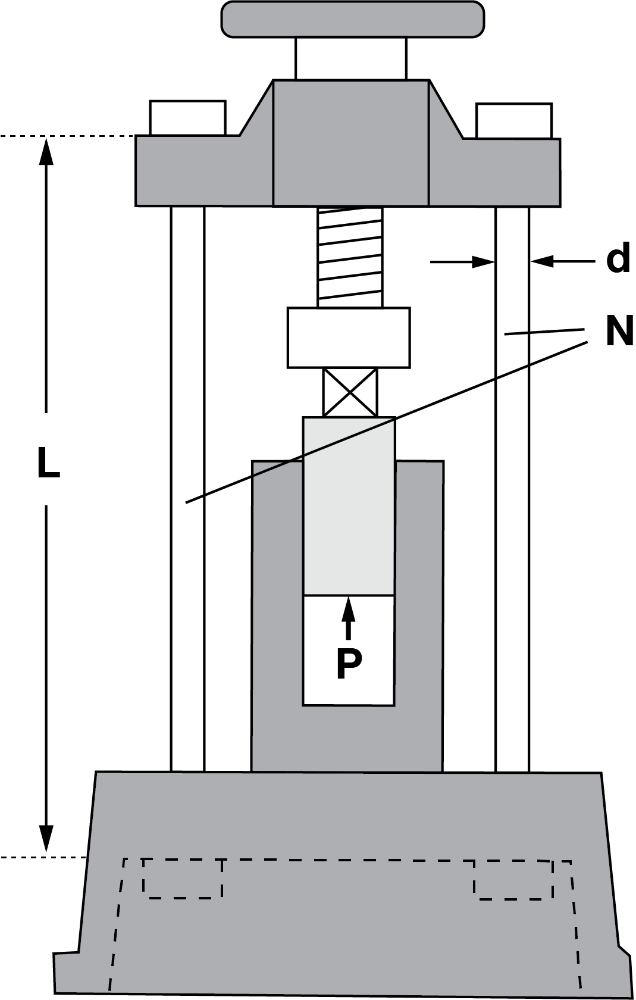
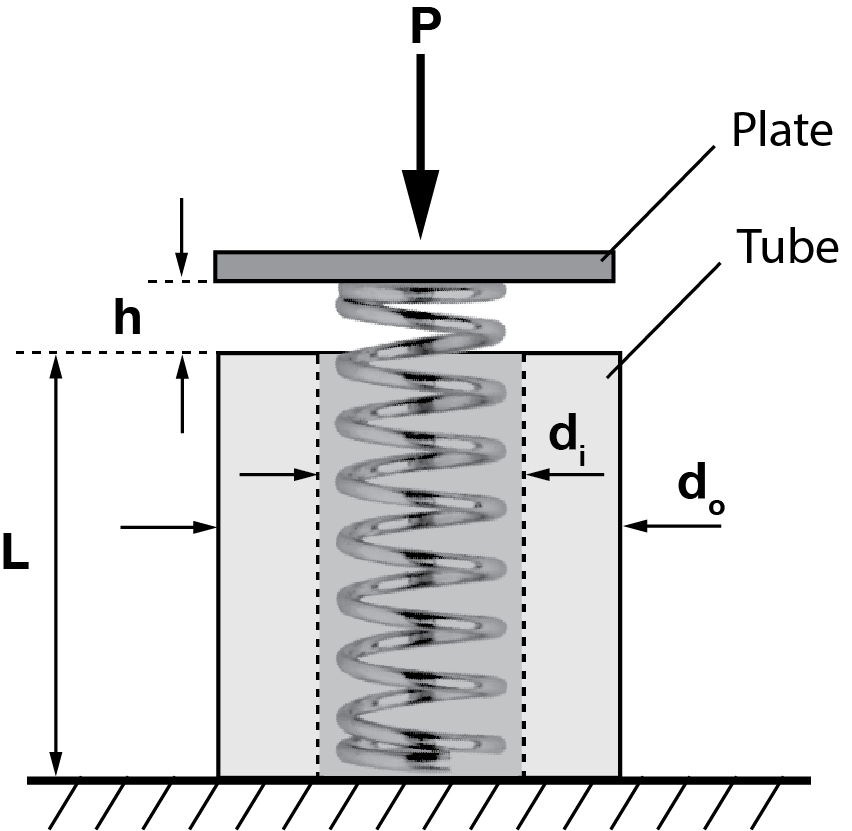
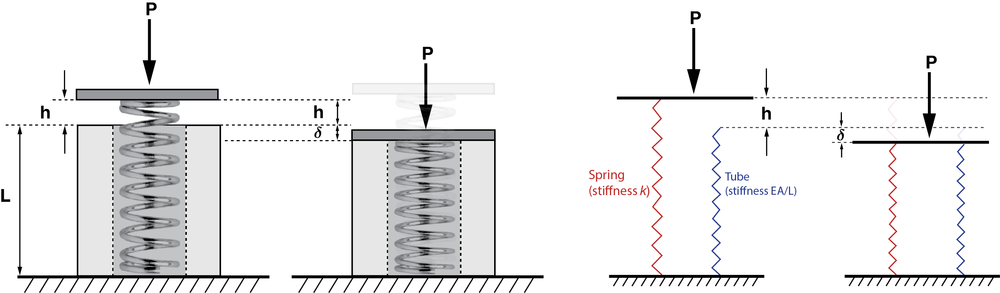
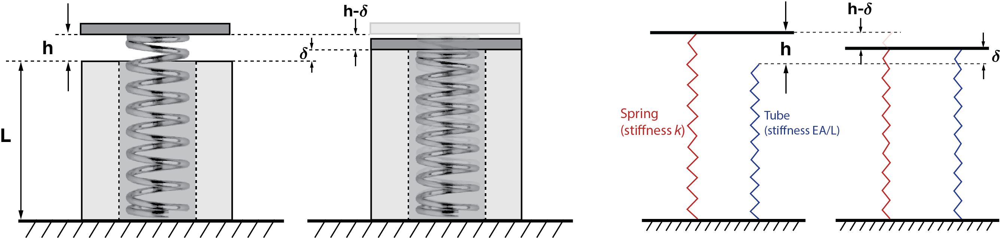




# ENGN0310: Homework 1 Soltuion

| Materials      | $E ~(\rm{GPa})$ |
|----------------|-----------------|
| Steel          | 200             |
| Titanium alloy | 120             |

 

1. (10 pts) Consider a solid cylindrical titanium alloy bar of length 15 cm, whose cross-section is a circle of diameter $2~\rm{cm}$ and  $\delta=90~\rm{\mu m}$. 
 (i). What is the stress in the bar?
 (ii). What is the force acting on the bar?  
 

    **Solution:**

    (i) Simply plugging in $E=120~\rm{GPa}$, $\delta=90~\rm{\mu m}$, and $L=15cm$,

    $$
    \begin{equation}
    \sigma=\frac{F}{A}=E\frac{\delta}{L}=72~\rm{MPa}
    \end{equation}
    $$

    (ii) Taking $\sigma=72~\rm{MPa}$ and $d=2~\rm{cm}$,

    $$
    \begin{equation}
    F=\sigma A= \sigma(\pi\frac{d^2}{4})=22.6~\rm{kN}
    \end{equation}
    $$

2. (10 pts) Determine the elongation $\delta$ when the  stress in a $25~\rm{cm}$ long steel bar is equal to $100~\rm{MPa}$. Note that we have not specified what the shape of the bar's cross-section is. That is because the answer will not depend on the shape, or in this current problem, size, of the bar's cross-section. 
 

    **Solution:**

    Taking $E=200~\rm{GPa}$ for steel, 

    $$
    \begin{equation}
    \delta=\frac{FL}{AE} =\frac{\sigma}{E} L=125~\rm{\mu m}
    \end{equation}
    $$

3. (5 pts) (i) We call the ratio $\delta/L$ the unit elongation/strain. What is the ratio of Young's modulus $E$ of the materials of two bars if the bars are of the same size and their unit elongations are in the ratio 5/3 when subjected to equal tensile loading?

    (5 pts) (ii) Determine the unit elongation in each bar if one is made of steel, the other is made of titanium alloy, and the tensile stress is $50~\rm{MPa}$.
 

    **Solution:**

    (i) Since $\delta/L$ is inversely proportional to $E$, under equal tensile loading $F$ and cross-sectional area $A$, the ratio of $E$ of the two materials are 3/5.

    (ii) Steel:

    $$
    \begin{equation}
    \frac{\delta}{L}=\frac{\sigma}{E} = \frac{50~\rm{MPa}}{200~\rm{GPa}} = 2.5\times10^{-4}
    \end{equation}
    $$

    Titanium alloy:

    $$
    \begin{equation}
    \frac{\delta}{L}=\frac{\sigma}{E} = \frac{50~\rm{MPa}}{120~\rm{GPa}} = 4.16\times10^{-4}
    \end{equation}
    $$

    

4. (10 pts) A piece of wire, with circular cross-section, $6~\rm{mm}$ thick and $30~\rm{m}$ long is subjected to a tensile force $P = 5~\rm{kN}$. If the wire elongates by $2~\rm{cm}$, what is its Young's modulus?
 

    **Solution:**

    Plugging in $P = 5~\rm{kN}$, $L=30~\rm{m}$, $d=6~\rm{mm}$, and $\delta=2~\rm{cm}$,

    $$
    \begin{equation}
    E=\frac{P L}{A\delta}=\frac{P L}{(\pi d^2/4)\delta} = 265~\rm{GPa}
    \end{equation}
    $$

5. (10 pts) (i) Determine the diameter $d$ of the steel bolts of circular cross-section (marked as $N$ in the below Figure) of a press for a maximum compressive force $P = 490~\rm{kN}$, if the tensile strength (working stress) for steel bars  is $\sigma_w = 70~\rm{MPa}$. The tensile strength is defined to be the critical value for $\sigma$ on which the bar would fail if exceeded.

    (10 pts) (ii) Determine the elongation $\delta$ of the bolts at the maximum load, if the length between their heads is $L = 125~\rm{cm}$.
    

     
    

     

    **Solution:**

    (i) The diameter $d$ has to be such that the stress $\sigma$ in the two steel bolts, each with cross-sectional area $A=\pi d^2/4$, do not exceed the working stress when compressive force $P$ is applied.

    $$
    \begin{equation}
     \sigma = \frac{P}{2A} \leq \sigma_w
    \end{equation}
    $$

    $$
    \begin{equation}
    \Leftrightarrow d \geq \left(\frac{2P}{\pi\sigma_w}\right)^{1/2}=6.68~\rm{cm}
    \end{equation}
    $$

    (ii) At maximum load, $\sigma=\sigma_w=70~\rm{MPa}$ 

    $$
    \begin{equation}
    \delta=\frac{\sigma}{E} L = 438~\rm{\mu m}
    \end{equation}
    $$

6. (20 pts) A spring with stiffness $k$ is encased in a tube of length $L$, which is shorter than the spring by length $h$. Derive an expression for the compression $\delta$ of the tube when the spring is compressed by an axial load $\boldsymbol{F}=-P \hat{\boldsymbol{E}}_{a}$ applied to the plate. Assume that the tube has an inner diameter $d_i$, outer diameter $d_o$, and Young's modulus $E$. You may ignore the mass of the plate. **Hint:** You will have to consider two scenarios, the first in which the force is so small (however, still non-zero) such that the plate does not come into contact with the tube's top surface, and the second in which it does.

    

     
    

     

    **Solution:**

    When $P\leq kh$, $\delta=0$.

    When $P>kh$, both the spring and the tube are compressed. 
    Note that when the tube is compressed by $\delta$, the spring is also compressed by additional $\delta$. 
    It should also be noted that this problem can be thought of as two springs in parallel.
    
    

     
    

     
  
    Considering that the plate is in equilibrium,

    $$
    \begin{equation}
    -P \hat{\boldsymbol{E}}_{\rm a}+k(h+\delta)\hat{\boldsymbol{E}}_{\rm a} + \frac{EA}{L}\delta\hat{\boldsymbol{E}}_{\rm a} = \boldsymbol{0}
    \end{equation}
    $$

    It follows then that

    $$
    \begin{equation}
    P=k(h+\delta)+\frac{EA}{L}\delta
    \end{equation}
    $$

    Solving for $\delta$,

    $$
    \begin{equation}
    \delta=\frac{P-kh}{kL+EA} L
    \end{equation}
    $$

    With $A=\pi (d_o^2-d_i^2)/4$,

    $$
    \begin{equation}
    \delta=\frac{4(P-kh)}{4kL+\pi E(d_o^2-d_i^2)} L
    \end{equation}
    $$

7. (20 pts) Imagine that the top plate is compressed to get it into contact with the tube's top surface and then the two of them are welded together. After the welding operation the applied force on the plate is removed. What will be the stress in the tube in this final state?

    **Solution:** 

    

     
    

     

    Considering that the net force on the plate should be zero in the final state, it can be assumed that the tube will be elongated by some $\delta$ while the spring will be compressed by $h-\delta$. This way, the force exerted on the plate due to the spring in compression can be balanced by that due to the tube in elongation.

    This can be expressed as

    $$
    \begin{equation}
    k(h-\delta)\hat{\boldsymbol{E}}_{\rm a}-\frac{EA}{L}\delta\hat{\boldsymbol{E}}_{\rm a}=\boldsymbol{0}
    \end{equation}
    $$

    It follows then that 

    $$
    \begin{equation}
    k(h-\delta)=\frac{EA}{L}\delta
    \end{equation}
    $$

    Solving for $\delta$,

    $$
    \begin{equation}
    \delta=\frac{khL}{kL+EA}
    \end{equation}
    $$

    Hence, the stress in the tube is

    $$
    \begin{equation}
    \sigma = E\frac{\delta}{L} = \frac{khE}{kL+EA}
    \end{equation}
    $$

    where, again,  $A=\pi (d_o^2-d_i^2)/4 $ and

    $$
    \begin{equation}
    \sigma =\frac{4khE}{4kL+\pi E(d_o^2-d_i^2)}
    \end{equation}
    $$

    In vector form,

    $$
    \begin{equation}
    \begin{aligned}
    \boldsymbol{\sigma} &=E\frac{\boldsymbol{\delta}}{L}= E\frac{\delta}{L}\hat{\boldsymbol{E}}_{\rm a}\\
    &=\frac{4khE}{4kL+\pi E(d_o^2-d_i^2)}\hat{\boldsymbol{E}}_{\rm a}

    \end{aligned}
    \end{equation}
    $$

    
    
    <u> Another approach:</u>

    Consider some change in length vector $\boldsymbol{\delta}=\delta \hat{\boldsymbol{E}}_{\rm a}$ of the tube.
    Then, taking the origin to be at the bottom of the tube, the change in length vector of the spring $^s\boldsymbol{\delta}$ can be expressed as

    $$
    \begin{equation}
    \begin{aligned}
    ^s\!\boldsymbol{\delta} & = ^s\!\boldsymbol{l}-^s\!\boldsymbol{L} \\
    &= (L+\delta)\hat{\boldsymbol{E}}_{\rm a}-(L+h)\hat{\boldsymbol{E}}_{\rm a} \\
    &=-(h-\delta)\hat{\boldsymbol{E}}_{\rm a}
    \end{aligned}
    \end{equation}
    $$

    Then, the forces in the tube and the spring are, respectively, 

    $$
    \begin{equation}
    \boldsymbol{F}_{tube}=\frac{EA}{L}\boldsymbol{\delta}=\frac{EA}{L}\delta\hat{\boldsymbol{E}}_{\rm a}
    \end{equation}
    $$

    $$
    \begin{equation}
    \boldsymbol{F}_{spring}=k^s\!\boldsymbol{\delta}=-k(h-\delta)\hat{\boldsymbol{E}}_{\rm a}
    \end{equation}
    $$

    From equilibrium,

    $$
    \begin{equation}
    \boldsymbol{F}_{tube}+\boldsymbol{F}_{spring}=\boldsymbol{0}
    \end{equation}
    $$

    It follows then that 

    $$
    \begin{equation}
    \frac{EA}{L}\delta-k(h-\delta)=0
    \end{equation}
    $$

    so that 

    $$
    \begin{equation}
    \delta=\frac{khL}{kL+EA}
    \end{equation}
    $$

    

