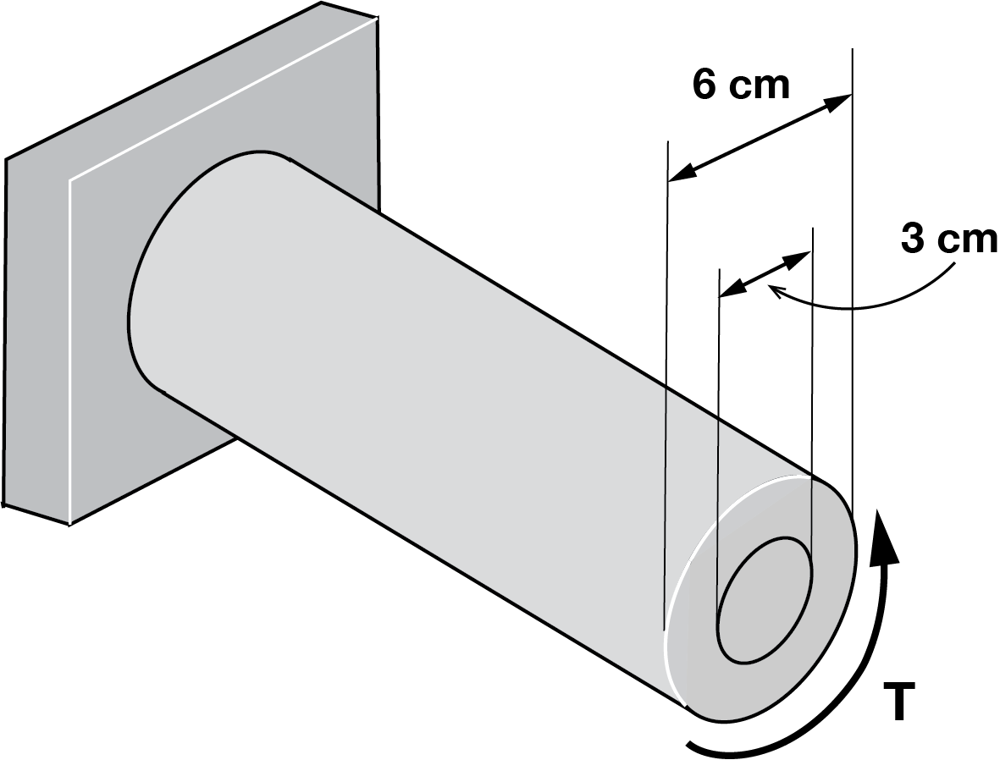
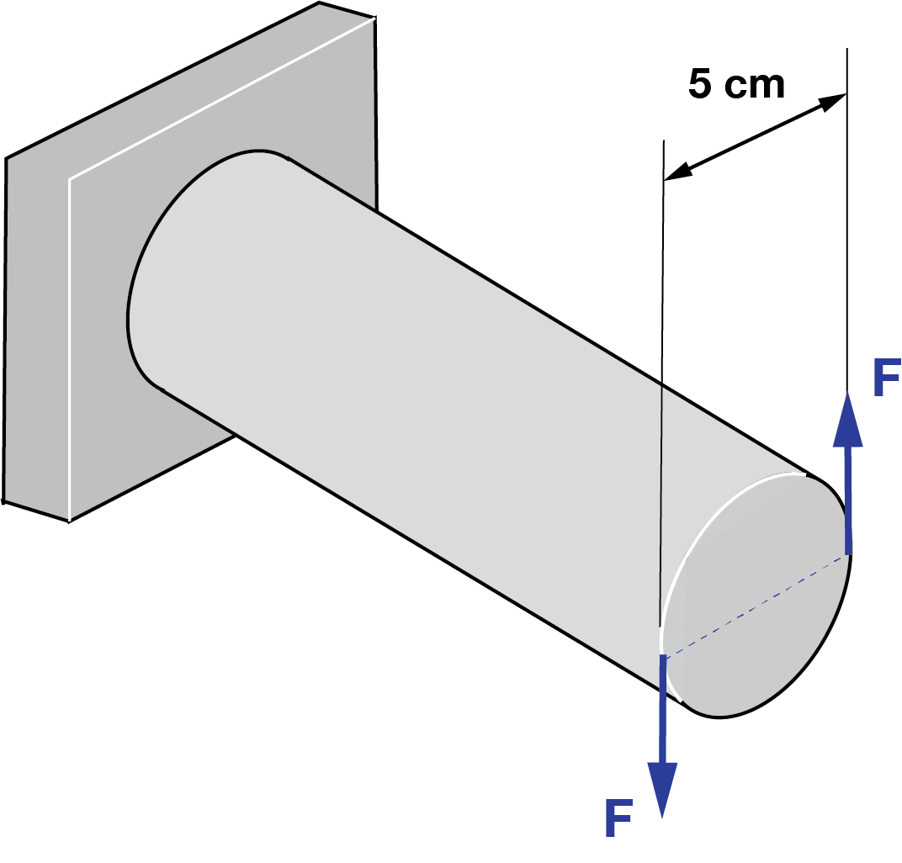
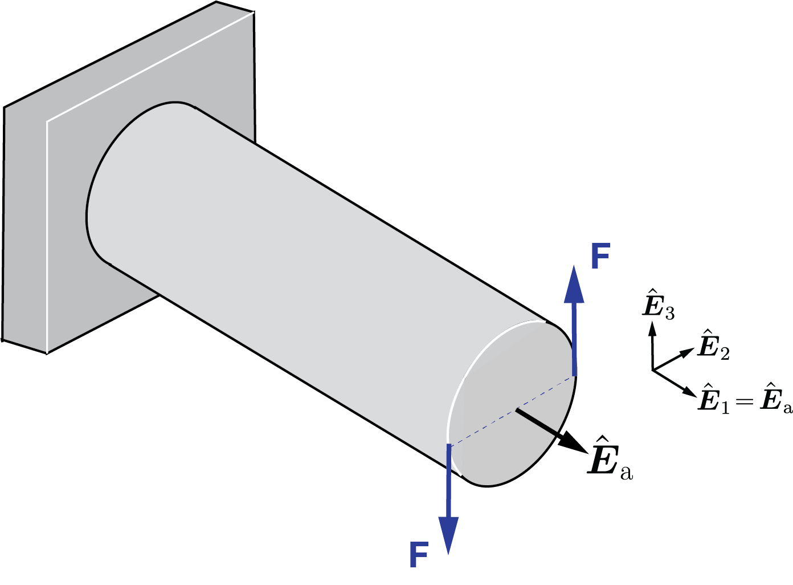
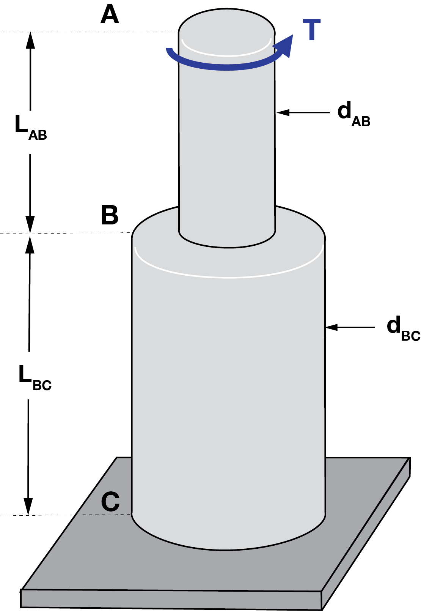
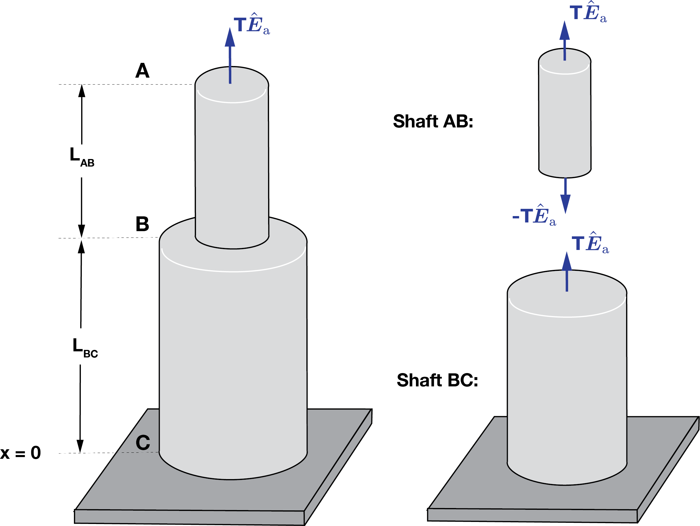
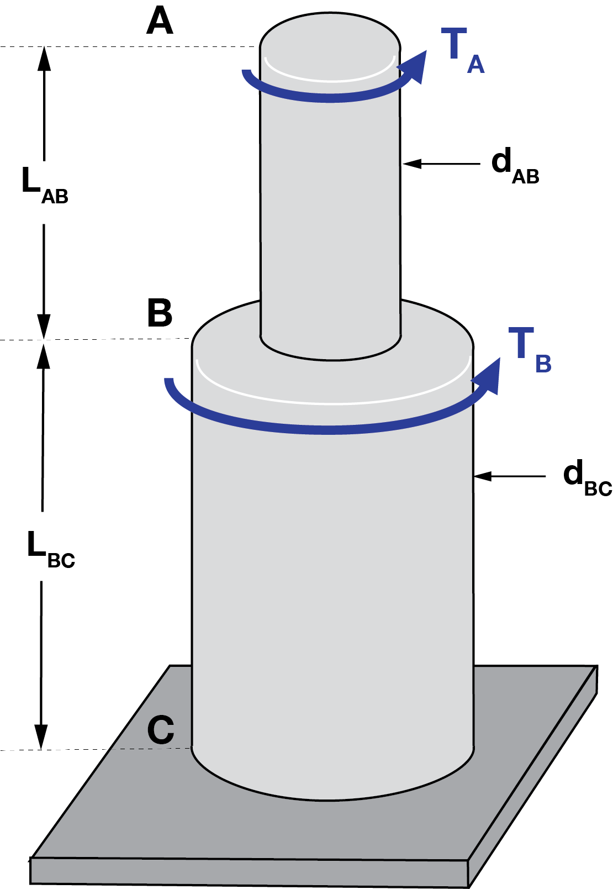
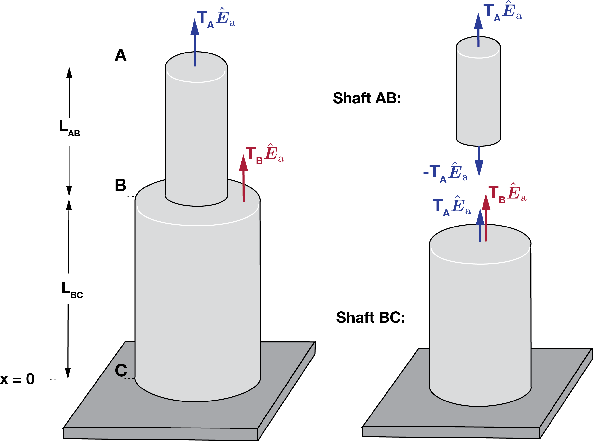




# ENGN0310: Homework 4 Solution

| Materials      | $G ~(\rm{GPa})$ |
|----------------|-----------------|
| Steel          | 77             |
| Titanium alloy | 44             |

**Mathematica file** used to compute the solutions below can be found [here](HW4_calc.nb).

<u> Problem 1 (10 pts) </u>

* Determine the angle of twist $\theta$ when the applied torque is $800~\rm{N \cdot m}$ in a $25~\rm{cm}$ long steel bar, whose cross section is a circle of $4~\rm{cm}$ diameter.
 

   **Solution:**

   The polar moment of inertia [$J$ for a circular cross-section](../../CourseNotes/Torsion/Torsion-J.md) of radius $a$ can be calculated as 

   $$
   \begin{align*}
   J = \frac{\pi}{2}a^4
   \end{align*}
   $$

   Computing $J$ for $a = 2~\rm{cm}$ and simply plugging in $T=800~\rm{N \cdot m}$, $L=25~\rm{cm}$, and $G=77~\rm{GPa}$ for steel,

   $$
   \begin{align*}
   \theta&= \frac{T L}{J G}\\ 
   &= 0.0103347 ~\rm{rad}
   \end{align*}
   $$

   In degrees, $\theta =  0.592137^{\circ}$.
   

<u> Problem 2 (10 pts) </u>

* Consider a solid cylindrical steel shaft of length $15~\rm{cm}$,  whose cross-section is a circle of diameter $2~\rm{cm}$. If the angle of twist at the right face is $\pi/3~\rm{rad}$, what is the torque applied to the shaft?
 

   **Solution:**

   Computing $J$ for $a = 1~\rm{cm}$ and simply plugging in $\theta=\pi/3$, $L=15~\rm{cm}$, and $G=77~\rm{GPa}$ for steel,

   $$
   \begin{align*}
   T&=\frac{G J \theta}{L}\\
   &=8.44~\rm{kN}

   \end{align*}
   $$

<u> Problem 3 (10 pts total) </u>
* (5 pts) (i) What is the ratio of Shear modulus $G$ of the materials of two shafts if the shafts are of the same size and their angle of twist are in the ratio 5/3 when subjected to equal torque?

* (5 pts) (ii) Consider two shafts of different diameters, one made of steel and the other made of titanium alloy. Determine the diameter of each shaft if for both shafts, the applied torque is $240~\rm{N\cdot m}$, length of the shaft is $6~\rm{m}$, and the angle of twist at the end face is $45^{\circ}.$
 

   **Solution:**

   (i) Since $\theta$ is inversely proportional to $G$, the ratio of $G$ of the two materials are 3/5.

   (ii) Given that 
   
    $$
    \begin{align*}
    J &= \frac{T L}{G\theta}= \frac{\pi}{2}a^4
    \end{align*}
    $$

    we can solve for radius $a$ as 
   
   $$
    \begin{align*}
    a &= \left(\frac{2 TL} {\pi G\theta}\right)^{1/4}
    \end{align*}
    $$
   
   <u>Steel</u>: 
   
   Plugging in $T = 240~\rm{N\cdot m}$, $L=6~\rm{m}$, $\theta=\pi/4$, and $G=77~\rm{GPa}$,

   $$
    \begin{align*}
    d&=2a\\
    &=0.022192~\rm m
    \end{align*}
    $$
 

    <u>Titanium alloy</u>: 
    
    Plugging in $T = 240~\rm{N\cdot m}$, $L=6~\rm{m}$, $\theta=\pi/4$, and $G=44~\rm{GPa}$,

    $$
    \begin{align*}
    d&=2a\\
    &=0.0255244~\rm m
    \end{align*}
    $$

<u> Problem 4 (15 pts total) </u>

* A $8~\rm{m}$ long shaft with a circular cross-sectional area of diameter $6~\rm{cm}$ is subjected to a torque of $T = 5~\rm{kN \cdot m}$. 

    * (10pts) (i) If the shaft gets twisted by $30^{\circ}$, what is its shear modulus? 
    * (5pts)(ii) Now, consider that the shaft has an inner core of $3~\rm{cm}$ diameter as shown below. What is the percentage of the torque carried out by this inner core? You can assume that the core is also made out of the same material, and that the inner core undergo the same angle of twist ($30^{\circ}$ at the right end).

    
    

     
    

    

   **Solution:**

   (i) Computing $J$ for $a = 3~\rm{cm}$ and simply plugging in $T = 5~\rm{kN \cdot m}$, $L=8~\rm{m}$, and $\theta=\frac{\pi}{6}$,

   $$
   \begin{align*}
   G&=\frac{T L}{J \theta}\\
   &=60.0~\rm{GPa}
   \end{align*}
   $$

   (ii) Let the torque carried out by the inner core be $T_i$. Then, the expression for $T_i$ is given as 

   $$
   \begin{align*}
   T_i&=\frac{G J_i \theta}{L}\\
   \end{align*}
   $$

   where $J_i$ is the polar moment of inertia of the circular cross-section of radius $a = 1.5~\rm{cm}$.

   The ratio of the torque carried out by the inner core to the applied torque is then

   $$
   \begin{align*}

   \frac{T_i}{T} = \frac{J_i}{J} 
   = \frac{\frac{\pi}{2}(1.5~\rm{cm})^4}{\frac{\pi}{2}(3~\rm{cm})^4}=0.0625
   \end{align*}
   $$

   Hence, $6.25\%$ of the applied torque is carried out by the inner core.

<u> Problem 5 (15 pts total) </u>

* A $3~\rm{m}$ long shaft with a with a circular cross-sectional area of diameter $5~\rm{cm}$ is subjected to a force couple as shown below, where $F = 15~\rm{kN}$. 

    * (5pts) (i) What is the torque $T$ acting on the shaft?    
    * (5pts) (ii)  If the shaft gets twisted by $30^{\circ}$, what is its shear modulus?
    * (5pts) (iii))  Determine the angle of twist half-way along the length of the shaft.

  
    

     
    

   **Solution:**

   (i)  
    

     
    

   Taking the basis as shown above, torque is given as

   $$
   \begin{align*}
   \boldsymbol{T}&=\sum \boldsymbol{r}\times \boldsymbol{F}\\
   &=r\hat{\boldsymbol{E}}_{\rm 2} \times F\hat{\boldsymbol{E}}_{\rm 3}+ r(-\hat{\boldsymbol{E}}_{\rm 2})\times F(-\hat{\boldsymbol{E}}_{\rm 3})\\
   &=2 r\hat{\boldsymbol{E}}_{\rm 2} \times F\hat{\boldsymbol{E}}_{\rm 3} \\
   &= 2 rF\hat{\boldsymbol{E}}_{\rm 1} = 2 rF\hat{\boldsymbol{E}}_{\rm a}
   \end{align*}
   $$

   so that plugging in $r = 2.5~\rm{cm}$ and $F=15~\rm{kN}$, 
   
   $$
   T = 2rF = 750~\rm{N\cdot m}
   $$

   (ii) Computing $J$ for $a = 2.5~\rm{cm}$ and simply plugging in $T = 750~\rm{N \cdot m}$, $L=3~\rm{m}$, and $\theta=\frac{\pi}{6}$,

   $$
   \begin{align*}
   G&=\frac{T L}{J \theta}\\
   &=7.00~\rm{GPa}
   \end{align*}
   $$

   (iii) Since the angle of twist is proportional to $L$, $\theta = 15^\circ$ or $0.262~\rm{rad}$.
   

<u> Problem 6 (20 pts total) </u>
* A smaller steel shaft $\rm{AB}$ of diameter $\rm{d_{AB}}= 50~\rm{mm}$ and length $\rm{L_{AB}}= 1~\rm{m}$ is attached to a larger steel shaft $\rm{BC}$ of diameter $\rm{d_{BC}}= 75~\rm{mm}$ and length $\rm{L_{BC}}= 2~\rm{m}$.  Consider the torque  $\boldsymbol{T}=T \hat{\boldsymbol{E}}_{\rm{a}}$, $T = 3~\rm{kN \cdot m} $ acting at $\rm{A}$ as shown. 

    * (5pts) (i) What are the polar moment of inertia $J$ in shaft $\rm{AB}$ and shaft $\rm{BC}$ respectively?
    * (5pts) (ii) Determine the angle of twist at point $\rm{B}$.
    * (5pts) (iii) Determine the angle of twist at point $\rm{A}$.
    * (5pts) (iv) If the shaft $\rm{BC}$ is made of titanium alloy instead of steel, what is the angle of twist at $\rm{A}$?

     
    

     
    

   **Solution:**

   (i) Simply computing $J$ for $a = 25~\rm{mm}$ and $a=37.5~\rm{mm}$ respectively,

   $$
   \begin{align*}
   J_{AB}&=\frac{\pi}{2}(25~\rm{mm})^4=6.14\times10^{-7} \rm m^4\\
   J_{BC}&=\frac{\pi}{2}(37.5~\rm{mm})^4=3.11\times10^{-6} \rm m^4\\

   \end{align*}
   $$

   (ii) The torque in shaft $\rm BC$ is $T = 3~\rm{kN \cdot m} $. If this isn't intuitive, note that the same thought process that was employed in solving bar problems can also be applied here. If you isolate shaft $\rm AB$, we know from equilibrium that an opposing torque  ($-T\hat{\boldsymbol{E}}_{\rm{a}}$) must be acting at point $\rm B$. It follows then that torque $T\hat{\boldsymbol{E}}_{\rm{a}}$ is acting on shaft $\rm BC$. 

    
    

     
    

   Hence, 

   $$
   \begin{align*}
   \theta_{\rm B}&= \frac{T~L_{\rm{BC}}}{J_{\rm BC}~ G} = \frac{(3 ~\rm{kN\cdot m})(2~\rm m)}{(3.11\times10^{-6} \rm m^4)(77~\rm{GPa})}\\ &= 0.0251 ~\rm{rad}\\
   &=1.44^{\circ}
   \end{align*}
   $$

   Or, 

   $$
   \begin{align*}
   \theta_{\rm B}&= \int_{0}^{L_{\rm BC}}\frac{T(X)}{J(X) G(X)} dx\\
   &= \int_{0}^{L_{\rm BC}}\frac{T}{J_{\rm{BC}} G} dx
   \end{align*}
   $$

   yields the same result.

   (iii) The angle of twist in shaft $\rm AB$ (going from point $\rm B$ to point $\rm A$) can be calculated as

   $$
  \begin{align*}
   \theta_{\rm AB}&= \frac{T~L_{\rm{AB}}}{J_{\rm AB}~ G} = \frac{(3 ~\rm{kN\cdot m})(1~\rm m)}{(6.14\times10^{-7} \rm m^4)(77~\rm{GPa})}\\ &= 0.0635 ~\rm{rad}\\
   &=3.64^{\circ}
   \end{align*}
   $$

   Noting that the angle of twist at point $\rm B$ is $\theta_B=0.0251~\rm rad$, the angle of twist at point A is

   $$
   \begin{align*}
   \theta_{\rm A}&= \theta_{\rm B}+\theta_{\rm{AB}}\\
   &= 0.0886 ~\rm{rad}\\
   &=5.08^{\circ}
   \end{align*}
   $$

   Note that the above approach is equivalent to computing

   $$
   \begin{align*}
   \theta_{\rm A}&= \int_{0}^{L_{\rm AB}+L_{\rm BC}}\frac{T(X)}{J(X) G(X)} dx\\
   &= \int_{0}^{L_{\rm BC}}\frac{T}{J_{\rm{BC}} G} dx +\int_{L_{\rm BC}}^{L_{\rm AB}+L_{\rm AB}}\frac{T}{J_{\rm{AB}} G} dx
   \end{align*}
   $$

   (iv) Following the same steps as $\rm (ii)$&$\rm (iii)$ except that $G=44~\rm{GPa}$ in shaft $\rm BC$,

   $$
   \begin{align*}
   \theta_{\rm A}&= \int_{0}^{L_{\rm AB}+L_{\rm BC}}\frac{T(X)}{J(X) G(X)} dx\\
   &= \int_{0}^{L_{\rm BC}}\frac{T}{J_{\rm{BC}} G_{\rm{Ti}}} dx +\int_{L_{\rm BC}}^{L_{\rm AB}+L_{\rm AB}}\frac{T}{J_{\rm{AB}} G_{\rm{Steel}}} dx\\
   &= \int_{0}^{2}\frac{(3 ~\rm{kN\cdot m})}{(3.11\times10^{-6} \rm m^4)(44~\rm{GPa})} dx +\int_{2}^{3}\frac{(3 ~\rm{kN\cdot m})}{(6.14\times10^{-7} \rm m^4)(77~\rm{GPa})} dx\\
   &=0.107~\rm{rad}\\
   &=6.15^{\circ}
   \end{align*}
   $$

<u> Problem 7 (20 pts total) </u>
* Now, consider a similar problem but with two torques $T_A = 6~\rm{kN \cdot m}$ and $T_B =12~\rm{kN \cdot m}$ acting at $\rm{A}$ and $\rm{B}$ as shown. All other dimensions/quantities remain the same.

    * (5pts) (i) What are the torques acting in shaft $\rm{AB}$ and shaft $\rm{BC}$ respectively?
    * (5pts) (ii) Determine the angle of twist at point $\rm{B}$.
    * (5pts) (iii) Determine the angle of twist at point $\rm{A}$.
    * (5pts) (iv) If the shaft $\rm{BC}$ is made of titanium alloy instead of steel, what is the angle of twist at $\rm{A}$?
 
    
    

     
    

   **Solution:**

   (i) In shaft $\rm AB$,  $T= T_A = 6~\rm{kN \cdot m}$, and in shaft $\rm BC$, $T= T_A+T_B = 18~\rm{kN \cdot m}$ (see figure below.)

    
    

     
    

    

   (ii) Following the exact same thought process as in Problem 6 (ii),  

   $$
   \begin{align*}
   \theta_{\rm B}&= \int_{0}^{L_{\rm BC}}\frac{T(X)}{J(X) G(X)} dx\\
   &= \int_{0}^{L_{\rm BC}}\frac{T_A+T_B}{J_{\rm{BC}} G} dx\\
   &=\frac{(T_A+T_B)L_{\rm{BC}}}{J_{\rm{BC}} G}\\
   &=\frac{(18 ~\rm{kN\cdot m})(2~\rm m)}{(3.11\times10^{-6} \rm m^4)(77~\rm{GPa})}\\ &= 0.0151 ~\rm{rad}\\
   &=8.62^{\circ}
   \end{align*}
   $$ 

   (iii) Following the exact same thought process as in Problem 6 (iii),

   $$
   \begin{align*}
   \theta_{\rm A}&= \int_{0}^{L_{\rm AB}+L_{\rm BC}}\frac{T(X)}{J(X) G(X)} dx\\
   &= \int_{0}^{L_{\rm BC}}\frac{T_A+T_B}{J_{\rm{BC}} G} dx +\int_{L_{\rm BC}}^{L_{\rm AB}+L_{\rm AB}}\frac{T_A}{J_{\rm{AB}} G} dx\\
   &= \frac{(T_A+T_B)L_{\rm{BC}}}{J_{\rm{BC}} G}+\frac{T_A L_{\rm{AB}}}{J_{\rm{AB}} G}\\
   &=\frac{(18 ~\rm{kN\cdot m})(2~\rm m)}{(3.11\times10^{-6} \rm m^4)(77~\rm{GPa})}+\frac{(6 ~\rm{kN\cdot m})(1~\rm m)}{(6.14\times10^{-7} \rm m^4)(77~\rm{GPa})}\\
   &= 0.0277 ~\rm{rad}\\
   &=15.9^{\circ}
   \end{align*}
   $$

   (iv) Following the exact same thought process as in Problem 6 (iv),
   
   $$
   \begin{align*}
   \theta_{\rm A}&= \int_{0}^{L_{\rm AB}+L_{\rm BC}}\frac{T(X)}{J(X) G(X)} dx\\
   &= \int_{0}^{L_{\rm BC}}\frac{T_A+T_B}{J_{\rm{BC}} G_{\rm{Ti}}} dx +\int_{L_{\rm BC}}^{L_{\rm AB}+L_{\rm AB}}\frac{T_A}{J_{\rm{AB}} G_{\rm{Steel}}} dx\\
   &= \int_{0}^{2}\frac{(18 ~\rm{kN\cdot m})}{(3.11\times10^{-6} \rm m^4)(44~\rm{GPa})} dx +\int_{2}^{3}\frac{(6 ~\rm{kN\cdot m})}{(6.14\times10^{-7} \rm m^4)(77~\rm{GPa})} dx\\
   &=0.390~\rm{rad}\\
   &=22.4^{\circ}
   \end{align*}
   $$

