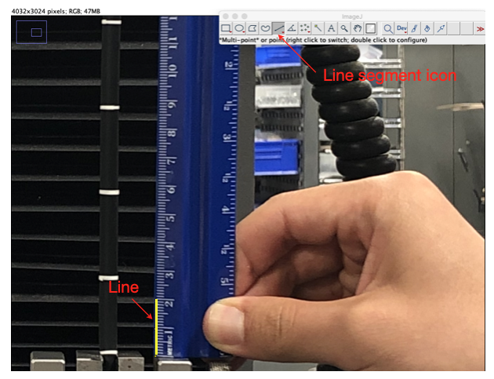
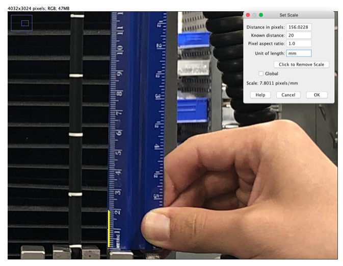
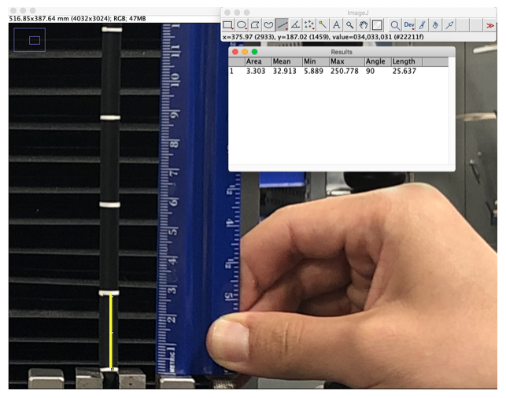



# ImageJ Guidence
* Step 1:  Open your image. Draw line of known length on your image using the line segment (5th) icon, for example, draw a line from $0~\rm cm$ to $2~\rm cm$ of the ruler scale, see figure below.

* Step 2: Click Analyze in the dropdown menu, followed by Set Scale. Put the value of the length of the line and click Ok. Record the converted scale. We will use it for processing remaining images. Here we input $20~\rm mm$, see figure below.

* Step 3: Draw line between two points of which you want to measure the distance on your image. Hit Measure under Analyze after drawing a line to find out the length, angle, etc. of the segment using the measurement scale you specified. Here for example, we want to measure the distance of two marked line , see figure below.

