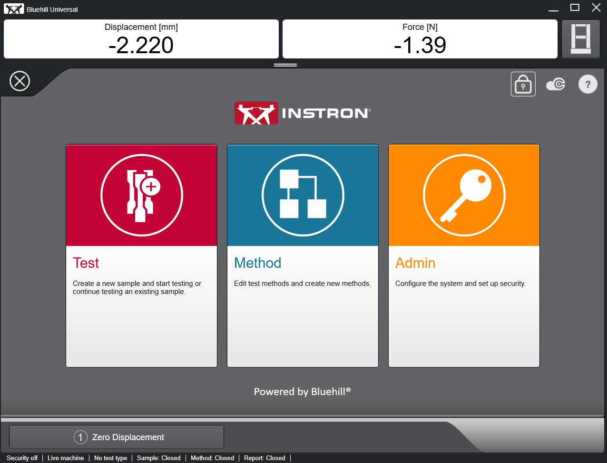
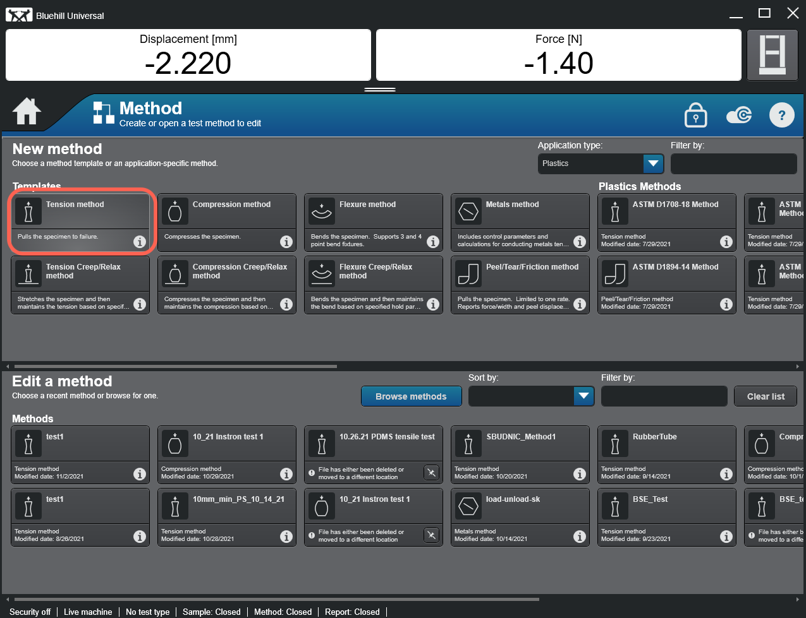
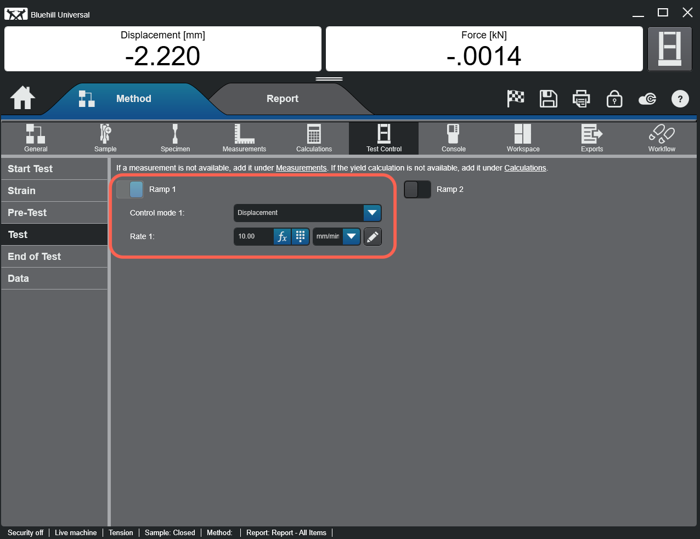
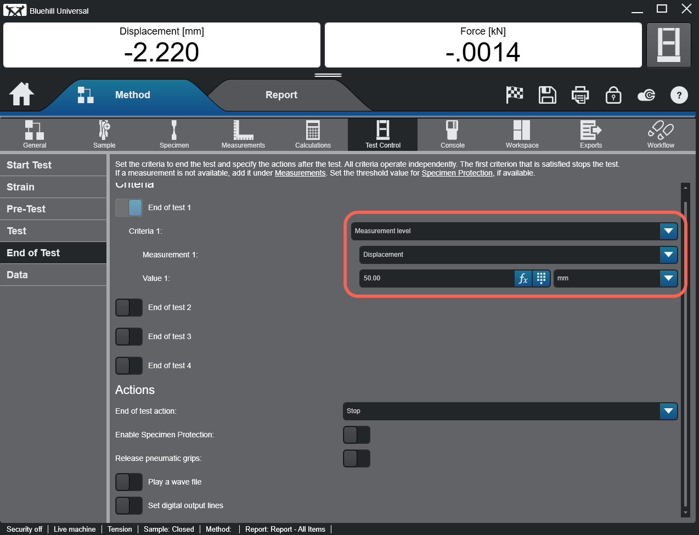
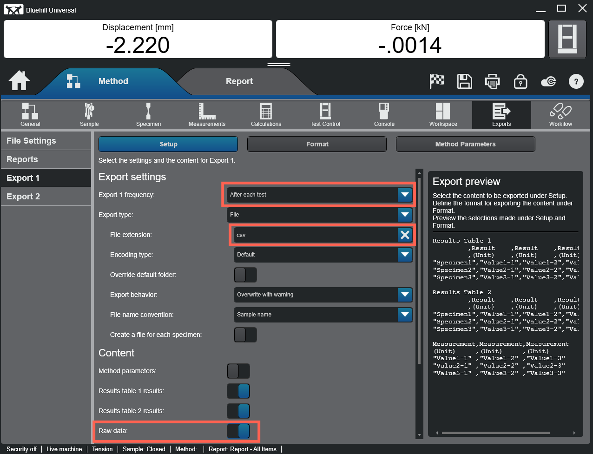
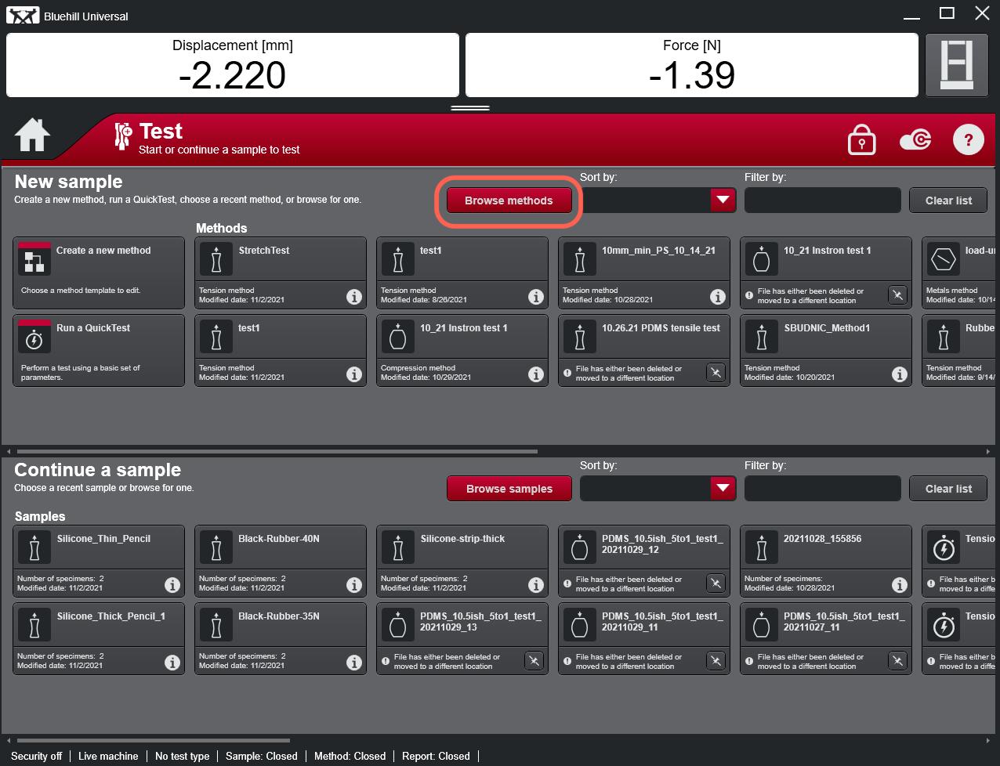

1. When you open the Instron software, the top-menu looks like this. Click on the Method. 

    

2. We want to make a new tension-based method and specify the loading rate, etc. Click on Tension method. 

    

3. Go to the Test Control tab. We want to set the loading rate (displacement-controlled) as 10 mm/min.

    

4. Change the criteria for end of the test. Set it at some relatively high measurement level (beyond what we intend to measure in the experiment), for instance at  50mm, etc, so that the test won't stop before we actually want it to.

    

5. Next, go to the Export tab. This is to ensure we get the raw data output to csv file. Select "After each test" "csv" and ensure that the "Raw data" is switched ON.

    

6. At this point, save the method by clicking the save button on the top right-hand corner. Name your method.

7. Return to the top menu screen by clicking the Home button.

    

8. choose Test. Browse and open the method you just created.

    