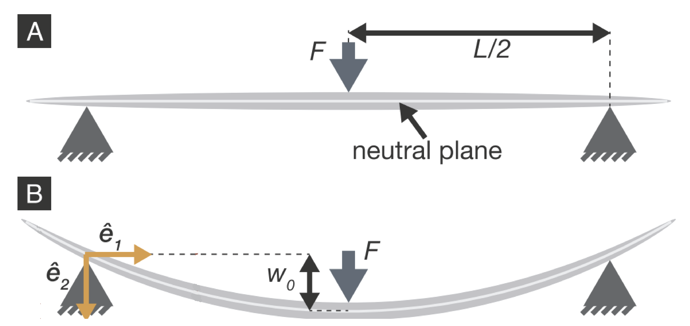

# Lab3: Membrane strain measuring lab

## 1. Introduction and objective
Young's modulus and Poisson's ratio are important mechanical properties of materials. 
Young's modulus quantifies the relationship between tensile stress and corresponding axial strain and predicts how much a material sample extends under tension or shortens under compression.
Poisson's ratio is a measure of the deformation of a material in directions perpendicular to the specific direction of loading.

In this lab, our job is to measure the Young's modulus and Poisson's ratio of a sheet of silicone via uniaxial loading test. We will draw a square on the undeformed sheet (see schematics below). After loading, the square will change to a rectangle. Through measuring the changes of the shape and loading force, we can figure out Young's modulus and Poisson's ratio of the material.

## 2. Location

## 3. Theory

## 4. Equipment and Materials

1. Instron Universal Testing Systems

## 5. Experimental setup

## 6. Data analysis

## 7. Lab report guidelines

## [8. Lab calendar](https://calendar.google.com/calendar/embed?src=c_hobnaabmfreqp84o7qaescmn2g%40group.calendar.google.com&ctz=America%2FNew_York)

<iframe src="https://calendar.google.com/calendar/embed?src=c_hobnaabmfreqp84o7qaescmn2g%40group.calendar.google.com&ctz=America%2FNew_York" style="border: 0" width="800" height="600" frameborder="0" scrolling="no"></iframe>

