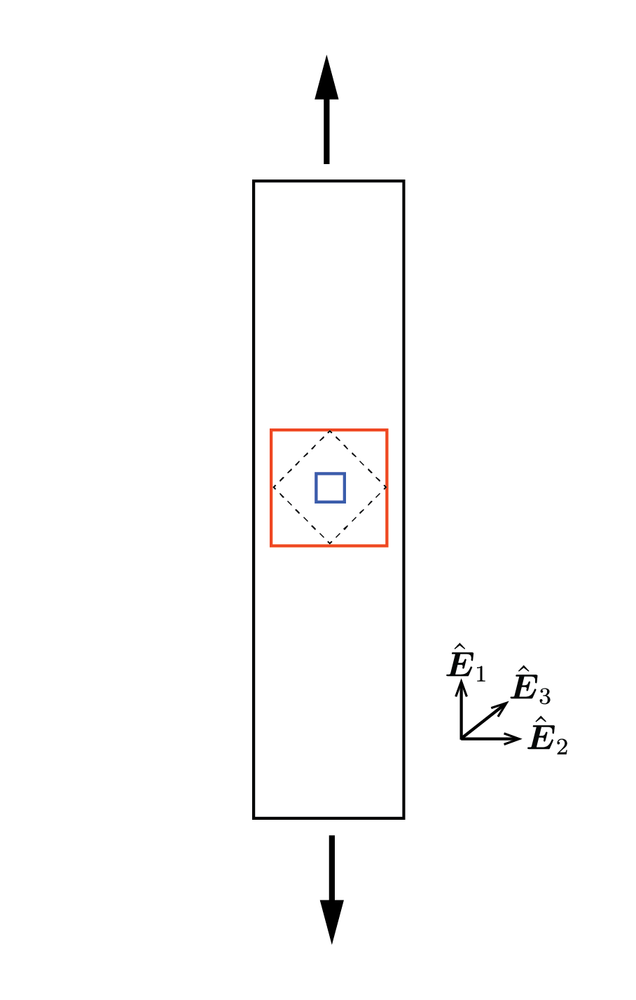
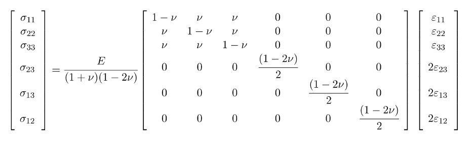
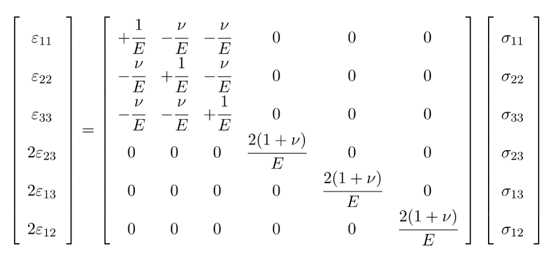




# Lab2: Stress-strain measuring lab

## 1. Introduction and objective
Stress/strain tensors are concepts that help us describe the stress state and deformation  of the material, much like how in 1D-case of a bar under uniaxial tension, we were able to fully describe its state through the two values, stress ($\frac{F}{A}$) and strain($\frac{\delta}{L}$). 

Now recall that in 1D-case, we only needed Young's modulus to relate stress ($\frac{F}{A}$) to strain ($\frac{\delta}{L}$). How do we relate stress tensor to strain tensor? To describe the relation between stress and strain tensors, we actually need two material properties. With this motivation, we will introduce another material property, Poisson's ratio, which is a measure of the deformation of a material in a direction perpendicular to specific loading.

In this lab, you will be given a silicone strip with three squares drawn on it, as shown below. We will put this under uni-axial tension to 1) become familiar with the concept of stress/strain tensors, and 2) see and measure the Poisson's effect in action.

For the purpose of this lab, don't worry about the angled (dotted) square. Just focus on the largest (red) and the smallest (blue) one.

Through tensile test and image analysis, you will find the
1. Stress field
2. Strain field
3. Young's modulus
4. Poisson's ratio

of the silicone strip.

 

## 2. Location 

Brown Design Workshop 

## 3. Theory

Stress components are related to strain components as

This is equivalent to writing

Don't worry if this looks complicated.
When the dimension of the material is much smaller in one direction compared to others, the stress in that direction is negligible compared to those in the other two directions. In such case, you can assume a plane-stress condition, in which you can take $\sigma_{13}=\sigma_{23}=\sigma_{33}=0$. 

Under this assumption, the stress tensor-strain tensor relationship can be simplified to:

$$
\begin{bmatrix}
\sigma_{11} \\
\sigma_{22}\\
\sigma_{12}
\end{bmatrix}

=
\frac{E}{1-\nu^2}
\begin{bmatrix}
1 & \nu & 0 \\
\nu & 1 &  0 \\
0 & 0 & 1-\nu
\end{bmatrix}

\begin{bmatrix}
\epsilon_{11} \\
\epsilon_{22} \\
\epsilon_{12} 
\end{bmatrix}
$$

and 

$$
\begin{bmatrix}
\epsilon_{11} \\
\epsilon_{22} \\
\epsilon_{12} 
\end{bmatrix}

=
\frac{1}{E}
\begin{bmatrix}
1 & -\nu & 0 \\
-\nu & 1 &  0 \\
0 & 0 & 1+\nu
\end{bmatrix}

\begin{bmatrix}
\sigma_{11} \\
\sigma_{22}\\
\sigma_{12} 
\end{bmatrix}
$$

$$
\epsilon_{33}=\frac{-\nu}{E}(\sigma_{11}+\sigma_{22})
$$

where $E$ is Young's modulus, and $\nu$ is the Poisson's ratio. You will obtain both $E$ and $\nu$ from the experiment.

 

## 4. Equipment and Materials

1. Instron 500N 5942 testing machine
2. Silicone strip
    * Length:
    $150~\rm mm$ 
    * Width: $2.54~\rm mm$
    * Thickness: $3.175 \rm mm$
    * Young' Modulus: $1-5~\rm MPa$
    * Poisson's ratio $0.48~0.495$
3. Phone
4. Others: vernier caliper and regular ruler.

    (All materials/equipments will be provided except for the phone)

    

## 5. Experimental Procedure 

### <b> Steps :  </b>

  (a) You will each be given a silicone strip. Measure its length, width, and thickness using the vernier caliper and the ruler provided.

  (b) Clamp the ends of the strip to the Instron machine.
  
  (c) Set up the Instron machine for tensile  testing at displacement rate of $10~\rm mm/min$ (see [operation of Instron](Instron.md)). You will obtain a csv file containing the raw data (force vs displacement).

  (d) Set up your phone by the silicone strip and take a picture of the strip before starting the tensile test. Make sure you don't move the phone until after you finish taking picture of the deformed strip in the next step.

  (d) Start test, and take the picture of the strip at $10~\rm N$.

  

  

  

  

 
 

## 6.1 Tasks and Analysis -Large square-

### <b> Task 1A: Compute each component of stress tensor </b>
As discussed in Theory section, we can take $\sigma_{13}=\sigma_{23}=\sigma_{33}=0$. What are the values of the remaining components,  $\sigma_{11}, \sigma_{12}$, and $\sigma_{22}$? 
>Hint: You can take $\sigma_{22}$ to be 0. Can you give a reason why?

 
 

### <b> Task 2A: Find the values of $\epsilon_{11}$, and $\epsilon_{22}$, and $\epsilon_{12}$. </b>
Use ImageJ to analyze the deformation, as you've done before in the previous lab. What are the values of $\epsilon_{11}$ and $\epsilon_{22}$? What value does $\epsilon_{12}$ have? 

***
Now you will find the material properties of the sample
***
### <b> Task 3A:  Compute Young's modulus </b>
Take the raw csv file from the experiment and plot the stress-strain curve. Find the best fit of the plotted curve. Is the value that you found in a reasonable range?

### <b> Task 4A:  Compute Poisson's ratio </b>
Now you can solve for the value of $\nu$. You can start by looking at the stress-strain relation. In particular, it will be the easiest to look at

$$
\sigma_{22}=\frac{E}{1-\nu^2}(\nu \epsilon_{11}+\epsilon_{22})
$$

In general, rubber is considered a nearly incompressible material, meaning its Poisson ratio values is very close to 0.5. Is the value from your experiment close to 0.5?

### <b> Task 5A:  Complete the strain tensor </b>
Is there any other non-zero component of the strain tensor that you have not considered yet? Compute any that you think should be non-zero using the stress-strain relation given above in the Theory section.

 

## 6.2 Tasks and Analysis -Small square-

***
You will now compute the stress/strain tensor components for the small square.
***

### <b> Task 1B: Find the values of $\epsilon_{11}$, and $\epsilon_{22}$, and $\epsilon_{12}$. </b>
Use ImageJ to analyze the deformation and provide the three values.

 
 

### <b> Task 2B:  Compute each component of the strain tensor </b>
The assumption $\sigma_{13}=\sigma_{23}=\sigma_{33}=0$ is still valid. What are the values of the remaining components,  $\sigma_{11}, \sigma_{12}$, and $\sigma_{22}$?

> Note that $\sigma_{22}$ is a non-zero value. Write a sentence or two on why it might be more reasonable to assume a non-zero value in this case (you won't get points taken off for not getting this)

> Hint: You can take the values of $E$ and $\nu$ you computed in Tasks 3A and 4A. 

***
Now you will find the material properties of the sample
***
### <b> Task 3B:  Rest of the strain tensor components </b>
Are there any non-zero components that has not been considered yet? Compute the values if there is any.

 

## 7. Lab report guidelines
1. The lab report should be written as a single, professional-prepared document for each student. 
Please organize your report using the structure given on the next Section: Lab report organization. 
Please use International System of Units (SI), for example using meter and kilogram instead of inch and pounds.

2. There should be a **cover page** that contains the title of the lab, name of the author, name of the group members, date, and the name of the class. 

3. **Plots should look professional**. There should be no auto-generated Excel plots. Any figures should have a caption explaining the purpose of the figure and labeled axes with units, all in readably large text. Specific things to avoid are shadow on line plots, having grid lines on only one axis, and unnecessary overuse of color. Points will be deducted if your plots do not look professional. 

4. Tabulated raw data should be included in the appendices, not in the body of the report. Additional figures not essential to the body of the report may be included in the appendices as well. Make sure to cite (refer to) every picture (appendix and body alike) in your report.

5. A good resource for lab report preparation is the Mayfield Handbook of Technical and Scientific Writing (https://www.mit.edu/course/21/21.guide/).
<!--(http://www.mhhe.com/mayfieldpub/tsw/home.htm)-->

6. Lab reports should be submitted electronically on Canvas in PDF format. No paper reports will be accepted.

 

## 7. Lab report organization 

1. **Introduction**: Write a brief statement describing the purpose of the lab.

2. **Methods and Materials**: Describe the experimental setup and procedural details for the experiment.

3. **Results and Discussion**:
* Following the Data analysis section in Tasks 1-4, generate plots showing your experimental results.
* For each task, discuss the theoretical aspect that allows you to relate different measurements you obtained, for example, the relationship between force and displacement in Task 1. 
* Discuss any possible sources of error.

4. **Conclusion**: Write a brief statement describing your conclusions and what you learned in the lab.

5. **Appendices**: Include tables of your raw data, detailed calculations, and other information/figures that you deem pertinent but non-essential to the body of your report.

 

## [8. Lab calendar](https://calendar.google.com/calendar/embed?src=c_ftk0rj4uauudpfmcmm22plq5ig%40group.calendar.google.com&ctz=America%2FNew_York)

<iframe src="https://calendar.google.com/calendar/embed?src=c_ftk0rj4uauudpfmcmm22plq5ig%40group.calendar.google.com&ctz=America%2FNew_York" style="border: 0" width="800" height="600" frameborder="0" scrolling="no"></iframe>

