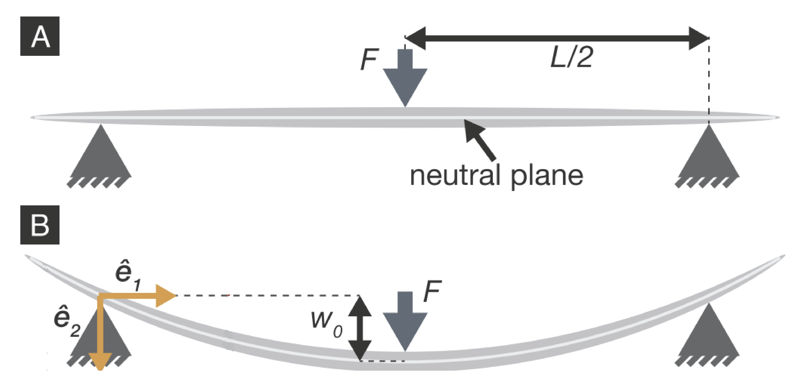




# Lab3: Three point bending testing lab

## 1. Introduction and objective
In applied mechanics, bending characterize the behavior of a slender structural element, like a bar, subjected to an lateral load, that is, forces or moments having their vectors perpendicular to the  axis of the element.
There are many classical bending theories to analyze the bending behavior of materials, such as Euler-Bernoulli bending theory, which we will cover in the class.

In this lab, we will conduct a three point bending test on spagetti and compare the deflection with the predicted deflection from the theory (see schematics below).
Through the test, we also want to obtain the Young's modulus and flexural strength of the spagetti.

 

## 2. Location
Brown Design Workshop
   

## 3. Theory
### a) Deflection formula of a beam under three point bending test
   

### b) Deflection of the middle position of a beam under three point bending test

   

### c) Flexural strength 

   

## 4. Equipment and Materials

1. Instron 500N 5942 testing machine
2. Spagetti
3. Phone
4. Others: vernier caliper and regular ruler.

    (All materials/equipments will be provided except for the phone)

    

## 5. Experimental setup and tasks

### Task 1: Calculate the Young's modulus of the spagetti 

#### <u>Steps: </u>

(a) You will be given a spaghetto. Measure its diameter using the vernier caliper provided. Then mark three positions of spaghetto using marker pen. We will apply loads on these three positions. The distance between neighboring points is $ 20~\rm mm$

(b) Place the spaghetto on the fixture following the marked line made in (a).

(c) Set up the Instron machine for compression testing at displacement rate of $5~\rm mm/min$ and the end condition as $30 ~\rm mm $.

(d) Start test until the spaghetto fails.

(e) Save the raw data of displacement and loading force time series

  

#### <u>Data analysis: </u>
 * Plot the force vs. displacement curve.

 * Choose 5 points of the curve, whose displacement is $3,4,5,6,7,8 ~\rm mm$, respectively. Then calculate and plot the Young's modulus of each point. Is the Young's modulus constant? Add a horizontal line to fit the data.

 * Calculate the Young’s modulus as an average of the computed values.

   

### Task 2: Calculate the flexural strength of the spagetti 

#### <u>Data analysis: </u>
 * From the plot of force vs. displacement of the spagetti, calculate the flexural strength.

   

### Task 3: Compare the deflection of the spagetti under 3 point bending test with the predicted deflection from the theory

#### <u>Steps: </u>

(a) You will each be given a spaghetto. Measure its diameter using the vernier caliper provided. Then mark three positions denoted as $A, B, C$ of spaghetto using marker pen from left to right. We will apply loads on these three positions. The distance between neighboring points is $ 20~\rm mm$. 

(b) Mark multiple positions on the spagetti from point $A$ to point $C$ with uniform distance. The distance is $\frac{1}{6} L$, where L is the length of $AC$.

(c) Place the spaghetto on the fixture following the marked points ($A, B, C$) made in (a).

(d) Fix a camera at a certain distance from the spagetti. You can choose any camera you'd like as long as you can transfer the images to your computer. Your phone would be a good choice and we will provide a tripod to hold the camera. Next to your spagetti, place a ruler or an object of known length, and make sure that both the spagetti and your ruler or object are in focus on your camera. (You will use the image of the ruler or object later to calibrate your pixel to millimeter conversion). 

(e) Take a picture of the spagetti before loading.

(f) Apply displacement of $4~\rm mm$ using the fine control jog on the Instron control panel. Record the displacement reading displayed on the panel and take a picture of the deformed spagetti. 

(g) Repeat step (f) for the displacement of $8~\rm mm$.

#### <u>Data analysis: </u>
  * For each displacement loading, you have two pictures of the specimen, before and after loading. You can measure the deflection of each marked position using ImageJ, which can be downloaded [here](https://imagej.nih.gov/ij/download.html). See [Detailed guidance to using ImageJ](ImageJguide.md) for how to use the software.

  * Plot the deflection of each mark against its position, In the same figure, add a plot of deflection formula from the beam theory. Choose $\frac{X}{L}$ as the x-variable, where $X$ is the position of the mark and $X=0$ for the point A. 

   

## 6. Lab report guidelines
1. The lab report should be written as a single, professional-prepared document for each student. 
Please organize your report using the structure given on the next Section: Lab report organization. 
Please use International System of Units (SI), for example using meter and kilogram instead of inch and pounds.

2. There should be a **cover page** that contains the title of the lab, name of the author, name of the group members, date, and the name of the class. 

3. **Plots should look professional**. There should be no auto-generated Excel plots. Any figures should have a caption explaining the purpose of the figure and labeled axes with units, all in readably large text. Specific things to avoid are shadow on line plots, having grid lines on only one axis, and unnecessary overuse of color. Points will be deducted if your plots do not look professional. 

4. Tabulated raw data should be included in the appendices, not in the body of the report. Additional figures not essential to the body of the report may be included in the appendices as well. Make sure to cite (refer to) every picture (appendix and body alike) in your report.

5. A good resource for lab report preparation is the Mayfield Handbook of Technical and Scientific Writing (https://www.mit.edu/course/21/21.guide/).
<!--(http://www.mhhe.com/mayfieldpub/tsw/home.htm)-->

6. Lab reports should be submitted electronically on Canvas in PDF format. No paper reports will be accepted.

 

## 7. Lab report organization 

1. **Introduction**: Write a brief statement describing the purpose of the lab.

2. **Methods and Materials**: Describe the experimental setup and procedural details for the experiment.

3. **Results and Discussion**: Complete all tasks, comment on the associated theoretical aspect, and discuss any possible sources of error.

4. **Conclusion**: Write a brief statement describing your conclusions and what you learned in the lab.

5. **Appendices**: Include tables of your raw data, detailed calculations, and other information/figures that you deem pertinent but non-essential to the body of your report.

 

## [8. Lab calendar](https://calendar.google.com/calendar/embed?src=c_ftk0rj4uauudpfmcmm22plq5ig%40group.calendar.google.com&ctz=America%2FNew_York)

<iframe src="https://calendar.google.com/calendar/embed?src=c_ftk0rj4uauudpfmcmm22plq5ig%40group.calendar.google.com&ctz=America%2FNew_York" style="border: 0" width="800" height="600" frameborder="0" scrolling="no"></iframe>

