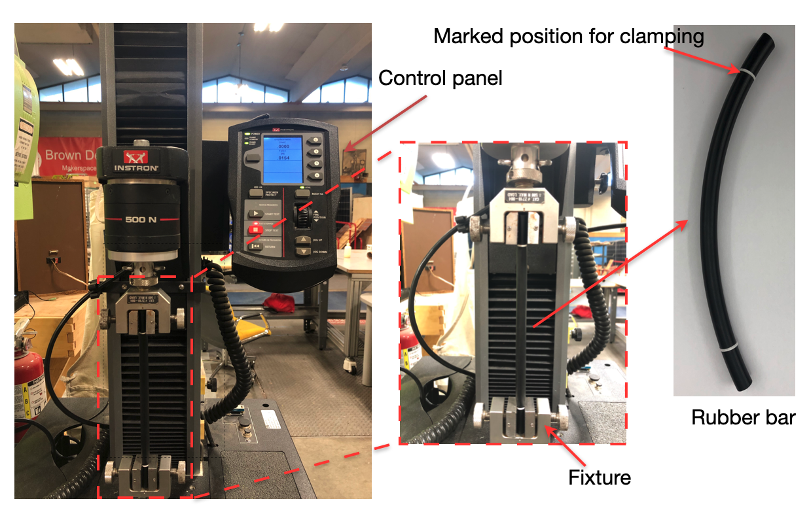
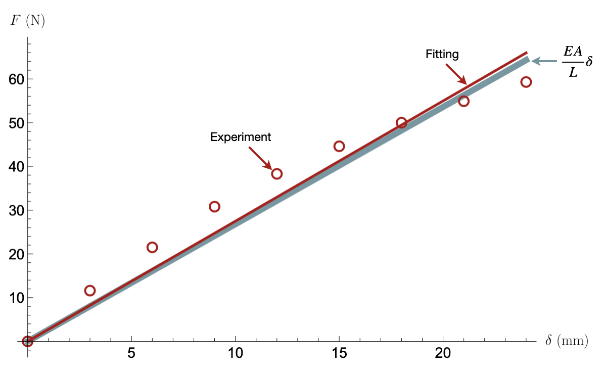




# Lab1: Uniaxial tensile testing lab

## 1. Introduction and objective
Designing mechanical structures requires an understanding of the mechanical behaviors of the material consisting them. Generally, to determine how materials behave under loading, we perform tests using universal testing machines like those shown below.
The usual procedure involves taking a small section of the material of interest and applying controlled loads to measure their deformation (such as changes in length and diameter), or vice versa. 

In this lab, we will study the mechanical behavior of the materials through uniaxial tensile testing. We will test rubber rods with varying length and cross-sectional area (see schematics below).

The measurements acquired through the experiment will answer the following questions:
1. How does the length of the specimen change when applying different loads?
2. What is the displacement field of a rubber bar under uniaxial tensile testing?
3. For specimens of the same material but in different geometry, will they have the same mechanical behaviors?

 

## 2. Location 

Brown Design Workshop 

## 3. Theory
* [Hooke's law for the bar](../CourseNotes/Bars/Bars.md)
* [Displacement field within the bar](../CourseNotes/Bars/Bars3.md)

## 4. Equipment and Materials

1. Instron 500N 5942 testing machine
2. Buna-N rubber cord
    * Length:
    $100, 150, 200~\rm mm$ 
    * Diameter: $6.35, 9.525, 12.7~\rm mm$
    * Young' Modulus: $4~\rm MPa$
    * Tensile strength: $4.9987~\rm MPa$
3. Recording system: phone and tripod
4. Others: vernier caliper and regular ruler.

    (All materials/equipments will be provided except for the phone)

    

## 5. Experimental setup and data analysis

### <b> Task 1: Measure the force and the displacement of a rubber bar under uniaxial tensile testing </b>

#### <u>Steps: </u>
  (a) Choose a rubber bar and measure its length and diameter using the vernier caliper and the ruler provided.

  (b) Clamp the ends of the bar to the Instron machine aligning the marks on the bar to the fixture.

  
  (c) Apply displacement of $3~\rm mm$ using the fine control jog on the Instron control panel. Wait for 2 minutes and record the force reading displayed on the panel (see the note below for the reason this 2-minute wait is required)

  (d) Repeat step (c) for the following displacements: $6, 9, 12, 15, 18, 21, 24 ~\rm mm$

  > *NOTE: Not all materials behave like an ideal spring-like material. Buna-N rubber is an example of such material, so that its instantaneous response to applied displacement deviates from such idealized behavior. This deviation diminishes over time. Therefore, to record its stable elastic deformation, we need to wait for some time. Based on our preliminary testing, 2 minutes was found to be sufficient. 

  

#### <u>Data analysis </u>
 * Plot the force vs. displacement curve. Is the data linear? In the same figure, add a line to fit the data.

 

  

 

### <b> Task 2: Calculate the Young's modulus $E=\frac{FL}{A\delta}$ of the rubber bars </b>

#### <u> Steps </u>
  (a) 9 rubber bars of varying length $L$ and diameter $D$ (see figure below) will be provided. Measure the dimensions of each bar.

  (b) For each rubber bar, clamp the ends of the bar to the Instron machine aligning the marks to the fixture, and apply a displacement of $\delta=15~\rm mm$. Wait for 2 minutes and record the resulting force $F$. 

  (c) Repeat step (b) for the remaining rubber bars.

#### <u>Data analysis </u>
   * For each bar, calculate the term $\frac{FL}{A\delta}$, where $A$ is cross-sectional area of the rubber bar.

   * Plot the value of $\frac{FL}{A\delta}$ vs. length of bar. Is $\frac{FL}{A\delta}$ constant? 
   Add a horizontal line to fit the data (see the figure below for example).

   * Calculate the Young's modulus as an average of the computed values.

 

### <b> Task 3: Determine the displacement field of rubber bar under uniaxial tensile test </b>

#### <u> Steps </u>

  (a) Choose a rubber bar and measure its length $L$ and diameter $D$. The bar is marked at several positions.

  (b) Clamp the ends of the bar to the Instron machine aligning the outer-most marks to the fixture. 
  
  (c) Fix a camera at a certain distance from the bar. You can choose any camera you'd like as long as you can transfer the images to your computer. Your phone would be a good choice and we will provide a tripod to hold the camera. Next to your bar, place a ruler or an object of known length, and make sure that both the bar and your ruler or object are in focus on your camera. (You will use the image of the ruler or object later to calibrate your pixel to millimeter conversion). 

  (d) Take a picture of the bar before loading.

  (e) Stretch the bar to the displacement of $\delta=20~\rm mm$, wait 2 minutes, and record the corresponding force and take a picture of the deformed bar.

#### <u>Data analysis </u>
   * Now you have two pictures of the specimen, before and after loading. You can measure the displacement of each marked position using ImageJ, which can be downloaded [here](http://rsbweb.nih.gov/ij/download.html). See [Detailed guidance to using ImageJ](ImageJguide.md) for how to use the software.

<!--
     * Download and open ImageJ (download from http://rsbweb.nih.gov/ij/download.html) . Open your the image. Click Analyze in the dropdown menu, followed by Set Scale. You can put in the scale to convert pixels to mm or cm use a fixed object (ruler) for the scale conversion.

     * From here, draw line on your image using the line segment (5th) icon. Hit Measure under Analyze after drawing a line to find out the length, angle, etc. of the segment using the measurement scale you specified.
-->

   * Plot the displacement of each mark against its original position. Set the position of the bottom marked line of the bar as $X=0$. From the class, we know that the displacement field of the bar under uniaxial tension is $U(X)=\delta\frac{X}{L}$. In the same figure, add a plot of function $U$ such that $U(X)=\delta\frac{X}{L}$, where $\delta$ and $L$ are determined from the experiment (see figure below for example). 

 

### <b> Task 4: Validate Hooke's law for the rubber bar </b>

#### <u>Data analysis </u>

* Following Task 1, add a plot of function $F$ such that $F(\delta)=\frac{EA}{L}\delta$, where $E$ is the Young's modulus of the rubber calculated from Task 2, and $A$ and $L$ are as measured in Task 1 (see figure below for example).

 

## 6. Lab report guidelines
1. The lab report should be written as a single, professional-prepared document for each student. 
Please organize your report using the structure given on the next Section: Lab report organization. 
Please use International System of Units (SI), for example using meter and kilogram instead of inch and pounds.

2. There should be a **cover page** that contains the title of the lab, name of the author, name of the group members, date, and the name of the class. 

3. **Plots should look professional**. There should be no auto-generated Excel plots. Any figures should have a caption explaining the purpose of the figure and labeled axes with units, all in readably large text. Specific things to avoid are shadow on line plots, having grid lines on only one axis, and unnecessary overuse of color. Points will be deducted if your plots do not look professional. 

4. Tabulated raw data should be included in the appendices, not in the body of the report. Additional figures not essential to the body of the report may be included in the appendices as well. Make sure to cite (refer to) every picture (appendix and body alike) in your report.

5. A good resource for lab report preparation is the Mayfield Handbook of Technical and Scientific Writing (http://www.mhhe.com/mayfieldpub/tsw/home.htm).

6. Lab reports should be submitted electronically on Canvas in PDF format. No paper reports will be accepted.

 

## 7. Lab report organization 

1. **Introduction**: Write a brief statement describing the purpose of the lab.

2. **Methods and Materials**: Describe the experimental setup and procedural details for the experiment.

3. **Results and Discussion**:
* Following the Data analysis section in Tasks 1-4, generate plots showing your experimental results.
* For each task, discuss the theoretical aspect that allows you to relate different measurements you obtained, for example, the relationship between force and displacement in Task 1. 
* Discuss any possible sources of error.

4. **Conclusion**: Write a brief statement describing your conclusions and what you learned in the lab.

5. **Appendices**: Include tables of your raw data, detailed calculations, and other information/figures that you deem pertinent but non-essential to the body of your report.

 

## [8. Lab calendar](https://calendar.google.com/calendar/embed?src=c_ftk0rj4uauudpfmcmm22plq5ig%40group.calendar.google.com&ctz=America%2FNew_York)

<iframe src="https://calendar.google.com/calendar/embed?src=c_ftk0rj4uauudpfmcmm22plq5ig%40group.calendar.google.com&ctz=America%2FNew_York" style="border: 0" width="800" height="600" frameborder="0" scrolling="no"></iframe>

