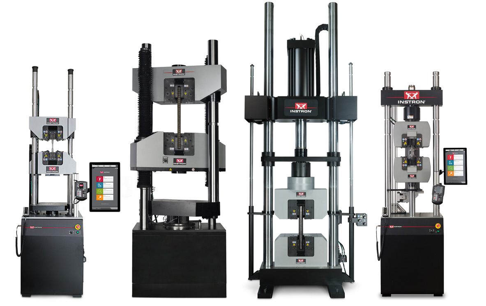




# Lab1: Uniaxial tensile testing lab

## 1. Introduction and objective
The design of material of structures so that they function properly requires an understanding of the mechancial behavior of the materials being used. Generally, to determine how materials behave when they are subjected to loads, we perform experiments using testing machines (see the figure below). 
The usual procedure is to take a small specimen of the material, put the specimen in testing machines, apply the loads, and then measure the deformations(like the changes in length and diameters).

In this lab, we will test the mechancial behavior of the materials via uniaxial tensile testing. We will test the rubber rods with different length and area ( see schematics below).

Through the lab, we are going to answer:
1. how does the length of the specimen change when applying different loads?

2. how to determine the strain of a point of the specimen? and how the strain of a point relates to the corresponding displacement?

3. For specimens of the same material but in different geometry, will they have the same mechanical behaviors?

## 2. Location
Brown Design Workshop

## 3. Theory
* [Hooke's law for the bar](../CourseNotes/Bars/Bars.md)

* [Displacement field within the bar](../CourseNotes/Bars/Bars3.md)

## 4. Equipment and Materials

1. Instron 500N 5942 testing machine
2. Buna-N rubber cord
    * Length:
    $100, 150, 200~\rm mm$ 
    * Diameter: $6.35, 9.525, 12.7~\rm mm$
    * Young' Modulus: $4~\rm MPa$
    * Tensile strength: $4.9987~\rm MPa$
3. Recording system: phone and tripod
4. Others: vernier caliper and regular ruler.

## 5. Experimental setup and data analysis

### Task 1: Measure the force and the displacement of a rubber bar under uniaxial tensile testing (see figure below)

#### Steps
  (a) Choose a rubber bar and measure the length and diameter of the bar using vernier caliper and regular ruler provided.

  (b)Clamp the ends of the bar to Instron machine follwing the marks on the bar using the fixture.

  (c) Proceed to load with specific displacement at $3, 6, 9, 12, 15, 18, 21, 24 ~\rm mm$ using Instron control panel.

  (d) For each applied displacement loading, record the corresponding force after waiting for 2 minutes (Rubber is kind of polymeric materials. To record the stable elastic deformation of rubber when applying load on it, we need wait for a while when the rubber is fully relaxed. Based on our experience, 2 minutes is enough). 

  

#### Data analysis
 * Plot the force vs. displacement. Is the data linear? Add a straight line to fit the plot (see the figure below for example).

 

  

### Task 2: Calculate Young's modulus $E=\frac{FL}{A\delta}$ of rubber bar

#### Steps
  (a) Choose 9 rubber bars of various length $L$ and various diameter $D$ (see figure below) and measure the length and diameter of each bar.

  (b) For each bar, clamp the ends of the bar to Instron machine follwing the marks on the bar using the fixture and stretch the bar to the displacememt of $\delta=15~\rm mm$, record the resulting force $F$ after waiting for 2 minutes.

  (c) Repeat Step (b) for each rubbar bar.

#### Data analysis
   * For each bar, calculate the term $\frac{FL}{A\delta}$, where $A$ is the area of cross section the rubber bar and $A=(\frac{D}{2})^2\pi$

   * Plot the value of $\frac{FL}{A\delta}$ vs. length of bar. Is $\frac{FL}{A\delta}$ constant? 
   Add a horizontal line to fit the plot (see the figure below for example).

   * Calculate the Young's modulus by choosing the averaged values of each bar.

### Task 3: Determine the displacement field of rubber bar under uniaxial tensile test

#### Steps
  (a) Choose a rubber bar and measure its length $L$ and diameter $D$. The bar was marked at different position. You will later measure the displacements of each marked position.

  (b)Clamp the ends of the bar to Instron machine follwing the marks on the bar using the fixture.
  
  (c) Fix a camera at a certain distance from the bar. You can choose any camera you'd like as long as you can transfer the images to your computer. Your Phone would be a good choice and we will provide a tripod to hold the camera. Next to your bar, place a ruler or an object of known length, make sure that both the bar and your ruler or object are in focus on your camera. (You will use the image of the ruler or object later to calibrate your pixel to mm conversion). 

  (d) Take a picture of the bar before loading.

  (e) Stretch the bar to the displacememt of $\delta=20~\rm mm$, record the corresponding force and take a piture of the deformed bar after waiting for 2 minutes.

#### Data analysis
   * Now you have two pictures of undeformed and deformed bar, you can measure the displacement of each marked position using ImageJ following steps below ([Detailed guidence to use ImageJ](ImageJguide.md)):

     * Download and open ImageJ (download from http://rsbweb.nih.gov/ij/download.html) . Open your the image. Click Analyze in the dropdown menu, followed by Set Scale. You can put in the scale to convert pixels to mm or cm use a fixed object (ruler) for the scale conversion.

     * From here, draw line on your image using the line segment (5th) icon. Hit Measure under Analyze after drawing a line to find out the length, angle, etc. of the segment using the measurement scale you specified.

   * Plot displacement vs. position of each marked position. Set the postion of bottom marked line of the bar as $X=0$. From the class, we know the displacement field of the bar under unaixal tensile test is $U(X)=\delta\frac{X}{L}$. Add a plot of function $U$ such that $U(X)=\delta\frac{X}{L}$, where $\delta$ and $L$ is determined from the experiment(see figure below for example). 

### Task 4: Validate Hooke's law for the rubber bar

#### Data analysis

* Following Task 1, add a plot of function $F$ such that $F(\delta)=\frac{EA}{L}\delta$, where $E$ is Young's modulus of the rubber calculated from Task 2, $A$ and $L$ are measured from Task 1 (see figure below for example).

## 6. Lab report guidelines
1. The lab report should be written as a single, professional-prepared document for each student. 
Please organize your report using the structure given on the next Section: Lab report organization. 
Please use International System of Units (SI), for example using meter and kilogram instead of inch and pounds.

2. There should be a cover page that contains the title of the lab, name of the author, name of the group members, date, and the name of the class. 

3. Plots should look professional. There should be no auto-generated Excel plots. Any figures should have a caption explaining the purpose of the figure and labeled axes with units, all in readably large text. Specific things to avoid are shadow on line plots, having grid lines on only one axis, and unnecessary overuse of color. Points will be deducted if your plots do not look professional!

4. Tabulated raw data should be included in the appendices, not in the body of the report. Additional figures not essential to the body of the report may be included in the appendices as well. Make sure to cite (refer to) every picture (appendix and body alike) in your report.

5. A good resource for lab report preparation is the Mayfield Handbook of Technical and Scientific Writing (http://www.mhhe.com/mayfieldpub/tsw/home.htm).

6. Lab reports should be submitted electronically on Canvas in PDF format. No paper reports will be accepted.

## 7. Lab report organization 

1. **Introduction**: Write a brief statement describing the purpose of the lab.

2. **Methods and Materials**: Describe the experimental setup and procedural details for the experiment.

3. **Results and Discussion**:
* Following Data analysis of each task to show your experiment results using plots and tables.
* For each task, discuss the theoretical analysis that allows you to relate different measurements of the experiment, for example, the relationship between Force and Displacement in  Task 1.
* Discuss any possible sources of error.

4. **Conclusion**: Write a brief statement describing your conclusions and what you learned in the lab.

5. **Appendices**: Include tables of your raw data, detailed calculations, and other information/figures that you deem pertinent but non-essential to the body of your report.

## [8. Lab calendar](https://calendar.google.com/calendar/embed?src=c_ftk0rj4uauudpfmcmm22plq5ig%40group.calendar.google.com&ctz=America%2FNew_York)

<iframe src="https://calendar.google.com/calendar/embed?src=c_ftk0rj4uauudpfmcmm22plq5ig%40group.calendar.google.com&ctz=America%2FNew_York" style="border: 0" width="800" height="600" frameborder="0" scrolling="no"></iframe>
