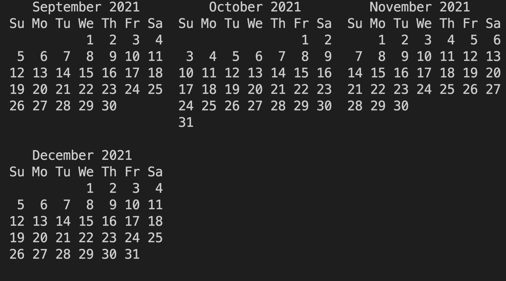

# Syllabus 

## Outline 

_From CAB_: Mechanical behavior of materials and analysis of stress and deformation in engineering structures and continuous media. Topics include concepts of stress and strain; the elastic, plastic, and time-dependent response of materials; principles of structural analysis and application to simple bar structures, beam theory, instability and buckling, torsion of shafts; general three-dimensional states of stress; Mohr's circle; stress concentrations. Lectures, recitations, and laboratory. Prerequisite: ENGN 0030.

## Detailed

* * Bars
  - Springs
  - 1D Displacements, strains, stresses
  - Simple bar. Displacement field, strain field, and stress field.
  - Computer Algebra
  - Uniaxial tensile testing
  - Two diamater bars
  - Distributed forces
  - Inhomgenous properties

*  Torsion
  - Tordsional Springs
  -  Displacements, strains, stresses in the context of torsion
  - Computer Algebra
  - Simple bar: Displacement field, strain field, and stress field
  - Variable cross-section
  - Distributed forces
  - Inmogenous properties

*  Bending

  -  Displacements, strains, stresses in the context of bending
  - Pure bending (displacements and stresses)
  -  Computer Algebra
  - Simple bending (displacements and stresses)
  - Three pt bending (displacements and stresses)
  - 4 pt benbding (displacements and stresses)
  - Distributed loading

* Dynamics
    - Fundamental models of Vibration. Bar, Shafts, Beam.

*  Buckling
   - Columns

* Introduction to the theory of elasticity
 - Particularizing it   Bars
 - Particularizing it Shear
 - Particularizing it Bending
 - Mohr Circle
 
* Optional
    - Energy Methods.
    - Pressure vessels
    - Plasticity

| Class Number | Topic                                          | Date  |
|--------------|------------------------------------------------|-------|
| Class 1      | Introduction + Computer Algebra                | 09/08 |
| Class 2      | Chapter 1 Concept of Stress                    | 09/10 |
| Class 3      | Chapter 1 Concept of Stress                    | 09/13 |
| Class 4      | Chapter 1 Concept of Stress                    | 09/15 |
| Class 6      | Chapter 2 Stress and Strain                    | 09/20 |
| Class 7      | Chapter 2 Stress and Strain                    | 09/22 |
| Class 8      | Chapter 2 Stress and Strain                    | 09/24 |
| Class 9      | Chapter 2 Stress and Strain                    | 09/27 |
| Class 10     | Chapter 2 Stress and Strain                    | 09/29 |
| Class 11     | Chapter  3 Torsion                             | 10/01 |
| Class 12     | Chapter  3 Torsion                             | 10/04 |
| Class 13     | Chapter  3 Torsion                             | 10/06 |
| Class 14     | Chapter 4 Pure Bending                         | 10/08 |
| Class 15     | No Class                                       | 10/11 |
| Class 16     | Chapter 4 Pure Bending                         | 10/13 |
| Class 17     | Chapter 4 Pure Bending                         | 10/15 |
| Class 18     | Chapter 4 Pure Bending                         | 10/18 |
| Class 19     | Chapter 5 Beams                                | 10/20 |
| Class 20     | Midterm                                        | 10/22 |
| Class 21     | Chapter 5 Beams                                | 10/25 |
| Class 22     | Chapter 5 Beams                                | 10/27 |
| Class 23     | Chapter 6 Shearing Stresses                    | 10/29 |
| Class 24     | Chapter 6 Shearing Stresses                    | 11/01 |
| Class 25     | Chapter 9 Deflection of Beams                  | 11/03 |
| Class 26     | Chapter 9 Deflection of Beams                  | 11/05 |
| Class 27     | Chapter 9 Deflection of Beams                  | 11/08 |
| Class 28     | Chapter 9 Deflection of Beams                  | 11/10 |
| Class 29     | Chapter 7 Transformations of Stress and Strain | 11/12 |
| Class 30     | Chapter 7 Transformations of Stress and Strain | 11/15 |
| Class 31     | Chapter 7 Transformations of Stress and Strain | 11/17 |
| Class 32     | Chapter 7 Transformations of Stress and Strain | 11/19 |
| Class 33     | Dynamics                                       | 11/22 |
| Class 34     | Dynamics                                       | 11/24 |
| Class 35     | No Class                                       | 11/26 |
| Class 36     | Chapter 10 Columns                             | 11/29 |
| Class 37     | Chapter 10 Columns                             | 12/01 |
| Class 38     | Chapter 7 Theories of Failure                  | 12/03 |
| Class 39     | Chapter 7 Theories of Failure                  | 12/06 |
| Class 40     | Chapter 7 Thin Walled Pressure Vessels         | 12/08 |
| Class 41     | Review                                         | 12/10 |
| Class 42     | Review                                         | 12/12 |
| Final        | Final 02:00:00 PM                              | 12/14 |

