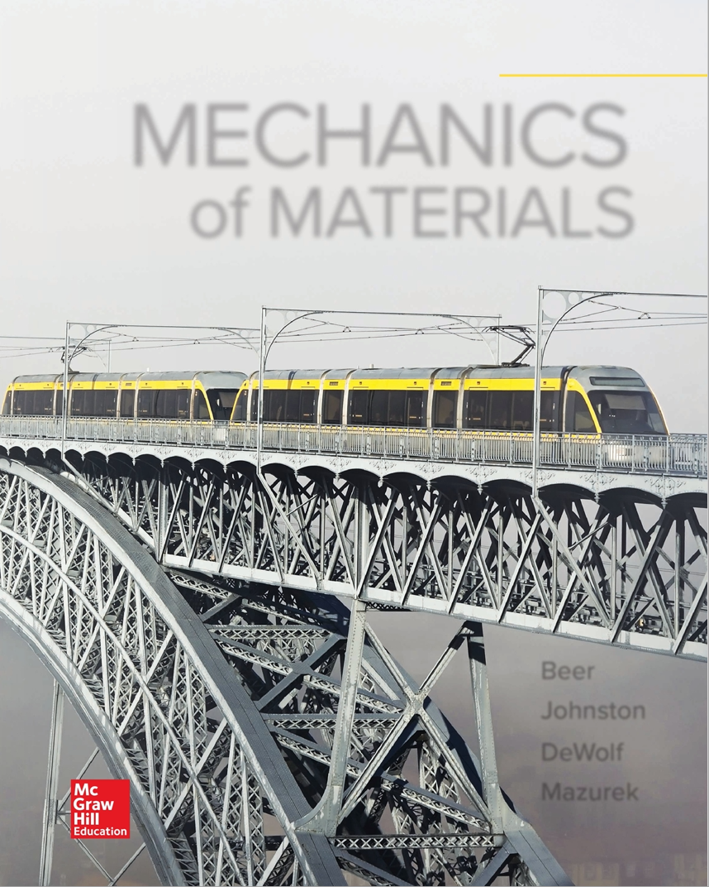

# Mechanics of Solids and Structures




 
 

## Course Information

#### Teaching team <!--HK_to_HK: done with this section-->
 * [Haneesh Kesari](https://appliedmechanicslab.github.io/Team)  
 * [Sayaka Kochiyama](https://appliedmechanicslab.github.io/Team)
 * Andrew Bagnoli 
 * [Yang Wan](https://appliedmechanicslab.github.io/Team)
 
 <!-- * [Benjamin Grossman-Ponemon](https://appliedmechanicslab.github.io/Team) -->

#### Lecture and recitation timings

Lectures MTW: 9-9:50 am in BH 158. Instructor: H. Kesari   
Recitation: T: 12:00-12:50 in BH 158. Instructor: H. Kesari/B. Grossman-Ponemo..n  

#### Office hours 

*  H. Kesari
    - Friday 2:00-5:00 pm in ERC 125.
    - Tuesday 12:50-1:50 pm in BH 158.

* Sayaka Kochiyama
   - Wednesday 12:00-1:00 in ERC125    
   - Thursday  2:00-5:00 in BH 744

* Andrew Bagnoli
   - Thursday  4:00-5:00 in BH 158
   -  Friday   2:00-5:00  in ERC 125

<!-- * Benjamin Grossman-Ponemon
   - TBD -->

* Yang Wan 
   - through appointment
 

#### Syllabus

Mechanical behavior of materials and analysis of stress and deformation in engineering structures and continuous media. Topics include concepts of stress and strain; the elastic, plastic, and time-dependent response of materials; principles of structural analysis and application to simple bar structures, beam theory, instability and buckling, torsion of shafts; general three-dimensional states of stress; Mohr's circle; stress concentrations. Lecture
s, recitations, and laboratory. Prerequisite: ENGN 0030.

[Detailed syllabus and teaching schedule](CourseNotes/CourseTopics.md)

#### Grading

The grade in the course will be based on the students' performance in the following categories 

* Homeworks, 
* Midterm exam, 
* Labs, and 
* Final exam. 
 
Each student will have some flexibility in deciding how the total points for the course should be distributed among the different categories for their individual case. The _Homeworks_ category can contain anywhere between 30 and 40 points. The _Midterm exam_ category can contain anywhere between 10 and 20 points. The _Labs_ category can count for anywhere between 20 and 30 points, and the _Final exam_ category can count for anywhere between 20 and 30 points.

[Detailed information about grading](./CourseInformation/Grading.md) 

## Learning resources <!--HK_to_HK: done with this section-->

#### Lectures

* :balloon::new::balloon: [Lecture schedule and links to video recordings of lectures ](CourseNotes/CourseTopics.md)
* :balloon::new::balloon: [Instructor's notes (by topic), on which the lectures are based](CourseNotes/index.md)

#### Textbook and reference books

     
    

 

[Mechanics of Materials 8th Edition](https://www.amazon.com/Mechanics-Materials-Ferdinand-P-Beer/dp/1260113272) (Ferdinand Beer, E. Johnston, John DeWolf, David Mazurek)

#### Software
* Mathematica 
    - [Mathematica Download page](https://www.brown.edu/information-technology/software/)
    - [Mathematica learning material](https://appliedmechanicslab.github.io/appliedmechanicslab/Mathematica_software_commands.html)

Python, Matlab, Maple, etc. can also be used for the HWs and exams. However, the lectures and recitations will be carried out solely using Mathematica. Questions related to Python, Matlab can asked during the Instructor or TA office hours.   

## Homeworks <!-- HK_to_HK: HK done with this section -->

Nine Homework (HW) sets will be released and graded during the course. However, only the seven best HW scores will be used for calculating the grade. The schedule of when the HWs will be released and when they are due can be see in the course calendar. 

<!-- AB_TODO: Please update the above paragraph based on your latest schedule. Also update this HW schedule in the course calendar, the one that shows up on the home page of the course website -->

 *  [Homeworks](Homeworks/index.md)

## Exams

The midterm and final exams will be online exams (through CANVAS). You will have 48 (resp. 72) hrs over which to take the  midterm (resp. final) exam. The exams can be taken remotely. Once an exam starts you will have a fixed amount of time to complete the exam. The dates for the midterm and final exams can be found in the course calendar. Any further exam related information will be posted at the below link.
 
*  [Exams](Exams/index.md)

## Labs

There will be three labs during the semester. Each lab has to be performed in person in a team of about 4 people. Each lab has to be carried out within a 3 hr slot. Several slots are available in a 10 day time frame for each lab. The calendars to reserve the time slots can be found at the below link. Each student has to write a separate report for each of the labs they complete. The time periods when the slots for each lab are available and the deadlines for when the reports are due can be found in the course calendar.

*  [Labs](Labs/index.md)

## Schedule/Important dates and Course calendar

* Indigenous people's day: Oct 11, Monday  
* Midterm Date: Oct 22, Friday (Online exam)   
* Thanksgiving break: Nov, 24th, Wednesday, starting at Noon) to Nov 28, Sunday. 
* Reading period start date : Dec 8th, Wednesday  
* Last day of classes: Dec 12, Sunday  
* Final Exam date: Dec 14, Tuesday (Online exam).  
* Final Exam period: Dec 13, Mon to Dec 21, Tue  

* [Course calendar](https://calendar.google.com/calendar/u/0?cid=Y182MG1uMnZuNnRxbmM4ODA2a2V1MXF0bzFpY0Bncm91cC5jYWxlbmRhci5nb29nbGUuY29t)

<iframe src="https://calendar.google.com/calendar/embed?src=c_60mn2vn6tqnc8806keu1qto1ic%40group.calendar.google.com&ctz=America%2FNew_York" style="border: 0" width="800" height="600" frameborder="0" scrolling="no"></iframe>

## Related websites

* [Canvas](https://canvas.brown.edu/courses/1086173)
* [Banner](https://selfservice.brown.edu/ss/twbkwbis.P_GenMenu?name=homepage)
* [Brown CAB](https://cab.brown.edu/)

